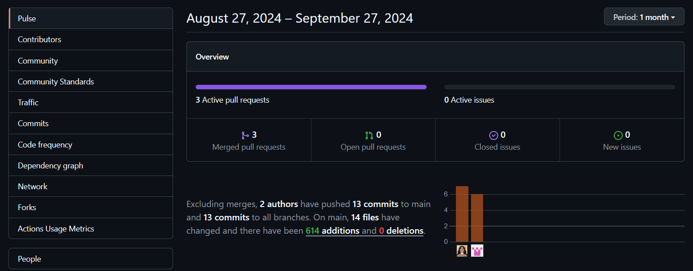
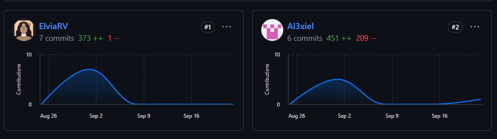
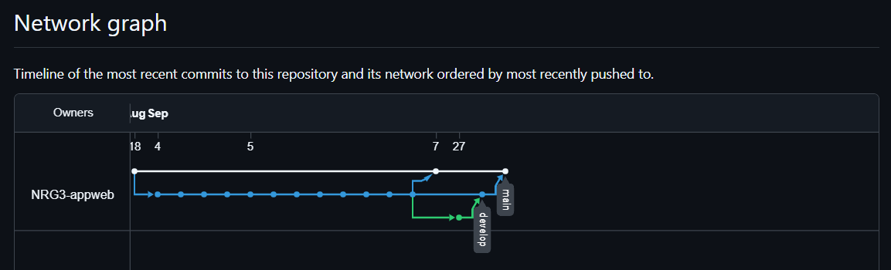
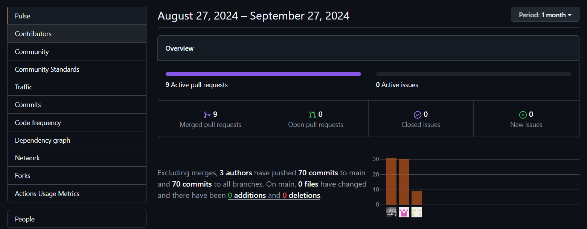
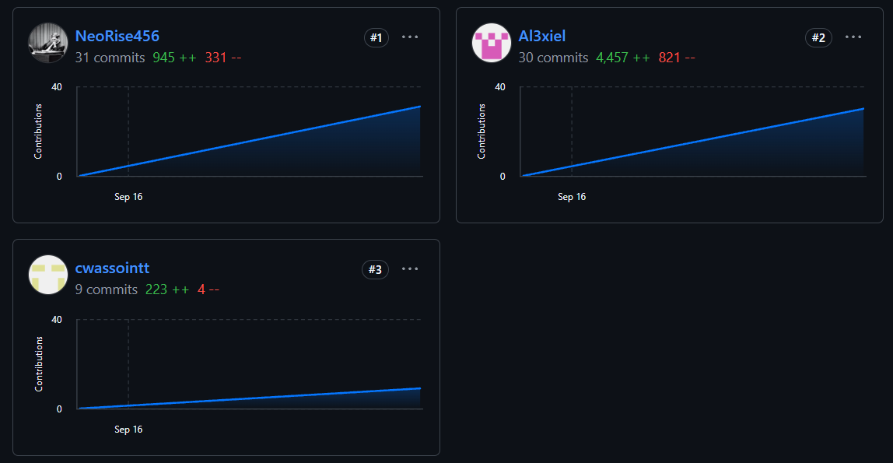
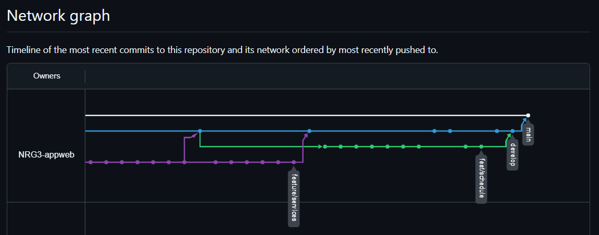
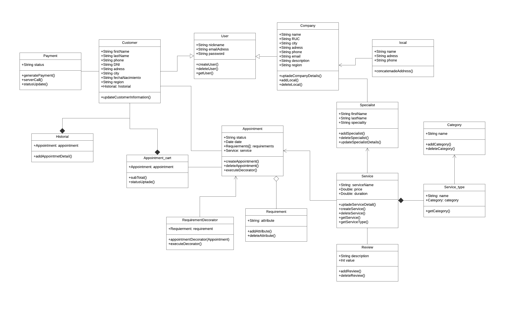
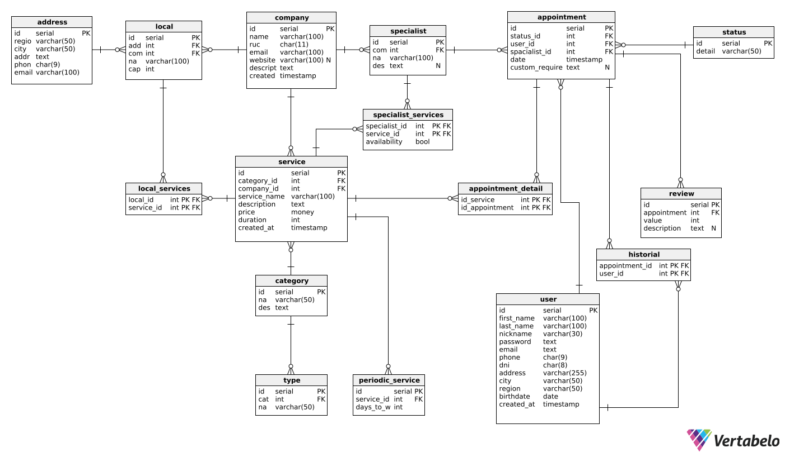
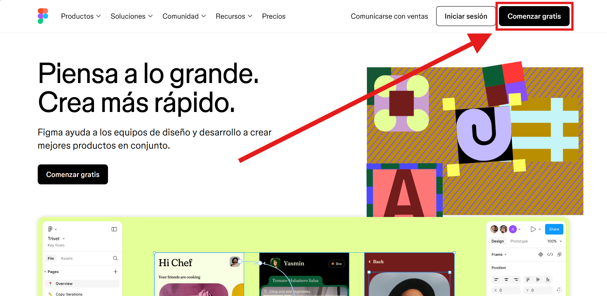
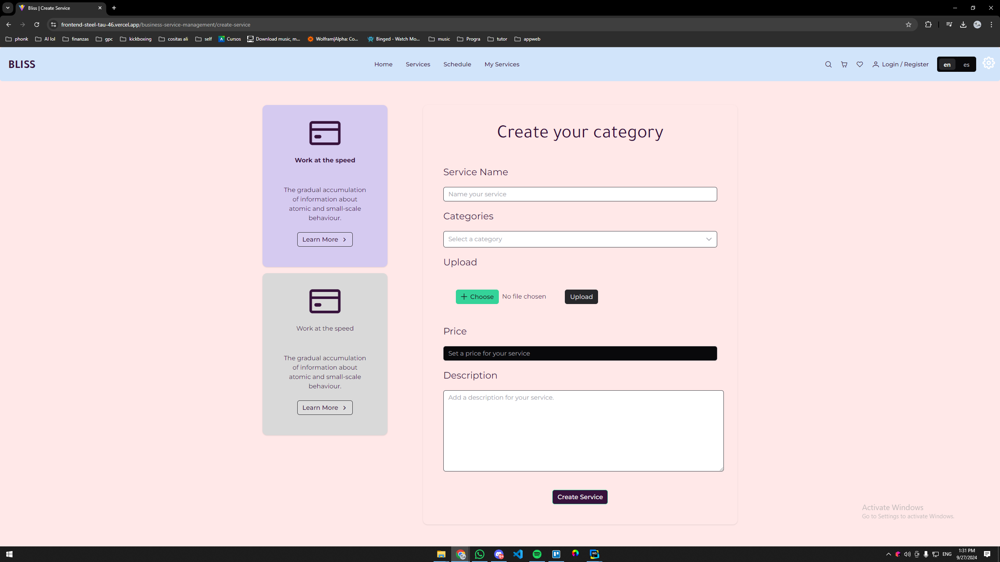

  <h1>Universidad Peruana de Ciencias Aplicadas</h1>
  
  <h2 >Carrera: de Ingeniería de Software</h2>
  <h2 >Ciclo: 2024-02</h2>
   
  <h2 >Curso: Aplicaciones Web</h2>
  <h2 >Sección: WS53</h2>
   
  <h2 >Informe del TB1</h2>
  <h2 >Startup: NRG3</h2>
  <h2 >Producto: Bliss</h2>
   
  <h2 >Integrantes:</h2>
  <ul style="list-style: none; padding: 0;">
      <li><h3>Juan Diego Astonitas Díaz</h3></li>
      <li><h3>Gabriel Alexander Casas Sanchez</h3></li>
      <li><h3>Gianluca Santino Pasquale Barrenechea</h3></li>
      <li><h3>Godofredo Quispe Tipo</h3></li>
      <li><h3>Elvia Marcela Rodriguez Villa</h3></li>
  </ul>
   
  <h4>Septiembre del 2024</h4>

## Registro de Versiones del Informe

| Versión | Fecha      | Autor                                                            | Descripción de modificación          |
|---------|------------|------------------------------------------------------------------|--------------------------------------|
| 0.1     | 28/08/2024 | Juan Astonitas                                                   | Desarollo Capitulo 1 y seccion 2.1   |
| 0.2     | 29/08/2024 | Gialuca Pasquale                                                 | Desarollo Cuadros del capitulo 2 y 3 |
| 0.3     | 29/08/2024 | Elvia Rodrigrez, Gabriel Casas , Juan Astonitas                  | Desarollo Capitulo 4                 |
| 1       | 07/09/2024 | Todos los integrantes                                            | Entregas TB1                         |
| 1.1     | 27/09/2024 | Elvia Elvia, Gialuca Pasquale                                    | Correciones TB1                      |
| 2       | 27/09/2024 | Elvia Rodrigrez, Gialuca Pasquale, Juan Astonitas, Gabriel Casas | Entrega TP                           |

## Project Report Collaboration Insights
| URL de la organización del proyecto |                URL del repositorio del reporte                |
|:-----------------------------------:|:-------------------------------------------------------------:|
|   https://github.com/SI729-Bliss    | https://github.com/SI729-Bliss/OpenSource-Bliss-Documentation |

TP1: Se han realizado todas las tareas asignadas para la entrega del TP1, las cuales se encuentran registradas en el repositorio de Github de la organización del equipo bajo el enlace https://github.com/NRG3-appweb. Para elaborar el informe cada miembro corrigio y añadio puntos que se  debian mejorar de la anterior entrega en el siguiente repositorio: https://github.com/NRG3-appweb/report, de la misma manera para el desarrollo de la web application se trabajo en este repositorio: https://github.com/NRG3-appweb/frontend.

Vista de commits: Landing page:

- Juan Diego Astonitas Díaz: -
- Gabriel Alexander Casas Sanchez: 6
- Gianluca Santino Pasquale Barrenechea: -
- Elvia Marcela Rodriguez Villa: 7

Web Application Frontend:

- Juan Diego Astonitas Díaz: 31
- Gabriel Alexander Casas Sanchez: 30
- Gianluca Santino Pasquale Barrenechea: 9
- Godofredo Quispe Tipo -
- Elvia Marcela Rodriguez Villa: -

Report: 

- Juan Diego Astonitas Díaz: 38
- Gabriel Alexander Casas Sanchez: 52
- Gianluca Santino Pasquale Barrenechea: 30
- Godofredo Quispe Tipo: 
- Elvia Marcela Rodriguez Villa: 26

  
### TB1 

| Integrante                                 | Tareas Asignadas                                                                                                          |
|--------------------------------------------|---------------------------------------------------------------------------------------------------------------------------|
| Elvia Marcela Rodriguez Villa              | Elaboración de prototipado y wireframes  Elaboración del capítulo 4 del reporte   Implementación del landing page |
| Gabriel Alexander Casas Sanchez            | Desarrollo de landing page   Elaboración y corrección de capítulo 1, 2 y 4 del reporte                                |
| Gianluca Santino Pasquale Barrenechea      | Elaboración de la documentación Lean UX                                                                                   |
| Juan Diego Astonitas Díaz                  | Elaboración del capítulo 1,2 y 3 Elaboración del diagrama de clases y el modelo de base de datos                      |
| Sebastian Aaron Anibal Carbajal Santivañez | Elaboración y análisis de entrevistas                                                                                     |

### TP (Trabajo Parcial)

| Integrante                                 | Tareas Asignadas                                                       |
|--------------------------------------------|------------------------------------------------------------------------|
| Elvia Marcela Rodriguez Villa              | Elaboración de prototipado y wireframes  Actualización del reporte |
| Gabriel Alexander Casas Sanchez            | Desarrollo de aplicación web                                           |
| Gianluca Santino Pasquale Barrenechea      | Actualización del reporte y elaboración del capitulo 5                 |
| Juan Diego Astonitas Díaz                  | Desarrollo de aplicación web                                           |
| Sebastian Aaron Anibal Carbajal Santivañez |                                                                        |

### Capturas de la colaboración

## Contenido

- [Registro de Versiones del Informe](#registro-de-versiones-del-informe)
- [Project Report Collaboration Insights](#project-report-collaboration-insights)
  - [TB1](#tb1)
  - [TP (Trabajo Parcial)](#tp-trabajo-parcial)
  - [Capturas de la colaboración](#capturas-de-la-colaboración)
- [Contenido](#contenido)
- [Student Outcome](#student-outcome)
- [Capítulo I: Introducción ](#capítulo-i-introducción-)
  - [1.1. Startup Profile](#11-startup-profile)
    - [1.1.1. Descripción de la Startup](#111-descripción-de-la-startup)
    - [1.1.2. Perfiles de integrantes del equipo](#112-perfiles-de-integrantes-del-equipo)
  - [1.2. Solution Profile](#12-solution-profile)
    - [1.2.1 Antecedentes y problemática](#121-antecedentes-y-problemática)
    - [1.2.2 Lean UX Process](#122-lean-ux-process)
      - [1.2.2.1. Lean UX Problem Statements](#1221-lean-ux-problem-statements)
      - [1.2.2.2. Lean UX Assumptions](#1222-lean-ux-assumptions)
        - [User Assumptions (Suposiciones de Usuario)](#user-assumptions-suposiciones-de-usuario)
        - [Business Assumptions (Suposiciones de Negocio)](#business-assumptions-suposiciones-de-negocio)
        - [Technical Assumptions (Suposiciones Técnicas)](#technical-assumptions-suposiciones-técnicas)
        - [Market Assumptions (Suposiciones de Mercado)](#market-assumptions-suposiciones-de-mercado)
        - [Design Assumptions (Suposiciones de Diseño)](#design-assumptions-suposiciones-de-diseño)
      - [1.2.2.3. Lean UX Hypothesis Statements](#1223-lean-ux-hypothesis-statements)
      - [1.2.2.4. Lean UX Canvas](#1224-lean-ux-canvas)
  - [1.3. Segmentos objetivo](#13-segmentos-objetivo)
- [Capítulo II: Requirements Elicitation \& Analysis ](#capítulo-ii-requirements-elicitation--analysis-)
  - [2.1. Competidores](#21-competidores)
    - [2.1.1. Análisis competitivo](#211-análisis-competitivo)
    - [2.1.2. Estrategias y tácticas frente a competidores.](#212-estrategias-y-tácticas-frente-a-competidores)
        - [Estrategias:](#estrategias)
        - [Tácticas:](#tácticas)
  - [2.2. Entrevistas.](#22-entrevistas)
    - [2.2.1. Diseño de entrevistas](#221-diseño-de-entrevistas)
    - [2.2.2. Registro de entrevistas](#222-registro-de-entrevistas)
    - [2.2.3. Análisis de entrevistas](#223-análisis-de-entrevistas)
  - [2.3. Needfinding](#23-needfinding)
    - [2.3.1. User Personas](#231-user-personas)
        - [**MYPES o Emprendedores**](#mypes-o-emprendedores)
        - [**Clientes de la industria de belleza y bienestar**](#clientes-de-la-industria-de-belleza-y-bienestar)
    - [2.3.2. User Task Matrix](#232-user-task-matrix)
        - [**MYPES o Emprendedores**](#mypes-o-emprendedores-1)
        - [**Clientes de la industria de belleza y bienestar**](#clientes-de-la-industria-de-belleza-y-bienestar-1)
    - [2.3.3. User Journey Mapping](#233-user-journey-mapping)
        - [**Clientas Aficionadas al Embellecimiento**](#clientas-aficionadas-al-embellecimiento)
        - [**MYPES del Sector de Belleza**](#mypes-del-sector-de-belleza)
    - [2.3.4. Empathy Mapping](#234-empathy-mapping)
        - [Clientas Aficionadas al Embellecimiento](#clientas-aficionadas-al-embellecimiento-1)
        - [MYPES del Sector de Belleza](#mypes-del-sector-de-belleza-1)
    - [2.3.5. As-is Scenario Mapping](#235-as-is-scenario-mapping)
        - [Clientas Aficionadas al Embellecimiento](#clientas-aficionadas-al-embellecimiento-2)
        - [MYPES del Sector de Belleza](#mypes-del-sector-de-belleza-2)
  - [2.4. Ubiquitous Language](#24-ubiquitous-language)
- [Capítulo III: Requirements Specification ](#capítulo-iii-requirements-specification-)
  - [3.1. To-Be Scenario Mapping](#31-to-be-scenario-mapping)
        - [Clientas Aficionadas al Embellecimiento](#clientas-aficionadas-al-embellecimiento-3)
        - [MYPES del Sector de Belleza](#mypes-del-sector-de-belleza-3)
  - [3.2. User Stories](#32-user-stories)
  - [3.3. Impact Mapping](#33-impact-mapping)
  - [3.4. Product Backlog](#34-product-backlog)
- [Capítulo IV: Product Design ](#capítulo-iv-product-design-)
  - [4.1. Style Guidelines](#41-style-guidelines)
    - [4.1.1. General Style Guidelines](#411-general-style-guidelines)
  - [Typography](#typography)
  - [Minimalismo y sofisticación:](#minimalismo-y-sofisticación)
  - [Sentido emocional:](#sentido-emocional)
  - [Icons](#icons)
    - [4.1.2. Web Style Guidelines](#412-web-style-guidelines)
  - [4.2. Information Architecture](#42-information-architecture)
    - [4.2.1. Organization Systems](#421-organization-systems)
    - [4.2.2. Labeling Systems](#422-labeling-systems)
    - [4.2.3. SEO Tags and Meta Tags](#423-seo-tags-and-meta-tags)
      - [Página de Aterrizaje (Landing Page)](#página-de-aterrizaje-landing-page)
      - [Aplicación Web](#aplicación-web)
    - [4.2.4. Searching Systems](#424-searching-systems)
      - [Opciones de Búsqueda](#opciones-de-búsqueda)
      - [Barra de Búsqueda](#barra-de-búsqueda)
      - [Categorías](#categorías)
      - [Etiquetas Populares](#etiquetas-populares)
      - [Filtros Disponibles](#filtros-disponibles)
      - [Filtros por Tipo de Servicio](#filtros-por-tipo-de-servicio)
      - [Filtro por Precio](#filtro-por-precio)
      - [Resumen y Descripción](#resumen-y-descripción)
      - [Opciones de Ordenación y Filtros Aplicados](#opciones-de-ordenación-y-filtros-aplicados)
      - [Revisiones y Comentarios](#revisiones-y-comentarios)
    - [4.2.5. Navigation Systems](#425-navigation-systems)
  - [4.3. Landing Page UI Design](#43-landing-page-ui-design)
    - [4.3.1. Landing Page Wireframe](#431-landing-page-wireframe)
    - [4.3.2. Landing Page Mock-up](#432-landing-page-mock-up)
  - [4.4. Web Applications UX/UI Design](#44-web-applications-uxui-design)
    - [4.4.1. Web Applications Wireframes.](#441-web-applications-wireframes)
    - [4.4.2. Web Applications Wireflow Diagrams.](#442-web-applications-wireflow-diagrams)
      - [Registro y Perfil de Empresa](#registro-y-perfil-de-empresa)
      - [Gestión de Usuario](#gestión-de-usuario)
      - [Visualización de Historial y Agenda](#visualización-de-historial-y-agenda)
      - [Reserva de Servicio](#reserva-de-servicio)
      - [Creación de Servicio](#creación-de-servicio)
    - [4.4.3. Web Applications Mock-ups](#443-web-applications-mock-ups)
    - [4.4.4. Web Applications User Flow Diagrams](#444-web-applications-user-flow-diagrams)
  - [4.5. Web Applications Prototyping](#45-web-applications-prototyping)
  - [4.6. Domain-Driven Software Architecture](#46-domain-driven-software-architecture)
    - [4.6.1. Software Architecture Context Diagram](#461-software-architecture-context-diagram)
    - [4.6.2. Software Architecture Container Diagrams](#462-software-architecture-container-diagrams)
    - [4.6.3. Software Architecture Components Diagrams](#463-software-architecture-components-diagrams)
      - [Service Management Component](#service-management-component)
  - [4.7. Software Object-Oriented Design](#47-software-object-oriented-design)
    - [4.7.1. Class Diagrams](#471-class-diagrams)
    - [4.7.2. Class Dictionary](#472-class-dictionary)
  - [4.8. Database Design](#48-database-design)
    - [4.8.1. Database Diagram](#481-database-diagram)
- [Capítulo V: Product Implementation, Validation \& Deployment ](#capítulo-v-product-implementation-validation--deployment-)
  - [5.1. Software Configuration Management](#51-software-configuration-management)
    - [5.1.1. Software Development Environment Configuration](#511-software-development-environment-configuration)
    - [5.1.2. Source Code Management](#512-source-code-management)
    - [5.1.3. Source Code Style Guide \& Conventions](#513-source-code-style-guide--conventions)
    - [5.1.4. Software Deployment Configuration](#514-software-deployment-configuration)
  - [5.2. Landing Page, Services \& Applications Implementation](#52-landing-page-services--applications-implementation)
    - [5.2.1. Sprint 1](#521-sprint-1)
      - [5.2.1.1. Sprint Planning 1](#5211-sprint-planning-1)
      - [5.2.1.2. Sprint Backlog 1](#5212-sprint-backlog-1)
      - [5.2.1.3. Development Evidence for Sprint Review](#5213-development-evidence-for-sprint-review)
      - [5.2.1.4. Testing Suite Evidence for Sprint Review](#5214-testing-suite-evidence-for-sprint-review)
      - [5.2.1.5. Execution Evidence for Sprint Review](#5215-execution-evidence-for-sprint-review)
      - [5.2.1.6. Services Documentation Evidence for Sprint Review](#5216-services-documentation-evidence-for-sprint-review)
      - [5.2.1.7. Software Deployment Evidence for Sprint Review](#5217-software-deployment-evidence-for-sprint-review)
      - [5.2.1.8. Team Collaboration Insights during Sprint](#5218-team-collaboration-insights-during-sprint)
    - [5.2.2. Sprint 2](#522-sprint-2)
        - [5.2.2.1.Sprint Planning 2.](#5221sprint-planning-2)
        - [5.2.2.2.Sprint Backlog 2.](#5222sprint-backlog-2)
        - [5.2.2.3. Development Evidence for Sprint Review.](#5223-development-evidence-for-sprint-review)
        - [5.2.2.4. Testing Suite Evidence for Sprint Review.](#5224-testing-suite-evidence-for-sprint-review)
        - [5.2.2.5. Execution Evidence for Sprint Review.](#5225-execution-evidence-for-sprint-review)
        - [5.2.2.6. Services Documentation Evidence for Sprint Review.](#5226-services-documentation-evidence-for-sprint-review)
        - [5.2.2.7. Software Deployment Evidence for Sprint Review.](#5227-software-deployment-evidence-for-sprint-review)
        - [5.2.2.8. Team Collaboration Insights during Sprint.](#5228-team-collaboration-insights-during-sprint)
    - [5.2.3. Sprint 3](#523-sprint-3)
        - [5.2.3.1.Spring Planning 3.](#5229sprint-planning-3)
        - [5.2.3.2.Sprint Backlog 3.](#5230sprint-backlog-3)
        - [5.2.3.3. Development Evidence for Sprint Review.](#5231-development-evidence-for-sprint-review)
        - [5.2.3.4. Testing Suite Evidence for Sprint Review.](#5232-testing-suite-evidence-for-sprint-review)
        - [5.2.3.5. Execution Evidence for Sprint Review.](#5233-execution-evidence-for-sprint-review)
        - [5.2.3.6. Services Documentation Evidence for Sprint Review.](#5234-services-documentation-evidence-for-sprint-review)
        - [5.2.3.7. Software Deployment Evidence for Sprint Review.](#5235-software-deployment-evidence-for-sprint-review)
        - [5.2.3.8. Team Collaboration Insights during Sprint.](#5236-team-collaboration-insights-during-sprint)
  - [5.3. Validation Interviews.](#53-validation-interviews)
      - [5.3.1. Diseño de Entrevistas.](#531-diseño-de-entrevistas)
      - [5.3.2. Registro de Entrevistas.](#532-registro-de-entrevistas)
      - [5.3.3. Evaluaciones según heurísticas.](#533-valuaciones-según-heurísticas)
  - [5.4. Video About-the-Product.](#54-video-about-the-product)
- [Conclusiones](#conclusiones)
- [Bibliografía](#bibliografía)
- [Anexos](#anexos)

## Student Outcome

El curso contribuye al cumplimiento del Student Outcome ABET:

**ABET – EAC - Student Outcome 5**
Criterio: *La capacidad de funcionar efectivamente en un equipo cuyos miembros
juntos proporcionan liderazgo, crean un entorno de colaboración e inclusivo,
establecen objetivos, planifican tareas y cumplen objetivos.*
En el siguiente cuadro se describe las acciones realizadas y enunciados de
conclusiones por parte del grupo, que permiten sustentar el haber alcanzado el logro
del ABET – EAC - Student Outcome 5.

<table>
  <tr>
    <td colspan="1"><strong>Criterio Específico</strong></td>
    <td colspan="1"><strong>Acciones Realizadas</strong></td>
    <td colspan="1"><strong>Conclusiones</strong></td>
  </tr>
  <tr>
    <td> Trabaja en equipo para proporcionar liderazgo en forma conjunta</td>
    <td>
	    Juan Astonitas TB1:   A lo largo del desarrollo del proyecto Bliss, he participado activamente en la toma de decisiones estratégicas y en la definición de la dirección del equipo, promoviendo la comunicación abierta y la responsabilidad compartida para garantizar un liderazgo efectivo y colectivo. 
        Gabriel Casas TB1:   Para el desarrollo del proyecto he participado de manera activa tanto en la toma de decisiones como en la división de responsabilidades, de la misma manera he ayudado en responsabilidades de mis compañeros con el afán de entregar un mejor produto.   TP1:   Realicé una reuión antes de la entrega para colaborar como  grupo en el desarrollo del proyecto. Establecí las bases para el desarrollo del proyecto. Ayude a mis compañeros a comprender conceptos que desconocian.
	     Elvia Rodriguez TB1:  Durante el proyecto Bliss, mi enfoque ha sido mantener la cohesión del equipo, facilitando una comunicación fluida y asegurando que todas las voces fueran escuchadas. He trabajado mano a mano con mis compañeros para resolver conflictos y establecer un liderazgo compartido, lo que ha sido clave para el éxito del equipo.
 Gianluca Pasquale TB1:  He contribuido activamente en el liderazgo compartido, facilitando la toma de decisiones y promoviendo la responsabilidad colectiva.   TP1:   Participe activamente en las reuniones de grupo y promoví el avance en conjunto para asi lograr de manera satisfactoria las entregas del trabajo.
    </td>
    <td>
	    TB1: 
A lo largo del desarrollo del proyecto Bliss, hemos demostrado una fuerte capacidad de liderazgo compartido, destacando la importancia de la toma de decisiones conjunta y la distribución equitativa de responsabilidades. Cada miembro del equipo ha aportado activamente, promoviendo una comunicación abierta y colaborando para superar desafíos, lo cual ha fortalecido la cohesión y efectividad del grupo. La responsabilidad colectiva y el apoyo mutuo han sido pilares clave que nos han permitido dirigir el proyecto hacia el cumplimiento exitoso de nuestros objetivos. Este enfoque de liderazgo conjunto ha sido fundamental para crear un entorno de trabajo inclusivo y productivo.  
    </td>
  </tr>
  <tr>
    <td>Crea un entorno colaborativo e inclusivo, establece metas, planifica tareas y cumple objetivos.</td>
    <td>
	    Juan Astonitas  TB1:   Durante el proyecto, he contribuido a la creación de un entorno inclusivo y colaborativo, fomentando la participación de todos los miembros del equipo. He trabajado en la definición de metas claras, la planificación de tareas detalladas, y el seguimiento del cumplimiento de los objetivos, asegurando que cada miembro se sienta valorado y comprometido con los resultados.
	     Gabriel Casas TB1:   Durante el proyecto fue de mi prioridad ayudar a mis compañeros en la realización de sus tareas, por este motivo he reviso todo el proyecto, corregido errores, como tmambién aportado a la creación de items externos a mis responsabilidades asignadas.   TP1:   Establecí metas de entrega para el desarrollo de las actividades correspondientes a este ciclo de trabajo. Procure que todos los miembros del equipo sean incluidos en la repartición de tareas.
	     Elvia Rodriguez: TB1:  A lo largo del proyecto Bliss, me he centrado en establecer un entorno de trabajo colaborativo e inclusivo, asegurándome de que cada miembro del equipo tuviera las herramientas y el apoyo necesarios para cumplir con sus tareas. Además, he liderado la planificación de actividades y el establecimiento de metas alcanzables para cumplir con los objetivos de manera eficiente.
  Gianluca Pasquale TB1:   He fomentado un entorno inclusivo, definiendo metas claras, planificando tareas, y asegurando el cumplimiento de los objetivos del proyecto.   TP1:   Durante el desarrollo del  proyecto, me aseguré de ser parte de un entorno colaborativo con mi grupo, y acatar con las responsabilidades correspondientes.
    </td>
    <td>
	    TB1: 
Durante el proyecto Bliss, hemos logrado crear un entorno inclusivo y colaborativo que ha facilitado la participación activa de todos los miembros del equipo. Hemos definido metas claras y planificado tareas detalladamente, lo que ha permitido un seguimiento efectivo del progreso y el cumplimiento de los objetivos. La colaboración y el apoyo mutuo han sido esenciales para asegurar que cada miembro del equipo se sintiera valorado y comprometido. Este enfoque ha contribuido significativamente a la eficiencia y éxito del proyecto. 
    </td>
  </tr>
</table>

## Capítulo I: Introducción 
### 1.1. Startup Profile

#### 1.1.1. Descripción de la Startup
Bliss es una plataforma digital dedicada a optimizar la gestión de clientes para centros de belleza y cuidado personal, mejorando la experiencia del usuario al facilitar la búsqueda, selección y reserva de servicios de belleza. Nuestro enfoque está en crear un ambiente de confianza y transparencia tanto para los clientes como para los proveedores de servicios, promoviendo la formalización de pequeños emprendimientos familiares en la industria de la belleza.

Misión: 
Empoderar a los clientes y pequeños negocios de la industria de la belleza mediante una plataforma que simplifica la búsqueda y reserva de servicios, garantizando transparencia, calidad y eficiencia en cada interacción.

Visión: 
Convertirnos en la plataforma líder de servicios de belleza, reconocida por su confianza, transparencia y apoyo a los emprendimientos familiares, creando un ecosistema formal y de alta calidad para la industria del cuidado personal.

Problema Identificado:  El sector de belleza y cuidado personal en Perú está experimentando un crecimiento acelerado, especialmente en los tratamientos faciales y la dermocosmética, que se han multiplicado casi ocho veces en la última década. Este crecimiento se da en respuesta a una demanda creciente de la clase media emergente, que busca servicios más personalizados y de alta calidad. En este contexto, los salones de belleza juegan un papel clave, pero muchos de ellos operan en un mercado polarizado e informal.

La competencia entre salones de belleza, especialmente los gestionados por pequeñas empresas familiares, es alta, y la personalización del servicio se ha convertido en un factor diferenciador clave. La mayoría de estos establecimientos, dirigidos en un 75.6% por mujeres según datos del INEI, enfrentan el desafío de profesionalizar su atención y mejorar la experiencia del usuario. A medida que la industria sigue creciendo, se vuelve esencial elevar la calidad del servicio, mejorar la gestión de la atención al cliente y formalizar las operaciones para establecer relaciones más duraderas y significativas con los clientes.

Para destacar en un mercado competitivo y en crecimiento, es crucial mejorar la calidad del servicio y ofrecer experiencias personalizadas que profesionalicen la industria y fortalezcan las relaciones con los clientes.

Solución Propuesta:  Bliss proporciona una plataforma que conecta a clientes con centros de belleza confiables, garantizando la transparencia y formalidad de los proveedores a través de un sistema de verificación y evaluación de calidad. Además, ofrece una interfaz intuitiva y eficiente que centraliza la comunicación y facilita la reserva directa, mejorando la confianza del usuario y optimizando los procesos de los emprendedores en la industria.

#### 1.1.2. Perfiles de integrantes del equipo

<table>
  <tr>
    <th colspan="2"> Juan Diego Astonitas </th>
  </tr>
  <tr>
    <td>  </td>
    <td> Mi nombre es Juan Diego Astonitas Diaz, mi código de estudiante es u202110237 ,tengo 20 años, actualmente curso el 5to ciclo de la carrera de Ingeniería de Software, en la UPC en la sede San Miguel. Mis principales cualidades son el liderazgo y el dominio de Python. Haré todo lo que esté a mi alcance para respaldar al equipo en la finalización oportuna y efectiva de las tareas asignadas. </td>
  </tr>
  <tr>
    <th colspan="2"> Casas Sanchez Gabriel Alexander </th>
  </tr>
  <tr>
    <td>  </td>
    <td> Soy estudiante de Ingeniería de Software en quinto ciclo, con habilidades para dirigir y trabajar bien bajo presión. Aunque no disfruto mucho de los trabajos grupales, siempre asumo un rol destacado y sobresaliente en ellos, aprovechando mi capacidad académica y versatilidad. </td>
  </tr>
<tr>
    <th colspan="2"> Gianluca Santino Pasquale Barrenechea </th>
  </tr>
  <tr>
    <td>  </td>
    <td> Me llamo Gianluca Santino Pasquale Barrenechea, estudiante de Ingeniería de Software (código u202112078). En nuestra Startup, me enfoco en el desarrollo frontend y backend, utilizando C++, C#, Python, Java, HTML y JavaScript. Mi objetivo es crear soluciones escalables y eficientes, mejorando la experiencia del usuario y optimizando la operación de la plataforma, siempre aplicando metodologías ágiles como Scrum. </td>
  </tr>
<tr>
    <th colspan="2"> Elvia Marcela Rodríguez Villa </th>
  </tr>
  <tr>
    <td>  </td>
    <td> Soy Elvia Rodríguez, estudiante universitaria, egresada de Laboratoria y embajadora de Microsoft. He participado en voluntariados y Hackathons, aplicando mis habilidades en desarrollo de interfaces de usuario (UI) y programación web. Mi experiencia en el ámbito tecnológico y educativo puede contribuir al modelo de negocio mediante la creación de soluciones digitales innovadoras y funcionales. </td>
  </tr>
<tr>
    <th colspan="2"> Godofredo Quispe Tipo </th>
  </tr>
  <tr>
    <td>  </td>
    <td>Mi nombre es Godofredo y actualmente me encuentro cursando la carrera de Ingeniería de Software, un campo que me apasiona profundamente. Mi interés por las nuevas tecnologías es constante, y estoy siempre al tanto de las últimas innovaciones que están redefiniendo el panorama tecnológico. Me considero un entusiasta de la programación, área en la que he adquirido un dominio en diversos lenguajes, tales como Python, C++ y Assembler, lo que me ha permitido abordar una amplia gama de proyectos y desafíos técnicos.</td>
  </tr>
</table>

### 1.2. Solution Profile
#### 1.2.1 Antecedentes y problemática

**What**
- ¿Cuál es el problema?

El problema radica en la falta de personalización y profesionalización en los servicios de belleza, donde las personas tienen dificultades para reservar citas, y las Mypes enfrentan retos para atraer nuevos clientes en un mercado competitivo e informal.

- ¿Cuál es la relación con la persona en cuestión?

La relación es conectar a clientes que buscan servicios de belleza convenientes y confiables con estilistas y dueños de negocios que desean expandir su clientela y visibilizar sus servicios.

**When**
- ¿Cuándo sucede el problema?

El problema surge cuando los clientes quieren reservar citas de belleza, pero no tienen tiempo para buscar proveedores o hacer reservas por teléfono.

- ¿Cuándo utiliza el cliente el producto?

El cliente utiliza el producto cuando desea buscar, reservar y pagar servicios de cuidado y belleza, ya sea en casa o en el establecimiento, y cuando los proveedores necesitan una plataforma para promocionar sus servicios.

**Where**
- ¿Dónde está el cliente cuando usa el producto?

El cliente usa el producto desde cualquier lugar con acceso a Internet, como su hogar, lugar de trabajo o mientras se desplaza.

- ¿Dónde surge el problema?

El problema surge cuando los clientes intentan reservar citas para servicios de belleza y encuentran dificultades para encontrar proveedores confiables o coordinar horarios adecuados.

**Who**
- ¿Quienes se ven involucrados en el problema?

Se ven involucrados los clientes que buscan servicios de belleza y cuidado personal, así como los proveedores que los ofrecen.

**Why**
- ¿Cuáles son las causas del problema?

La causa del problema es la falta de una plataforma centralizada que facilite la conexión conveniente entre clientes y proveedores de servicios de belleza, así como la dificultad para coordinar horarios y encontrar proveedores confiables.

**How**
- ¿En qué condiciones los clientes usan nuestro producto?

Nuestros clientes usan el producto cuando están en casa buscando servicios para ocasiones especiales, durante descansos en el trabajo navegando opciones, o en movimiento para reservar rápidamente servicios mientras están fuera de casa.

**How Much**

- ¿Cuál es la magnitud del problema?

La magnitud del problema es considerable, ya que, según la Asociación Peruana de Empresarios de la Belleza (2022), 4 de cada 10 peluquerías tuvieron que cerrar debido a la pandemia, y solo el 30% de las que permanecen siguen en la formalidad. Esto se debe a los altos costos de alquiler y materia prima, que afectan la viabilidad y profesionalización de muchos negocios en el sector.

#### 1.2.2 Lean UX Process
El lean UX process es un enfoque iterativo centrado en el usuario para el diseño de proyectos y productos. Este enfoque se base en ciclos rápidos (sprints) de investigación, diseño y pruebas para validar la propuesta o ideas planteadas por el equipo. Estas propuestas estarán siempre orientadas a satisfacer las necesidades de los usuarios. 
##### 1.2.2.1. Lean UX Problem Statements

El estado actual de la industria de la belleza y el cuidado personal se ha centrado principalmente en abordar las necesidades de los clientes en cuanto a comodidad a la hora de buscar y reservar servicios. Sin embargo, el mercado enfrenta importantes puntos débiles, en particular el alto nivel de informalidad en la industria. Esto conduce a una falta de transparencia e incertidumbre sobre la calidad de los servicios, afectando la confianza y la experiencia del cliente.

Lo que los productos y servicios existentes no logran abordar es la necesidad de un sistema confiable que garantice la seguridad, la transparencia y la credibilidad de los proveedores de servicios. Los clientes a menudo se enfrentan a ineficiencias en los sistemas de reservas y a dudas sobre la calidad y fiabilidad de los servicios, lo que deteriora aún más su confianza en estas plataformas.

Nuestro producto abordará esta brecha ofreciendo una plataforma eficiente y transparente para buscar, reservar y comunicarse con proveedores de servicios de belleza. También implementaremos salvaguardas para promover la confianza, como revisiones verificadas, métricas de calidad estandarizadas y perfiles de proveedores claros.

Nuestro enfoque inicial estará en los clientes que buscan servicios de belleza que prioricen la seguridad, la calidad y la facilidad de reserva en regiones con una alta prevalencia de proveedores informales.

Sabremos que hemos tenido éxito cuando veamos una mayor retención de clientes, tasas de reserva más altas y una mejora notable en la satisfacción y confianza del cliente, como lo demuestran las reseñas positivas y las tasas de cancelación más bajas.

##### 1.2.2.2. Lean UX Assumptions

###### User Assumptions (Suposiciones de Usuario)
- ¿Quién es el usuario?: El usuario es alguien que busca servicios de belleza convenientes y confiables.
- ¿Dónde encaja nuestro producto en su trabajo o vida?: Nuestro producto encaja en su rutina diaria proporcionando una manera fácil de reservar servicios de belleza de forma fácil y eficiente.
- ¿Qué problemas resuelve nuestro producto? : Resuelve el problema de encontrar y reservar servicios de belleza confiables de manera conveniente y segura.
- ¿Cuándo y cómo se usa nuestro producto? El producto se usa cuando el usuario necesita reservar un servicio de belleza, típicamente a través de una aplicación web.
- Qué características son importantes?: Características importantes incluyen una interfaz fácil de usar, perfiles de profesionales verificados,detalles del servicio , reseñas de servicios y opciones de pago seguras.
- ¿Cómo debe verse y comportarse nuestro producto? :El producto debe tener un diseño limpio y minimalista, ser fácil de navegar y proporcionar una experiencia de reserva sin complicaciones.
###### Business Assumptions (Suposiciones de Negocio)
- Necesidades y problemas: Creo que mis clientes tienen la necesidad de saber  cómo y dónde acceder a servicios de belleza de manera conveniente y segura.
- Plataforma: Estas necesidades se pueden resolver con una aplicación que conecte a clientes con profesionales de belleza verificados, ofreciendo una amplia gama de servicios personalizados y garantizando medidas de seguridad y calidad.
- Segmentación: Mis clientes iniciales son (o serán) personas que buscan comodidad y confiabilidad al reservar servicios de belleza,.
- Comportamientos: El valor número uno que un cliente quiere obtener de mi servicio es la conveniencia en la reserva y recepción de servicios de belleza de calidad.
- Beneficios: El cliente también puede obtener estos beneficios adicionales como profesionales verificados, servicios personalizados y garantía de calidad.
- Captación de clientes: Adquiriré la mayoría de mis clientes a través de marketing digital, redes sociales y asociaciones con marcas de belleza.
- Modelo de ingresos: Generaré ingresos a través de comisiones por reservas, membresías premium y colaboraciones con marcas de belleza.
- Competencia: Mi principal competencia en el mercado será aplicaciones similares de servicios de belleza y salones de belleza locales.
- Los superaremos debido a nuestro enfoque en profesionales verificados, personalización de servicios y facilidad de reserva.
###### Technical Assumptions (Suposiciones Técnicas)
- Tecnología utilizada: Podemos utilizar tecnologías web actuales para construir la aplicación.
- Integraciones: La aplicación se integrará sin problemas con sistemas de pago y plataformas de marketing digital.
- Escalabilidad: La solución podrá escalar para manejar un número creciente de usuarios y datos sin problemas de rendimiento.
###### Market Assumptions (Suposiciones de Mercado)
- Tamaño del mercado: Existe una gran cantidad de potenciales usuarios interesados en servicios de belleza y cuidado personal.
- Competencia: Las aplicaciones similares y redes sociales son los principales competidores.
- Tendencias: El mercado de servicios de belleza y cuidado está creciendo en la región, sin embargo esta no parece crecer dentro de los parámetros de formalidad.
###### Design Assumptions (Suposiciones de Diseño)
- Interacción del usuario: Los usuarios encontrarán más fácil navegar por la aplicación si implementamos filtros por categoría y tipo de servicio.
- Experiencia del usuario: Los usuarios valorarán una experiencia de reserva intuitiva y sin complicaciones.
- Colores y la tipografía: Los usuarios prefieren una paleta de colores suaves y una tipografía legible.
- Preferencias visuales: Los usuarios consideran atractivo un diseño limpio y minimalista.
- Prototipos y pruebas: Necesitamos validar la facilidad de uso y la efectividad del diseño a través de pruebas de usabilidad.

##### 1.2.2.3. Lean UX Hypothesis Statements

**Hypothesis Statement 01:**

- Creemos que el usuario es alguien que busca servicios de belleza convenientes y confiables.
- Sabremos que estamos en lo correcto cuando veamos comentarios cualitativos positivos sobre la conveniencia y confiabilidad de nuestros servicios y un aumento en el número de usuarios registrados.

**Hypothesis Statement 02:**

- Creemos que nuestro producto encaja en la rutina diaria del usuario proporcionando una manera fácil de reservar servicios de belleza de forma fácil y eficiente.

- Sabremos que estamos en lo correcto cuando veamos comentarios cualitativos sobre la facilidad de uso y un aumento en la frecuencia de reservas.

**Hypothesis Statement 03:**

- Creemos que nuestro producto resuelve el problema de encontrar y reservar servicios de belleza confiables de manera conveniente y segura.

- Sabremos que estamos en lo correcto cuando veamos una disminución en las quejas sobre la confiabilidad y seguridad de los servicios y un aumento en las reservas repetidas.

**Hypothesis Statement 04:**

- Creemos que el producto se usa cuando el usuario necesita reservar un servicio de belleza, típicamente a través de una aplicación web.

- Sabremos que estamos en lo correcto cuando veamos un aumento en el uso de la aplicación web durante las horas pico de reserva.

**Hypothesis Statement 05:**

- Creemos que características importantes incluyen una interfaz fácil de usar, perfiles de profesionales verificados, detalles del servicio, reseñas de servicios y opciones de pago seguras.
- Sabremos que estamos en lo correcto cuando veamos comentarios cualitativos positivos sobre estas características y un aumento en la tasa de conversión de visitas a reservas.

**Hypothesis Statement 06:**

- Creemos que el producto debe tener un diseño limpio y minimalista, ser fácil de navegar y proporcionar una experiencia de reserva sin complicaciones.
- Sabremos que estamos en lo correcto cuando veamos comentarios cualitativos positivos sobre el diseño y la navegación, y un aumento en la tasa de retención de usuarios.

**Hypothesis Statement 07:**

- Creemos que nuestros clientes tienen la necesidad de saber cómo y dónde acceder a servicios de belleza de manera conveniente y segura.
- Sabremos que estamos en lo correcto cuando veamos un aumento en las búsquedas y reservas a través de nuestra plataforma.

**Hypothesis Statement 08:**

- Creemos que estas necesidades se pueden resolver con una aplicación que conecte a clientes con profesionales de belleza verificados, ofreciendo una amplia gama de servicios personalizados y garantizando medidas de seguridad y calidad.
- Sabremos que estamos en lo correcto cuando veamos un aumento en la satisfacción del cliente y en las reservas a través de la aplicación.

**Hypothesis Statement 09:**

- Creemos que nuestros clientes iniciales son (o serán) personas que buscan comodidad y confiabilidad al reservar servicios de belleza.
- Sabremos que estamos en lo correcto cuando veamos un aumento en el número de usuarios registrados que buscan estos atributos.

**Hypothesis Statement 10:**

- Creemos que el valor número uno que un cliente quiere obtener de nuestro servicio es la conveniencia en la reserva y recepción de servicios de belleza de calidad.
- Sabremos que estamos en lo correcto cuando veamos comentarios cualitativos positivos sobre la conveniencia y un aumento en las reservas repetidas.

**Hypothesis Statement 11:**

- Creemos que el cliente también puede obtener estos beneficios adicionales como profesionales verificados, servicios personalizados y garantía de calidad.
- Sabremos que estamos en lo correcto cuando veamos comentarios cualitativos positivos sobre estos beneficios y un aumento en la tasa de retención de usuarios.

**Hypothesis Statement 12:**

- Creemos que adquiriremos la mayoría de nuestros clientes a través de marketing digital, redes sociales y asociaciones con marcas de belleza.
- Sabremos que estamos en lo correcto cuando veamos un aumento en el tráfico y las conversiones provenientes de estas fuentes.

**Hypothesis Statement 13:**

- Creemos que generaremos ingresos a través de comisiones por reservas, membresías premium y colaboraciones con marcas de belleza.
- Sabremos que estamos en lo correcto cuando veamos un aumento en los ingresos provenientes de estas fuentes.

**Hypothesis Statement 14:**

- Creemos que nuestra principal competencia en el mercado serán aplicaciones similares de servicios de belleza y salones de belleza locales.
- Sabremos que estamos en lo correcto cuando veamos un análisis competitivo que confirme esta suposición y un aumento en nuestra cuota de mercado.

**Hypothesis Statement 15:**

- Creemos que superaremos a la competencia debido a nuestro enfoque en profesionales verificados, personalización de servicios y facilidad de reserva.
- Sabremos que estamos en lo correcto cuando veamos comentarios cualitativos positivos sobre estos aspectos y un aumento en la tasa de conversión de usuarios de la competencia a nuestra plataforma.

**Hypothesis Statement 16:**

- Creemos que podemos utilizar tecnologías móviles y web actuales para construir la aplicación.
- Sabremos que estamos en lo correcto cuando veamos una implementación exitosa y sin problemas técnicos significativos.

**Hypothesis Statement 17:**

- Creemos que la aplicación se integrará sin problemas con sistemas de pago y plataformas de marketing digital.
- Sabremos que estamos en lo correcto cuando veamos una integración exitosa y sin problemas técnicos significativos.

**Hypothesis Statement 18:**

- Creemos que la solución podrá escalar para manejar un número creciente de usuarios y datos sin problemas de rendimiento.
- Sabremos que estamos en lo correcto cuando veamos un aumento en el número de usuarios sin una disminución en el rendimiento de la aplicación.

**Hypothesis Statement 19:**

- Creemos que existe una gran cantidad de potenciales usuarios interesados en servicios de belleza y cuidado personal.
- Sabremos que estamos en lo correcto cuando veamos un aumento en el número de usuarios registrados y en las reservas.

**Hypothesis Statement 20:**

- Creemos que las aplicaciones similares y redes sociales son los principales competidores.
- Sabremos que estamos en lo correcto cuando veamos un análisis competitivo que confirme esta suposición y un aumento en nuestra cuota de mercado.

**Hypothesis Statement 21:**

- Creemos que el mercado de servicios de belleza y cuidado está creciendo en la región, sin embargo, esta no parece crecer dentro de los parámetros de formalidad.
- Sabremos que estamos en lo correcto cuando veamos un aumento en la demanda de servicios formales y un crecimiento en nuestra base de usuarios.

**Hypothesis Statement 22:**

- Creemos que los usuarios encontrarán más fácil navegar por la aplicación si implementamos filtros por categoría y tipo de servicio.
- Sabremos que estamos en lo correcto cuando veamos comentarios cualitativos positivos sobre la navegación y un aumento en la tasa de conversión.

**Hypothesis Statement 23:**

- Creemos que los usuarios valorarán una experiencia de reserva intuitiva y sin complicaciones.
- Sabremos que estamos en lo correcto cuando veamos comentarios cualitativos positivos sobre la experiencia de reserva y un aumento en la tasa de retención de usuarios.

**Hypothesis Statement 24:**

- Creemos que los usuarios prefieren una paleta de colores suaves y una tipografía legible.
- Sabremos que estamos en lo correcto cuando veamos comentarios cualitativos positivos sobre el diseño visual y un aumento en la tasa de retención de usuarios.

**Hypothesis Statement 25:**

- Creemos que los usuarios consideran atractivo un diseño limpio y minimalista.
- Sabremos que estamos en lo correcto cuando veamos comentarios cualitativos positivos sobre el diseño visual y un aumento en la tasa de retención de usuarios.

**Hypothesis Statement 26:**

- Creemos que necesitamos validar la facilidad de uso y la efectividad del diseño a través de pruebas de usabilidad.
- Sabremos que estamos en lo correcto cuando veamos resultados positivos en las pruebas de usabilidad y un aumento en la tasa de conversión.

##### 1.2.2.4. Lean UX Canvas

### 1.3. Segmentos objetivo

**Segmento objetivo #1: Usuarios de servicios de belleza y cuidad**

Este grupo está compuesto por mujeres de entre 20 y 45 años, pertenecientes a los sectores socioeconómicos B-C, que residen en Lima. Estas clientas buscan activamente servicios de embellecimiento y cuidado personal para realzar su apariencia y bienestar. A menudo enfrentan desafíos relacionados con la accesibilidad y la calidad de los servicios de belleza disponibles en el mercado.

Características clave de este segmento:

- Buscan servicios de belleza y cuidado personal para mejorar su apariencia y bienestar.
- Valoran la calidad y personalización en los servicios que reciben.
- Residen en áreas urbanas y tienen un interés constante en mantenerse al tanto de las últimas tendencias en belleza.
- Enfrentan dificultades para acceder a servicios de alta calidad debido a la falta de opciones confiables y convenientes.

**Segmento objetivo #2: MYPES del Sector de Belleza**

Este grupo está compuesto por dueños de pequeños y medianos negocios que brindan servicios de cuidado y belleza en Lima. Estos empresarios enfrentan retos significativos relacionados con la promoción de sus servicios, la captación de nuevos clientes y la competencia en un mercado en constante cambio. La realidad de este segmento se caracteriza por la necesidad de adoptar soluciones eficaces para mejorar su visibilidad y profesionalizar sus operaciones.

Características clave de este segmento:

- Enfrentan desafíos en la promoción de sus servicios y en la atracción de nuevos clientes.
- Buscan herramientas y plataformas que les permitan mejorar su visibilidad y profesionalizar sus operaciones.
- Operan en un mercado competitivo donde la diferenciación y la calidad del servicio son cruciales para su éxito.
- Valoran soluciones que les ayuden a gestionar eficientemente su negocio y a destacar en el mercado de belleza.

## Capítulo II: Requirements Elicitation & Analysis 

### 2.1. Competidores

Considerando los ideales de nuestra empresa y la tecnología que desarrollamos, alineados con nuestra misión y visión, es importante reconocer la existencia de otras aplicaciones y herramientas similares en el mercado. A continuación, mencionamos algunas de ellas y cómo se diferencian de nuestra propuesta.

- **Treatwell:**

Treatwell es una plataforma de reserva de servicios de belleza y bienestar que opera en Europa. Permite a los usuarios encontrar y reservar una amplia gama de tratamientos de belleza y bienestar en establecimientos locales. Aunque ofrece una extensa red de proveedores y una experiencia de reserva conveniente, su enfoque está limitado a Europa, y su personalización y adaptación al mercado latinoamericano, como el peruano, son limitadas.

- **SimplyBook.me:**

SimplyBook.me es una plataforma de programación en línea que sirve a una variedad de negocios, incluyendo los del sector belleza. Facilita la gestión de citas y reservas con una amplia gama de características de personalización para diferentes tipos de servicios. A diferencia de nuestra propuesta, SimplyBook.me es más generalista y no está específicamente centrada en el sector de belleza ni en la adaptación cultural y local para mercados específicos como el peruano.

- **Booksy:**

Booksy es una aplicación de reserva de citas enfocada en la industria de belleza y bienestar, facilitando la búsqueda y reserva de servicios de peluquería, estética y cuidado personal. Ofrece una plataforma intuitiva para encontrar y reservar tratamientos, pero su alcance se centra principalmente en mercados anglosajones. Su diferencia clave radica en su especialización en belleza, aunque su adaptación y enfoque en mercados latinoamericanos son limitados comparados con nuestra propuesta local y personalizada.

#### 2.1.1. Análisis competitivo

<table> 
  <tr>
    <th colspan="6"> Competitive Analysis Landscape </th>
  </tr>
  <tr>
    <td colspan="2" rowspan="2">¿Por qué llevar acabo este análisis? </td>
    <td colspan="4"> Pregunta </td>
  </tr>
  <tr>
    <td colspan="4"> Respuesta </td>
  </tr>
  <tr>
    <td colspan="2"> Productos </td>
    <td> BLISS </td>
    <td> Treatwell </td>
    <td> SimplyBook.me </td>
    <td> Booksy </td>
  </tr>
  <tr>
    <td rowspan="2">Perfil</td>
    <td>Overview</td>
    <td> Bliss es una plataforma de citas y reservas, enfocadas en la búsqueda, comparación y programación del servicio de negocios de belleza y bienestar </td>
    <td> Treatwell es una plataforma de reserva de servicios de belleza y bienestar en Europa. </td>
    <td> SimplyBook.me es una plataforma de programación en línea para una variedad de negocios, que facilita la gestión de citas y reservas. </td>
    <td> Booksy es una aplicación de reserva de citas enfocada en la industria de belleza y bienestar, que facilita a los usuarios la búsqueda y reserva de servicios de peluquería, estética y cuidado personal. </td>
  </tr>
  <tr>
    <td>Ventaja
    competitiva
    ¿Qué valor
    ofrece a los
    clientes?</td>
    <td> Ofrece una interfaz intuitiva para su facilidad de uso, disponibilidad las 24 horas del día, gestión centralizada de citas con la finalidad de poder ver y gestionar todas sus citas desde la plataforma. </td>
    <td> Ofrece conveniencia alpermitir a los clientes reservar servicios de belleza en línea y acceso a una amplia gama de salones y tratamientos.</td>
    <td> Ofrece conveniencia al permitir a los clientes reservar citas en línea las 24 horas del día y acceso a funciones como recordatorios automáticos y pagos en línea. </td>
    <td> Ofrece conveniencia al permitir a los clientes encontrar y reservar servicios de belleza en línea las 24 horas del día, así como acceder a información detallada sobre profesionales, servicios y precios. </td>
  </tr>
  <tr>
    <td rowspan="2">Perfil de Marketing</td>
    <td> Mercado Objetivo </td>
    <td> Las micro y pequeñas empresas enfocadas en la industria de belleza y bienestar que estén interesadas en publicar sus servicios en una plataforma online, también las mujeres que busquen gestionar y pedir este servicio. </td>
    <td> Usuarios urbanos interesados en servicios de belleza y bienestar en Europa. </td>
    <td> Negocios de servicios que requieren programación de citas, como peluquerías, salones de belleza, consultorios médicos, centros de fitness y más. </td>
    <td> Usuarios que buscan servicios de belleza y bienestar, así como profesionales de la industria de belleza y cuidado personal. </td>
  </tr>
  <tr>
    <td> Estrategias de Marketing </td>
    <td> Fomentar la participación en nuestra plataforma al permitir que los clientes reaccionen y compartan los servicios, al igual que hacer colaboraciones con las empresas de esta industria para un marketing digital. </td>
    <td> Marketing digital, colaboraciones con salones de belleza, promociones y programas de fidelización. </td>
    <td> Marketing digital, promoción en redes sociales, colaboraciones con negocios afines y programas de referidos. </td>
    <td> Marketing digital, promoción en redes sociales, colaboraciones con negocios afines y programas de referidos. </td>
  </tr>
  <tr>
    
  </tr>
  <tr>
    <td rowspan="3">Perfil de Producto</td>
    <td> Productos & Servicios </td>
    <td> Gestión de citas y reserva a servicios del sector belleza y bienestar, permitir transacciones de pago en línea, interfaz intuitiva para presentar los servicios que ofrece su empresa y sección de comentarios para que los clientes muestres y opiniones y las empresas puedan comunicarse con sus clientes. </td>
    <td> Reserva de citas para servicios de peluquería, belleza y bienestar </td>
    <td> Plataforma de programación en línea con funciones como calendarios, recordatorios de citas, gestión de personal y pagos en línea. </td>
    <td> Aplicación móvil y plataforma en línea que permite la reserva de citas, gestión de agendas y comunicación entre clientes y profesionales. </td>
  </tr>
  <tr>
    <td> Precios & Costos </td>
    <td> Las empresas deberán pagar en nuestra plataforma, será un porcentaje bajo por cada reserva o cita pagada, sin embargo, para los que buscan un servicio la aplicación será gratuita. </td>
    <td> Varían según el servicio y la ubicación del salón. </td>
    <td> Varían según el plan y las características seleccionadas, con opciones de suscripción mensual o anual. </td>
    <td> Varían según el plan y las características seleccionadas para los profesionales, mientras que para los usuarios finales, la aplicación es gratuita. </td>
  </tr>
  <tr> 
    <td>Canales de distribución (Web y/o Móvil)</td>
    <td> Plataforma en línea y aplicación móvil. </td>
    <td> Plataforma en línea y aplicación móvil. </td>
    <td> Plataforma en línea y aplicación móvil. </td>
    <td> Aplicación móvil disponible en tiendas de aplicaciones y plataforma en línea. </td>
  </tr>
  <tr>
    <td rowspan="4"> Análisis SWOT </td>
    <td> Fortalezas </td>
    <td> Función de filtrado de servicios de belleza según precio, lugar, valorados por la comunidad, entre otros. Interfaz intuitiva para que las empresas puedan mostrar a los usuarios sus servicios. Herramientas para permitir a la comunidad expresarse y recomendar los servicios de su agrado. </td>
    <td> Amplia red de salones asociados, conveniencia de reserva en línea, variedad de servicios. </td>
    <td> Interfaz intuitiva, amplia personalización, adaptabilidad a diferentes industrias y tipos de negocios. </td>
    <td> Especialización en la industria de belleza, interfaz intuitiva, amplia red de profesionales y servicios. </td>
  </tr>
  <tr>
    <td> Debilidades </td>
    <td> Dependencia por los comentarios y puntajes de los usuarios, pues sin ellos no podremos filtrar los mejores servicios. Las empresas que paguen por nuestro servicio posiblemente no puedan seguir nuestra curva de aprendizaje </td>
    <td> Dependencia de la disponibilidad de los salones asociados, posibles problemas de calidad del servicio. </td>
    <td> Posible curva de aprendizaje para usuarios nuevos, limitaciones en funciones avanzadas en planes más básicos. </td>
    <td> Dependencia de la disponibilidad de los profesionales, posibles problemas de calidad del servicio. </td>
  </tr>
  <tr>
    <td> Oportunidades </td>
    <td> Existen usuarios interesados en plataformas similares. Muchas empresas pequeñas no usan estos medios, pero están interesados. Colaboraremos con ellos para llegar al público objetivo. Facilidad al expandir nuestros servicios pues es digital. Después de la pandemia las plataformas digitales ganaron confianza. </td>
    <td> Expansión a nuevos mercados, introducción de nuevos servicios, mejorar la experiencia del usuario. </td>
    <td> Expansión a nuevos mercados, mejora continua de características y funciones, colaboraciones estratégicas con otros servicios. </td>
    <td> Expansión a nuevos mercados, introducción de nuevas características y servicios, colaboraciones estratégicas con marcas de belleza. </td>
  </tr>
  <tr>
    <td> Amenazas </td>
    <td> Competiremos con aplicaciones ya establecidas. Podría haber problemas a la seguridad de los datos y física de las empresas al cualquier usuario pedir sus servicios. </td>
    <td> Competencia de otras plataformas similares, cambios en las preferencias de los consumidores, problemas regulatorios. </td>
    <td> Competencia de otras plataformas de programación en línea, cambios en las necesidades y expectativas de los usuarios, problemas de seguridad de datos. </td>
    <td> Competencia de otras aplicaciones de reserva de citas, cambios en las preferencias de los usuarios, problemas de calidad del servicio por parte de los profesionales. </td>
  </tr>
</table>

#### 2.1.2. Estrategias y tácticas frente a competidores.

Considerando el análisis competitivo y las características únicas de nuestra startup Bliss, hemos desarrollado las siguientes estrategias y tácticas para abordar las fortalezas y debilidades de nuestros competidores, así como aprovechar las oportunidades y mitigar las amenazas presentes en el mercado.

###### Estrategias:
1. **Ampliación de servicios:** Bliss ofrecerá una gama integral de servicios de belleza y cuidado personal, que incluirá desde manicura y pedicura hasta tratamientos faciales, asegurando así una experiencia completa y personalizada tanto en el hogar como en el establecimiento del proveedor.

2. **Verificación de profesionales:** Implementaremos un proceso de verificación exhaustivo para los estilistas y negocios asociados. Esto garantizará que los servicios ofrecidos sean de alta calidad y confiables, lo que diferencia a Bliss al enfocarse en la confianza y seguridad del cliente.

3. **Enfoque en la comodidad del usuario:** Nos centraremos en mejorar la conveniencia y la facilidad de uso de la aplicación. La plataforma estará diseñada para ofrecer una experiencia intuitiva y fluida, facilitando la búsqueda y reserva de servicios, lo que aumentará la satisfacción y fidelización del usuario.

###### Tácticas:

4. **Optimización de la interfaz de usuario:** Mejoraremos continuamente la navegación y las funcionalidades de búsqueda dentro de la aplicación para que los usuarios puedan encontrar y reservar fácilmente servicios que se ajusten a sus horarios y preferencias.

5. **Sistema de calificación y comentarios:** Implementaremos un sistema robusto de calificación y comentarios que permita a los usuarios evaluar los servicios recibidos. Esto fomentará la transparencia y ayudará a construir una reputación sólida para los proveedores y para la plataforma en general.

6. **Programación flexible:** Permitiremos a los usuarios seleccionar franjas horarias específicas y preferencias de estilistas al hacer reservas, ofreciendo opciones flexibles que se adapten a sus necesidades y horarios, lo que mejorará la experiencia del usuario.

7. **Promoción de garantía de calidad:** Comunicaremos claramente nuestro compromiso con la calidad y la verificación de profesionales a través de campañas de marketing y mensajes en la aplicación, fortaleciendo la confianza de los usuarios en nuestra plataforma.

8. **Incentivos para usuarios y estilistas:** Ofreceremos descuentos, promociones y recompensas tanto para los usuarios que realicen reservas como para los estilistas que mantengan altos estándares de servicio, incentivando la calidad y la lealtad en la plataforma.

9. **Colaboraciones estratégicas:** Estableceremos asociaciones con marcas de productos de belleza y colaboradores influyentes para aumentar nuestra visibilidad y credibilidad en el mercado, atrayendo tanto a nuevos usuarios como a proveedores de servicios.

### 2.2. Entrevistas.
Las entrevistas nos permitirán recolectar los insights valiosos de los usuarios a través de preguntas que serán diseñadas y analizadas por nuestro equipo, previa realización de las entrevistas.
#### 2.2.1. Diseño de entrevistas
**Segmento 1: Usuario se servicios de belleza y cuidado**
* ¿Cómo sueles enterarte de nuevos servicios de cuidado y belleza, como tratamientos de belleza, manicura, masajes, extensiones de pestañas, tintes de cabello, depilación, etc.?
* ¿Qué canales de información utilizas con más frecuencia para buscar estos servicios? (Por ejemplo, redes sociales, buscadores en línea, recomendaciones de amigos o familiares, etc.)
* Cuando buscas un servicio específico, como manicura o extensiones de pestañas, ¿qué características te gustaría ver en un catálogo en línea para ayudarte a tomar una decisión informada?
* ¿Has buscado servicios de tintes de cabello, cortes de pelo o peinados en línea? ¿Qué información te gustaría encontrar en una plataforma digital para obtener una cotización precisa?
* ¿Qué aspectos te llaman más la atención al descubrir un nuevo servicio de cuidado y belleza en línea? (Por ejemplo, la calidad de las imágenes, las reseñas de otros usuarios, la descripción detallada de los servicios, etc.)
* ¿Has utilizado alguna vez plataformas digitales específicas para encontrar y reservar servicios de cuidado y belleza? Si es así, ¿qué aspectos te gustaron más de esas plataformas y cuáles crees que podrían mejorar?
* ¿Qué información consideras más importante al buscar y comparar diferentes proveedores de servicios de cuidado y belleza en línea? (Por ejemplo, precios, disponibilidad de citas, ubicación, reseñas de clientes, etc.)
* ¿Qué tan importante es para ti la facilidad y rapidez del proceso de reserva en línea al elegir un proveedor de servicios de cuidado y belleza?
* ¿Has experimentado algún problema o dificultad al reservar servicios de cuidado y belleza en línea en el pasado? ¿Qué aspectos crees que podrían mejorar para hacer este proceso más eficiente?
* ¿Te gustaría tener acceso a promociones especiales o descuentos exclusivos al reservar servicios de cuidado y belleza a través de una plataforma digital? ¿Cómo te gustaría recibir esta información?
* ¿Qué características adicionales te gustaría ver en una plataforma digital para reservar servicios de cuidado y belleza que aún no existan en otras plataformas?
* ¿Qué tan importante es para ti la seguridad y confianza en la plataforma digital al proporcionar información personal y financiera para reservar servicios de cuidado y belleza?

**Segmento 2: MYPES del sector de belleza y cuidado**
* ¿Qué servicios de cuidado y belleza ofrece actualmente en su negocio?
* ¿Cuáles son los servicios más solicitados por los clientes de su negocio?
* ¿Cómo suelen los clientes reservar citas actualmente en su negocio?
* ¿Cuál es su principal desafío o dificultad al gestionar las reservas y citas en su negocio actualmente?
* ¿Qué características o funciones le gustaría ver en una aplicación que les ayude a gestionar las reservas y citas de su negocio y dar a conocerlo a más personas?
* ¿Con qué frecuencia hace uso de las redes sociales o medios de información para poder contactar a sus clientes?
* ¿Qué aspectos considera más importantes al elegir una plataforma para promocionar sus servicios y aceptar reservas? (Por ejemplo, costo, facilidad de uso, popularidad)
* Actualmente, ¿ofrece servicios de cuidado y belleza a domicilio?
* Sí: ¿A qué tipo de clientes ofrece este tipo de servicio? (Por ejemplo, clientes frecuentes o conocidos, cualquier persona que lo/a contacte)
* No: ¿Por qué? (qué necesita o desea para implementar este servicio)
* Explicación breve de la aplicación ¿Cómo cree que una aplicación como la que estamos desarrollando podría beneficiar a su negocio y a sus clientes?
* Considerando los posibles beneficios que podría traerle esta aplicación a su negocio, ¿estaría dispuesto/a a pagar una comisión por cada servicio adquirido a través de la aplicación? (de ser posible, especificar tasa máxima en % o, si es comisión fija, monto en soles)
* ¿Estaría dispuesto/a a ofrecer promociones o descuentos exclusivos a través de la aplicación para atraer nuevos clientes o fidelizar a los existentes?
* ¿Qué sugerencias o comentarios adicionales tiene para mejorar la experiencia de reserva de servicios de cuidado y belleza a través de una aplicación?
#### 2.2.2. Registro de entrevistas
 En esta sección registramos los puntos e ideas más importantes de las entrevistas realizadas a los usuarios y MYPES del sector de belleza y cuidado personal. Los detalles completos de las entrevistas, incluyendo las grabaciones, se encuentran disponibles en el siguiente enlace.

|                                                           |                                                                                                                                                   |
|-----------------------------------------------------------|---------------------------------------------------------------------------------------------------------------------------------------------------|
| **Link de video de entrevistas**                          | [Link de acceso](https://upcedupe-my.sharepoint.com/:v:/g/personal/u20231c784_upc_edu_pe/Ee9kcISPYAROhgFooQrxMpEBfTMiAdkTTqVLeM7VB-_itg?e=WE4x5F) |

A continuación se presentan los detalles clave de las entrevistas realizadas a los usuarios y MYPES del sector de belleza y cuidado personal.

| Entrevista 1: Usuario se servicios de belleza y cuidado   |                                                                                                                                                                                          |
| --------------------------------------------------------- |------------------------------------------------------------------------------------------------------------------------------------------------------------------------------------------|
| Nombre Entrevistado                                       | Emma Solis Espinoza                                                                                                                                                                      |
| Edad                                                      | 73 Años                                                                                                                                                                                  |
| Profesión                                                 | Ex - Asistenta Social Universitaria                                                                                                                                                      |
| Departamento                                              | Lima, Perú                                                                                                                                                                               |
| Duración de la Entrevista                                 | 15:31 min                                                                                                                                                                                |
| **Análisis de la Entrevista**                             |                                                                                                                                                                                          |
| Fuentes de Información                                    | Redes sociales y contactos personales. Indica la importancia de recomendaciones boca a boca y visibilidad en plataformas digitales.                                                      |
| Preferencias en Catálogos                                 | Prioriza la seriedad y la higiene en los servicios. Los aspectos de presentación y confianza son esenciales para la toma de decisiones.                                                  |
| Búsqueda de Precios                                       | Frustración por la falta de precios publicados. Necesidad de mayor transparencia en la información de costos.                                                                            |
| Uso de Plataformas Digitales                              | Aprecia el uso de WhatsApp y correo electrónico para comunicarse con proveedores. La integración de múltiples canales es beneficiosa.                                                    |
| Seguridad y Confianza                                     | Prefiere transacciones presenciales por preocupaciones sobre la seguridad de sus datos personales. Confianza en plataformas digitales sigue siendo delicada, especialmente para mayores. |
| Seguridad y Confianza                                     | Prefiere transacciones presenciales por preocupaciones sobre la seguridad de sus datos personales. Confianza en plataformas digitales sigue siendo delicada, especialmente para mayores. |

| Entrevista 2: Usuario se servicios de belleza y cuidado |                                                                                                                                                                |
|---------------------------------------------------------|----------------------------------------------------------------------------------------------------------------------------------------------------------------|
| Nombre Entrevistado                                     | Clara Rivas                                                                                                                                                    |
| Edad                                                    | 24 Años                                                                                                                                                        |
| Profesión                                               | Estudiante de ciencias ambientales                                                                                                                             |
| Departamento                                            | Lima, Perú                                                                                                                                                     |
| Duración de la Entrevista                               | 11:09 min                                                                                                                                                      |
| **Análisis de la Entrevista**                           |                                                                                                                                                                |
| Fuentes de Información                                  | Utiliza redes sociales y plataformas de búsqueda para informarse. La interacción digital es fundamental para su proceso de decisión.                           |
| Interés por la Sostenibilidad                           | Alta conciencia sobre prácticas sostenibles y responsables. Busca productos y servicios que alineen con sus valores ambientales.                               |
| Preferencias en Servicios                               | Valora la personalización en servicios, así como la transparencia en los procesos. La comunicación clara es clave para su confianza.                           |
| Uso de Plataformas Digitales                            | Prefiere aplicaciones móviles y sitios web que ofrezcan experiencias interactivas y visualmente atractivas. La usabilidad es esencial.                         |
| Expectativas de Nuevas Características                  | Desea ver opciones de comparación de servicios y precios, así como reseñas de otros usuarios. La participación activa de la comunidad es importante para ella. |

| Entrevista 3: Usuario se servicios de belleza y cuidado |                                                                                                                                                            |
|---------------------------------------------------------|------------------------------------------------------------------------------------------------------------------------------------------------------------|
| Nombre Entrevistado                                     | Cesar Santivañez                                                                                                                                           |
| Edad                                                    | 42 Años                                                                                                                                                    |
| Profesión                                               | Gerente de Ingeniería de Procesos de Seguridad                                                                                                             |
| Departamento                                            | Lima, Perú                                                                                                                                                 |
| Duración de la Entrevista                               | 10:27 min                                                                                                                                                  |
| **Análisis de la Entrevista**                           |                                                                                                                                                            |
| Proceso de Reserva                                      | Prefiere realizar reservas en línea por la conveniencia y rapidez. Aprecia plataformas que ofrecen un resumen claro de servicios y precios.                |
| Expectativas                                            | Busca un proceso de reserva sin complicaciones, con confirmaciones rápidas. Valora un servicio al cliente eficiente para resolver cualquier inconveniente. |
| Preferencias en la Comunicación                         | Prefiere recibir notificaciones sobre la reserva y recordatorios de citas a través de mensajes de texto o correo electrónico.                              |
| Experiencia Previa                                      | Ha tenido malas experiencias con la falta de comunicación de salones, lo que ha llevado a cancelar o cambiar de lugar.                                     |

A continuación se presentan los detalles clave de las entrevistas realizadas a las MYPES y emprendedores del sector de belleza y cuidado personal.

| Entrevista 4: Mypes o emprendedores |                                                                                                                                                                                                                                                                       |
|-----------------------------------|-----------------------------------------------------------------------------------------------------------------------------------------------------------------------------------------------------------------------------------------------------------------------|
| Nombre Entrevistado               | Ysabel Santivañez Solis                                                                                                                                                                                                                                               |
| Edad                              | 41 Años                                                                                                                                                                                                                                                               |
| Profesión                         | Administradora / Estilista                                                                                                                                                                                                                                            |
| Departamento                      | Lima, Perú                                                                                                                                                                                                                                                            |
| Duración de la Entrevista         | 13:01 min                                                                                                                                                                                                                                                             |
| Análisis de la Entrevista         |                                                                                                                                                                                                                                                                       |
| Método de Reserva                 | Las reservas se gestionan a través de WhatsApp e Instagram, buscando mayor visibilidad.                                                                                                                                                                               |
| Desafíos en la Gestión            | Enfrenta la falta de puntualidad de algunas clientas, lo que provoca desorganización en el horario de atención. Especifica que se respeta un horario con una tolerancia de 15 minutos; si no llegan en ese tiempo, se anula la reserva para atender a otros clientes. |
| Requerimientos de Aplicación      | Necesita una aplicación fácil de usar para reservas y pagos, incluyendo promociones para evitar pérdidas económicas. También menciona la importancia de dar a conocer su negocio a más personas.                                                                      |
| Uso de Redes Sociales             | Importante para llegar a su público objetivo, principalmente mujeres.                                                                                                                                                                                                 |
| Estrategias de Promoción          | Realiza promociones como 2x1 y descuentos por referidos, buscando afianzar la relación con sus clientas.                                                                                                                                                              |
| Expectativas de la Aplicación     | Cree que una aplicación bien diseñada podría facilitar la gestión de reservas, pagos y promociones. Está dispuesta a pagar una comisión razonable por su uso.                                                                                                         |
| Sugerencias Adicionales           | Propone incluir funcionalidades para enviar notificaciones y realizar agendas de citas, mejorando la experiencia del cliente. También desea características que ayuden a gestionar las reservas y citas de su negocio.                                                |

| Entrevista a Emprendedor/MYPE - 2                    |                                                                                                                                                              |
|------------------------------------------------------|--------------------------------------------------------------------------------------------------------------------------------------------------------------|
| Nombre Entrevistad@                                  | Elena Hernandez                                                                                                                                              |
| Edad                                                 | 29 Años                                                                                                                                                      |
| Profesión                                            | Pedicurista - Manicurista                                                                                                                                    |
| Departamento                                         | Piura, Perú                                                                                                                                                  |
| Duración de la Entrevista                            | 11:12 min                                                                                                                                                    |
| **Análisis de la Entrevista**                        |                                                                                                                                                              |
| Visibilidad en un Mercado Saturado                   | Los pequeños emprendedores enfrentan alta competencia, lo que dificulta destacar. Sin una estrategia de marketing clara, es fácil perderse en la saturación. |
| Costos de Publicidad                                 | La inversión en publicidad digital puede ser alta, y muchos emprendedores deben sopesar su presupuesto frente al retorno de inversión.                       |
| Estrategias de Marketing Limitadas                   | La falta de formación en marketing digital limita la capacidad de atraer clientes.                                                                           |
| Gestión del Tiempo                                   | La atención al cliente consume tiempo que podría dedicarse a la promoción del negocio.                                                                       |
| Importancia de la Experiencia del Cliente            | La visibilidad es clave; los testimonios deben ser accesibles para impactar.                                                                                 |
| Recursos Limitados para Capacitación                 | Muchos carecen de acceso a capacitación en marketing digital.                                                                                                |
| Falta de Apoyo Comunitario                           | La ausencia de redes locales dificulta la colaboración entre pequeños negocios.                                                                              |
| Adaptación a Cambios en el Comportamiento del Consumidor | Los emprendedores deben estar actualizados sobre las tendencias para ajustar sus ofertas.                                                                    |

#### 2.2.3. Análisis de entrevistas

Los usuarios de servicios de belleza se informan sobre nuevos productos y servicios principalmente a través de redes sociales y recomendaciones de personas cercanas. La comunicación directa con los proveedores es fundamental para estos consumidores, quienes prefieren recibir catálogos y detalles sobre servicios por medio de mensajes. Esta interacción personalizada no solo genera confianza, sino que también motiva a los clientes a explorar y probar nuevos servicios de belleza, lo que demuestra la importancia de un enfoque centrado en el cliente.

Por otro lado, al evaluar catálogos en línea, los usuarios consideran crucial la seriedad y la higiene de los establecimientos. La transparencia en la información sobre precios es otro aspecto esencial, ya que muchos clientes desean conocer las tarifas antes de realizar una visita. Este deseo de claridad resalta la necesidad de una comunicación efectiva por parte de los emprendedores de la industria, quienes deben asegurarse de que la información proporcionada sea accesible y comprensible para atraer a más clientes.

Las Mypes y emprendedores de la industria de belleza, a pesar de la creciente digitalización, se enfrentan al desafío de mantener la preferencia de sus clientes por métodos de comunicación tradicionales como WhatsApp y correo electrónico. Esto se debe a que muchos consumidores aún valoran la posibilidad de realizar cotizaciones de manera directa. La facilidad de uso de las plataformas digitales es esencial para estos negocios; por lo tanto, es fundamental que diseñen interfaces amigables que sean accesibles para personas de todas las edades y niveles de familiaridad con la tecnología.

Uno de los desafíos recurrentes que enfrentan las Mypes es la falta de puntualidad de algunos clientes, lo que puede afectar la programación de citas y, en consecuencia, la atención a otros usuarios. Para mitigar este problema, los emprendedores deberían implementar un sistema que gestione el tiempo de manera eficiente, incluyendo tolerancias y avisos automáticos que recuerden a los clientes sus citas. Esto no solo mejoraría la puntualidad, sino que también optimizaría la experiencia general del cliente y la operación del negocio.

Los usuarios de servicios de belleza también anhelan características específicas en las plataformas digitales, tales como recordatorios de citas, facilidad para realizar reservas y la posibilidad de acceder a promociones o descuentos. Para las Mypes, es crucial mantenerse actualizados sobre la calidad de los productos ofrecidos y los servicios disponibles, ya que esto impacta directamente en la satisfacción del cliente y su fidelización.

Finalmente, tanto los usuarios como las Mypes expresan preocupaciones sobre la seguridad al proporcionar información personal y financiera. Los consumidores valoran la privacidad y la protección de sus datos, lo que significa que los emprendedores de la industria de belleza deben garantizar que sus plataformas digitales ofrezcan altos estándares de seguridad. Fomentar la confianza en el uso de sus servicios es esencial para el crecimiento y la sostenibilidad de sus negocios en un mercado cada vez más competitivo.

### 2.3. Needfinding

#### 2.3.1. User Personas

###### **MYPES o Emprendedores**
Rosa Martínez encarna a las propietarias de pequeñas y medianas empresas en el sector de belleza, quienes enfrentan desafíos para competir en un mercado saturado. A través de las entrevistas, se destacó su necesidad de atraer más clientes y profesionalizar la gestión de su negocio. Rosa busca herramientas que le permitan mejorar la visibilidad de su salón y fidelizar a sus clientes, reflejando el perfil de las MYPES que intentan crecer en un entorno competitivo, pero carecen de los recursos tecnológicos necesarios para optimizar su operación.

###### **Clientes de la industria de belleza y bienestar**
Andrea Salazar representa a las mujeres ocupadas que buscan servicios de belleza personalizados y de alta calidad. A partir del análisis de entrevistas, se identificaron sus principales necesidades: acceder a salones confiables que ofrezcan una atención constante y ahorrar tiempo en la búsqueda de estos servicios. Andrea refleja el perfil de clientas que valoran la estética como parte importante de su estilo de vida, pero que se frustran al no encontrar soluciones eficientes y adaptadas a sus expectativas.

#### 2.3.2. User Task Matrix

###### **MYPES o Emprendedores**
La siguiente tabla detalla las actividades clave que Rosa Martínez, propietaria de un salón de belleza, lleva a cabo para gestionar su negocio. Estas tareas incluyen la promoción del salón, la atención a clientes y la gestión de reservas, necesarias para mantener el funcionamiento del negocio sin depender de una aplicación digital. 

| **Task**                                                         | **Importancia** | Frecuencia |
|------------------------------------------------------------------|-----------------|------------|
| Publicitar el salón a través de métodos tradicionales e internet | High            | Many       |
| Mantener un catálogo físico o digital de servicios actualizado   | High            | Many       |
| Gestionar reservas por teléfono o en persona                     | Moderate        | Rare       |
| Atender a clientes y gestionar citas                             | High            | Always     |
| Hacer cambios en los servicios a pedido de los clientes          | Moderate        | Always     |
| Mantener comunicación con los clientes para fidelización         | High            | Many       |
| Gestionar inventario de productos y materiales del salón         | Moderate        | Many       |
| Crear promociones y descuentos para atraer nuevos clientes       | Low             | Rare       |
| Responder a la retroalimentación de los clientes                 | Moderate        | Rare       |

###### **Clientes de la industria de belleza y bienestar**
Esta tabla resume las principales tareas que realiza Andrea Salazar, una clienta aficionada a la belleza, al buscar y acceder a servicios de cuidado personal. Incluye desde la búsqueda de salones confiables hasta la reserva de citas y ajustes en los servicios, todas estas tareas se realizan actualmente sin la asistencia de herramientas digitales.

| Task Matrix                                                                                   | Importancia | Frecuencia |
|-----------------------------------------------------------------------------------------------|-------------|------------|
| Requerir servicios de belleza                                                                 | High        | Many       |
| Buscar locales de servicios de belleza mediante contenido en linea y redes sociales           | High        | Multiple   |
| Explorar los detalles de los locales y servicios mediante contenido en linea y redes sociales | Moderate    | Rare       |
| Contactar a la empresa mediante un mensaje en alguna red social                               | High        | Many       |
| Dar información sobre las especificaciones del servicio requerido                             | Moderate    | Rare       |
| Analizar la propuesta del especialista respecto a sus posibilidades y disponibilidad          | High        | Many       |
| Reservar una cita                                                                             | High        | Many       |
| Asisitir a la cita                                                                            | High        | Always     |
| Pagar después del servicio en el centro de servicio                                           | High        | Many       |
| Dejar un comentario en redes sociales respecto a su experiencia en el centro de servicio      | Low         | Rare       |

#### 2.3.3. User Journey Mapping
###### **Clientas Aficionadas al Embellecimiento**
Este User Journey Map ilustra el recorrido de las Clientas Aficionadas al Embellecimiento en su búsqueda de servicios de belleza en la situación actual. Desde la identificación de sus necesidades hasta la reserva de citas en salones de belleza, este mapa destaca los pasos que siguen, sus emociones y las frustraciones que enfrentan al tratar de acceder a servicios personalizados de calidad. Al comprender este viaje, se pueden identificar áreas de mejora y oportunidades para optimizar la experiencia del usuario.

###### **MYPES del Sector de Belleza**
El User Journey Map para las MYPES del Sector de Belleza representa el recorrido que siguen los propietarios de salones al gestionar su negocio en el contexto actual. Este mapa abarca desde la promoción de sus servicios hasta la atención al cliente y la gestión de reservas. Se enfoca en los desafíos y oportunidades que enfrentan para atraer y retener clientes, destacando sus emociones y necesidades a lo largo del proceso. Analizar este viaje permite identificar puntos críticos y áreas en las que se puede mejorar la operación y la experiencia del cliente en el sector de belleza.

#### 2.3.4. Empathy Mapping

###### Clientas Aficionadas al Embellecimiento
sta sección presenta el Empathy Map para las Clientas Aficionadas al Embellecimiento, diseñado para entender sus necesidades, emociones y preocupaciones en la búsqueda de servicios de belleza. Al centrarse en el User Persona, se han recopilado observaciones clave que permiten identificar sus Pains y Gains, fundamentales para desarrollar soluciones que optimicen su experiencia en el sector.

###### MYPES del Sector de Belleza
El Empathy Map para las MYPES del Sector de Belleza se elabora para profundizar en las preocupaciones y aspiraciones de los propietarios de salones. Al colocar al User Persona en el centro, se recogen observaciones sobre sus desafíos y motivaciones, identificando Pains y Gains específicos. Este análisis ofrece una visión clara que ayudará a diseñar estrategias efectivas para mejorar la operación de sus negocios en un mercado competitivo.

#### 2.3.5. As-is Scenario Mapping

###### Clientas Aficionadas al Embellecimiento
En esta sección se presenta el As-Is Scenario Mapping para las Clientas Aficionadas al Embellecimiento. El equipo llevó a cabo un proceso de lluvia de ideas y revisión para identificar las fases de la experiencia de búsqueda de servicios de belleza, abarcando acciones, pensamientos y emociones. Este mapeo destaca áreas positivas, negativas y aquellas que requieren más investigación, sentando las bases para mejorar su experiencia.

###### MYPES del Sector de Belleza
Esta sección introduce el As-Is Scenario Mapping para las MYPES del Sector de Belleza, enfocándose en el recorrido actual de los propietarios de salones. Mediante un proceso de preparación y lluvia de ideas, se identificaron las fases clave de su experiencia, así como sus acciones, pensamientos y sentimientos. El mapeo también resalta áreas favorables y desfavorables, así como aquellas que necesitan mayor comprensión, proporcionando una visión clara de los desafíos actuales.

### 2.4. Ubiquitous Language

| Término (Inglés)            | Término (Español)         | Definición                                                                                                                                                                                     |
|-----------------------------|---------------------------|------------------------------------------------------------------------------------------------------------------------------------------------------------------------------------------------|
| **Client**                  | Cliente                   | Persona que utiliza los servicios de cuidado y belleza ofrecidos por el salón. El cliente puede reservar citas, pedir servicios personalizados y proporcionar feedback.                        |
| **Stylist**                 | Estilista                 | Profesional que ofrece servicios de cuidado y belleza dentro del salón. El estilista realiza las tareas según las citas agendadas y es responsable de la satisfacción del cliente.             |
| **Local**                   | Local                     | Centro de belleza o salón de belleza donde se atiende a las clientes y se realiza los servicios de belleza.                                                                                    |
| **Appointment**             | Cita                      | Reserva realizada por un cliente para recibir uno o más servicios en una fecha y hora específicas. Las citas pueden ser gestionadas y confirmadas a través del sistema.                        |
| **Service**                 | Servicio                  | Actividad específica ofrecida por el salón, como un corte de cabello, manicura, pedicura, etc. Los servicios son solicitados y recibidos por los clientes durante una cita.                    |
| **Reservation**             | Reservación               | Proceso de solicitar y asegurar una cita en el sistema del salón. Una reservación incluye la selección del servicio, estilista, y la fecha/hora preferida.                                     |
| **Promotion**               | Promoción                 | Estrategias y acciones diseñadas para aumentar la visibilidad de los servicios del salón y atraer más clientes. Las promociones pueden incluir descuentos, paquetes especiales, y publicidad.  |
| **Availability**            | Disponibilidad            | El tiempo en que un estilista está libre para realizar servicios y el horario disponible para que un cliente haga una reservación. La disponibilidad se gestiona a través del sistema de citas |
| **Service Detail**          | Detalle del servicio      | Descripción de un servicio que incluye duración, costo, productos , beneficios y requisitos.                                                                                                   |
| **Review**                  | Reseña                    | 	Evaluación que los clientes dejan sobre el servicio recibido, con calificación y comentario                                                                                                   |
| **Promotion**               | Promoción                 | Estrategias como descuentos o paquetes especiales para atraer clientes.                                                                                                                        |
| **Service Catalog**         | Catálogo de servicios     | Lista de servicios disponibles con detalles como precios, descripciones e imágenes.                                                                                                            |
| **Personalized Experience** | Experiencia personalizada | Recomendaciones y personalización de servicios basados en las preferencias del cliente.                                                                                                        |
| **Brand Partnership**       | Alianza con marcas        | Asociaciones con marcas locales para ofrecer productos exclusivos                                                                                                                              |
| **Local's schedule**        | Agenda del local          | Calendario que gestiona la disponibilidad de los locales para evitar citas superpuestas.                                                                                                       |

## Capítulo III: Requirements Specification 

### 3.1. To-Be Scenario Mapping

###### Clientas Aficionadas al Embellecimiento
En esta sección se presenta el To-Be Scenario Mapping para las Clientas Aficionadas al Embellecimiento. El equipo siguió un proceso de preparación y lluvia de ideas para identificar las fases de la experiencia mejorada en la búsqueda de servicios de belleza. Al comparar con el As-Is Scenario Mapping, se resaltan los cambios potenciales que podrían optimizar sus acciones, pensamientos y emociones, ofreciendo una experiencia más satisfactoria.

###### MYPES del Sector de Belleza
Esta sección introduce el To-Be Scenario Mapping para las MYPES del Sector de Belleza, centrándose en la evolución de la experiencia de los propietarios de salones. A través de un proceso de revisión y comparación con el As-Is Scenario Mapping, se identifican mejoras en las fases clave de su recorrido. Esto permite vislumbrar cambios que pueden facilitar sus acciones, pensamientos y sentimientos, contribuyendo a un funcionamiento más eficiente de sus negocios.

### 3.2. User Stories
Para elaborar user stories estas deben pertenecer a una epic stories. A continuación, se mostrarán las epic stories:

| Epic ID  | Título                                       | Descripción                                                                                                                                                                                                                              |                                                                                                                                                                                                                                                                                                                                                                                                                                                                                                                                                                                                                                                                                                                                                                                                                                                                                                                                                                                                                                                                                                                                                                                                                                                                                                                                                                                                                                                                                                                                                                                                                                                                                                                                                                                                                                                                                                                                                                                                                                                                                                                   |
|----------|----------------------------------------------|------------------------------------------------------------------------------------------------------------------------------------------------------------------------------------------------------------------------------------------|-------------------------------------------------------------------------------------------------------------------------------------------------------------------------------------------------------------------------------------------------------------------------------------------------------------------------------------------------------------------------------------------------------------------------------------------------------------------------------------------------------------------------------------------------------------------------------------------------------------------------------------------------------------------------------------------------------------------------------------------------------------------------------------------------------------------------------------------------------------------------------------------------------------------------------------------------------------------------------------------------------------------------------------------------------------------------------------------------------------------------------------------------------------------------------------------------------------------------------------------------------------------------------------------------------------------------------------------------------------------------------------------------------------------------------------------------------------------------------------------------------------------------------------------------------------------------------------------------------------------------------------------------------------------------------------------------------------------------------------------------------------------------------------------------------------------------------------------------------------------------------------------------------------------------------------------------------------------------------------------------------------------------------------------------------------------------------------------------------------------|
| EP001    | Gestión de usuario                           | Como usuario (cliente o empresa), quiero gestionar mi perfil personal o de empresa para mantener la información actualizada.                                                                                                             |                                                                                                                                                                                                                                                                                                                                                                                                                                                                                                                                                                                                                                                                                                                                                                                                                                                                                                                                                                                                                                                                                                                                                                                                                                                                                                                                                                                                                                                                                                                                                                                                                                                                                                                                                                                                                                                                                                                                                                                                                                                                                                                   |
| Story ID | Título                                       | Descripción                                                                                                                                                                                                                              | Criterios de Aceptación con Escenarios                                                                                                                                                                                                                                                                                                                                                                                                                                                                                                                                                                                                                                                                                                                                                                                                                                                                                                                                                                                                                                                                                                                                                                                                                                                                                                                                                                                                                                                                                                                                                                                                                                                                                                                                                                                                                                                                                                                                                                                                                                                                            | 
| US001    | Creación de cuenta                           | Como nuevo usuario, quiero crear una cuenta para poder reservar servicios de belleza y gestionar mis citas en línea.                                                                                                                     | E01: Registro completado   Dado que un nuevo visitante quiere registrarse   Cuando esta en la sección de registro    Y acepta registrarse    Entonces se envía un correo de verificación a la dirección enviada.     E02: Registro incompleto   Dado que un nuevo visitante quiere registrarse   Cuando    Y presiona el botón de Crear Cuenta   Entonces aparece en pantalla un mensaje de error, indicando el error y solicitando corrección                                                                                                                                                                                                                                                                                                                                                                                                                                                                                                                                                                                                                                                                                                                                                                                                                                                                                                                                                                                                                                                                                                                                                                                                                                                                                                                                                                                                                                                                                                                                                                                                                                      | 
| US002    | Inicio de sesión de usuario                  | Como usuario recurrente, quiero iniciar sesión en mi cuenta para acceder a mis servicios personalizados y reservas anteriores.                                                                                                           | E01: Inicio sesión exitoso   Dado que un usuario quiere ingresar a su cuenta   Cuando está en la sección de inicio de sesión   Y elige acceder con sus datos    Entonces es redirigido a la página principal.     E02: Error al iniciar sesión   Dado que un usuario proporciona credenciales inválidas   Cuando intente acceder   Entonces se muestra un mensaje de error solicitando reingreso de credenciales.                                                                                                                                                                                                                                                                                                                                                                                                                                                                                                                                                                                                                                                                                                                                                                                                                                                                                                                                                                                                                                                                                                                                                                                                                                                                                                                                                                                                                                                                                                                                                                                                                                                                      |
| US003    | Recuperar contraseña                         | Como cliente registrado, quiero recuperar mi contraseña para acceder a la aplicación si la he olvidado.                                                                                                                                  | E01: Recuperación de contraseña exitosa   Dado que el cliente olvidó su contraseña   Cuando desea recuperar su contrasa   Y recibe un correo de recuperación   Entonces puede restablecer la contraseña y acceder nuevamente.     E02: Error en la recuperación   Dado que el cliente olvidó su contraseña   Cuando selecciona la opción de recuperación   Y no recibe el correo   Entonces se muestra un mensaje de error y un botón de reintentar.                                                                                                                                                                                                                                                                                                                                                                                                                                                                                                                                                                                                                                                                                                                                                                                                                                                                                                                                                                                                                                                                                                                                                                                                                                                                                                                                                                                                                                                                                                                                                                                                                                | 
| US004    | Edición de perfil de especialista            | **Como** empresa, **quiero** editar los perfiles de mis especialistas **para** que el cliente pueda visualizar las características y disponibilidad de los especialistas.                                                                | **E01: Modificar el perfil de empresa satisfactoriamente** **Dado que** la empresa quiere editar su información **Cuando** cambia la información en su formulario **Y** quiere confirmar la edición **Entonces** se visualiza un mensaje de correcto guardado **Y** se guarda en la base de datos.  **E02: Error al modificar el perfil de empresa** **Dado que** la empresa quiere editar su información **Cuando** cambia la información en su formulario **Y** quiere confirmar la edición **Entonces** el sistema muestra un mensaje de error y no se guarda en la base de datos.                                                                                                                                                                                                                                                                                                                                                                                                                                                                                                                                                                                                                                                                                                                                                                                                                                                                                                                                                                                                                                                                                                                                                                                                                                                                                                                                                                                                                                                                                            |
| US005    | Registro de perfil de empresa                | **Como** empresa, **quiero** crear un perfil **para** mostrar información sobre mi negocio y los servicios que ofrezco.                                                                                                                  | **E01: Creación exitosa de perfil de empresa** **Dado que** la empresa esta en la sección de registro **Cuando** el cliente tiene la intención de registrarse **Entonces** el sistema mostrará un mensaje de creación correcta de perfil de empresa.  **E02: Error al crear perfil de empresa** **Dado que** la empresa quiere crear su perfil de empresa **Cuando** llena el formulario de creación de perfil **Entonces** el sistema mostrará un mensaje de error al crear el perfil.                                                                                                                                                                                                                                                                                                                                                                                                                                                                                                                                                                                                                                                                                                                                                                                                                                                                                                                                                                                                                                                                                                                                                                                                                                                                                                                                                                                                                                                                                                                                                                                                   | 
| TS001    | Endpoint para registro                       | **Como** Developer, **quiero** crear un endpoint para permitir a los usuarios registrarse en la aplicación y autenticar su identidad para acceder a sus cuentas.                                                                         | **E01: Registro exitoso** **Dado que** el Developer implementa el endpoint "/api/register" **Cuando** un usuario envía una solicitud POST con datos de registro válidos **Entonces** la respuesta debe ser 201 Created con el encabezado 'Location' que enlace a "/users/{id}" **Y** el usuario debe estar registrado en el sistema.  **Escenario 2: Datos de registro faltantes o inválidos** **Dado que** el Developer implementa el endpoint "/api/register" **Cuando** un usuario envía una solicitud POST con datos de registro faltantes o inválidos **Entonces** la respuesta debe ser 400 Bad Request con un mensaje que indique los campos requeridos o el formato incorrecto.  **Escenario 3: Usuario ya registrado** **Dado que** el Developer implementa el endpoint "/api/register" **Cuando** un usuario envía una solicitud POST con un correo electrónico que ya está registrado en el sistema **Entonces** la respuesta debe ser 409 Conflict indicando que el recurso ya existe.                                                                                                                                                                                                                                                                                                                                                                                                                                                                                                                                                                                                                                                                                                                                                                                                                                                                                                                                                                                                                                                                      |
| Epic ID  | Título                                       | Descripción                                                                                                                                                                                                                              |
| EP002    | Busqueda y selección de servicios            | Como cliente, quiero buscar y seleccionar servicios de belleza con facilidad, para encontrar la opción que mejor se adapte a mis necesidades.                                                                                            |
| Story ID | Título                                       | Descripción                                                                                                                                                                                                                              | Criterios de Aceptación con Escenarios                                                                                                                                                                                                                                                                                                                                                                                                                                                                                                                                                                                                                                                                                                                                                                                                                                                                                                                                                                                                                                                                                                                                                                                                                                                                                                                                                                                                                                                                                                                                                                                                                                                                                                                                                                                                                                                                                                                                                                                                                                                                            |
| US005    | Búsqueda de servicios                        | Como cliente, quiero buscar un servicio o establecimiento específico para realizar una búsqueda rápida y fácil.                                                                                                                          | E01: Búsqueda por nombre   Dado que el usuario está en la sección de búsqueda   Cuando desea buscar un servicio o local específico   Entonces  debería visualiza los resultados coincidentes.     E02: Filtro de servicios   Dado que el usuario está en la sección de búsqueda    Cuando desea filtrar por tipo de servicio o rango de precios   Entonces  debería visualizar a los servicios coincidentes con estos condicionales.                                                                                                                                                                                                                                                                                                                                                                                                                                                                                                                                                                                                                                                                                                                                                                                                                                                                                                                                                                                                                                                                                                                                                                                                                                                                                                                                                                                                                                                                                                                                                                                                                                                      | 
| US007    | Recomendación por ubicación                  | Como cliente, quiero visualizar los servicios de belleza o cuidado de establecimientos cercanos a mi ubicación actual.                                                                                                                   | E01: Recomendaciones encontradas   Dado que el cliente está en la página principal   Cuando se reconoce su ubicación por localización satelital   Entonces se muestra una lista de servicios cercanos.     E02: No se encuentran recomendaciones   Dado que el cliente está en la página principal   Cuando no se reconoce su ubicación   Entonces se visualizan servicios basados en su historial de servicios.                                                                                                                                                                                                                                                                                                                                                                                                                                                                                                                                                                                                                                                                                                                                                                                                                                                                                                                                                                                                                                                                                                                                                                                                                                                                                                                                                                                                                                                                                                                                                                                                                                                                          | 
| TS002    | Cuadro de búsqueda                           | **Como** desarrollador, **quiero** implementar un cuadro de búsqueda **para** que los clientes busquen servicios o establecimientos fácilmente.                                                                                          | **E01: Búsqueda por nombre** **Dado que** el cliente escribe el nombre del establecimiento o servicio **Cuando** envía la búsqueda **Entonces** visualiza resultados coincidentes.  **E02: Filtro de servicios** **Dado que** el cliente usa la barra de búsqueda **Cuando** selecciona filtros **Entonces** visualiza resultados filtrados.                                                                                                                                                                                                                                                                                                                                                                                                                                                                                                                                                                                                                                                                                                                                                                                                                                                                                                                                                                                                                                                                                                                                                                                                                                                                                                                                                                                                                                                                                                                                                                                                                                                                                                                                              |
| TS003    | Endpoint para buscar servicios               | **Como** Developer, **quiero** implementar un endpoint que permita buscar servicios de belleza según filtros aplicados.                                                                                                                  | **E01: Búsqueda exitosa de servicios** **Dado que** el Developer implementa el endpoint "/api/search" **Cuando** un usuario envía una solicitud GET con parámetros de búsqueda válidos (tipo de servicio, ubicación, rango de precios) **Entonces** la respuesta debe ser 200 OK con una lista de servicios que coinciden con los filtros aplicados.  **Escenario 2: Parámetros de búsqueda inválidos** **Dado que** el Developer implementa el endpoint "/api/search" **Cuando** un usuario envía una solicitud GET con parámetros de búsqueda en un formato incorrecto **Entonces** la respuesta debe ser 400 Bad Request con un mensaje que indique el formato correcto de los parámetros.  **Escenario 3: Ningún servicio encontrado** **Dado que** el Developer implementa el endpoint "/api/search" **Cuando** un usuario envía una solicitud GET con parámetros de búsqueda válidos pero no se encuentran servicios que coincidan **Entonces** la respuesta debe ser 200 OK con una lista vacía de servicios.                                                                                                                                                                                                                                                                                                                                                                                                                                                                                                                                                                                                                                                                                                                                                                                                                                                                                                                                                                                                                                                       |
| Epic ID  | Título                                       | Descripción                                                                                                                                                                                                                              |
| EP003    | Reserva y confirmacion de servicios          | Como cliente, quiero reservar un servicio y recibir una confirmación clara y rápida, para asegurarme de que mi cita esté programada.                                                                                                     |
| Story ID | Título                                       | Descripción                                                                                                                                                                                                                              | Criterios de Aceptación con Escenarios                                                                                                                                                                                                                                                                                                                                                                                                                                                                                                                                                                                                                                                                                                                                                                                                                                                                                                                                                                                                                                                                                                                                                                                                                                                                                                                                                                                                                                                                                                                                                                                                                                                                                                                                                                                                                                                                                                                                                                                                                                                                            |
| US008    | Visualización de disponibilidad de citas     | Como cliente, quiero ver la disponibilidad de citas de centros de belleza y cuidado para elegir un horario conveniente.                                                                                                                  | E01: Visualización de disponibilidad   Dado que el cliente ha reservado una cita   Cuando tiene la intención de cancelarla   Entonces debería  ver  un mensaje de confirmación y se elimina la cita de la agenda personal.     E02: Error de cancelación   Dado que el cliente selecciona cancelar una cita   Cuando ocurre un error   Entonces se muestra un mensaje de error y se sugiere intentar nuevamente.                                                                                                                                                                                                                                                                                                                                                                                                                                                                                                                                                                                                                                                                                                                                                                                                                                                                                                                                                                                                                                                                                                                                                                                                                                                                                                                                                                                                                                                                                                                                                                                                                                                                          |
| US009    | Gestión de citas                             | **Como** empresa, **quiero** gestionar las citas realizadas a través de la aplicación **para** poder realizar el cronograma de trabajo.                                                                                                  | **E01: Visualización de citas** **Dado que** la empresa esta en su perfil  **Cuando**  desea ver el detalle de sus citas  **Entonces** debería ver detalles de cada cita y gestionar las reservas.  **E02: Error en la visualización de citas** **Dado que** la empresa quiere gestionar las citas **Cuando** accede a la lista de citas **Entonces** no aparecerá ninguna cita.                                                                                                                                                                                                                                                                                                                                                                                                                                                                                                                                                                                                                                                                                                                                                                                                                                                                                                                                                                                                                                                                                                                                                                                                                                                                                                                                                                                                                                                                                                                                                                                                                                                                                                          | EP009   |
| US010    | Reserva de citas periódicas                  | Como cliente, quiero agendar servicios que requieran mantenimientos periódicos en una sola reserva.                                                                                                                                      | E01: Confirmación de citas periódicas   Dado que el cliente ha reservado una cita para un servicio con más de 2 citas   Cuando acepta agendar todo el paquete   Entonces las reservas se hacen válidas y se visualizan en el calendario.     E02: Error en la reserva de citas periódicas   Dado que el cliente confirmó un servicio con más de 2 citas   Cuando ocurre un error   Entonces se muestra un mensaje de error indicando que no se pudieron agendar.                                                                                                                                                                                                                                                                                                                                                                                                                                                                                                                                                                                                                                                                                                                                                                                                                                                                                                                                                                                                                                                                                                                                                                                                                                                                                                                                                                                                                                                                                                                                                                                                                          | 
| US011    | Ver disponibilidad de especialista           | Como cliente, quiero ver la disponibilidad de un especialista específico antes de seleccionar el servicio, para poder agendar de acuerdo a mi preferencia.                                                                               | E01: Ver disponibilidad de especialista   Dado que el cliente se encuentra en la sección de un servicio   Cuando desea un especialista en particula   Entonces debería ver su disponibilidad en el calendario de reservas.     E02: Error al consultar disponibilidad   Dado que el cliente se encuentra en la sección de un servicio   Cuando tenga la intención de ver la disponibilidad de un especialista pero e  Entonces debería visualizar un mensaje de error pidiendo intentar más tarde.                                                                                                                                                                                                                                                                                                                                                                                                                                                                                                                                                                                                                                                                                                                                                                                                                                                                                                                                                                                                                                                                                                                                                                                                                                                                                                                                                                                                                                                                                                                                                                                        | 
| US012    | Crear reserva de citas                       | Como cliente, quiero registrar una nueva reserva para acceder a mi servicio deseado.                                                                                                                                                     | E01: Reserva correcta   Dado que el cliente eligió el servicio deseado   Cuando selecciona fecha y hora disponibles   Entonces la cita queda registrada y se visualiza en su perfil.     E02: Error en la reserva   Dado que el cliente se encuentra en la página de un servicio seleccionado que no tenga disponibilidad    y desea reservar una cita para este   Entonces se muestra un mensaje de error indicando falta de disponibilidad y ofreciendo horarios alternativos.                                                                                                                                                                                                                                                                                                                                                                                                                                                                                                                                                                                                                                                                                                                                                                                                                                                                                                                                                                                                                                                                                                                                                                                                                                                                                                                                                                                                                                                                                                                                                                                                          | EP003   |
| TS004    | Endpoint para gestión de citas               | **Como** Developer, **quiero** crear un endpoint para permitir a los especialistas gestionar sus citas programadas, incluyendo la actualización, visualización y cancelación.                                                            | **E01: Actualización exitosa de cita** **Dado el endpoint** "/stylists/{id}/appointments/{appointmentId}" **Y** la cita existe en el sistema **Cuando** el estilista realiza una solicitud PUT con información válida para actualizar la cita **Entonces** la respuesta debe ser 200 OK **Y** la cita debe reflejar las actualizaciones realizadas.  **Escenario 2: Visualización exitosa de cita** **Dado el endpoint** "/stylists/{id}/appointments/{appointmentId}" **Y** la cita existe en el sistema **Cuando** el estilista realiza una solicitud GET **Entonces** la respuesta debe ser 200 OK con la información de la cita.  **Escenario 3: Cancelación exitosa de cita** **Dado el endpoint** "/stylists/{id}/appointments/{appointmentId}" **Y** la cita existe en el sistema **Cuando** el estilista realiza una solicitud DELETE **Entonces** la respuesta debe ser 204 No Content **Y** la cita debe ser eliminada del sistema.  **Escenario 4: Cita no encontrada** **Dado el endpoint** "/stylists/{id}/appointments/{appointmentId}" **Cuando** el estilista realiza una solicitud GET, PUT o DELETE con un ID de cita que no existe **Entonces** la respuesta debe ser 404 Not Found indicando que la cita no fue encontrada.                                                                                                                                                                                                                                                                                                                                                                                                                                                                                                                                                                                                                                                                                                                                                                                              |
| TS005    | Crear reserva de citas                       | **Como** desarrollador, **quiero** implementar el registro de reservas **para** que los clientes accedan a los servicios.                                                                                                                | **E01: Reserva exitosa** **Dado que** el cliente quiere reservar una cita **Cuando** confirma y realiza el pago **Entonces** se almacena en la base de datos y se envía una confirmación.  **E02: Error de reserva** **Dado que** el cliente está en la pagina de un servicio **Cuando** tiene la intención de reservar pero no se logra realizar la confirmación de pago **Entonces** debería visualizar un mensaje de error indicando la falla.                                                                                                                                                                                                                                                                                                                                                                                                                                                                                                                                                                                                                                                                                                                                                                                                                                                                                                                                                                                                                                                                                                                                                                                                                                                                                                                                                                                                                                                                                                                                                                                                                                         |
| Epic ID  | Título                                       | Descripción                                                                                                                                                                                                                              |
| EP004    | Retroalimentación y valoración               | Como cliente, quiero proporcionar retroalimentación y valoraciones sobre los servicios recibidos, para ayudar a otros clientes y mejorar la calidad de los servicios ofrecidos.                                                          |
| Story ID | Título                                       | Descripción                                                                                                                                                                                                                              | Criterios de Aceptación con Escenarios                                                                                                                                                                                                                                                                                                                                                                                                                                                                                                                                                                                                                                                                                                                                                                                                                                                                                                                                                                                                                                                                                                                                                                                                                                                                                                                                                                                                                                                                                                                                                                                                                                                                                                                                                                                                                                                                                                                                                                                                                                                                            |
| US013    | Dejar valoración y reseña después de la cita | Como cliente, quiero dejar una valoración y reseña sobre el servicio recibido después de completar una cita.                                                                                                                             | E01: Publicación de reseña   Dado que el cliente esta en su historial de servicios   Cuando tiene la intención de dejar una reseña en alguno de sus servicios pasados   Y escribe su experiencia junto a una puntuación de hasta 5 estrellas   Entonces su reseña debería ser publicada en el perfil de la empresa.     E02: Error en la reseña   Dado que el cliente completó el servicio   Cuando selecciona dejar una reseña   Y ocurre un error   Entonces se muestra un mensaje de error al publicar la reseña.                                                                                                                                                                                                                                                                                                                                                                                                                                                                                                                                                                                                                                                                                                                                                                                                                                                                                                                                                                                                                                                                                                                                                                                                                                                                                                                                                                                                                                                                                                                                                                | 
| TS006    | Endpoint para gestión de reseñas             | **Como** Developer, **quiero** crear un endpoint para permitir a los usuarios dejar una reseña y valoración sobre el servicio recibido, así como consultar y gestionar estas reseñas.                                                    | **E0: Creación exitosa de reseña** **Dado que** el Developer implementa el endpoint "/services/{serviceId}/reviews" **Cuando** un usuario envía una solicitud POST con una reseña válida **Entonces** la respuesta debe ser 201 Created con el encabezado 'Location' que enlace a "/services/{serviceId}/reviews/{reviewId}" **Y** la reseña debe ser guardada en el sistema.  **Escenario 2: Datos de reseña faltantes o inválidos** **Dado que** el Developer implementa el endpoint "/services/{serviceId}/reviews" **Cuando** un usuario envía una solicitud POST con datos de reseña faltantes o inválidos **Entonces** la respuesta debe ser 400 Bad Request con un mensaje que indique los campos requeridos o el formato incorrecto.  **Escenario 3: Consulta exitosa de reseñas** **Dado el endpoint** "/services/{serviceId}/reviews" **Cuando** un usuario envía una solicitud GET para obtener las reseñas de un servicio **Entonces** la respuesta debe ser 200 OK con una lista de reseñas relacionadas con ese servicio.  **Escenario 4: Actualización exitosa de reseña** **Dado el endpoint** "/services/{serviceId}/reviews/{reviewId}" **Y** la reseña existe en el sistema **Cuando** un usuario envía una solicitud PUT con información válida para actualizar la reseña **Entonces** la respuesta debe ser 200 OK **Y** la reseña debe reflejar las actualizaciones realizadas.  **Escenario 5: Eliminación exitosa de reseña** **Dado el endpoint** "/services/{serviceId}/reviews/{reviewId}" **Y** la reseña existe en el sistema **Cuando** un usuario envía una solicitud DELETE **Entonces** la respuesta debe ser 204 No Content **Y** la reseña debe ser eliminada del sistema.  **Escenario 6: Reseña no encontrada** **Dado el endpoint** "/services/{serviceId}/reviews/{reviewId}" **Cuando** un usuario envía una solicitud GET, PUT o DELETE con un ID de reseña que no existe **Entonces** la respuesta debe ser 404 Not Found indicando que la reseña no fue encontrada. |
| Epic ID  | Título                                       | Descripción                                                                                                                                                                                                                              |
| EP005    | Gestión del catálogo de servicios            | Como empresa, quiero poder gestionar los servicios que aparecen en mi catálogo para así poder manternerlo actualizado en caso de que añada o quite alguno.                                                                               |
| Story ID | Título                                       | Descripción                                                                                                                                                                                                                              | Criterios de Aceptación con Escenarios                                                                                                                                                                                                                                                                                                                                                                                                                                                                                                                                                                                                                                                                                                                                                                                                                                                                                                                                                                                                                                                                                                                                                                                                                                                                                                                                                                                                                                                                                                                                                                                                                                                                                                                                                                                                                                                                                                                                                                                                                                                                            |
| US014    | Creación de servicio                         | **Como** empresa, **quiero** crear y especificar los detalles de un servicio **para** que los usuarios lo soliciten.                                                                                                                     | **E01: Creación correcta de servicio** **Dado que** la empresa esta en la sección de "Mis servicios"  **Cuando** quiera confirmar la creación de uno de ellos  **Entonces** debería visualizar que el servicio ha sido correctamente adjuntado al catálogo.  **E02: Error al crear servicio** **Dado que** la empresa esta en la sección de mis servicios **Cuando** desea agregar un servicio pero los datos estén incompletos **Entonces** el sistema mostrará un mensaje de error.                                                                                                                                                                                                                                                                                                                                                                                                                                                                                                                                                                                                                                                                                                                                                                                                                                                                                                                                                                                                                                                                                                                                                                                                                                                                                                                                                                                                                                                                                                                                                                                                     | 
| US015    | Eliminación de servicio                      | **Como** empresa, **quiero** poder eliminar un servicio que yo creé **para** mantener los servicio relevantes y a mi criterio.                                                                                                           | **E01: Modificación correcta de servicio** **Dado que** la empresa esta en la sección de "Mis Servicios" **Cuando** desea eliminar un servicio **Entonces** el sistema muestra que el servicio ha sido correctamente eliminado.  **E02: Modificación incorrecta de servicio** **Dado que** la empresa esta en la sección de mis servicios **Cuando** quiera confirmar la eliminación **Entonces** el sistema muestra un mensaje de error y no guardará las modificaciones.                                                                                                                                                                                                                                                                                                                                                                                                                                                                                                                                                                                                                                                                                                                                                                                                                                                                                                                                                                                                                                                                                                                                                                                                                                                                                                                                                                                                                                                                                                                                                                                                                |
| US016    | Actualización de servicios ofrecidos         | **Como** empresa, **quiero** actualizar los detalles de los servicios que ofrezco en la aplicación **para** que mis clientes estén informados del servicio que brindo.                                                                   | **E01: Actualización de Servicios** **Dado que** la empresa esta en la sección de servicio **Cuando** modifica e intenta guardar los cambios en uno de los servicios ofrecidos **Entonces** los cambios se reflejan en la aplicación.  **E02: Error de Disponibilidad de Servicios** **Dado que** la empresa quiere modificar un servicio **Cuando** modifica e intenta guardar los cambios en uno de los servicios ofrecidos **Entonces** los cambios no se han sido guardados en la aplicación ni en la base de datos.                                                                                                                                                                                                                                                                                                                                                                                                                                                                                                                                                                                                                                                                                                                                                                                                                                                                                                                                                                                                                                                                                                                                                                                                                                                                                                                                                                                                                                                                                                                                                                  | 
| TS007    | Creación de servicio                         | **Como** Developer, **quiero** crear un servicio en la aplicación **para** que los usuarios puedan solicitarlo.                                                                                                                          | **E0 1: Creación exitosa de servicio** **Dado que** el Developer implementa el endpoint "/api/services" **Cuando** un usuario envía una solicitud POST con datos válidos del servicio **Entonces** la respuesta debe ser 201 Created con el encabezado 'Location' que enlace a "/services/{id}" **Y** el servicio debe estar registrado en el sistema.  **Escenario 2: Datos de servicio faltantes o inválidos** **Dado que** el Developer implementa el endpoint "/api/services" **Cuando** un usuario envía una solicitud POST con datos de servicio faltantes o inválidos **Entonces** la respuesta debe ser 400 Bad Request con un mensaje que indique los campos requeridos o el formato incorrecto.                                                                                                                                                                                                                                                                                                                                                                                                                                                                                                                                                                                                                                                                                                                                                                                                                                                                                                                                                                                                                                                                                                                                                                                                                                                                                                                                                                              |
| TS008    | Eliminación de servicio                      | **Como** Developer, **quiero** eliminar un servicio en la aplicación **para** que los usuarios no puedan solicitarlo.                                                                                                                    | **E0: Eliminación exitosa de servicio** **Dado que** el Developer implementa el endpoint "/api/services/{id}" **Cuando** un usuario envía una solicitud DELETE con un ID de servicio válido **Entonces** la respuesta debe ser 204 No Content **Y** el servicio debe ser eliminado del sistema.  **Escenario 2: Servicio no encontrado** **Dado que** el Developer implementa el endpoint "/api/services/{id}" **Cuando** un usuario envía una solicitud DELETE con un ID de servicio que no existe **Entonces** la respuesta debe ser 404 Not Found indicando que el servicio no fue encontrado.                                                                                                                                                                                                                                                                                                                                                                                                                                                                                                                                                                                                                                                                                                                                                                                                                                                                                                                                                                                                                                                                                                                                                                                                                                                                                                                                                                                                                                                                                      |
| TS009    | Actualización de servicio                    | **Como** Developer, **quiero** actualizar un servicio en la aplicación **para** que los usuarios puedan ver la información actualizada.                                                                                                  | **E0: Actualización exitosa de servicio** **Dado que** el Developer implementa el endpoint "/api/services/{id}" **Cuando** un usuario envía una solicitud PUT con datos válidos del servicio **Entonces** la respuesta debe ser 200 OK **Y** el servicio debe reflejar las actualizaciones realizadas.  **Escenario 2: Datos de servicio faltantes o inválidos** **Dado que** el Developer implementa el endpoint "/api/services/{id}" **Cuando** un usuario envía una solicitud PUT con datos de servicio faltantes o inválidos **Entonces** la respuesta debe ser 400 Bad Request con un mensaje que indique los campos requeridos o el formato incorrecto.  **Escenario 3: Servicio no encontrado** **Dado que** el Developer implementa el endpoint "/api/services/{id}" **Cuando** un usuario envía una solicitud PUT con un ID de servicio que no existe **Entonces** la respuesta debe ser 404 Not Found indicando que el servicio no fue encontrado.                                                                                                                                                                                                                                                                                                                                                                                                                                                                                                                                                                                                                                                                                                                                                                                                                                                                                                                                                                                                                                                                                                            |
| Epic ID  | Título                                       | Descripción                                                                                                                                                                                                                              |
| EP006    | Personalización del servicio                 | Como cliente, quiero adaptar mi solicitud de servicios de belleza y/o cuidado de acuerdo a mis preferencias y a la disposición de la empresa que ofrece el servicio para asegurarme que el servicio que solicite sea posible de agendar. |
| Story ID | Título                                       | Descripción                                                                                                                                                                                                                              | Criterios de Aceptación con Escenarios                                                                                                                                                                                                                                                                                                                                                                                                                                                                                                                                                                                                                                                                                                                                                                                                                                                                                                                                                                                                                                                                                                                                                                                                                                                                                                                                                                                                                                                                                                                                                                                                                                                                                                                                                                                                                                                                                                                                                                                                                                                                            |
| US017    | Personalización del Servicio                 | Como cliente, quiero personalizar algunos detalles del servicio reservado para cumplir con todas mis necesidades.                                                                                                                        | E01: Personalización correcta   Dado que el cliente está en el formulario de reserva de servicio   Cuando tenga la intención de agregar atributos o preferencias al servicio   Entonces podrá incluir el detalle del servicio personalizado.     E02: Error en la personalización   Dado que el cliente quiere personalizar el servicio   Cuando modifica aspectos no aceptados por la empresa   Entonces se muestra un mensaje indicando que no se puede modificar ese aspecto.                                                                                                                                                                                                                                                                                                                                                                                                                                                                                                                                                                                                                                                                                                                                                                                                                                                                                                                                                                                                                                                                                                                                                                                                                                                                                                                                                                                                                                                                                                                                                                                                          | 
| Epic ID  | Título                                       | Descripción                                                                                                                                                                                                                              |
| EP007    | Seguridad y Verificación                     | Como usuario  (cliente o empresa), quiero asegurarme de que mi identidad y la de otros usuarios estén verificadas, para garantizar un entorno seguro y confiable dentro de la plataforma.                                                |
| Story ID | Título                                       | Descripción                                                                                                                                                                                                                              | Criterios de Aceptación con Escenarios                                                                                                                                                                                                                                                                                                                                                                                                                                                                                                                                                                                                                                                                                                                                                                                                                                                                                                                                                                                                                                                                                                                                                                                                                                                                                                                                                                                                                                                                                                                                                                                                                                                                                                                                                                                                                                                                                                                                                                                                                                                                            |
| US018    | Verificación de correo electrónico           | Como visitante quiero recibir un correo electrónico de verificación después de registrarme para confirmar mi dirección de correo electrónico.                                                                                            | E01: Verificación exitosa   Dado que un visitante esta en la sección de resgistro de cuenta   Cuando desee crear una cuenta y validar esta   Y proporciona el código enviado al correo correctamente   Entonces la cuenta es creada y redirigida a la página principal.     E02: Error en la verificación   Dado que un visitante no encuentra el correo de verificación   Cuando presiona el botón de reenviar después de 15 minutos   Entonces aparecerá un mensaje indicando que el correo no se pudo verificar y pedirá ingresar nuevamente el correo electrónico.                                                                                                                                                                                                                                                                                                                                                                                                                                                                                                                                                                                                                                                                                                                                                                                                                                                                                                                                                                                                                                                                                                                                                                                                                                                                                                                                                                                                                                                                                                                 | 
| Epic ID  | Título                                       | Descripción                                                                                                                                                                                                                              |
| EP010    | Sistema de pagos                             | Como usuario de la aplicación (cliente o empresa), quiero gestionar los pagos de manera segura y eficiente, para asegurar transacciones confiables y sin inconvenientes.                                                                 |
| Story ID | Título                                       | Descripción                                                                                                                                                                                                                              | Criterios de Aceptación con Escenarios                                                                                                                                                                                                                                                                                                                                                                                                                                                                                                                                                                                                                                                                                                                                                                                                                                                                                                                                                                                                                                                                                                                                                                                                                                                                                                                                                                                                                                                                                                                                                                                                                                                                                                                                                                                                                                                                                                                                                                                                                                                                            |
| US019    | Pago a través de la App                      | Como cliente, quiero pagar el servicio de belleza o cuidado en una plataforma integrada para asegurarme de que todo es parte del mismo sistema.                                                                                          | E01: Pago directo   Dado que el usuario está en la sección de pago de reserva    Cuando tiene la intención de pagar por uno   Entonces se realiza el pago y la cita es confirmada.     E02: Error de pago   Dado que el cliente tiene su tarjeta bancaria asociada   Cuando no se recibe la confirmación del banco   Entonces se muestra un mensaje de error y no se reserva el servicio.                                                                                                                                                                                                                                                                                                                                                                                                                                                                                                                                                                                                                                                                                                                                                                                                                                                                                                                                                                                                                                                                                                                                                                                                                                                                                                                                                                                                                                                                                                                                                                                                                                                                                                 | 
| US020    | Ingresar código promocional                  | Como cliente, quiero ingresar un código promocional antes de reservar para obtener un descuento en el servicio seleccionado.                                                                                                             | E01: Promoción aplicada   Dado que el usuario está en la sección de pago de reserva   Cuando ingresa el código correcto   Entonces se le otorga el descuento reflejado en el pago final.     E02: Código inválido   Dado que el cliente selecciona un servicio   Cuando ingresa un código inválido   Entonces deberá visualizar un mensaje de error solicitando ingresar el código nuevamente.                                                                                                                                                                                                                                                                                                                                                                                                                                                                                                                                                                                                                                                                                                                                                                                                                                                                                                                                                                                                                                                                                                                                                                                                                                                                                                                                                                                                                                                                                                                                                                                                                                                                                            | 
| US021    | Suscripción al sistema de pagos              | **Como** empresa, **quiero** suscribirme al sistema de pagos en la aplicación **para** gestionar los pagos de las citas de manera segura.                                                                                                | **E01: Habilitación de Pagos Seguros** **Dado que** la empresa quiere recibir pagos por los servicios en la aplicación **Cuando** sigue los pasos para completar la suscripción y confirma los reglamentos **Entonces** está habilitado para recibir pagos de manera segura.  **E02: Error en la habilitación** **Dado que** la empresa quiere recibir pagos por los servicios en la aplicación **Cuando** sigue los pasos para completar la suscripción y confirma los reglamentos **Entonces** el sistema muestra un mensaje de error al habilitar los pagos.                                                                                                                                                                                                                                                                                                                                                                                                                                                                                                                                                                                                                                                                                                                                                                                                                                                                                                                                                                                                                                                                                                                                                                                                                                                                                                                                                                                                                                                                                                                           | 
| Epic ID  | Título                                       | Descripción                                                                                                                                                                                                                              |
| EP011    | Experiencia del Usuario                      | Como visitante de la landing page de Bliss, quiero interactuar de manera fluida y obtener toda la información relevante sobre el producto y sus alianzas estratégicas, para tomar una decisión informada.                                |
| Story ID | Título                                       | Descripción                                                                                                                                                                                                                              | Criterios de Aceptación con Escenarios                                                                                                                                                                                                                                                                                                                                                                                                                                                                                                                                                                                                                                                                                                                                                                                                                                                                                                                                                                                                                                                                                                                                                                                                                                                                                                                                                                                                                                                                                                                                                                                                                                                                                                                                                                                                                                                                                                                                                                                                                                                                            | 
| US022    | Navegación por la landing page               | **Como** visitante de la landing page, **quiero** navegar por la landing page de Bliss **para** obtener más información sobre el producto.                                                                                               | **E01: Correcta reserva de cita** **Dado que** un visitante está en la página de inicio de la landing page de Bliss **Cuando** desea  saber las alianzas estratégicas que posee el producto  **Entonces** puede ver las características y ventajas que tiene este. **E02: Fallo al navegar por la landing** **Dado que** un visitante está en la página de inicio de la landing page de Bliss **Cuando** baja por la página para obtener más información sobre el producto **Entonces** la página muestra un error de carga.                                                                                                                                                                                                                                                                                                                                                                                                                                                                                                                                                                                                                                                                                                                                                                                                                                                                                                                                                                                                                                                                                                                                                                                                                                                                                                                                                                                                                                                                                                                                                                                      | 
| US023    | Visualizar alianzas                          | **Como** visitante de la landing page, **quiero** visualizar las alianzas que tiene Bliss **para** confiar en la experiencia que brinda el producto.                                                                                     | **E01: Visualización de alianzas** **Dado que** el visitante  un visitante está en la página de inicio de la landing page de Bliss **Cuando** observe la sección de Alianzas **Entonces** el usuario puede confiar más en la excelencia del producto. **E02: Incorrecta visualización de alianzas** **Dado que** el visitante esta en la sección de alianzas  **Cuando** desee visualizar información al respecto pero tenga un error de acceso  **Entonces** no podrá informarse bien sobre la confiabilidad del producto.                                                                                                                                                                                                                                                                                                                                                                                                                                                                                                                                                                                                                                                                                                                                                                                                                                                                                                                                                                                                                                                                                                                                                                                                                                                                                                                                                                                                                                                                                                                                                                                       | 
| US024    | Visualizar equipo de Bliss                   | **Como** visitante de la landing page, **quiero** ver la información sobre el equipo, **para** conocer a las personas detrás de la empresa y su experiencia.                                                                             | **E01: Información Correcta** **Dado que** el visitante está en la sección "Quiénes Somos"**Cuando** revisa la información del equipo **Entonces** puede ver perfiles detallados de los miembros del equipo, incluyendo sus nombres, roles y biografías. **E02: Información Incorrecta** **Dado que** el visitante está en la sección "Quiénes Somos" **Cuando** revisa la información del equipo  **Entonces** la información de los perfiles está incompleta o desactualizada.                                                                                                                                                                                                                                                                                                                                                                                                                                                                                                                                                                                                                                                                                                                                                                                                                                                                                                                                                                                                                                                                                                                                                                                                                                                                                                                                                                                                                                                                                                                                                                                                                                  | 
| US025    | Visualizar visión del equipo                 | **Como** visitante de la landing page, **quiero** ver la visión de la empresa **para** entender los objetivos y valores fundamentales de la empresa.                                                                                     | **E01: Visión Correcta** **Dado que** el visitante está en la sección "Nuestra visión" **Cuando** revisa la visión de la empresa **Entonces** puede leer una declaración clara y bien presentada de la visión y objetivos de la empresa. **E02: Visión Incorrecta** **Dado que** el visitante está en la sección "Nuestra visión" **Cuando** revisa la visión de la empresa  **Entonces** la declaración de la visión está desactualizada o mal redactada.                                                                                                                                                                                                                                                                                                                                                                                                                                                                                                                                                                                                                                                                                                                                                                                                                                                                                                                                                                                                                                                                                                                                                                                                                                                                                                                                                                                                                                                                                                                                                                                                                                                        | 

### 3.3. Impact Mapping
En esta sección se presenta el Impact Mapping para el modelo de negocio digital, donde se identifican los Business Goals utilizando criterios SMART y se vinculan con los User Personas de Clientas Aficionadas al Embellecimiento y MYPES del Sector de Belleza. Se analiza cómo estos segmentos pueden contribuir a alcanzar los objetivos comerciales, se definen los impactos deseados, los entregables necesarios y se desarrollan User Stories que guiarán la creación de características clave del negocio digital.

### 3.4. Product Backlog

=======
| Prioridad | Story ID | Título                                       | Descripción                                                                                                                                                                   | SP |
| --------- | -------- | -------------------------------------------- |-------------------------------------------------------------------------------------------------------------------------------------------------------------------------------| -- |
| 1         | US022    | Navegación por la landing page               | Como visitante de la landing page, quiero navegar por la landing page de Bliss para obtener más información sobre el producto.                                                | 3  |
| 2         | US023    | Visualizar alianzas                          | Como visitante de la landing page, quiero visualizar las alianzas que tiene Bliss para confiar en la experiencia que brinda el producto.                                      | 2  |
| 3         | US024    | Visualizar equipo de Bliss                   | Como visitante de la landing page, quiero ver la información sobre el equipo, para conocer a las personas detrás de la empresa y su experiencia.                              | 2  |
| 4         | US025    | Visualizar visión del equipo                 | Como visitante de la landing page, quiero ver la visión de la empresa para entender los objetivos y valores fundamentales de la empresa.                                      | 2  |
| 5         | US014    | Creación de servicio                         | Como empresa, quiero crear y especificar los detalles de un servicio para que los usuarios lo soliciten.                                                                      | 5  |
| 6         | TS007    | Creación de servicio                         | Como Developer, quiero permitir la creación de un servicio en la aplicación para que los usuarios puedan solicitarlo.                                                         | 3  |
| 7         | US015    | Eliminación de servicio                      | Como empresa, quiero poder eliminar un servicio que yo creé para mantener los servicios relevantes y a mi criterio.                                                           | 3  |
| 8         | TS008    | Eliminación de servicio                      | Como Developer, quiero eliminar un servicio en la aplicación para que los usuarios no puedan solicitarlo.                                                                     | 2  |
| 9         | US016    | Actualización de servicios ofrecidos         | Como empresa, quiero actualizar los detalles de los servicios que ofrezco en la aplicación para que mis clientes estén informados del servicio que brindo.                    | 3  |
| 10        | TS009    | Actualización de servicio                    | Como Developer, quiero actualizar un servicio en la aplicación para que los usuarios puedan ver la información actualizada.                                                   | 2  |
| 11        | US005    | Búsqueda de servicios                        | Como cliente, quiero buscar un servicio o establecimiento específico para realizar una búsqueda rápida y fácil.                                                               | 4  |
| 12        | TS002    | Cuadro de búsqueda                           | Como desarrollador, quiero implementar un cuadro de búsqueda para que los clientes busquen servicios o establecimientos fácilmente.                                           | 3  |
| 13        | TS003    | Endpoint para buscar servicios               | Como Developer, quiero implementar un endpoint que permita buscar servicios de belleza según filtros aplicados.                                                               | 3  |
| 14        | US012    | Crear reserva de citas                       | Como cliente, quiero registrar una nueva reserva para acceder a mi servicio deseado.                                                                                          | 5  |
| 15        | TS005    | Crear reserva de citas                       | Como desarrollador, quiero implementar el registro de reservas para que los clientes accedan a los servicios.                                                                 | 4  |
| 16        | US008    | Visualización de disponibilidad de citas     | Como cliente, quiero ver la disponibilidad de citas de centros de belleza y cuidado para elegir un horario conveniente.                                                       | 3  |
| 17        | US011    | Ver disponibilidad de especialista           | Como cliente, quiero ver la disponibilidad de un especialista específico antes de seleccionar el servicio, para poder agendar de acuerdo a mi preferencia.                    | 3  |
| 18        | US010    | Reserva de citas periódicas                  | Como cliente, quiero agendar servicios que requieran mantenimientos periódicos en una sola reserva.                                                                           | 2  |
| 19        | US009    | Gestión de citas                             | Como empresa, quiero gestionar las citas realizadas a través de la aplicación para poder realizar el cronograma de trabajo.                                                   | 3  |
| 20        | TS004    | Endpoint para gestión de citas               | Como Developer, quiero crear un endpoint para permitir a los especialistas gestionar sus citas programadas, incluyendo la actualización, visualización y cancelación.         | 3  |
| 21        | US001    | Creación de cuenta                           | Como nuevo usuario, quiero crear una cuenta para poder reservar servicios de belleza y gestionar mis citas en línea.                                                          | 5  |
| 22        | TS001    | Endpoint para registro                       | Como Developer, quiero crear un endpoint para permitir a los usuarios registrarse en la aplicación y autenticar su identidad para acceder a sus cuentas.                      | 4  |
| 23        | US002    | Inicio de sesión de usuario                  | Como usuario recurrente, quiero iniciar sesión en mi cuenta para acceder a mis servicios personalizados y reservas anteriores.                                                | 3  |
| 24        | US003    | Recuperar contraseña                         | Como cliente registrado, quiero recuperar mi contraseña para acceder a la aplicación si la he olvidado.                                                                       | 3  |
| 25        | US018    | Verificación de correo electrónico           | Como visitante quiero recibir un correo electrónico de verificación después de registrarme para confirmar mi dirección de correo electrónico.                                 | 2  |
| 26        | US013    | Dejar valoración y reseña después de la cita | Como cliente, quiero dejar una valoración y reseña sobre el servicio recibido después de completar una cita.                                                                  | 3  |
| 27        | TS006    | Endpoint para gestión de reseñas             | Como Developer, quiero crear un endpoint para permitir a los usuarios dejar una reseña y valoración sobre el servicio recibido, así como consultar y gestionar estas reseñas. | 2  |
| 28        | US019    | Pago a través de la App                      | Como cliente, quiero pagar el servicio de belleza o cuidado en una plataforma integrada para asegurarme de que todo es parte del mismo sistema.                               | 5  |
| 29        | US020    | Ingresar código promocional                  | Como cliente, quiero ingresar un código promocional antes de reservar para obtener un descuento en el servicio seleccionado.                                                  | 3  |
| 30        | US021    | Suscripción al sistema de pagos              | Como empresa, quiero suscribirme al sistema de pagos en la aplicación para gestionar los pagos de las citas de manera segura.                                                 | 4  |

## Capítulo IV: Product Design 

### 4.1. Style Guidelines
Estas directrices de estilo describen los principios y prácticas que se deben seguir al diseñar la interfaz de usuario (UI) de Bliss. El objetivo de estas directrices es crear una experiencia de usuario coherente, intuitiva y atractiva que sea fácil de usar para todos los usuarios.
 
El concepto general es crear una atmósfera de confianza y modernidad. Al reflejar las últimas tendencias en colores y al usar tipografías claras y refinadas, se apoya el objetivo de ser una plataforma moderna y exclusiva que atiende las necesidades de los usuarios que buscan servicios de belleza de alta calidad.

Este enfoque visual fortalece la experiencia de usuario y fomenta una sensación de bienestar, invitando a los clientes a sentirse en armonía con la estética y el cuidado que la empresa promete.
#### 4.1.1. General Style Guidelines
Los colores son fundamentales para transmitir la identidad visual de la marca. En el caso de una empresa de servicios de belleza, es ideal basarse en colores de temporada, lo que mantiene la marca relevante y conectada con las últimas tendencias.
Además, deben estar en sintonía con los valores de innovación, compromiso y bienestar.

### Typography
 
La combinación de Tajawal y Montserrat ofrece una mezcla de elegancia minimalista y presencia contemporánea. Tajawal brinda un toque único que conecta con audiencias que valoran la diversidad cultural, mientras que Montserrat asegura que la marca se vea moderna y profesional.

Ambas tipografías son sans-serif, lo que significa que tienen un enfoque limpio y sin adornos, ideal para entornos digitales y modernos, donde la facilidad de lectura y la atracción visual son fundamentales. Además, sus líneas geométricas y proporciones balanceadas refuerzan la identidad visual de una empresa que se especializa en servicios de belleza de alta calidad, ofreciendo una experiencia visual coherente y atractiva.

En las tipografías Tajawal y Montserrat, el espaciado entre letras y palabras debe ser lo suficientemente amplio para garantizar una buena legibilidad sin que se sienta disperso. Debido a que ambas son tipografías sans-serif, el espaciado natural es bastante limpio, pero ajustarlo ligeramente puede generar diferentes efectos:

Tajawal: Un espaciado ligeramente más amplio entre letras puede acentuar la elegancia y fluidez, ideal para cuerpos de texto o descripciones de los servicios.
Montserrat: Al ser más sólida y geométrica, un espaciado moderado en los títulos permite que las letras "respiren", lo que refuerza el carácter moderno y confiable de la marca.

El espaciado en un style guideline es fundamental para crear una experiencia visual armoniosa, especialmente en una plataforma de servicios de belleza, donde la estética y la claridad son primordiales. El espaciado adecuado asegura que el contenido sea fácil de leer, que la interfaz se sienta organizada y que el diseño transmita una sensación de calma y sofisticación.

### Minimalismo y sofisticación:
El uso exclusivo de la palabra "BLISS" en el logo sigue el principio del minimalismo, eliminando elementos gráficos innecesarios y permitiendo que el nombre de la marca sea el centro de atención. En la industria de la belleza, menos es más: la simplicidad comunica elegancia, profesionalismo y calidad, sin distracciones. Esto asegura que el logo no sature visualmente, sino que proyecte una imagen limpia y sofisticada, consistente con los servicios ofrecidos.

### Sentido emocional:
"BLISS", que en inglés significa felicidad suprema o estado de éxtasis, conecta directamente con las emociones del público objetivo. El nombre evoca sensaciones de bienestar, relajación y satisfacción, que son precisamente los sentimientos que se buscan en los servicios de belleza. Al usar esta palabra como el logo, se establece una asociación inmediata con una experiencia placentera, posicionando a la marca como un facilitador de estos estados de ánimo.

### Icons
Los iconos son una extensión visual integral de la identidad de la marca y alinean perfectamente con el estilo general de la empresa. En la plataforma de belleza, los iconos refuerzan la sofisticación y elegancia de la marca, integrándose armoniosamente con el resto del diseño.

Los iconos son coherentes en estilo y forma a lo largo de toda la plataforma. Siguen un estilo de diseño uniforme, incluyendo el grosor de las líneas, el estilo de los bordes y la paleta de colores. Los iconos no pueden variar en estilo, asegurando una apariencia ordenada y consistente.

#### 4.1.2. Web Style Guidelines

El Web Style Guide nos permitió garantizar una apariencia uniforme en toda la web. Definimos colores, tipografías y elementos de diseño para asegurar que todos los componentes mantengan una coherencia visual. Esto refuerza la identidad de la marca y facilita la navegación del usuario. El Web Style Guide refleja la personalidad y valores de la marca a través de nuestras elecciones de diseño. Utilizamos una paleta de colores y tipografías que transmiten el mensaje y la estética de la empresa, fortaleciendo su presencia visual y distinguiéndola en el mercado.

Para proporcionar una comprensión visual más clara de nuestra Web Style Guide, a continuación, incluimos imágenes que ilustran los principales aspectos de las guías de estilo. Estas imágenes representan las directrices clave que hemos establecido para asegurar la consistencia y coherencia en el diseño web. Cada sección visual incluye detalles sobre la paleta de colores, las tipografías seleccionadas, y las normas de espaciado, entre otros elementos.

### 4.2. Information Architecture

#### 4.2.1. Organization Systems

En esta sección, hemos aplicado los sistemas de organización en función de los grupos de información correspondientes. La organización visual del contenido ha sido implementada de las siguientes formas:

Jerárquica (visual hierarchy): Para destacar elementos clave según su importancia, facilitando que los usuarios accedan de manera intuitiva a la información más relevante.

Organización secuencial (step-by-step): Utilizada en procesos que requieren una guía paso a paso, como la reserva de servicios, garantizando un flujo lógico y fácil de seguir.

Organización matricial: Implementada en áreas donde es necesario comparar o analizar datos interrelacionados, brindando al usuario una visión estructurada de las opciones disponibles.

Asimismo, hemos seleccionado los esquemas de categorización del contenido según las necesidades específicas, es decir, categorías, serivicios, especialistas, tipo de servicio, locales y salones.

#### 4.2.2. Labeling Systems
Se detallan las decisiones sobre la organización visual del contenido y los esquemas de categorización, lo cual asegura que los usuarios puedan navegar fácilmente a través de la plataforma.

Para la organización del contenido, se ha decidido utilizar:

Jerarquía visual: Se aplica principalmente en la estructura de las páginas de servicios y productos, donde la información más importante se presenta primero. Esto facilita que el usuario identifique rápidamente los servicios más relevantes.
Organización secuencial: Utilizada en el proceso de reserva de servicios, donde el usuario sigue un flujo paso a paso hasta completar la acción.

Organización matricial: Se utiliza en las comparaciones de servicios, permitiendo que los usuarios evalúen las características de diferentes opciones de manera clara y concisa.

#### 4.2.3. SEO Tags and Meta Tags

##### Página de Aterrizaje (Landing Page)
Title: Bliss - Elige, Agenda y Personaliza Tu Servicio de Belleza
Meta Description: Bliss te permite elegir, agendar y personalizar tu servicio de cuidado o belleza en un solo lugar. Descubre la manera más fácil de recibir el mejor cuidado con total comodidad.
Meta Keywords: servicios de belleza, cuidado personal, agenda de belleza, personaliza tus servicios, Bliss
Meta Author: NRG3
##### Aplicación Web
Title: Bliss - Reserva y Personaliza Servicios de Belleza Online
Meta Description: Bliss te ofrece una plataforma para elegir, agendar y personalizar tus servicios de belleza con facilidad. Disfruta de una experiencia intuitiva y adaptada a tus necesidades.
Meta Keywords: reserva de belleza, aplicación de belleza, servicios personalizados, Bliss
Meta Author: NRG3

#### 4.2.4. Searching Systems

Estas decisiones están diseñadas para evitar que los usuarios se sientan abrumados por grandes volúmenes de información, facilitando una navegación eficiente y una búsqueda precisa. A continuación, se detallan las opciones de búsqueda y los filtros disponibles, así como la presentación de los datos después de la búsqueda.

##### Opciones de Búsqueda
##### Barra de Búsqueda
La barra de búsqueda permite a los usuarios ingresar términos específicos para encontrar rápidamente servicios, características o productos relacionados. La búsqueda se realiza en todos los campos de datos relevantes, proporcionando resultados instantáneos.

##### Categorías
Los usuarios pueden seleccionar entre diferentes categorías, como "Hair", "Nails", "Lashes", "Brows", "Skin", "Body", y "Toes", para limitar los resultados a un grupo específico de servicios.

##### Etiquetas Populares
Las etiquetas populares, como "Agata" y "Jelly Nails", permiten a los usuarios buscar elementos relacionados con términos específicos, facilitando la localización de servicios populares o especializados.

##### Filtros Disponibles
##### Filtros por Tipo de Servicio

Hair: Incluye opciones como "Dye", "Treatment", "Botox", "Curly", "Perm".
Nails: Incluye opciones para diferentes tipos de servicios de uñas.
Makeup: Servicios relacionados con el maquillaje.
Filtros por Salón
Los usuarios pueden seleccionar salones específicos, como "Vera", "SOHO", "Daniela’s Art", "Lucky", "Honey Moon", y "Magaly’s Salon", para encontrar servicios ofrecidos en lugares preferidos.

##### Filtro por Precio

Rango de Precio: Los usuarios pueden ajustar el rango de precio para filtrar los resultados entre 0 y 1000 unidades monetarias, ayudando a encontrar opciones dentro de su presupuesto.
Filtro de Popularidad

Popular Tags: Permite filtrar resultados por etiquetas populares, como "Agata" (9), "Jelly Nails" (15), etc., para encontrar servicios que tienen alta demanda.
Apariencia de los Datos Después de la Búsqueda
Listados de Resultados
Los resultados de búsqueda se presentan en una lista ordenada con información clave, como nombre del servicio, descripción breve, y etiquetas relevantes. Se incluyen opciones para ver más detalles o realizar una acción directa, como agendar o contactar.

##### Resumen y Descripción
Cada resultado incluye un resumen y descripción que destaca la información más relevante, facilitando una rápida evaluación sin necesidad de acceder a la vista completa.

##### Opciones de Ordenación y Filtros Aplicados
Los resultados se pueden ordenar por criterios como relevancia o precio. Los filtros aplicados se muestran claramente para que los usuarios puedan ver qué opciones están activas y ajustar su búsqueda según sea necesario.

##### Revisiones y Comentarios
Se muestra un resumen de las revisiones y comentarios (si los hay), permitiendo a los usuarios evaluar la calidad y popularidad de los servicios.

#### 4.2.5. Navigation Systems

La estructura de navegación y las opciones disponibles en nuestro producto digital están diseñadas para proporcionar una experiencia de usuario intuitiva y eficiente. A continuación se muestra un resumen de las secciones y elementos clave:

1. Páginas Principales
Home: Página principal del sitio web.
About: Información sobre la empresa o producto.
Contact: Información de contacto y formulario.
Pricing: Información sobre precios y planes.
Services: Detalles sobre los servicios ofrecidos.
2. Opciones de Usuario
Login: Acceso a cuentas de usuario.
Sign-up: Registro de nuevos usuarios.
Become a member: Opción para unirse como miembro.
Login / Register: Alternativa para iniciar sesión o registrarse.
3. Búsqueda y Navegación
Search: Barra de búsqueda para encontrar contenido.
Category: Filtros por categoría para organizar la información.
Explore: Opciones para explorar diferentes secciones o servicios.
4. Branding y Identidad
BrandName: Logo y nombre de la marca, repetido en varias secciones para mantener la identidad visual.
1: Referencias genéricas que podrían indicar elementos de navegación repetidos o destacadas.

### 4.3. Landing Page UI Design
#### 4.3.1. Landing Page Wireframe

El wireframe de la landing page de Bliss sirve como una guía visual básica que estructura los elementos clave de la página sin enfocarse en los detalles de diseño. Este esquema inicial muestra la disposición de secciones como el encabezado con el logo y menú de navegación, una propuesta de valor clara, testimonios de usuarios, y llamadas a la acción (call to action) prominentes para motivar a los visitantes a explorar los servicios. El objetivo es asegurar que la experiencia del usuario sea intuitiva y que los elementos estén estratégicamente ubicados para facilitar la conversión de visitantes en usuarios registrados.

#### 4.3.2. Landing Page Mock-up

El mockup de la landing page representa una versión más detallada y cercana al diseño final de la página, integrando los colores, tipografías, e imágenes que reflejan la identidad visual de Bliss. Este diseño proporciona una vista realista de cómo se verá la página en su versión final, destacando la estética moderna y amigable que busca atraer y retener a los usuarios. Además, resalta la importancia de la coherencia en los elementos gráficos y la alineación con la propuesta de valor de Bliss, asegurando una presentación profesional y atractiva que comunica confianza y calidad a los visitantes.

### 4.4. Web Applications UX/UI Design

#### 4.4.1. Web Applications Wireframes.

Los wireframes de las aplicaciones web de Bliss representan la estructura y disposición de las pantallas clave, mostrando la ubicación de los elementos de la interfaz de usuario y la navegación. Estos esquemas visuales proporcionan una guía clara para el diseño final, asegurando que la experiencia del usuario sea intuitiva y eficiente. Los wireframes se centran en la funcionalidad y la usabilidad, permitiendo a los diseñadores y desarrolladores visualizar la interacción del usuario con la aplicación y optimizar la disposición de los elementos para una experiencia fluida y atractiva.

#### 4.4.2. Web Applications Wireflow Diagrams.
##### Registro y Perfil de Empresa
El presente user flow corresponde con el formulario de registro que solicita el ingreso de la información empresarial, al hacer el registro el visitante cambia de rol a empresa asociada.

##### Gestión de Usuario
El presente user flow corresponde con la gestión de usuario, en el cual el usuario puede iniciar sesión, registrarse, ver su perfil y editar su información.

##### Visualización de Historial y Agenda
El presente user flow corresponde con la visualización de historial y agenda, en el cual el usuario puede ver su historial de servicios y agendar una cita.

##### Reserva de Servicio
El presente user flow corresponde con la reserva de servicio, en el cual el usuario puede buscar un servicio, ver la disponibilidad y reservar una cita.

##### Creación de Servicio
El presente user flow corresponde con la creación de servicio, en el cual la empresa puede crear y especificar los detalles de un servicio.

#### 4.4.3. Web Applications Mock-ups

#### 4.4.4. Web Applications User Flow Diagrams

A continuación un diagrama que representa los user goals.

### 4.5. Web Applications Prototyping

A continuación el prototipo de la aplicación web de Bliss, el cual permite a los usuarios interactuar con la interfaz y navegar por las diferentes secciones de la plataforma. El prototipo incluye las principales funcionalidades y características de la aplicación, brindando una vista previa de la experiencia del usuario y facilitando la evaluación y prueba de la interfaz antes de su implementación final.
 [Link del prototipo en Figma](https://www.figma.com/proto/q8ko2mrIU6grV8qMSgCY3i/BLISS-UX%2FUI-APP-WEB?node-id=1-2&t=VM9izIhSuY0cSXUQ-1)

### 4.6. Domain-Driven Software Architecture
#### 4.6.1. Software Architecture Context Diagram

En el diagrama de contexto se consideraron tres actores clave para el negocio: los visitantes, que pueden convertirse en usuarios potenciales al visitar la página de inicio; los dueños del negocio, que incluyen tanto a estilistas como a empresas con salones de belleza; y los consumidores, que utilizan el producto final.

.jpeg)

#### 4.6.2. Software Architecture Container Diagrams

En el diagrama de contenedores, se ha propuesto una arquitectura monolítica en la cual los usuarios pueden conectarse a través de sus dispositivos móviles o navegadores a la aplicación. Esta aplicación interactúa con una API REST, la cual gestiona los cinco bounded contexts identificados. Todos estos contextos están integrados a una única base de datos.

.jpeg)

#### 4.6.3. Software Architecture Components Diagrams

Los componentes del sistema siguen el patrón CQRS, organizados en cinco áreas clave: Service Management, User Management, Booking Management, Notifications, y Payments.

##### Service Management Component

.jpeg)

### 4.7. Software Object-Oriented Design
#### 4.7.1. Class Diagrams

#### 4.7.2. Class Dictionary

<table>
  <tr>
    <td><strong>Clase</strong></td>
    <td><strong>Nombre de atributos</strong></td>
    <td><strong>Descripción</strong></td>
    <td><strong>Tipo de dato</strong></td>
  </tr>
  <tr>
    <td colspan = "4">Customer</td>
  </tr>
  <tr>
    <td>1</td>
    <td>firstName</td>
    <td>Almacena el primer nombre del cliente.</td>
    <td>String</td>
  </tr>
  <tr>
    <td>2</td>
    <td>lastName</td>
    <td>Almacena el apellido del cliente.</td>
    <td>String</td>
  </tr>
  <tr>
    <td>3</td>
    <td>DNI</td>
    <td>Almacena el dni del cliente.</td>
    <td>String</td>
  </tr>
  <tr>
    <td>4</td>
    <td>phone</td>
    <td>Almacena el telefono del cliente.</td>
    <td>String</td>
  </tr>
  <tr>
    <td>5</td>
    <td>adress</td>
    <td>Almacena la dirección del cliente.</td>
    <td>String</td>
  </tr>
  <tr>
    <td>6</td>
    <td>city</td>
    <td>Almacena la ciudad del cliente.</td>
    <td>String</td>
  </tr>
  <tr>
    <td>7</td>
    <td>fechaNacimiento</td>
    <td>Almacena la fecha de nacimiento del cliente.</td>
    <td>String</td>
  </tr>
  <tr>
    <td>8</td>
    <td>region</td>
    <td>Almacena la region del cliente.</td>
    <td>String</td>
  </tr>
  <tr>
    <td>9</td>
    <td>historial</td>
    <td>Almacena el historial de reservas del cliente.</td>
    <td>Historial</td>
  </tr>
  <tr>
    <td colspan = "4">User</td>
  </tr>
  <tr>
    <td>1</td>
    <td>nickname</td>
    <td>Almacena el apodo del usuario.</td>
    <td>String</td>
  </tr>
  <tr>
    <td>2</td>
    <td>emailAdress</td>
    <td>Almacena el email del usuario.</td>
    <td>String</td>
  </tr>
  <tr>
    <td>3</td>
    <td>password</td>
    <td>Almacena la contrseña del usuario.</td>
    <td>String</td>
  </tr>
  <tr>
    <td colspan = "4">Company</td>
  </tr>
  <tr>
    <td>1</td>
    <td>name</td>
    <td>Almacena el nombre de la compañia.</td>
    <td>String</td>
  </tr>
  <tr>
    <td>2</td>
    <td>RUC</td>
    <td>Almacena el RUC de la empresa.</td>
    <td>String</td>
  </tr>
  <tr>
    <td>3</td>
    <td>city</td>
    <td>Almacena la ciudad en la que se encuentra la empresa.</td>
    <td>String</td>
  </tr>
  <tr>
    <td>4</td>
    <td>address</td>
    <td>Almacena la dirección de la compañia.</td>
    <td>String</td>
  </tr>
  <tr>
    <td>5</td>
    <td>phone</td>
    <td>Almacena el telefono de contacto de la compañia.</td>
    <td>String</td>
  </tr>
  <tr>
    <td>6</td>
    <td>email</td>
    <td>Almacena el correo electrónico de la empresa.</td>
    <td>String</td>
  </tr>
  <tr>
    <td>7</td>
    <td>description</td>
    <td>Almacena una breve descripción relacionada con la empresa.</td>
    <td>String</td>
  </tr>
  <tr>
    <td>8</td>
    <td>region</td>
    <td>Almacena la region en la que se encuentra la empresa.</td>
    <td>String</td>
  </tr>
  <tr> 
    <td colspan="4">Local</td>
  </tr> 
  <tr>
    <td>1</td> 
    <td>name</td> 
    <td>Almacena el nombre del local.</td> 
    <td>String</td> 
  </tr> 
  <tr> 
    <td>2</td> 
    <td>address</td> 
    <td>Almacena la dirección del local.</td> 
    <td>String</td> 
  </tr> 
  <tr> 
    <td>3</td> 
    <td>phone</td> 
    <td>Almacena el número de teléfono del local.</td> 
    <td>String</td> 
  </tr>
  <tr>
    <td colspan = "4">Payment</td>
  </tr>
  <tr> 
  <td colspan="4">Payment</td> 
  </tr> 
  <tr> 
    <td>1</td> 
    <td>status</td> 
    <td>Almacena el estado del pago.</td> 
    <td>String</td> 
  </tr>
  <tr>
    <td colspan = "4">Appointment</td>
  </tr>
  <tr> 
    <td>1</td> 
    <td>status</td> 
    <td>Almacena el estado de la cita.</td> 
    <td>String</td> 
  </tr> 
  <tr> 
    <td>2</td> 
    <td>date</td> 
    <td>Almacena la fecha de la cita.</td> 
    <td>Date</td> 
  </tr> 
  <tr> 
    <td>3</td> 
    <td>requirements</td> 
    <td>Almacena los requisitos de la cita.</td> 
    <td>Requirements[]</td> 
  </tr> 
  <tr> 
    <td>4</td> 
    <td>service</td> 
    <td>Almacena el servicio relacionado con la cita.</td> 
    <td>Service</td> 
  </tr>
  <tr>
    <td colspan = "4">Appointment_cart</td>
  </tr>
  <tr> 
    <td>1</td> 
    <td>appointment</td> 
    <td>Almacena los detalles de la cita en el carrito.</td> 
    <td>Appointment</td> 
  </tr>
  <tr>
    <td colspan = "4">Historial</td>
  </tr>
  <tr> 
    <td>1</td> 
    <td>appointment</td>
    <td>Almacena los detalles de la cita histórica.</td>
    <td>Appointment</td>
  </tr>
  <tr>
    <td colspan = "4">Specialist</td>
  </tr>
  <tr>
    <td>1</td>
    <td>firstName</td> 
    <td>Almacena el nombre del especialista.</td> 
    <td>String</td> 
  </tr> 
  <tr> 
    <td>2</td> 
    <td>lastName</td> 
    <td>Almacena el apellido del especialista.</td> 
    <td>String</td> 
  </tr> 
  <tr> 
    <td>3</td> 
    <td>speciality</td> 
    <td>Almacena la especialidad del especialista.</td> 
    <td>String</td> 
  </tr>
  <tr>
    <td colspan = "4">Category</td>
  </tr>
  <tr> 
    <td>1</td> 
    <td>name</td> 
    <td>Almacena el nombre de la categoría.</td> 
    <td>String</td> 
  </tr>
  <tr>
    <td colspan = "4">Service</td>
  </tr>
  <tr> 
    <td>1</td> 
    <td>serviceName</td> 
    <td>Almacena el nombre del servicio.</td> 
    <td>String</td> 
  </tr> 
  <tr> 
    <td>2</td> 
    <td>price</td> 
    <td>Almacena el precio del servicio.</td> 
    <td>Double</td> 
  </tr> 
  <tr> 
    <td>3</td> 
    <td>duration</td> 
    <td>Almacena la duración del servicio.</td> 
    <td>Double</td> 
  </tr>
  <tr>
    <td colspan = "4">Service_type</td>
  </tr>
  <tr> 
    <td>1</td> 
    <td>name</td> 
    <td>Almacena el nombre del tipo de servicio.</td> 
    <td>String</td> 
  </tr> 
  <tr> 
    <td>2</td> 
    <td>category</td> 
    <td>Almacena la categoría relacionada con el tipo de servicio.</td> 
    <td>Category</td> 
  </tr>
  <tr>
    <td colspan = "4">Requirement</td>
  </tr>
  <tr> 
    <td>1</td> 
    <td>attribute</td> 
    <td>Almacena el atributo requerido.</td> 
    <td>String</td> 
  </tr>
  <tr>
    <td colspan = "4">RequirementsDecorator/td>
  </tr>
  <tr> 
    <td>1</td> 
    <td>requirement</td> 
    <td>Almacena el requisito decorado.</td> 
    <td>Requirement</td> 
  </tr>
  <tr>
    <td colspan = "4">Review</td>
  </tr>
  <tr> 
    <td>1</td> 
    <td>description</td> 
    <td>Almacena la descripción de la reseña.</td> 
    <td>String</td> 
  </tr> 
  <tr> 
    <td>2</td> 
    <td>value</td> 
    <td>Almacena el valor de la reseña (calificación).</td> 
    <td>Int</td> 
  </tr>
</table>

### 4.8. Database Design
#### 4.8.1. Database Diagram

## Capítulo V: Product Implementation, Validation & Deployment 

### 5.1. Software Configuration Management
En este ítem se definirán todas las reglas y procesos que hemos seguido en el proyecto al momento de crear y desplegar la página web de Bliss. El objetivo de estas reglas y procesos es garantizar la integridad y consistencia del software, desde el inicio hasta el despliegue y mantenimiento.

#### 5.1.1. Software Development Environment Configuration
**Project Management**

Para la organizacion del proyecto requerimos de un sistema de de asignación de tareas, palataformas y puntos de reunión y un repositorio dónde trabajaremos en conjunto cada avance del proyecto. A continuación se menciona los nombres de los productos y el propósito de uso en el proyecto:
<ul>
  <li>Centro de organización de trabajo: Github</li>
  <li>Planificación de tareas: Trello</li>
  <li>Reuniones con el equipo: Google Meet</li>
  <li>Coordinación grupal: WhatsApp</li>
</ul>

**Requirements Management**
<table>
  <tr>
    <td>Herramienta</td>
    <td>Descripción</td>
    <td>Enlace</td>
  </tr>
  <tr>
    <td>Trello</td>
    <td>Para designar las tareas y actividades de cada integrante del grupo en caso de revisión o cambios.</td>
    <td><a href="https://trello.com" target="_blank">https://trello.com</a></td>
  </tr>
</table>

**Product UX/UI Design**
<table>
  <tr>
    <td>Herramienta</td>
    <td>Descripción</td>
    <td>Enlace</td>
  </tr>
  <tr>
    <td>Figma</td>
    <td>Para el diseño de los wireframe y mockups, además de la realización del prototipo de Web App</td>
    <td><a href="https://www.figma.com/" target="_blank">https://www.figma.com/</a></td>
  </tr>
</table>

**Software Development**
<table>
  <tr>
    <td>Herramienta</td>
    <td>Descripción</td>
    <td>Enlace</td>
  </tr>
  <tr>
    <td>HTML</td>
    <td>El lenguaje base de etiquetado para aplicaciones web sera empleado en este proyecto.</td>
    <td><a href="https://www.w3schools.com/html/default.asp" target="_blank">https://www.w3schools.com/html/default.asp</a></td>
  </tr>
  <tr>
    <td>CSS</td>
    <td>Cascade Styles Sheet maneja el diseño visual de la landing page.</td>
    <td><a href="https://www.w3schools.com/css/default.asp" target="_blank">https://www.w3schools.com/css/default.asp</a></td>
  </tr>
</table>

**Software Deployment**
<table>
  <tr>
    <td>Herramienta</td>
    <td>Descripción</td>
    <td>Enlace</td>
  </tr>
  <tr>
    <td>GitHub Pages</td>
    <td>Para realizar el despliegue de nuestra landing page.</td>
    <td><a href="https://pages.github.com/" target="_blank">https://pages.github.com/</a></td>
  </tr>
</table>

**Software Documentation**7
<table>
  <tr>
    <td>Herramienta</td>
    <td>Descripción</td>
    <td>Enlace</td>
  </tr>
  <tr>
    <td>Github</td>
    <td>Para gestionar la documentación del proyecto</td>
    <td><a href="https://github.com/UPC-PRE-SI729-2402-SW54-X-Force/Report" target="_blank">https://github.com/UPC-PRE-SI729-2402-SW54-X-Force/Report</a></td>
  </tr>
  <tr>
    <td>MarkDown</td>
    <td>Para documentar el proyecto.</td>
    <td><a href="https://markdown.es/" target="_blank">https://markdown.es/</a></td>
  </tr>
</table>

#### 5.1.2. Source Code Management

<table>
    <tbody>
        <tr>
            <td> Producto </td>
            <td> Repositorio </td>
            <td>  URL </td>
        </tr>
        <tr>
            <td> Landing Page </td>
            <td> Bliss-landing-page </td>
            <td><a href="https://github.com/NRG3-appweb/Landing-Page" target="_blank">https://github.com/NRG3-appweb/Landing-Page</a></td>
        </tr>
        <tr>
            <td> Web Services </td>
            <td> Bliss-web-services: </td>
            <td><a href="https://github.com/NRG3-appweb/Backend">https://github.com/NRG3-appweb/Backend</a></td>
        </tr>
        <tr>
            <td> Front Web Application </td>
            <td> Bliss-Frontend </td>
            <td><a href="https://github.com/NRG3-appweb/Frontend">https://github.com/NRG3-appweb/Frontend</a></td>
        </tr>
    </tbody>
</table>

**Flujo de trabajo GitFlow**

Usaremos el flujo de trabajo planteado por Vincent Driessen en "A successful Git branching model" con los siguientes parámetros:
 * Una rama de producción.
 * Una rama de pruebas.
 * Una rama en la que se solucionen los bugs rapidamente y vuelvan a producción.
 * Ramas de features a implementar.
 * Cada cambio en producción debe establecerse como una nueva versión.
 * Para este proyecto en concreto consideramos que los cambios en la rama de producción y de pruebas deben tener autorización de un compa­ñero de equipo.
   
Teniendo en cuenta la información anterior nos inclinamos por este tipo de organización en los branches:

* **Main branch:** Esta rama esta destinada a la producción de la aplicación, cada cambio deberá tener autorización de un compañero de equipo para evitar cambios sin verificar.
* **Hotfix branch:** En esta rama se incluirán todas las versiones que poseen errores identificados y que con cada arreglo de este se despliegue otra vez a Main Branch además de implementarla en lo que será Develop Branch.
* **Develop branch:** Esta rama está destinada a las constantes implementaciones en caliente de los features, 
* **Features branch:** Cada feature poseerá su respectiva rama, una vez que se encuentre correctamente implementada será fusionada con Develop branch.

Con cada deployment de la aplicación debe establecerse como una nueva versión.
Nomenclatura de numeración de las versiones:

* <strong>Major changes:</strong> Cuando el código o versión nueva del proyecto a implementar presenta cambios significativos con la versión anterior, estos cambios llegan a ser incompatibles con la versión anterior. Esto se evidenciará en el numero de la versión ej: versión 1.0.0 -> versión 2.0.0.</li>
* <strong>Minor changes:</strong> Cuando el código o versión nueva del proyecto a implementar presenta cambios con respecto a alguna característica, ya sea añadir o modificar, 
de la versión anterior; estos cambios no llegan a ser incompatibles con la versión anterior. Esto se evidenciará en el numero de la versión ej: versión 1.1.0 -> versión 1.2.0.
* <strong>Patch:</strong> Cuando se solucionan bugs menores. Esto se evidenciará en el numero de la versión ej: versión 1.1.3 -> versión 1.1.4.

Sufijos asignados a las versiones:
* <strong>-alpha:</strong> versión no estable con características básicas o no funcionales, ejemplo : versión 1.0.0 -alpha.
* <strong>-beta:</strong> versión no apta para la publicación, aún así ya presenta características funcionales en el estado base, ejemplo versión 1.0.0 –beta.
* <strong>-rc:</strong> versión apta para la publicación y uso de los usuarios, es candidata para publicar, ejemplo versión 1.0.0 -rc.

#### 5.1.3. Source Code Style Guide & Conventions

Usaremos buenas prácticas en cuanto al código de manera que sea coherente y sostenible.

**HTML:**

* Cada etiqueta, id, nombre y clase será nombrada usando Lowercase.
* Utilizar UTF-8.
* Redacción en inglés.
* En cada referencia a un archivo, colocar el tipo de archivo (.css, .js).
* Terminar cada etiqueta con />.

**Etiquetas de HTML usadas:**
Se uso diferentes etiquetas para conformar la estructura del Landing Page del producto:
* **header**: Esta etiqueta define todo el contenido introductorio de la página web, como por ejemplo la barra de búsquedas.
* **nav**: Define las secciones de la página que estarán dedicadas a la navegación en la página
* **div**: Esta etiqueta permite la separación de diferentes objetos dentro de nuestra página, esto nos permitió poder aplicar hojas de estilo específicas para cada parte de los objetos.
* **img**: Esta etiqueta permite la inserción de imágenes en la página web, se uso en diversas ocasiones dentro de la página.
* **ul**: Esta etiqueta sirve para definir una lista desordenada, mayor mente se uso para la elaboración del menú interactivo de la página.
* **li**: Sirve para definir los elementos de las listas que se implementaron en la página, más especifico en la barra de búsqueda y el blog.
* **a**: También llamado “Anchor”, se usó para definir hipervínculos para mover a los usuarios a través de las diferentes secciones de la página.
* **p**: Definen los párrafos de texto, separándolos del resto de contenido.
* **button**: Declaran un botón interactivo modificable que permite a los usuarios realizar una acción en específico.
* **h1 - h4**: Definen los diferentes títulos y subtítulos de la página siendo h1 el mayor nivel y h4 el más bajo.

**CSS:**

* Width del body al 100%.
* En cuanto a las imágenes, especificar el ancho (Width) de acuerdo a la etiqueta padre.
* Cada etiqueta, nombre y clase será nombrada de acuerdo al propósito y clasificación del elemento.
* Separación de palabras con un guion "-".
* Margin y padding en "*" con valor de 0.

#### 5.1.4. Software Deployment Configuration

**Landing Page**

**Consideraciones antes del despliegue**
1. **Archivos HTML, CSS y JS**
Asegurse que todos los archivos de la página web sean implementados en HTML, CSS y JS para un correcto funcionamiento de la página. En el caso de la imágenes, nos permitimos usar los distintos formatos existentes (jpg, png, webp, etc).
2. **Publicación de archivos**
Debido al funcionamiento del servicio de Github Pages, todos los archivos correspondientes al funcionamiento de nuestra aplicación será subidos al repositorio compartido de Github para poder trabajar de manera simultanea entre los integrantes del grupo.
3. **Pruebas de funcionamiento**
Con cada actualización e implementación del repositorio se harán pruebas que garanticen el correcto funcionamiento de la página, además la página también será probada por usuarios externos al grupo de trabajo para evitar opiniones influenciadas por la propiedad del proyecto.

**Requerimientos para realizar del despliegue:**

* Repositorio en nuestra organización de GitHub
* Repositorio con visibilidad pública
* Permisos de Github
* Código Fuente de nuestra Landing Page

**Pasos realizados para desplegar nuestra Landing Page:**
  
1) Subir el código fuente de nuestra Landig Page a nuestro repositorio destino en GitHub.
2) Ir a la página de configuración de nuestro repositorio de GitHub.
3) Seleccionar el apartado de Pages.
4) Elegir la rama main y folder(/root).
5) Una vez hecho el paso anterior se estaría contruyendo y poco tiempo después tendriamos que observar la landing desplegada.

### 5.2. Landing Page, Services & Applications Implementation
#### 5.2.1. Sprint 1
##### 5.2.1.1. Sprint Planning 1
<table>
  <tr>
    <td colspan="1"><strong>Sprint #</strong></td>
    <td colspan="1">1</td>
  </tr>
  <tr>
    <td colspan="2"><strong>Sprint Planning Background</strong></td>
  </tr>
  <tr>
    <td colspan="1"><strong>Date</strong></td>
    <td colspan="1">2024-09-07</td>
  </tr>
  <tr>
    <td colspan="1"><strong>Time</strong></td>
    <td colspan="1">12:00 PM</td>
  </tr>
  <tr>
    <td colspan="1"><strong>Location</strong></td>
    <td colspan="1">Virtual google meet</td>
  </tr>
  <tr>
    <td colspan="1"><strong>Prepared by</strong></td>
    <td colspan="1">Gabriel Casas</td>
  </tr>
  <tr>
    <td colspan="1"><strong>Attendees (to planning meeting)</strong></td>
    <td colspan="1">Juan Astonitas, Sebastian Carbajal, Gabriel Casas, Gianluca Pasquale, Elvia Rodriguez</td>
  </tr>
  <tr>
    <td colspan="1"><strong>Sprint n – 1 Review Summary</strong></td>
    <td colspan="1">Se realizó la landing page implementada con css y html, a raiz de los mockups y wireframes del diseño del landing page</td>
  </tr>
  <tr>
    <td colspan="1"><strong>Sprint n – 1 Retrospective Summary</strong></td>
    <td colspan="1">Mejorar la puntualidad en la entrega de artefactos.</td>
  </tr>
  <tr>
    <td colspan="2"><strong>Sprint Goal & User Stories</strong></td>
  </tr>
  <tr>
    <td colspan="1"><strong>Sprint 1 Goal</strong></td>
    <td colspan="1">Nuestro enfoque para este sprint es implementar la landing page de nuestro producto. Creemos que esto brindará una correcta presentación de nuestro producto hacia los visitantes. Esto se confirmará cuando todas las secciones de nuestra página web sean visitadas por cada visitante.</td>
  </tr>
  <tr>
    <td colspan="1"><strong>Sprint 1 Velocity</strong></td>
    <td colspan="1">Para este sprint nuestro equipo puende aceptar hasta 25 story points</td>
  </tr>
  <tr>
    <td colspan="1"><strong>Sum of Story Points</strong></td>
    <td colspan="1">La suma de story point atendidos es de 19 story point.</td>
  </tr>
</table>

##### 5.2.1.2. Sprint Backlog 1

<table>
  <tr>
    <td colspan="1"><strong>Sprint #</strong></td>
    <td colspan="7"><strong>Sprint 1</strong></td>
  </tr>
  <tr>
    <td colspan="2"><strong>User Story</strong></td>
    <td colspan="6"><strong>Work-Item/task</strong></td>
  </tr>
  <tr>
    <td colspan="1"><strong>Id</strong></td>
    <td colspan="1"><strong>Title</strong></td>
    <td colspan="1"><strong>Id</strong></td>
    <td colspan="1"><strong>Title</strong></td>
    <td colspan="1"><strong>Description</strong></td>
    <td colspan="1"><strong>Estimation(Hrs)</strong></td>
    <td colspan="1"><strong>Assigned To</strong></td>
    <td colspan="1"><strong>Status</strong></td>
  </tr>
  <tr>
    <td colspan="1">US025</td>
    <td colspan="1">Navegacion por la landing page</td>
    <td colspan="1">T01</td>
    <td colspan="1">Crear una página web</td>
    <td colspan="1">Se debe crear unapágina web navegable y sin errores, sobre la cual se construirá la landing page de bliss.</td>
    <td colspan="1">0.5</td>
    <td colspan="1">Elvia Rodriguez</td>
    <td colspan="1">Done</td>
  </tr>
  <tr>
    <td colspan="1">TS001</td>
    <td colspan="1">Implementación del diseño responsivo</td>
    <td colspan="1">T02</td>
    <td colspan="1">Implementación de responsive site</td>
    <td colspan="1">Se debe programar la página webn teniendo en cuenta el diseño resposinve, para que de esta manera la página sea compatible con todos los dispositivos.</td>
    <td colspan="1">0.5</td>
    <td colspan="1">Elvia Rodriguez</td>
    <td colspan="1">Done</td>
  </tr>
  <tr>
    <td colspan="1">US028</td>
    <td colspan="1">Visualizar visión del equipo</td>
    <td colspan="1">T03</td>
    <td colspan="1">Agregar la sección de visión</td>
    <td colspan="1">Se debe agregar una sección a la landing page en la cual se evidencie la misión, visión y valores de la empresa.</td>
    <td colspan="1">0.5</td>
    <td colspan="1">Gabriel Casas</td>
    <td colspan="1">Done</td>
  </tr>
  <tr>
    <td colspan="1">TS004</td>
    <td colspan="1">Implementación de la sección "Nuestra Visión"</td>
    <td colspan="1">T04</td>
    <td colspan="1">Agregar la sección de visión</td>
    <td colspan="1">Se debe agregar esta sección donde se mostrarán la misión, visión y valores de la empresa. Se debe tener en cuenta las nomenclaturas correctas y de la misma manera las llamadas a los estilos.</td>
    <td colspan="1">0.5</td>
    <td colspan="1">Elvia Rodriguez</td>
    <td colspan="1">Done</td>
  </tr>
  <tr>
    <td colspan="1">US026</td>
    <td colspan="1">Visualizar alianzas</td>
    <td colspan="1">T05</td>
    <td colspan="1">Agregar la sección de alianzas</td>
    <td colspan="1">Se debe agregar una sección a la landing page en la cual se evidencie las empresas con las que ya estamos trabajando.</td>
    <td colspan="1">0.5</td>
    <td colspan="1">Gabriel Casas</td>
    <td colspan="1">Done</td>
  </tr>
  <tr>
    <td colspan="1">TS003</td>
    <td colspan="1">Implementación de la sección de alianzas</td>
    <td colspan="1">T06</td>
    <td colspan="1">Agregar la sección de alianzas</td>
    <td colspan="1">Se debe agregar esta sección donde se mostrarán las empresas con las que ya estamos trabajando. Se debe tener en cuenta las nomenclaturas correctas y de la misma manera las llamadas a los estilos.</td>
    <td colspan="1">0.5</td>
    <td colspan="1">Gabriel Casas</td>
    <td colspan="1">Done</td>
  </tr>
  <tr>
    <td colspan="1">US027</td>
    <td colspan="1">Visualizar equipo de Bliss</td>
    <td colspan="1">T07</td>
    <td colspan="1">Agregar la sección de equipo</td>
    <td colspan="1">Se debe de agregar una sección donde aparezca los integrantes del equipo junto a su participación en el proyecto.</td>
    <td colspan="1">0.5</td>
    <td colspan="1">Elvia Rodriguez</td>
    <td colspan="1">To-do</td>
  </tr>
  <tr>
    <td colspan="1">TS002</td>
    <td colspan="1">Implementación de la sección "Quiénes Somos"</td>
    <td colspan="1">T08</td>
    <td colspan="1">Agregar la sección sobre nosotros</td>
    <td colspan="1">Se debe agregar una sección donde se muestren los servicios que brindamos en el producto de Bliss. Se debe tener en cuenta las nomenclaturas correctas y de la misma manera las llamadas a los estilos.</td>
    <td colspan="1">0.5</td>
    <td colspan="1">Gabriel Casas</td>
    <td colspan="1">Done</td>
  </tr>
</table>

##### 5.2.1.3. Development Evidence for Sprint Review

**Tabla de commits de la landing-page**
<table>
  <tr>
    <td colspan="1">Repository</td>
    <td colspan="1">Branch</td>
    <td colspan="1">Commit Id</td>
    <td colspan="1">Commit Message</td>
    <td colspan="1">Commit Message Body</td>
    <td colspan="1">Commited on (Date)</td>
  </tr>
  <tr>
    <td>https://github.com/NRG3-appweb/Landing-Page</td>
    <td>main</td>
    <td>eef4365</td>
    <td>Initial commit</td>
    <td>Initial commit</td>
    <td>18/08/2024</td>
  </tr>
  <tr>
    <td>https://github.com/NRG3-appweb/Landing-Page</td>
    <td>develop</td>
    <td>359e599</td>
    <td>feat(landing-page): add html file</td>
    <td>feat(landing-page): add html file</td>
    <td>04/09/2024</td>
  </tr>
  <tr>
    <td>https://github.com/NRG3-appweb/Landing-Page</td>
    <td>develop</td>
    <td>e71c7da</td>
    <td>feat(landing): add empty initial css file</td>
    <td>feat(landing): add empty initial css file</td>
    <td>04/09/2024</td>
  </tr>
  <tr>
    <td>https://github.com/NRG3-appweb/Landing-Page</td>
    <td>develop</td>
    <td>5a3229d</td>
    <td>feat(landing-page):add empty initial js file</td>
    <td>feat(landing-page):add empty initial js file</td>
    <td>04/09/2024</td>
  </tr>
  <tr>
    <td>https://github.com/NRG3-appweb/Landing-Page</td>
    <td>develop</td>
    <td>58eb3a3</td>
    <td>feat(landing-page):add initial HTML structure</td>
    <td>feat(landing-page):add initial HTML structure</td>
    <td>04/09/2024</td>
  </tr>
  <tr>
    <td>https://github.com/NRG3-appweb/Landing-Page</td>
    <td>develop</td>
    <td>77387f2</td>
    <td>feat(landing-page): add initial CSS structure</td>
    <td>feat(landing-page): add initial CSS structure</td>
    <td>05/09/2024</td>
  </tr>
  <tr>
    <td>https://github.com/NRG3-appweb/Landing-Page</td>
    <td>develop</td>
    <td>4d3e758</td>
    <td>feat(landing-page): add initial JS functions</td>
    <td>feat(landing-page): add initial JS functions</td>
    <td>05/09/2024</td>
  </tr>
  <tr>
    <td>https://github.com/NRG3-appweb/Landing-Page</td>
    <td>develop</td>
    <td>06a00b0</td>
    <td>feat(landing-page): include additional components in the file</td>
    <td>feat(landing-page): include additional components in the file</td>
    <td>05/09/2024</td>
  </tr>
  <tr>
    <td>https://github.com/NRG3-appweb/Landing-Page</td>
    <td>develop</td>
    <td>1495444</td>
    <td>fix(style.css): Added omitted styles.</td>
    <td>fix(style.css): Added omitted styles.</td>
    <td>05/09/2024</td>
  </tr>
  <tr>
    <td>https://github.com/NRG3-appweb/Landing-Page</td>
    <td>develop</td>
    <td>a02e2c6</td>
    <td>fix(style.css): Fixed missreferenced properties on tag a.</td>
    <td>fix(style.css): Fixed missreferenced properties on tag a.</td>
    <td>05/09/2024</td>
  </tr>
  <tr>
    <td>https://github.com/NRG3-appweb/Landing-Page</td>
    <td>develop</td>
    <td>e787437</td>
    <td>fix(style.css): Fixed style button.</td>
    <td>fix(style.css): Fixed style button.</td>
    <td>05/09/2024</td>
  </tr>
  <tr>
    <td>https://github.com/NRG3-appweb/Landing-Page</td>
    <td>develop</td>
    <td>8deb156</td>
    <td>feat(footer): Added footer to the landing page.</td>
    <td>feat(footer): Added footer to the landing page.</td>
    <td>05/09/2024</td>
  </tr>
  <tr>
    <td>https://github.com/NRG3-appweb/Landing-Page</td>
    <td>develop</td>
    <td>192c35c</td>
    <td>feat(values): Added the values of the company.</td>
    <td>feat(values): Added the values of the company.</td>
    <td>05/09/2024</td>
  </tr>
</table>

##### 5.2.1.4. Testing Suite Evidence for Sprint Review

Para este sprint no se realizaron pruebas debido a que solo corresponde al desarrollo de la landing page.

##### 5.2.1.5. Execution Evidence for Sprint Review
En este apartado se hace presenta el despliegue de la landing page del producto solución Bliss: Enlace de la landing page: https://nrg3-appweb.github.io/Landing-Page/

##### 5.2.1.6. Services Documentation Evidence for Sprint Review

No se emplearon servicios adicionales, ya que este primer sprint se centró exclusivamente en la implementación del landing page.

##### 5.2.1.7. Software Deployment Evidence for Sprint Review
**Diseño**
Para realizar este apartado del sprint se uso uso de la plataforma figma en el cual se creo un archivo colaborativo donde se realizaron los mock-ups y wireframes, de la misma manera haciendo uso de esta plataforma se creo el prototipo de la aplicación.
* Para el uso de figma, primero es necesario crear tu propia cuenta, para esto se deberá ingresar al página oficial de figma (https://www.figma.com/) y registrarse.
* 

* Una vez se tiene la cuenta, se debe crear un draft en el que se trabajan los diseños de manera colaborativa.

**Despliege**
Para poder realizar todos los procesos realizados en este sprint relacionados con la landing page, loscuales corresponden a la creción de la landing page, se necesito de crear una organización dentro de github, así como crear un repositorio el cual almacenará la landing page.
* Para el uso de github, primero es necesario de crear tu porpia cuenta, para esto se deberá ingresar al página oficial de github (https://github.com/) y registrarse.

* Una vez se tiene el usuario, se debe crear una organización con el nombre de la startup, en este caso NRG3. Además se debe añadir a todos los miembros de la organización.

* Con la organización creada, ahora se deben crear los repositorios en los que se trabajara el proyecto.

* Una vez se han creado todos los repositorios, el proyecto ya esta listo para ser trabajado. Para nuestro proyecto se crearon 4 repositorios los cuales son:
  * Report: Este repositorio se usa para realizar el informa del proyecto de manera continua.
  * Landing-Page: Este repositorio se usa para codificar y desplegar la landingpage del proyecto.
  * Frontend: Este repositorio se usará para contener el código de la parte frontend del projecto.
  * Backend: Este repositorio se usará para contener el código de la parte backend del projecto.

##### 5.2.1.8. Team Collaboration Insights during Sprint
Para este sprint se dividieron las tareas en diseño e implementación de la landing page. Para el desarollo de los diseño todos los integrantes fromaron parte, sin embargo, el dearrollo e implementación de la landing page estuvo bajo responsabilidad de Gabriel Casas y Elvia Rodriguez.

* Gabriel Casas: 5 commits.
* Elvia Rodriguez: 7 commits.

#### 5.2.2. Sprint 2

##### 5.2.2.1.Sprint Planning 2.
| **Sección**                        | **Contenido**                                                                                                                                                                                                                                                                                                                                                                                                                                                              |
|------------------------------------| -------------------------------------------------------------------------------------------------------------------------------------------------------------------------------------------------------------------------------------------------------------------------------------------------------------------------------------------------------------------------------------------------------------------------------------------------------------------------- |
| **Sprint 2**                       | Sprint 2                                                                                                                                                                                                                                                                                                                                                                                                                                                                   |
| **Sprint Planning Background**     |                                                                                                                                                                                                                                                                                                                                                                                                                                                                            |
| **Date**                           | 2024-09-26                                                                                                                                                                                                                                                                                                                                                                                                                                                                 |
| **Time**                           | 11:00 PM                                                                                                                                                                                                                                                                                                                                                                                                                                                                   |
| **Location**                       | Virtual Meeting via Zoom                                                                                                                                                                                                                                                                                                                                                                                                                                                   |
| **Prepared By**                    | Rodríguez, Elvia                                                                                                                                                                                                                                                                                                                                                                                                                                               |
| **Attendees**                      | >Rodríguez, Elvia  Juan Diego Astonitas Díaz Gabriel Alexander Casas Sanchez Gianluca Santino Pasquale Barrenechea                                                                                                                                                                                                                                                     |
| **Sprint 2 Review Summary**        | En el Sprint anterior, se lograron los siguientes resultados: <ul><li> Se completó la implementación de la navegación en la landing page.</li><li> Se incorporó una sección para visualizar alianzas.</li><li> Feedback positivo del Product Owner sobre la presentación del equipo y la visión.</li><li> Se identificaron retrasos en la integración de ciertos componentes.</li></ul>                                                                                    |
| **Sprint 2 Retrospective Summary** | Las opiniones del equipo sobre el Sprint anterior: <ul><li><strong>Aciertos:</strong> Colaboración efectiva y metodología de daily stand-ups.</li><li><strong>Oportunidades de Mejora:</strong> Mejor planificación de tiempos para la integración y revisiones intermedias más frecuentes.</li></ul>                                                                                                                                                                      |
| **Sprint Goal & User Stories**     | **Sprint 2 Goal**: El objetivo del Sprint 2 es mejorar la experiencia del usuario en la landing page y en la gestión de servicios, implementando funcionalidades clave que permitan a las empresas crear y gestionar sus servicios de manera más eficiente. La métrica de cumplimiento se establecerá mediante la finalización de al menos el 80% de las tareas planificadas. **Sprint 2 Velocity**: El equipo acepta un total de 25 **Story Points** para el Sprint 2. |

##### 5.2.2.2.Sprint Backlog 2.

 **User Story ID** | **User Story**                 | **Work-Item / Task ID** | **Work-Item / Task Title**                             | **Description**                                                                     | **Estimation (Hours)**  | **Status** |
 ----------------- | ------------------------------ | ----------------------- | ------------------------------------------------------ | ----------------------------------------------------------------------------------- | ----------------------   |------------|
 US022             | Navegación por la landing page | TS002                   | Crear links funcionales                                | Establecer links funcionales para las secciones de la página.                       | 2                        | done       |
 US014             | Creación de servicio           | TS007                   | Diseño de interfaz para creación de servicios          | Diseñar la interfaz que permitirá a las empresas crear servicios.                   | 5                        | done       |
 US014             | Creación de servicio           | TS008                   | Gestión en RESTful API                                 | Implementar la gestión en RESTful API para guardar los detalles del servicio.       | 3                        | done       |
 US015             | Eliminación de servicio        | TS009                   | Añadir opción para eliminar servicios                  | Implementar la funcionalidad para eliminar servicios desde el perfil de la empresa. | 3                        | done       |
 US015             | Eliminación de servicio        | TS010                   | Crear funcionalidad en RESTful API                     | Implementar en RESTful API la funcionalidad para eliminar servicios.                | 2                        | to-do      |
 US005             | Búsqueda de servicios          | TS011                   | Implementar barra de búsqueda                          | Crear una barra de búsqueda para encontrar servicios fácilmente.                    | 4                        | done       |
 US005             | Búsqueda de servicios          | TS012                   | Crear filtros de búsqueda                              | Diseñar filtros de búsqueda por tipo de servicio o establecimiento.                 | 3                        | done       |
 US005             | Búsqueda de servicios          | TS013                   | Desarrollar cuadro de búsqueda                         | Implementar el componente de cuadro de búsqueda en la landing page.                 | 3                        | done       |
 US005             | Búsqueda de servicios          | TS014                   | Programar endpoint en RESTful API                      | Desarrollar el endpoint que permita la búsqueda de servicios aplicando filtros.     | 3                        | done       |

##### 5.2.2.3. Development Evidence for Sprint Review.

**Tabla de commits del Frontend**

<table>
  <tr>
    <td colspan="1">Repository</td>
    <td colspan="1">Branch</td>
    <td colspan="1">Commit Id</td>
    <td colspan="1">Commit Message</td>
    <td colspan="1">Commit Message Body</td>
    <td colspan="1">Commited on (Date)</td>
  </tr>
  <tr>
    <td colspan="1"> https://github.com/NRG3-appweb/frontend </td>
    <td colspan="1"> main </td>
    <td colspan="1"> 0f3ecb8 </td>
    <td colspan="1"> chore: initial commit. </td>
    <td colspan="1"> chore: initial commit. </td>
    <td colspan="1"> 26/09/2024 </td>
  </tr>
  <tr>
    <td colspan="1"> https://github.com/NRG3-appweb/frontend </td>
    <td colspan="1"> main </td>
    <td colspan="1"> 9eb46eb </td>
    <td colspan="1"> chore: setup dependencies </td>
    <td colspan="1"> chore: setup dependencies </td>
    <td colspan="1"> 26/09/2024 </td>
  </tr>
  <tr>
    <td colspan="1"> https://github.com/NRG3-appweb/frontend </td>
    <td colspan="1"> main </td>
    <td colspan="1"> ec6f912 </td>
    <td colspan="1"> feat(i18n): added internationalization. </td>
    <td colspan="1"> feat(i18n): added internationalization. </td>
    <td colspan="1"> 26/09/2024 </td>
  </tr>
  <tr>
    <td colspan="1"> https://github.com/NRG3-appweb/frontend </td>
    <td colspan="1"> main </td>
    <td colspan="1"> 808108f </td>
    <td colspan="1"> chore: cleaned app.vue. </td>
    <td colspan="1"> chore: cleaned app.vue. </td>
    <td colspan="1"> 26/09/2024 </td>
  </tr>
  <tr>
    <td colspan="1"> https://github.com/NRG3-appweb/frontend </td>
    <td colspan="1"> develop </td>
    <td colspan="1">  a540b37 </td>
    <td colspan="1">  fix: header-toolbar location. </td>
    <td colspan="1">  fix: header-toolbar location. </td>
    <td colspan="1"> 26/09/2024 </td>
  </tr>
  <tr>
    <td colspan="1"> https://github.com/NRG3-appweb/frontend </td>
    <td colspan="1"> develop </td>
    <td colspan="1">  7122d5e </td>
    <td colspan="1">  feat(pages): added home, schedule and services pages </td>
    <td colspan="1">  feat(pages): added home, schedule and services pages </td>
    <td colspan="1"> 26/09/2024 </td>
  </tr>
  <tr>
    <td colspan="1"> https://github.com/NRG3-appweb/frontend </td>
    <td colspan="1"> develop </td>
    <td colspan="1">  6d8b77d </td>
    <td colspan="1">  feat(routing): added routing dependencies. </td>
    <td colspan="1">  feat(routing): added routing dependencies. </td>
    <td colspan="1"> 26/09/2024 </td>
  </tr>
  <tr>
    <td colspan="1"> https://github.com/NRG3-appweb/frontend </td>
    <td colspan="1"> develop </td>
    <td colspan="1"> f9707d6 </td>
    <td colspan="1"> feat(routing): added routing paths. </td>
    <td colspan="1"> feat(routing): added routing paths. </td>
    <td colspan="1"> 26/09/2024 </td>
  </tr>
  <tr>
    <td colspan="1"> https://github.com/NRG3-appweb/frontend </td>
    <td colspan="1"> develop </td>
    <td colspan="1">  a51149c </td>
    <td colspan="1">  feat(routing): added routing to the toolbar. </td>
    <td colspan="1">  feat(routing): added routing to the toolbar. </td>
    <td colspan="1"> 26/09/2024 </td>
  </tr>
  <tr>
    <td colspan="1"> https://github.com/NRG3-appweb/frontend </td>
    <td colspan="1"> develop </td>
    <td colspan="1">  d8a5391 </td>
    <td colspan="1">  feat(i18n): added language-switcher.. </td>
    <td colspan="1">  feat(i18n): added language-switcher.. </td>
    <td colspan="1"> 26/09/2024 </td>
  </tr>
  <tr>
    <td colspan="1"> https://github.com/NRG3-appweb/frontend </td>
    <td colspan="1"> develop </td>
    <td colspan="1">  b985ebc </td>
    <td colspan="1">  feat(environment): setup environment variables. </td>
    <td colspan="1">  feat(environment): setup environment variables. </td>
    <td colspan="1"> 26/09/2024 </td>
  </tr>
  <tr>
    <td colspan="1"> https://github.com/NRG3-appweb/frontend </td>
    <td colspan="1"> develop </td>
    <td colspan="1"> 9033686 </td>
    <td colspan="1"> feat(http): setup http networking support. </td>
    <td colspan="1"> feat(http): setup http networking support. </td>
    <td colspan="1"> 26/09/2024 </td>
  </tr>
  <tr>
    <td colspan="1"> https://github.com/NRG3-appweb/frontend </td>
    <td colspan="1"> develop </td>
    <td colspan="1">  1eb58eb </td>
    <td colspan="1"> feat(fake-api): setup setup fake api. </td>
    <td colspan="1"> feat(fake-api): setup setup fake api. </td>
    <td colspan="1"> 26/09/2024 </td>
  </tr>
  <tr>
    <td colspan="1"> https://github.com/NRG3-appweb/frontend </td>
    <td colspan="1"> develop </td>
    <td colspan="1"> def4fad </td>
    <td colspan="1"> fix: header-toolbar location. </td>
    <td colspan="1"> fix: header-toolbar location. </td>
    <td colspan="1"> 26/09/2024 </td>
  </tr>
  <tr>
    <td colspan="1"> https://github.com/NRG3-appweb/frontend </td>
    <td colspan="1"> develop </td>
    <td colspan="1">  515cb87 </td>
    <td colspan="1"> feat(pages): added home, schedule and services pages </td>
    <td colspan="1"> feat(pages): added home, schedule and services pages </td>
    <td colspan="1"> 26/09/2024 </td>
  </tr>
  <tr>
    <td colspan="1"> https://github.com/NRG3-appweb/frontend </td>
    <td colspan="1"> develop </td>
    <td colspan="1"> dfa3579 </td>
    <td colspan="1"> feat(routing): added routing dependencies. </td>
    <td colspan="1"> feat(routing): added routing dependencies. </td>
    <td colspan="1"> 26/09/2024 </td>
  </tr>
  <tr>
    <td colspan="1"> https://github.com/NRG3-appweb/frontend </td>
    <td colspan="1"> develop </td>
    <td colspan="1"> 95b839a</td>
    <td colspan="1"> feat(routing): added routing paths. </td>
    <td colspan="1"> feat(routing): added routing paths. </td>
    <td colspan="1"> 26/09/2024 </td>
  </tr>
  <tr>
    <td colspan="1"> https://github.com/NRG3-appweb/frontend </td>
    <td colspan="1"> develop </td>
    <td colspan="1"> 59a4a16 </td>
    <td colspan="1"> feat(routing): added routing to the toolbar. </td>
    <td colspan="1"> feat(routing): added routing to the toolbar. </td>
    <td colspan="1"> 26/09/2024 </td>
  </tr>
  <tr>
    <td colspan="1"> https://github.com/NRG3-appweb/frontend </td>
    <td colspan="1"> develop </td>
    <td colspan="1"> efdbe56 </td>
    <td colspan="1"> feat(i18n): added language-switcher.. </td>
    <td colspan="1"> feat(i18n): added language-switcher.. </td>
    <td colspan="1"> 26/09/2024 </td>
  </tr>
  <tr>
    <td colspan="1"> https://github.com/NRG3-appweb/frontend </td>
    <td colspan="1"> develop </td>
    <td colspan="1"> ee2c7b4 </td>
    <td colspan="1"> feat(environment): setup environment variables. </td>
    <td colspan="1"> feat(environment): setup environment variables. </td>
    <td colspan="1"> 26/09/2024 </td>
  </tr>
  <tr>
    <td colspan="1"> https://github.com/NRG3-appweb/frontend </td>
    <td colspan="1"> develop </td>
    <td colspan="1"> 903368 </td> 
    <td colspan="1"> feat(http): setup http networking support. </td>
    <td colspan="1"> feat(http): setup http networking support. </td>
    <td colspan="1"> 26/09/2024 </td>
  </tr>
  <tr>
    <td colspan="1"> https://github.com/NRG3-appweb/frontend </td>
    <td colspan="1"> develop </td>
    <td colspan="1"> 7480ed1 </td>
    <td colspan="1"> feat(fake-api): setup setup fake api. </td>
    <td colspan="1"> feat(fake-api): setup setup fake api. </td>
    <td colspan="1"> 26/09/2024 </td>
  </tr>
  <tr>
    <td colspan="1"> https://github.com/NRG3-appweb/frontend </td>
    <td colspan="1"> develop </td>
    <td colspan="1"> 6cd1aa0 </td>
    <td colspan="1"> feat(server): added db.json data. </td>
    <td colspan="1"> feat(server): added db.json data. </td>
    <td colspan="1"> 26/09/2024 </td>
  </tr>
  <tr>
    <td colspan="1"> https://github.com/NRG3-appweb/frontend </td>
    <td colspan="1"> develop </td>
    <td colspan="1"> b0e0ae9 </td>
    <td colspan="1"> feat(model): added service entity. </td>
    <td colspan="1"> feat(model): added service entity. </td>
    <td colspan="1"> 26/09/2024 </td>
  </tr>
  <tr>
    <td colspan="1"> https://github.com/NRG3-appweb/frontend </td>
    <td colspan="1"> develop </td>
    <td colspan="1"> d98b4ea </td>
    <td colspan="1"> feat(service-api): added service-api get functionality. </td>
    <td colspan="1"> feat(service-api): added service-api get functionality. </td>
    <td colspan="1"> 26/09/2024 </td>
  </tr>
  <tr>
    <td colspan="1"> https://github.com/NRG3-appweb/frontend </td>
    <td colspan="1"> develop </td>
    <td colspan="1"> ee3a0cd </td>
    <td colspan="1"> feat(service): changed service main page dir. </td>
    <td colspan="1"> feat(service): changed service main page dir. </td>
    <td colspan="1"> 27/09/2024 </td>
  </tr>
  <tr>
    <td colspan="1"> https://github.com/NRG3-appweb/frontend </td>
    <td colspan="1"> develop </td>
    <td colspan="1"> 9936f7c </td>
    <td colspan="1"> feat(service): changed service main page dir. </td>
    <td colspan="1"> feat(service): changed service main page dir. </td>
    <td colspan="1"> 27/09/2024 </td>
  </tr>
  <tr>
    <td colspan="1"> https://github.com/NRG3-appweb/frontend </td>
    <td colspan="1"> develop </td>
    <td colspan="1"> b589247 </td>
    <td colspan="1"> feat(service-list): setup service-list component. </td>
    <td colspan="1"> feat(service-list): setup service-list component. </td>
    <td colspan="1"> 27/09/2024 </td>
  </tr>
  <tr>
    <td colspan="1"> https://github.com/NRG3-appweb/frontend </td>
    <td colspan="1"> develop </td>
    <td colspan="1"> 721989c </td>
    <td colspan="1"> feat(service-item): setup service-item component. </td>
    <td colspan="1"> feat(service-item): setup service-item component. </td>
    <td colspan="1"> 27/09/2024 </td>
  </tr>
  <tr>
    <td colspan="1"> https://github.com/NRG3-appweb/frontend </td>
    <td colspan="1"> develop </td>
    <td colspan="1"> 1149d28 </td>
    <td colspan="1"> feat(service-detail): setup service-detail page. </td>
    <td colspan="1"> feat(service-detail): setup service-detail page. </td>
    <td colspan="1"> 27/09/2024 </td>
  </tr>
  <tr>
    <td colspan="1"> https://github.com/NRG3-appweb/frontend </td>
    <td colspan="1"> develop </td>
    <td colspan="1"> ae5abe9 </td>
    <td colspan="1"> feat(price-filter): setup price-filter page. </td>
    <td colspan="1"> feat(price-filter): setup price-filter page. </td>
    <td colspan="1"> 27/09/2024 </td>
  </tr>
  <tr>
    <td colspan="1"> https://github.com/NRG3-appweb/frontend </td>
    <td colspan="1"> develop </td>
    <td colspan="1"> f3a6748 </td>
    <td colspan="1"> feat(category-filter): setup category-filter component. </td>
    <td colspan="1"> feat(category-filter): setup category-filter component. </td>
    <td colspan="1"> 27/09/2024 </td>
  </tr>
  <tr>
    <td colspan="1"> https://github.com/NRG3-appweb/frontend </td>
    <td colspan="1"> develop </td>
    <td colspan="1"> f8f18cb </td>
    <td colspan="1"> feat(service-entity): added service entity. </td>
    <td colspan="1"> feat(service-entity): added service entity. </td>
    <td colspan="1"> 27/09/2024 </td>
  </tr>
  <tr>
    <td colspan="1"> https://github.com/NRG3-appweb/frontend </td>
    <td colspan="1"> develop </td>
    <td colspan="1"> 7ef8940 </td>
    <td colspan="1"> feat(main): updated global imports. </td>
    <td colspan="1"> feat(main): updated global imports. </td>
    <td colspan="1"> 27/09/2024 </td>
  </tr>
  <tr>
    <td colspan="1"> https://github.com/NRG3-appweb/frontend </td>
    <td colspan="1"> develop </td>
    <td colspan="1"> 1ee0f8e </td>
    <td colspan="1"> feat(categoty-filter): added category-filter component . </td>
    <td colspan="1"> feat(categoty-filter): added category-filter component . </td>
    <td colspan="1"> 27/09/2024 </td>
  </tr>
  <tr>
    <td colspan="1"> https://github.com/NRG3-appweb/frontend </td>
    <td colspan="1"> develop </td>
    <td colspan="1"> f0d065e </td>
    <td colspan="1"> feat(price-filter): price-filter component implementation. </td>
    <td colspan="1"> feat(price-filter): price-filter component implementation. </td>
    <td colspan="1"> 27/09/2024 </td>
  </tr>
  <tr>
    <td colspan="1"> https://github.com/NRG3-appweb/frontend </td>
    <td colspan="1"> develop </td>
    <td colspan="1"> eb8759a </td>
    <td colspan="1"> feat(service-item): service-item component implementation. </td>
    <td colspan="1"> feat(service-item): service-item component implementation. </td>
    <td colspan="1"> 27/09/2024 </td>
  </tr>
  <tr>
    <td colspan="1"> https://github.com/NRG3-appweb/frontend </td>
    <td colspan="1"> develop </td>
    <td colspan="1"> eb1cf33 </td>
    <td colspan="1"> feat(service-list): service-list component implementation. </td>
    <td colspan="1"> feat(service-list): service-list component implementation. </td>
    <td colspan="1"> 27/09/2024 </td>
  </tr>
  <tr>
    <td colspan="1"> https://github.com/NRG3-appweb/frontend </td>
    <td colspan="1"> develop </td>
    <td colspan="1"> 08e03b5 </td>
    <td colspan="1"> feat(http-common): added provisional base url implementation. </td>
    <td colspan="1"> feat(http-common): added provisional base url implementation. </td>
    <td colspan="1"> 27/09/2024 </td>
  </tr>
  <tr>
    <td colspan="1"> https://github.com/NRG3-appweb/frontend </td>
    <td colspan="1"> develop </td>
    <td colspan="1"> 1d017b8 </td>
    <td colspan="1"> feat(services-page): added filters and service list. </td>
    <td colspan="1"> feat(services-page): added filters and service list. </td>
    <td colspan="1"> 27/09/2024 </td>
  </tr>
  <tr>
    <td colspan="1"> https://github.com/NRG3-appweb/frontend </td>
    <td colspan="1"> develop </td>
    <td colspan="1"> 8cbdd19 </td>
    <td colspan="1"> feat(routes): added service detail routes. </td>
    <td colspan="1"> feat(routes): added service detail routes. </td>
    <td colspan="1"> 27/09/2024 </td>
  </tr>
  <tr>
    <td colspan="1"> https://github.com/NRG3-appweb/frontend </td>
    <td colspan="1"> develop </td>
    <td colspan="1"> d273a62 </td>
    <td colspan="1"> fix(price-filter): fixed warning . </td>
    <td colspan="1"> fix(price-filter): fixed warning . </td>
    <td colspan="1"> 27/09/2024 </td>
  </tr>
  <tr>
    <td colspan="1"> https://github.com/NRG3-appweb/frontend </td>
    <td colspan="1"> develop </td>
    <td colspan="1"> c947bc8 </td>
    <td colspan="1"> feat(service-item): added redirect to service detail. </td>
    <td colspan="1"> feat(service-item): added redirect to service detail. </td>
    <td colspan="1"> 27/09/2024 </td>
  </tr>
  <tr>
    <td colspan="1"> https://github.com/NRG3-appweb/frontend </td>
    <td colspan="1"> develop </td>
    <td colspan="1"> c23717f </td>
    <td colspan="1"> feat(services-page): added provisional styles. </td>
    <td colspan="1"> feat(services-page): added provisional styles. </td>
    <td colspan="1"> 27/09/2024 </td>
  </tr>
  <tr>
    <td colspan="1"> https://github.com/NRG3-appweb/frontend </td>
    <td colspan="1"> develop </td>
    <td colspan="1"> 759c04b </td>
    <td colspan="1"> feat(index): added routes. </td>
    <td colspan="1"> feat(index): added routes. </td>
    <td colspan="1"> 27/09/2024 </td>
  </tr>
  <tr>
    <td colspan="1"> https://github.com/NRG3-appweb/frontend </td>
    <td colspan="1"> develop </td>
    <td colspan="1"> 0201e7b </td>
    <td colspan="1"> fix(client-service): name refactor of components. </td>
    <td colspan="1"> fix(client-service): name refactor of components. </td>
    <td colspan="1"> 27/09/2024 </td>
  </tr>
  <tr>
    <td colspan="1"> https://github.com/NRG3-appweb/frontend </td>
    <td colspan="1"> develop </td>
    <td colspan="1"> 65014de </td>
    <td colspan="1"> fix(category-filter): fixed api call. </td>
    <td colspan="1"> fix(category-filter): fixed api call. </td>
    <td colspan="1"> 27/09/2024 </td>
  </tr>
  <tr>
    <td colspan="1"> https://github.com/NRG3-appweb/frontend </td>
    <td colspan="1"> develop </td>
    <td colspan="1"> 44b37ca </td>
    <td colspan="1"> feat(client-service-detail): added service detail implementation. </td>
    <td colspan="1"> feat(client-service-detail): added service detail implementation. </td>
    <td colspan="1"> 27/09/2024 </td>
  </tr>
  <tr>
    <td colspan="1"> https://github.com/NRG3-appweb/frontend </td>
    <td colspan="1"> develop </td>
    <td colspan="1"> 75ef4d5 </td>
    <td colspan="1"> feat(routes): added routes. </td>
    <td colspan="1"> feat(routes): added routes. </td>
    <td colspan="1"> 27/09/2024 </td>
  </tr>
  <tr>
    <td colspan="1"> https://github.com/NRG3-appweb/frontend </td>
    <td colspan="1"> develop </td>
    <td colspan="1"> 26932dc </td>
    <td colspan="1"> fix(client-services-page): rename of component. </td>
    <td colspan="1"> fix(client-services-page): rename of component. </td>
    <td colspan="1"> 27/09/2024 </td>
  </tr>
  <tr>
    <td colspan="1"> https://github.com/NRG3-appweb/frontend </td>
    <td colspan="1"> develop </td>
    <td colspan="1">  336d712 </td>
    <td colspan="1"> feat(buisness-services): added buisnness services components. </td>
    <td colspan="1"> feat(buisness-services): added buisnness services components. </td>
    <td colspan="1"> 27/09/2024 </td>
  </tr>
  <tr>
    <td colspan="1"> https://github.com/NRG3-appweb/frontend </td>
    <td colspan="1"> develop </td>
    <td colspan="1"> 802d5eb </td>
    <td colspan="1"> feat(toolbar): fixed toolbar position in page. </td>
    <td colspan="1"> feat(toolbar): fixed toolbar position in page. </td>
    <td colspan="1"> 27/09/2024 </td>
  </tr>
  <tr>
    <td colspan="1"> https://github.com/NRG3-appweb/frontend </td>
    <td colspan="1"> develop </td>
    <td colspan="1"> ce89ef8 </td>
    <td colspan="1"> feat(business-services): Added business service component. </td>
    <td colspan="1"> feat(business-services): Added business service component. </td>
    <td colspan="1"> 27/09/2024 </td>
  </tr>
  <tr>
    <td colspan="1"> https://github.com/NRG3-appweb/frontend </td>
    <td colspan="1"> develop </td>
    <td colspan="1"> 057bc3f </td>
    <td colspan="1"> feat(business-services): Added business service item component. </td>
    <td colspan="1"> feat(business-services): Added business service item component. </td>
    <td colspan="1"> 27/09/2024 </td>
  </tr>
  <tr>
    <td colspan="1"> https://github.com/NRG3-appweb/frontend </td>
    <td colspan="1"> develop </td>
    <td colspan="1">  12b8672 </td>
    <td colspan="1"> feat(create-business-service): added create business service form. </td>
    <td colspan="1"> feat(create-business-service): added create business service form. </td>
    <td colspan="1"> 27/09/2024 </td>
  </tr>
  <tr>
    <td colspan="1"> https://github.com/NRG3-appweb/frontend </td>
    <td colspan="1"> develop </td>
    <td colspan="1"> a051ab5 </td>
    <td colspan="1"> feat(create-business-service): added POST function to created a new service. </td>
    <td colspan="1"> feat(create-business-service): added POST function to created a new service. </td>
    <td colspan="1"> 27/09/2024 </td>
  </tr>
  <tr>
    <td colspan="1"> https://github.com/NRG3-appweb/frontend </td>
    <td colspan="1"> develop </td>
    <td colspan="1"> 256c068 </td>
    <td colspan="1"> feat(create-business-service): added the post function to the component create business service. </td>
    <td colspan="1"> feat(create-business-service): added the post function to the component create business service. </td>
    <td colspan="1"> 27/09/2024 </td>
  </tr>

</table>

##### 5.2.2.4. Testing Suite Evidence for Sprint Review.

Para este sprint no se realizaron pruebas debido a que solo corresponde al desarrollo de la primera version del web application.

##### 5.2.2.5. Execution Evidence for Sprint Review.
Acontinuación se entrega el enlace a la landing page actualizada [https://nrg3-appweb.github.io/Landing-Page/](https://nrg3-appweb.github.io/Landing-Page/)

En este apartado se hace presente el despliegue de la primera versión web application del producto solución Bliss:
[Bliss](https://frontend-steel-tau-46.vercel.app/)

##### 5.2.2.6. Services Documentation Evidence for Sprint Review.

No se emplearon servicios adicionales, ya que este primer sprint se centró exclusivamente en la implementación de la primera versión del web application.

##### 5.2.2.7. Software Deployment Evidence for Sprint Review.

Antes de hacer el deployment de la aplicacion web, primero se utilizó
my json server para hacer el deployment de la fake api y poder consumir
los servicios de la aplicacion web desplegada.

Para hacer el deployment de la aplicacion web se utilizó Vercel,
una plataforma de deployment de aplicaciones web que permite hacer el
deployment de aplicaciones web de forma sencilla y rápida.

##### 5.2.2.8. Team Collaboration Insights during Sprint.

Para este sprint se dividieron las tareas en diseño e implementación de la primera version del web application. El desarrollo e implementación de la web application estuvo bajo responsabilidad de Gabriel Casas y Juan Astonitas.

- Juan Astonitas: 31 commits.
- Gabriel Casas: 30 commits.
- Gialuca Pasquale: 9 commits.

#### 5.2.3. Sprint 3
##### 5.2.3.1. Spring Planning 3.
<table>
  <tr>
    <td colspan="1"><strong>Sprint #</strong></td>
    <td colspan="1">3</td>
  </tr>
  <tr>
    <td colspan="2"><strong>Sprint Planning Background</strong></td>
  </tr>
  <tr>
    <td colspan="1"><strong>Date</strong></td>
    <td colspan="1">2024-10-23</td>
  </tr>
  <tr>
    <td colspan="1"><strong>Time</strong></td>
    <td colspan="1">12:50 PM</td>
  </tr>
  <tr>
    <td colspan="1"><strong>Location</strong></td>
    <td colspan="1">Discord</td>
  </tr>
  <tr>
    <td colspan="1"><strong>Prepared by</strong></td>
    <td colspan="1">Gabriel Casas</td>
  </tr>
  <tr>
    <td colspan="1"><strong>Attendees (to planning meeting)</strong></td>
    <td colspan="1">Juan Astonitas, Gabriel Casas, Godofredo Quispe, Gianluca Pasquale, Elvia Rodriguez</td>
  </tr>
  <tr>
    <td colspan="1"><strong>Sprint n – 2 Review Summary</strong></td>
    <td colspan="1">Se realizó el primer despliegue de la web application, implementando funcionalidades básicas como la creación de servicios y visualización de datos.</td>
  </tr>
  <tr>
    <td colspan="1"><strong>Sprint n – 2 Retrospective Summary</strong></td>
    <td colspan="1">Hubo un incremento considerable en la productividad y compromiso del equipo hacia el trabajo. Ademá se plantearon las bases para una organización efectiva.</td>
  </tr>
  <tr>
    <td colspan="2"><strong>Sprint Goal & User Stories</strong></td>
  </tr>
  <tr>
    <td colspan="1"><strong>Sprint 3 Goal</strong></td>
    <td colspan="1">Nuestro enfoque es mejorar la experiencia de los clientes y dueños mediante la optimización de la gestión de servicios y citas, proporcionando herramientas que faciliten la toma de decisiones informadas y el seguimiento de las reservas. Creemos que esto proporcionará a los clientes una manera más sencilla de seleccionar y administrar sus servicios, así como una mejor visibilidad de sus citas y reseñas. Para los dueños, ofrecerá la capacidad de gestionar eficazmente la información de su empresa y servicios, mejorando la calidad del servicio brindado. Esto se confirmará cuando los clientes puedan realizar reservas informadas basadas en sus necesidades, agendar y cancelar citas fácilmente, y los dueños puedan editar, crear y eliminar servicios, así como mejorar la gestión de sus citas y la calidad del servicio ofrecido.</td>
  </tr>
  <tr>
    <td colspan="1"><strong>Sprint 3 Velocity</strong></td>
    <td colspan="1">Para este sprint nuestro equipo puende aceptar hasta  story points</td>
  </tr>
  <tr>
    <td colspan="1"><strong>Sum of Story Points</strong></td>
    <td colspan="1">La suma de story point atendidos es de  story point.</td>
  </tr>
</table>

##### 5.2.3.2. Sprint Backlog 3.
<table>
  <tr>
    <td colspan="1"><strong>Sprint #</strong></td>
    <td colspan="7"><strong>Sprint 3</strong></td>
  </tr>
  <tr>
    <td colspan="2"><strong>User Story</strong></td>
    <td colspan="6"><strong>Work-Item/task</strong></td>
  </tr>
  <tr>
    <td colspan="1"><strong>Id</strong></td>
    <td colspan="1"><strong>Title</strong></td>
    <td colspan="1"><strong>Id</strong></td>
    <td colspan="1"><strong>Title</strong></td>
    <td colspan="1"><strong>Description</strong></td>
    <td colspan="1"><strong>Estimation(Hours)</strong></td>
    <td colspan="1"><strong>Assigned To</strong></td>
    <td colspan="1"><strong>Status</strong></td>
  </tr>
  <tr>
    <td rowspan="2">US006</td>
    <td rowspan="2">Búsqueda de servicios</td>
    <td>T01</td>
    <td>Diseñar e implementar el componente de búsqueda.</td>
    <td>Implementar un componente que permita ingresar parámetros para una búsqueda de servicios personalizada.</td>
    <td>4</td>
    <td>Juan Diego Astonitas Díaz</td>
    <td>Done</td>
  </tr>
  <tr>
    <td>T02</td>
    <td>Crear Métodos para filtrar los servicios mostrados según los datos del componente de búsqueda</td>
    <td>Crear el método de filtración que obtenga los parámetros ingresados al componente para un filtrado de los servicios.</td>
    <td>4</td>
    <td>Juan Diego Astonitas Díaz</td>
    <td>Done</td>
  </tr>
  <tr>
    <td>US009</td>
    <td>Visualización del cronograma de citas</td>
    <td>T01</td>
    <td>Diseñar e implementar los componentes necesarios para poder visualizar las citas relacionadas con una empresa.</td>
    <td>Diseñar e implementar la muestra de información de servicio mediante el uso de cards.</td>
    <td>4</td>
    <td>Gianluca Santino Pasquale Barrenechea</td>
    <td>Done</td>
  </tr>
  <tr>
    <td rowspan="2">US010</td>
    <td rowspan="2">Pantalla de inicio</td>
    <td>T01</td>
    <td>Diseñar e implementar la vista de home donde muestre los servicios y compañías principales para clientes.</td>
    <td>Diseñar los estilos e implementar un componente que muestre servicios populares.</td>
    <td>4</td>
    <td>Godofredo Quispe Tipo</td>
    <td>Done</td>
  </tr>
  <tr>
    <td>T02</td>
    <td>Implementación de filtro por popularidad en compañías y servicios.</td>
    <td>Programar una función que permita ordenar los servicios según su popularidad.</td>
    <td>4</td>
    <td>Godofredo Quispe Tipo</td>
    <td>Done</td>
  </tr>
  <tr>
    <td rowspan="2">US011</td>
    <td rowspan="2">Perfil de compañía.</td>
    <td>T01</td>
    <td>Diseñar e implementar el componente de perfil de empresa.</td>
    <td>Diseñar e implementar un component que muestre la información de la empresa.</td>
    <td>4</td>
    <td>Godofredo Quispe Tipo</td>
    <td>Done</td>
  </tr>
  <tr>
    <td>T02</td>
    <td>Implementación perfil de empresa, incluyendo rating, reseñas y servicios.</td>
    <td>Implementar una función que muestre los rating reseñas y servicios relacionados con la empresa.</td>
    <td>4</td>
    <td>Godofredo Quispe Tipo</td>
    <td>Done</td>
  </tr>
  <tr>
    <td rowspan="2">US012</td>
    <td rowspan="2">Reservar una cita.</td>
    <td>T01</td>
    <td>Diseñar e implementar el componente para la creación de una reserva.</td>
    <td>Diseñar e implementar un botón que redirija al formulario de creación de servicios.</td>
    <td>4</td>
    <td>Juan Diego Astonitas Díaz</td>
    <td>Done</td>
  </tr>
  <tr>
    <td>T02</td>
    <td>Crear método y validaciones para manejar la información ingresada al formulario de reserva.</td>
    <td>Crear un método para obtener la información presente en el formulario y construir un nuevo servicio a partir de esta.</td>
    <td>4</td>
    <td>Juan Diego Astonitas Díaz</td>
    <td>Done</td>
  </tr>
  <tr>
    <td rowspan="2">US013</td>
    <td rowspan="2">Dejar valoración y reseña después de la cita.</td>
    <td>T01</td>
    <td>Diseñar e Implementar el componente de valoración y reseña.</td>
    <td>Diseñar e implementar un botón que redirija al formulario de creación de una reseña.</td>
    <td>4</td>
    <td>Elvia Marcela Rodriguez Villa</td>
    <td>Done</td>
  </tr>
  <tr>
    <td>T02</td>
    <td>Crear método y validaciones para el formulario de creación y edición de reseña.</td>
    <td>Crear un método que permita la construcción de una reseña a partir de la información ingresada en el formulario.</td>
    <td>4</td>
    <td>Elvia Marcela Rodriguez Villa</td>
    <td>Done</td>
  </tr>
  <tr>
      <td rowspan="2">US015</td>
      <td rowspan="2">Eliminación de servicio</td>
      <td>T01</td>
      <td>Diseñar e implementar el componente de eliminación de servicios.</td>
      <td>Se debe implementar un botón dentro del componente del servicio de la empresa.</td>
      <td>4</td>
      <td>Gabriel Alexander Casas Sanchez</td>
      <td>Done</td>
    </tr>
    <tr>
      <td>T02</td>
      <td>Implementar la funcionalidad para eliminar un servicio.</td>
      <td>Al accionar el botón de eliminación se debe eliminar el servicio sobre el cual esta presente el botón.</td>
      <td>4</td>
      <td>Gabriel Alexander Casas Sanchez</td>
      <td>Done</td>
    </tr>
  <tr>
    <td rowspan="2">US016</td>
    <td rowspan="2">Actualización de servicios ofrecidos</td>
    <td>T01</td>
    <td>Diseñar e implementar el componente de edición de servicios.</td>
    <td>Se debe diseñar y agregar un formulario para poder actualizar los datos de un servicio</td>
    <td>4</td>
    <td>Gabriel Alexander Casas Sanchez</td>
    <td>Done</td>
  </tr>
  <tr>
    <td>T02</td>
    <td>Crear método para manejar los datos del formulario de edición de los datos de un servicio.</td>
    <td>Se debe implementar un formulario que sea capaz de mostrar la información actual del servicio, así como ingresar los datos que se desean modificar en el mismo formulario.</td>
    <td>4</td>
    <td>Gabriel Alexander Casas Sanchez</td>
    <td>Done</td>
  </tr>
  <tr>
    <td>US026</td>
    <td>Cancelación de una cita(compañía)</td>
    <td>T01</td>
    <td>Diseñar e implementar un action button para la cancelación de una reserva.</td>
    <td>Diseñar e implementar un botón que permita cancelar una reserva.</td>
    <td>4</td>
    <td>Gianluca Santino Pasquale Barrenechea</td>
    <td>Done</td>
  </tr>
  <tr>
    <td>US027</td>
    <td>Visualización de citas</td>
    <td>T01</td>
    <td>Diseñar e implementar los componentes necesarios para poder visualizar las citas relacionadas con un cliente.</td>
    <td>Diseñar e implementar un componente que muestre las citas pendientes que existen, mostrando la información del servicio y cliente.</td>
    <td>4</td>
    <td>Gianluca Santino Pasquale Barrenechea</td>
    <td>Done</td>
  </tr>
  <tr>
    <td>US028</td>
    <td>Cancelación de una cita(cliente)</td>
    <td>T01</td>
    <td>Diseñar e implementar un action button para la cancelación de una reserva.</td>
    <td>Diseñar e implementar un botón que permita cancelar una reserva.</td>
    <td>4</td>
    <td>Gianluca Santino Pasquale Barrenechea</td>
    <td>Done</td>
  </tr>
  <tr>
    <td>US029</td>
    <td>Visualización de historial de citas.</td>
    <td>T01</td>
    <td>Diseñar e implementar un componente donde se muestren las citas ya completadas.</td>
    <td>Diseñar e implementar un componente que muestre las citas con estado terminado.</td>
    <td>4</td>
    <td>Elvia Marcela Rodriguez Villa</td>
    <td>Done</td>
  </tr>
</table>

##### 5.2.3.3. Development Evidence for Sprint Review.

*Commits realizados en el repositorio de frontend durante el sprint 3:*
<table>
  <tr>
    <td colspan="1">Repository</td>
    <td colspan="1">Branch</td>
    <td colspan="1">Commit Id</td>
    <td colspan="1">Commit Message</td>
    <td colspan="1">Commit Message Body</td>
    <td colspan="1">Commited on (Date)</td>
  </tr>
  <tr>
    <td colspan="1"> https://github.com/NRG3-appweb/frontend </td>
    <td colspan="1"> feat/business-service-management </td>
    <td colspan="1"> 9271c91 </td>
    <td colspan="1"> feat(service-management): added the edit business service component. </td>
    <td colspan="1"> feat(service-management): added the edit business service component. </td>
    <td colspan="1"> 26/10/2024 </td>
  </tr>
  <tr>
    <td colspan="1"> https://github.com/NRG3-appweb/frontend </td>
    <td colspan="1"> feat/business-service-management </td>
    <td colspan="1"> 7013871 </td>
    <td colspan="1"> feat(service-management): added redirection to the edit service component. </td>
    <td colspan="1"> feat(service-management): added redirection to the edit service component. </td>
    <td colspan="1"> 26/10/2024 </td>
  </tr>
  <tr>
    <td colspan="1"> https://github.com/NRG3-appweb/frontend </td>
    <td colspan="1"> feat/business-service-management </td>
    <td colspan="1"> 3287858 </td>
    <td colspan="1"> feat(routes): redefined business routes index. </td>
    <td colspan="1"> feat(routes): redefined business routes index. </td>
    <td colspan="1"> 26/10/2024 </td>
  </tr>
  <tr>
    <td colspan="1"> https://github.com/NRG3-appweb/frontend </td>
    <td colspan="1"> feat/business-service-management </td>
    <td colspan="1"> 76120f5 </td>
    <td colspan="1"> feat(service-api): added get service by id endpoint. </td>
    <td colspan="1"> feat(service-api): added get service by id endpoint. </td>
    <td colspan="1"> 26/10/2024 </td>
  </tr>
  <tr>
    <td colspan="1"> https://github.com/NRG3-appweb/frontend </td>
    <td colspan="1"> feat/business-service-management </td>
    <td colspan="1"> 4f47a5d </td>
    <td colspan="1"> feat(service-management): enabled delete service button. </td>
    <td colspan="1"> feat(service-management): enabled delete service button. </td>
    <td colspan="1"> 26/10/2024 </td>
  </tr>
  <tr>
    <td colspan="1"> https://github.com/NRG3-appweb/frontend </td>
    <td colspan="1"> feat/business-service-management </td>
    <td colspan="1"> 55e08aa </td>
    <td colspan="1"> feat(service-management): added edit service form. </td>
    <td colspan="1"> feat(service-management): added edit service form. </td>
    <td colspan="1"> 26/10/2024 </td>
  </tr>
  <tr>
    <td colspan="1"> https://github.com/NRG3-appweb/frontend </td>
    <td colspan="1"> feat/business-service-management </td>
    <td colspan="1"> b910378 </td>
    <td colspan="1"> feat(service-management): added style to the edit form. </td>
    <td colspan="1"> feat(service-management): added style to the edit form. </td>
    <td colspan="1"> 26/10/2024 </td>
  </tr>
  <tr>
    <td colspan="1"> https://github.com/NRG3-appweb/frontend </td>
    <td colspan="1"> feat/business-service-management </td>
    <td colspan="1"> 10d83f4 </td>
    <td colspan="1"> feat(service-management): enabled edit service button functionality. </td>
    <td colspan="1"> feat(service-management): enabled edit service button functionality. </td>
    <td colspan="1"> 26/10/2024 </td>
  </tr>
</table>

*Commits realizados en el repositorio de frontend durante el sprint 3:*
<table>
  <tr>
    <td colspan="1">Repository</td>
    <td colspan="1">Branch</td>
    <td colspan="1">Commit Id</td>
    <td colspan="1">Commit Message</td>
    <td colspan="1">Commit Message Body</td>
    <td colspan="1">Commited on (Date)</td>
  </tr>
  <tr>
    <td colspan="1"> https://github.com/NRG3-appweb/backend </td>
    <td colspan="1"> main </td>
    <td colspan="1"> 30631ed </td>
    <td colspan="1"> chore: set up project. </td>
    <td colspan="1"> chore: set up project. </td>
    <td colspan="1"> 23/10/2024 </td>
  </tr>
  <tr>
    <td colspan="1"> https://github.com/NRG3-appweb/backend </td>
    <td colspan="1"> develop </td>
    <td colspan="1"> 157c294 </td>
    <td colspan="1"> chore: add dependencies. </td>
    <td colspan="1"> chore: add dependencies. </td>
    <td colspan="1"> 23/10/2024 </td>
  </tr>
  <tr>
    <td colspan="1"> https://github.com/NRG3-appweb/backend </td>
    <td colspan="1"> develop </td>
    <td colspan="1"> 84d2016 </td>
    <td colspan="1"> chore: add database connection string. </td>
    <td colspan="1"> chore: add database connection string. </td>
    <td colspan="1"> 23/10/2024 </td>
  </tr>
  <tr>
    <td colspan="1"> https://github.com/NRG3-appweb/backend </td>
    <td colspan="1"> develop </td>
    <td colspan="1"> 22f2f20 </td>
    <td colspan="1"> chore: add efc persistence base contracts. </td>
    <td colspan="1"> chore: add efc persistence base contracts. </td>
    <td colspan="1"> 23/10/2024 </td>
  </tr>
  <tr>
    <td colspan="1"> https://github.com/NRG3-appweb/backend </td>
    <td colspan="1"> develop </td>
    <td colspan="1"> 6c42dad </td>
    <td colspan="1"> chore: add efc persistence extensions. </td>
    <td colspan="1"> chore: add efc persistence extensions. </td>
    <td colspan="1"> 23/10/2024 </td>
  </tr>
  <tr>
    <td colspan="1"> https://github.com/NRG3-appweb/backend </td>
    <td colspan="1"> feat/services </td>
    <td colspan="1"> 6145c20 </td>
    <td colspan="1"> feat(services): add service aggregate and create service command. </td>
    <td colspan="1"> feat(services): add service aggregate and create service command. </td>
    <td colspan="1"> 25/10/2024 </td>
  </tr>
  <tr>
    <td colspan="1"> https://github.com/NRG3-appweb/backend </td>
    <td colspan="1"> feat/services </td>
    <td colspan="1"> 47ddf17 </td>
    <td colspan="1"> feat(services): added auditable service entity. </td>
    <td colspan="1"> feat(services): added auditable service entity. </td>
    <td colspan="1"> 28/10/2024 </td>
  </tr>
  <tr>
    <td colspan="1"> https://github.com/NRG3-appweb/backend </td>
    <td colspan="1"> feat/services </td>
    <td colspan="1"> 9d472db </td>
    <td colspan="1"> feat(services): added services principal queries. </td>
    <td colspan="1"> feat(services): added services principal queries. </td>
    <td colspan="1"> 28/10/2024 </td>
  </tr>
  <tr>
    <td colspan="1"> https://github.com/NRG3-appweb/backend </td>
    <td colspan="1"> feat/services </td>
    <td colspan="1"> ce145d4 </td>
    <td colspan="1"> feat(services): add command, query and outbound service contracts. </td>
    <td colspan="1"> feat(services): add command, query and outbound service contracts. </td>
    <td colspan="1"> 28/10/2024 </td>
  </tr>
  <tr>
    <td colspan="1"> https://github.com/NRG3-appweb/backend </td>
    <td colspan="1"> feat/services </td>
    <td colspan="1"> 98222f9 </td>
    <td colspan="1"> chore: add missing share context elements. </td>
    <td colspan="1"> chore: add missing share context elements. </td>
    <td colspan="1"> 28/10/2024 </td>
  </tr>
  <tr>
    <td colspan="1"> https://github.com/NRG3-appweb/backend </td>
    <td colspan="1"> feat/services </td>
    <td colspan="1"> 1ec3a710 </td>
    <td colspan="1"> feat(services): added category and company entities. </td>
    <td colspan="1"> feat(services): added category and company entities. </td>
    <td colspan="1"> 29/10/2024 </td>
  </tr>
  <tr>
    <td colspan="1"> https://github.com/NRG3-appweb/backend </td>
    <td colspan="1"> feat/services </td>
    <td colspan="1"> 4e32fae8 </td>
    <td colspan="1"> feat(orm): add object-relational mapping rules. </td>
    <td colspan="1"> feat(orm): add object-relational mapping rules. </td>
    <td colspan="1"> 29/10/2024 </td>
  </tr>
  <tr>
    <td colspan="1"> https://github.com/NRG3-appweb/backend </td>
    <td colspan="1"> feat/services </td>
    <td colspan="1"> 07d37eed </td>
    <td colspan="1"> feat(services): add service outbound service implementation. </td>
    <td colspan="1"> feat(services): add service outbound service implementation. </td>
    <td colspan="1"> 29/10/2024 </td>
  </tr>
  <tr>
    <td colspan="1"> https://github.com/NRG3-appweb/backend </td>
    <td colspan="1"> feat/services </td>
    <td colspan="1"> 7fff2eee </td>
    <td colspan="1"> feat(categories): add category auditable features. </td>
    <td colspan="1"> feat(categories): add category auditable features. </td>
    <td colspan="1"> 29/10/2024 </td>
  </tr>
  <tr>
    <td colspan="1"> https://github.com/NRG3-appweb/backend </td>
    <td colspan="1"> feat/services </td>
    <td colspan="1"> 20993714 </td>
    <td colspan="1"> feat(companies): add company auditable features. </td>
    <td colspan="1"> feat(companies): add company auditable features. </td>
    <td colspan="1"> 29/10/2024 </td>
  </tr>
  <tr>
    <td colspan="1"> https://github.com/NRG3-appweb/backend </td>
    <td colspan="1"> feat/services </td>
    <td colspan="1"> 1e70d278 </td>
    <td colspan="1"> feat(companies): add company commands. </td>
    <td colspan="1"> feat(companies): add company commands. </td>
    <td colspan="1"> 29/10/2024 </td>
  </tr>
  <tr>
    <td colspan="1"> https://github.com/NRG3-appweb/backend </td>
    <td colspan="1"> feat/services </td>
    <td colspan="1"> dc44b049 </td>
    <td colspan="1"> feat(categories): add category commands. </td>
    <td colspan="1"> feat(categories): add category commands. </td>
    <td colspan="1"> 29/10/2024 </td>
  </tr>
  <tr>
    <td colspan="1"> https://github.com/NRG3-appweb/backend </td>
    <td colspan="1"> feat/services </td>
    <td colspan="1"> 7b38e30b </td>
    <td colspan="1"> feat(companies): add company get all query. </td>
    <td colspan="1"> feat(companies): add company get all query. </td>
    <td colspan="1"> 29/10/2024 </td>
  </tr>
  <tr>
    <td colspan="1"> https://github.com/NRG3-appweb/backend </td>
    <td colspan="1"> feat/services </td>
    <td colspan="1"> e4aabd5b </td>
    <td colspan="1"> feat(categories): add category get all query. </td>
    <td colspan="1"> feat(categories): add category get all query. </td>
    <td colspan="1"> 29/10/2024 </td>
  </tr>
  <tr>
    <td colspan="1"> https://github.com/NRG3-appweb/backend </td>
    <td colspan="1"> feat/services </td>
    <td colspan="1"> 05d2c581 </td>
    <td colspan="1"> feat(categories): add command, query and outbound service contracts. </td>
    <td colspan="1"> feat(categories): add command, query and outbound service contracts. </td>
    <td colspan="1"> 29/10/2024 </td>
  </tr>
  <tr>
    <td colspan="1"> https://github.com/NRG3-appweb/backend </td>
    <td colspan="1"> feat/services </td>
    <td colspan="1"> f5255362 </td>
    <td colspan="1"> feat(companies): add command, query and outbound service contracts. </td>
    <td colspan="1"> feat(companies): add command, query and outbound service contracts. </td>
    <td colspan="1"> 29/10/2024 </td>
  </tr>
  <tr>
    <td colspan="1"> https://github.com/NRG3-appweb/backend </td>
    <td colspan="1"> feat/services </td>
    <td colspan="1"> efa8501c </td>
    <td colspan="1"> feat(categories): add category outbound service implementation. </td>
    <td colspan="1"> feat(categories): add category outbound service implementation. </td>
    <td colspan="1"> 29/10/2024 </td>
  </tr>
  <tr>
    <td colspan="1"> https://github.com/NRG3-appweb/backend </td>
    <td colspan="1"> feat/services </td>
    <td colspan="1"> e817ec23 </td>
    <td colspan="1"> feat(company): add company outbound service implementation. </td>
    <td colspan="1"> feat(company): add company outbound service implementation. </td>
    <td colspan="1"> 29/10/2024 </td>
  </tr>
  <tr>
    <td colspan="1"> https://github.com/NRG3-appweb/backend </td>
    <td colspan="1"> feat/services </td>
    <td colspan="1"> 5a60011b </td>
    <td colspan="1"> feat(services): add service command service implementation. </td>
    <td colspan="1"> feat(services): add service command service implementation. </td>
    <td colspan="1"> 29/10/2024 </td>
  </tr>
  <tr>
    <td colspan="1"> https://github.com/NRG3-appweb/backend </td>
    <td colspan="1"> feat/services </td>
    <td colspan="1"> 38ead981 </td>
    <td colspan="1"> feat(services): add service query service implementation. </td>
    <td colspan="1"> feat(services): add service query service implementation. </td>
    <td colspan="1"> 29/10/2024 </td>
  </tr>
  <tr>
    <td colspan="1"> https://github.com/NRG3-appweb/backend </td>
    <td colspan="1"> feat/services </td>
    <td colspan="1"> ab32248f </td>
    <td colspan="1"> feat(app) add main application services configuration. </td>
    <td colspan="1"> feat(app) add main application services configuration. </td>
    <td colspan="1"> 29/10/2024 </td>
  </tr>
  <tr>
    <td colspan="1"> https://github.com/NRG3-appweb/backend </td>
    <td colspan="1"> feat/services </td>
    <td colspan="1"> 68d509f7 </td>
    <td colspan="1"> feat(categories): added command constructor. </td>
    <td colspan="1"> feat(categories): added command constructor. </td>
    <td colspan="1"> 29/10/2024 </td>
  </tr>
  <tr>
    <td colspan="1"> https://github.com/NRG3-appweb/backend </td>
    <td colspan="1"> feat/services </td>
    <td colspan="1"> e9259f24 </td>
    <td colspan="1"> feat(company): added command constructor. </td>
    <td colspan="1"> feat(company): added command constructor. </td>
    <td colspan="1"> 29/10/2024 </td>
  </tr>
  <tr>
    <td colspan="1"> https://github.com/NRG3-appweb/backend </td>
    <td colspan="1"> feat/services </td>
    <td colspan="1"> a0522ce7 </td>
    <td colspan="1"> feat(categories): add category command and query service implementation. </td>
    <td colspan="1"> feat(categories): add category command and query service implementation. </td>
    <td colspan="1"> 29/10/2024 </td>
  </tr>
  <tr>
    <td colspan="1"> https://github.com/NRG3-appweb/backend </td>
    <td colspan="1"> feat/services </td>
    <td colspan="1"> 9e9d4c9f </td>
    <td colspan="1"> feat(company): add company command and query service implementation. </td>
    <td colspan="1"> feat(company): add company command and query service implementation. </td>
    <td colspan="1"> 29/10/2024 </td>
  </tr>
  <tr>
    <td colspan="1"> https://github.com/NRG3-appweb/backend </td>
    <td colspan="1"> feat/services </td>
    <td colspan="1"> 752ef955 </td>
    <td colspan="1"> feat(app): add missing bounded context dependency injection configuration. </td>
    <td colspan="1"> feat(app): add missing bounded context dependency injection configuration. </td>
    <td colspan="1"> 29/10/2024 </td>
  </tr>
  <tr>
    <td colspan="1"> https://github.com/NRG3-appweb/backend </td>
    <td colspan="1"> feat/services </td>
    <td colspan="1"> a91db2d2 </td>
    <td colspan="1"> feat(service-management): add resources. </td>
    <td colspan="1"> feat(service-management): add resources. </td>
    <td colspan="1"> 29/10/2024 </td>
  </tr>
  <tr>
    <td colspan="1"> https://github.com/NRG3-appweb/backend </td>
    <td colspan="1"> feat/services </td>
    <td colspan="1"> 7165b7a9 </td>
    <td colspan="1"> feat(service-management): added assemblers. </td>
    <td colspan="1"> feat(service-management): added assemblers. </td>
    <td colspan="1"> 29/10/2024 </td>
  </tr>
  <tr>
    <td colspan="1"> https://github.com/NRG3-appweb/backend </td>
    <td colspan="1"> feat/services </td>
    <td colspan="1"> 487b3a98 </td>
    <td colspan="1"> feat(categories): added and implemented find by id query. </td>
    <td colspan="1"> feat(categories): added and implemented find by id query. </td>
    <td colspan="1"> 29/10/2024 </td>
  </tr>
  <tr>
    <td colspan="1"> https://github.com/NRG3-appweb/backend </td>
    <td colspan="1"> feat/services </td>
    <td colspan="1"> 0684bb31 </td>
    <td colspan="1"> feat(companies): added and implemented find by id query. </td>
    <td colspan="1"> feat(companies): added and implemented find by id query. </td>
    <td colspan="1"> 29/10/2024 </td>
  </tr>
  <tr>
    <td colspan="1"> https://github.com/NRG3-appweb/backend </td>
    <td colspan="1"> feat/services </td>
    <td colspan="1"> ee73e542 </td>
    <td colspan="1"> feat(service-management): add category inbound service. </td>
    <td colspan="1"> feat(service-management): add category inbound service. </td>
    <td colspan="1"> 29/10/2024 </td>
  </tr>
  <tr>
    <td colspan="1"> https://github.com/NRG3-appweb/backend </td>
    <td colspan="1"> feat/services </td>
    <td colspan="1"> b5d36054 </td>
    <td colspan="1"> feat(service-management): add company inbound service. </td>
    <td colspan="1"> feat(service-management): add company inbound service. </td>
    <td colspan="1"> 29/10/2024 </td>
  </tr>
  <tr>
    <td colspan="1"> https://github.com/NRG3-appweb/backend </td>
    <td colspan="1"> feat/services </td>
    <td colspan="1"> cabd6762 </td>
    <td colspan="1"> feat(service-management): add service inbound service. </td>
    <td colspan="1"> feat(service-management): add service inbound service. </td>
    <td colspan="1"> 29/10/2024 </td>
  </tr>
  <tr>
    <td colspan="1"> https://github.com/NRG3-appweb/backend </td>
    <td colspan="1"> feat/services </td>
    <td colspan="1"> cc2a5d27 </td>
    <td colspan="1"> feat(service-management): add inbound services. </td>
    <td colspan="1"> feat(service-management): add inbound services. </td>
    <td colspan="1"> 29/10/2024 </td>
  </tr>
  <tr>
    <td colspan="1"> https://github.com/NRG3-appweb/backend </td>
    <td colspan="1"> feat/services </td>
    <td colspan="1"> 288e18fd </td>
    <td colspan="1"> fix: added missing swagger run line. </td>
    <td colspan="1"> fix: added missing swagger run line. </td>
    <td colspan="1"> 29/10/2024 </td>
  </tr>
</table>

##### 5.2.3.4. Testing Suite Evidence for Sprint Review.
##### 5.2.3.5. Execution Evidence for Sprint Review.
##### 5.2.3.6. Services Documentation Evidence for Sprint Review.
##### 5.2.3.7. Software Deployment Evidence for Sprint Review.
##### 5.2.3.8. Team Collaboration Insights during Sprint.

### 5.3. Validation Interviews
#### 5.3.1 Diseño de Entrevistas

## Objetivo de la Entrevista
Validar la usabilidad y efectividad de la landing page y la aplicación para cada uno de los segmentos de usuarios, asegurando que los flujos de usuario (user flows) sean intuitivos y satisfactorios.

## Elementos de Validación
- **Landing Page**: Los usuarios interactuarán con la landing page para evaluar la claridad del mensaje, las llamadas a la acción (CTA), la navegación y el diseño.
- **Aplicación**: Se guiará a los usuarios a través de flujos principales, como la reserva de servicios de belleza, la gestión de servicios y el sistema de feedback.

## User Flows a Validar

### Para el Segmento Cliente
1. **Navegación del Catálogo de Servicios**: Facilidad para encontrar y explorar servicios (manicure, pedicure, tratamientos faciales, etc.).
2. **Proceso de Reserva**: Facilidad para reservar un servicio, seleccionar una hora y elegir un profesional.
3. **Recepción de Servicios**: Evaluar la confirmación de la reserva, notificaciones y feedback post-servicio.

### Para el Segmento Empresa
1. **Edición de Cuenta**: Cómo las empresas editan su perfil, incluyendo los servicios que ofrecen.
2. **Visualización del Perfil de la Empresa**: Cómo la empresa visualiza su propio perfil.
3. **Creación de Servicio**: Facilidad para crear y personalizar nuevos servicios.
4. **Gestión de Reservas**: Capacidad para gestionar reservas de clientes, incluyendo la visualización y modificación de citas.
5. **Recepción de Reviews y Feedback de Clientes**: Cómo las empresas reciben y gestionan reseñas de los clientes.

## Formato de Registro de la Entrevista
1. **Datos del Entrevistado**:
   - Nombre y apellidos
   - Edad
   - Distrito de residencia
   - Dispositivo utilizado (smartphone, tablet, laptop)

### Preguntas para el Segmento Cliente

#### Visualización de Perfil
- ¿Cómo fue tu experiencia al intentar acceder a tu perfil desde la página principal?
- ¿Qué aspectos fueron útiles o confusos al revisar la información de tu perfil?
- Si tuvieras que actualizar tu perfil, ¿cómo procederías? ¿Fue intuitivo?
- ¿Algo te frustró o sentiste que faltaba al revisar tu perfil?

#### Catálogo de Servicios
- ¿Fue fácil encontrar lo que buscabas en el catálogo?
- ¿Cómo describirías la información presentada sobre los servicios?
- ¿Algún momento te sentiste perdido al explorar el catálogo?
- ¿Pudiste comparar fácilmente diferentes servicios? ¿Cómo mejorarías este proceso?

#### Creación de Reserva de Cita
- ¿Qué tan sencillo fue comenzar a reservar una cita?
- Describe el flujo para crear una reserva. ¿Algún paso generó dudas?
- ¿El sistema brindó suficiente retroalimentación al completar la reserva?
- ¿Hubo obstáculos al elegir la fecha o el servicio adecuado?

#### Visualización de Historial
- Describe tu experiencia al buscar el historial de reservas. ¿Fue intuitivo?
- ¿Pudiste encontrar la información fácilmente?
- ¿Hay algo en el historial que cambiarías para mejorar la gestión de reservas pasadas?

#### Reviews
- Describe el proceso para dejar una review. ¿Fue sencillo?
- ¿Recibiste suficiente guía para incluir tu review?
- ¿Te resultó útil valorar tanto el servicio como al proveedor?

### Preguntas para el Segmento Empresa

#### Visualización de Servicios
- ¿Fue clara la visualización de los servicios de tu empresa en el perfil?
- ¿Cómo fue la funcionalidad para actualizar o modificar los servicios?

#### Creación de Servicio
- Describe el proceso para crear un nuevo servicio. ¿Fue claro desde el principio?
- ¿Qué tan intuitivo fue definir los detalles del servicio (nombre, precio, disponibilidad)?
- ¿Recibiste suficiente orientación durante la creación del servicio?

#### Gestión de Servicios y Reservas
- ¿En qué medida el sistema te permite gestionar eficientemente los servicios?
- ¿Qué desafíos enfrentaste al actualizar la información de la empresa y servicios?
- ¿Qué aspectos del sistema valoras más en comparación con otras plataformas que usas?

#### 5.3.2. Registro de Entrevistas
#### 5.3.3. Evaluaciones según heurísticas.

### 5.4. Video About-the-Product

## Conclusiones

- El proyecto Bliss aborda una necesidad creciente en el mercado de servicios de belleza y cuidado personal, donde la demanda por conveniencia y personalización sigue en aumento. Al ofrecer una plataforma que facilita la búsqueda, reserva y pago de estos servicios, Bliss se posiciona estratégicamente para capturar la atención de clientes y proveedores que buscan eficiencia y calidad en sus interacciones. Esta solución no solo mejora la experiencia del usuario, sino que también contribuye a la formalización y profesionalización de un sector con gran potencial de crecimiento.

- Uno de los diferenciadores clave de Bliss es su enfoque en la verificación de profesionales y la personalización del servicio. Estas estrategias no solo garantizan la calidad y confiabilidad de los servicios ofrecidos, sino que también alinean la propuesta de valor de Bliss con las expectativas de sus usuarios. Esta atención al detalle y compromiso con la satisfacción del cliente permitirá a Bliss destacarse en un mercado competitivo, ofreciendo una experiencia de usuario superior y generando confianza entre sus usuarios.

- El análisis competitivo ha identificado tanto fortalezas como áreas de oportunidad para Bliss en comparación con sus principales competidores. Para afrontar estos desafíos, Bliss implementará tácticas enfocadas en la optimización de la interfaz de usuario, la flexibilidad en la programación y la garantía de calidad en los servicios. Estas estrategias, combinadas con incentivos y colaboraciones estratégicas, permitirán a Bliss no solo enfrentar las amenazas del mercado, sino también capitalizar las oportunidades para crecer y consolidarse como líder en su sector.

- El desarrollo de Bliss está alineado con su visión de ser un referente en la industria de la belleza y cuidado personal, ofreciendo experiencias personalizadas y contribuyendo a la formalización del sector. A medida que la plataforma evolucione, Bliss podrá expandir sus servicios y adaptarse a las necesidades cambiantes del mercado, siempre manteniendo un enfoque en la calidad y satisfacción del cliente. Esta proyección a futuro refuerza el compromiso de Bliss de no solo crecer como empresa, sino también de impactar positivamente en la industria y en la vida de sus usuarios.

## Bibliografía

## Anexos
