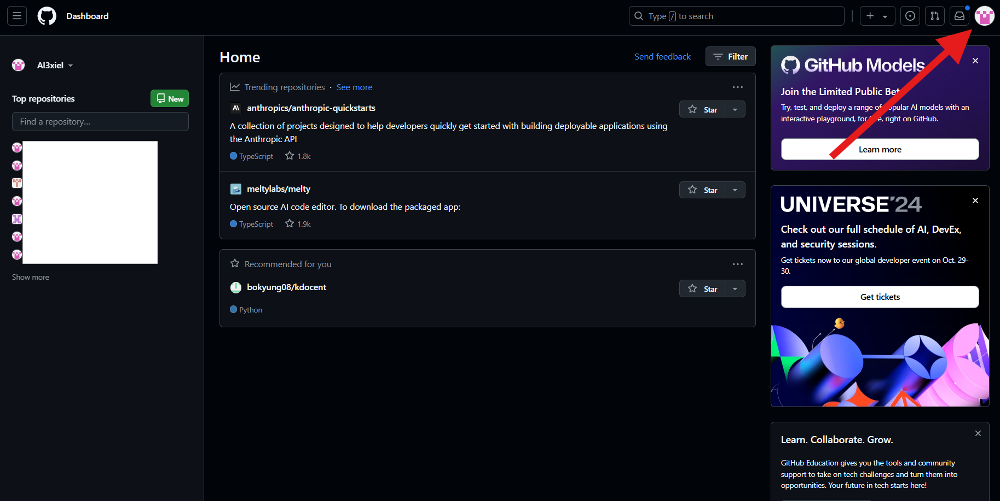

  <h1>Universidad Peruana de Ciencias Aplicadas</h1>
  
  <h2 >Carrera: de Ingeniería de Software</h2>
  <h2 >Ciclo: 2024-02</h2>
   
  <h2 >Curso: Aplicaciones Web</h2>
  <h2 >Sección: WS53</h2>
   
  <h2 >Informe del TB1</h2>
  <h2 >Startup: NRG3</h2>
  <h2 >Producto: Bliss</h2>
   
  <h2 >Integrantes:</h2>
  <ul style="list-style: none; padding: 0;">
      <li><h3>Juan Diego Astonitas Díaz</h3></li>
      <li><h3>Sebastian Aaron Anibal Carbajal Santivañez</h3></li>
      <li><h3>Gabriel Alexander Casas Sanchez</h3></li>
      <li><h3>Gianluca Santino Pasquale Barrenechea</h3></li>
      <li><h3>Elvia Marcela Rodriguez Villa</h3></li>
  </ul>
   
  <h4>Septiembre del 2024</h4>

## Student Outcome

<table>
  <tr>
    <td colspan="1"><strong>Criterio Específico</strong></td>
    <td colspan="1"><strong>Acciones Realizadas</strong></td>
    <td colspan="1"><strong>Conclusiones</strong></td>
  </tr>
  <tr>
    <td></td>
    <td></td>
    <td></td>
  </tr>
  <tr>
    <td></td>
    <td></td>
    <td></td>
  </tr>
</table>

## Registro de Versiones del Informe

| Versión | Fecha | Autor | Descripción de modificación |
|---------|-------|-------|-----------------------------|
|         |       |       |                             |

## Project Report Collaboration Insights
Se han realizado todas las tareas asignadas para la entrega de la TB1, las cuales se encuentran registradas en el repositorio de Github de la organización del equipo bajo el enlace https://github.com/NRG3-appweb. Para elaborar el informe, cada miembro ha redactado y creado gráficos en formato Markdown según los puntos asignados, realizando commits para registrar el avance en el repositorio. 

## Contenido

- [Student Outcome](#student-outcome)
- [Registro de Versiones del Informe](#registro-de-versiones-del-informe)
- [Project Report Collaboration Insights](#project-report-collaboration-insights)
- [Contenido](#contenido)
- [Student Outcome](#student-outcome-1)
- [Capítulo I: Introducción ](#capítulo-i-introducción-)
  - [1.1. Startup Profile](#11-startup-profile)
    - [1.1.1. Descripción de la Startup](#111-descripción-de-la-startup)
    - [1.1.2. Perfiles de integrantes del equipo](#112-perfiles-de-integrantes-del-equipo)
  - [1.2. Solution Profile](#12-solution-profile)
    - [1.2.1 Antecedentes y problemática](#121-antecedentes-y-problemática)
    - [1.2.2 Lean UX Process](#122-lean-ux-process)
      - [1.2.2.1. Lean UX Problem Statements](#1221-lean-ux-problem-statements)
      - [1.2.2.2. Lean UX Assumptions](#1222-lean-ux-assumptions)
      - [1.2.2.3. Lean UX Hypothesis Statements](#1223-lean-ux-hypothesis-statements)
      - [1.2.2.4. Lean UX Canvas](#1224-lean-ux-canvas)
  - [1.3. Segmentos objetivo](#13-segmentos-objetivo)
- [Capítulo II: Requirements Elicitation \& Analysis ](#capítulo-ii-requirements-elicitation--analysis-)
  - [2.1. Competidores](#21-competidores)
    - [2.1.1. Análisis competitivo](#211-análisis-competitivo)
    - [2.1.2. Estrategias y tácticas frente a competidores.](#212-estrategias-y-tácticas-frente-a-competidores)
  - [2.2. Entrevistas.](#22-entrevistas)
    - [2.2.1. Diseño de entrevistas](#221-diseño-de-entrevistas)
    - [2.2.2. Registro de entrevistas](#222-registro-de-entrevistas)
    - [2.2.3. Análisis de entrevistas](#223-análisis-de-entrevistas)
  - [2.3. Needfinding](#23-needfinding)
    - [2.3.1. User Personas](#231-user-personas)
    - [2.3.2. User Task Matrix](#232-user-task-matrix)
    - [2.3.3. User Journey Mapping](#233-user-journey-mapping)
    - [2.3.4. Empathy Mapping](#234-empathy-mapping)
    - [2.3.5. As-is Scenario Mapping](#235-as-is-scenario-mapping)
  - [2.4. Ubiquitous Language](#24-ubiquitous-language)
- [Capítulo III: Requirements Specification ](#capítulo-iii-requirements-specification-)
  - [3.1. To-Be Scenario Mapping](#31-to-be-scenario-mapping)
        - [User Persona #1](#user-persona-1)
        - [User Persona #2](#user-persona-2)
  - [3.2. User Stories](#32-user-stories)
    - [3.2.1 Epics](#321-epics)
    - [3.2.2 User Stories - Clientes](#322-user-stories---clientes)
    - [3.2.3 User Stories - Empresas](#323-user-stories---empresas)
    - [3.2.4 User Stories - Landing Page](#324-user-stories---landing-page)
    - [3.2.5 Technical Stories](#325-technical-stories)
  - [3.3. Impact Mapping](#33-impact-mapping)
  - [3.4. Product Backlog](#34-product-backlog)
- [Capítulo IV: Product Design ](#capítulo-iv-product-design-)
  - [4.1. Style Guidelines](#41-style-guidelines)
    - [4.1.1. General Style Guidelines](#411-general-style-guidelines)
    - [4.1.2. Web Style Guidelines](#412-web-style-guidelines)
  - [4.2. Information Architecture](#42-information-architecture)
    - [4.2.1. Organization Systems](#421-organization-systems)
    - [4.2.2. Labeling Systems](#422-labeling-systems)
    - [4.2.3. SEO Tags and Meta Tags](#423-seo-tags-and-meta-tags)
    - [4.2.4. Searching Systems](#424-searching-systems)
    - [4.2.5. Navigation Systems](#425-navigation-systems)
  - [4.3. Landing Page UI Design](#43-landing-page-ui-design)
    - [4.3.1. Landing Page Wireframe](#431-landing-page-wireframe)
    - [4.3.2. Landing Page Mock-up](#432-landing-page-mock-up)
  - [4.4. Web Applications UX/UI Design](#44-web-applications-uxui-design)
    - [4.4.1. Web Applications Wireframes](#441-web-applications-wireframes)
    - [4.4.2. Web Applications Wireflow Diagrams](#442-web-applications-wireflow-diagrams)
    - [4.4.3. Web Applications Mock-ups](#443-web-applications-mock-ups)
    - [4.4.4. Web Applications User Flow Diagrams](#444-web-applications-user-flow-diagrams)
  - [4.5. Web Applications Prototyping](#45-web-applications-prototyping)
  - [4.6. Domain-Driven Software Architecture](#46-domain-driven-software-architecture)
    - [4.6.1. Software Architecture Context Diagram](#461-software-architecture-context-diagram)
    - [4.6.2. Software Architecture Container Diagrams](#462-software-architecture-container-diagrams)
    - [4.6.3. Software Architecture Components Diagrams](#463-software-architecture-components-diagrams)
  - [4.7. Software Object-Oriented Design](#47-software-object-oriented-design)
    - [4.7.1. Class Diagrams](#471-class-diagrams)
    - [4.7.2. Class Dictionary](#472-class-dictionary)
  - [4.8. Database Design](#48-database-design)
    - [4.8.1. Database Diagram](#481-database-diagram)
- [Capítulo V: Product Implementation, Validation \& Deployment ](#capítulo-v-product-implementation-validation--deployment-)
  - [5.1. Software Configuration Management](#51-software-configuration-management)
    - [5.1.1. Software Development Environment Configuration](#511-software-development-environment-configuration)
    - [5.1.2. Source Code Management](#512-source-code-management)
    - [5.1.3. Source Code Style Guide \& Conventions](#513-source-code-style-guide--conventions)
    - [5.1.4. Software Deployment Configuration](#514-software-deployment-configuration)
  - [5.2. Landing Page, Services \& Applications Implementation](#52-landing-page-services--applications-implementation)
    - [5.2.1. Sprint 1](#521-sprint-1)
      - [5.2.1.1. Sprint Planning 1](#5211-sprint-planning-1)
      - [5.2.1.2. Sprint Backlog 1](#5212-sprint-backlog-1)
      - [5.2.1.3. Development Evidence for Sprint Review](#5213-development-evidence-for-sprint-review)
      - [5.2.1.4. Testing Suite Evidence for Sprint Review](#5214-testing-suite-evidence-for-sprint-review)
      - [5.2.1.5. Execution Evidence for Sprint Review](#5215-execution-evidence-for-sprint-review)
      - [5.2.1.6. Services Documentation Evidence for Sprint Review](#5216-services-documentation-evidence-for-sprint-review)
      - [5.2.1.7. Software Deployment Evidence for Sprint Review](#5217-software-deployment-evidence-for-sprint-review)
      - [5.2.1.8. Team Collaboration Insights during Sprint](#5218-team-collaboration-insights-during-sprint)
- [Conclusiones](#conclusiones)
- [Bibliografía](#bibliografía)
- [Anexos](#anexos)

## Student Outcome

## Capítulo I: Introducción 

### 1.1. Startup Profile
#### 1.1.1. Descripción de la Startup
El sector de belleza y cuidado personal en Perú está experimentando un crecimiento acelerado, especialmente en los tratamientos faciales y la dermocosmética, que se han multiplicado casi ocho veces en la última década. Este crecimiento se da en respuesta a una demanda creciente de la clase media emergente, que busca servicios más personalizados y de alta calidad. En este contexto, los salones de belleza juegan un papel clave, pero muchos de ellos operan en un mercado polarizado e informal.

La competencia entre salones de belleza, especialmente los gestionados por pequeñas empresas familiares, es alta, y la personalización del servicio se ha convertido en un factor diferenciador clave. La mayoría de estos establecimientos, dirigidos en un 75.6% por mujeres según datos del INEI, enfrentan el desafío de profesionalizar su atención y mejorar la experiencia del usuario. A medida que la industria sigue creciendo, se vuelve esencial elevar la calidad del servicio, mejorar la gestión de la atención al cliente y formalizar las operaciones para establecer relaciones más duraderas y significativas con los clientes.

Para destacar en un mercado competitivo y en crecimiento, es crucial mejorar la calidad del servicio y ofrecer experiencias personalizadas que profesionalicen la industria y fortalezcan las relaciones con los clientes.

**Misión:**
Brindar servicios de belleza y cuidado personal altamente personalizados, enfocados en satisfacer las necesidades y expectativas únicas de cada cliente, ofreciendo una atención cercana y de calidad.

**Visión:**
Convertirnos en el referente líder en la industria de la belleza y cuidado personal en Perú, conocidos por ofrecer experiencias personalizadas y contribuir al crecimiento y profesionalización del sector.

#### 1.1.2. Perfiles de integrantes del equipo

<table>
  <tr>
    <th colspan="2"> Juan Diego Astonitas </th>
  </tr>
  <tr>
    <td>  </td>
    <td> Mi nombre es Juan Diego Astonitas Diaz, mi código de estudiante es u202110237 ,tengo 20 años, actualmente curso el 5to ciclo de la carrera de Ingeniería de Software, en la UPC en la sede San Miguel. Mis principales cualidades son el liderazgo y el dominio de Python. Haré todo lo que esté a mi alcance para respaldar al equipo en la finalización oportuna y efectiva de las tareas asignadas. </td>
  </tr>
  <tr>
    <th colspan="2"> Casas Sanchez Gabriel Alexander </th>
  </tr>
  <tr>
    <td>  </td>
    <td> Soy estudiante de Ingeniería de software y estoy cursando el quinto ciclo de la carrera. Me considero una persona bastante capaz y versátil en el ámbito académico. Creo que mi principal fortaleza es mi capacidad para dirigir y trabajar bien bajo presión. A pesar de no disfrutar los trabajos grupales, considero que siempre desempeñó un rol sobresaliente en ellos. </td>
  </tr>
<tr>
    <th colspan="2"> Gianluca Santino Pasquale Barrenechea </th>
  </tr>
  <tr>
    <td>  </td>
    <td> Me llamo Gianluca Santino Pasquale Barrenechea, con código de alumno u202112078, tengo 20 años y soy estudiante de la carrera de Ingenieria de Software. Como miembro de equipo, me centraré en el desarrollo del frontend y backend de nuestra Startup, utilizare mis habilidades en C++, C#, Python, Java y HTML para lograr esto. Mi objetivo está en tener un código limpio y eficiente. </td>
  </tr>
<tr>
    <th colspan="2"> Elvia Marcela Rodríguez Villa </th>
  </tr>
  <tr>
    <td>  </td>
    <td> Soy Elvia Rodríguez, actual estudiante universitaria y egresada de Laboratoria. Soy actual embajadora del programa de estudiantes de Microsoft y fui participante de diversos voluntariados y Hackathons cómo Ciencia en tu Comunidad y el Laboratorio de Emprendimientos de SENAJU. Asimismo, soy maestra de inglés y suelo incorporar mis conocimientos de programación de interfaces de usuario en mi labor educativa. </td>
  </tr>
<tr>
    <th colspan="2"> Sebastian Carbajal Santivañez </th>
  </tr>
  <tr>
    <td>  </td>
    <td>Mi nombre es sebastian carbajal santivañez, me encuentro cursando la carrera de ingeniería de software, me apasiona mucho el explorar nuevos horizontes y oportunidades dentro de mi rubro académico y profesional, me considero además una persona creativa con pensamiento innovador.</td>
  </tr>
</table>

### 1.2. Solution Profile
#### 1.2.1 Antecedentes y problemática

**What**
- ¿Cuál es el problema?

El problema radica en la falta de personalización y profesionalización en los servicios de belleza, donde las personas tienen dificultades para reservar citas, y las Mypes enfrentan retos para atraer nuevos clientes en un mercado competitivo e informal.

- ¿Cuál es la relación con la persona en cuestión?

La relación es conectar a clientes que buscan servicios de belleza convenientes y confiables con estilistas y dueños de negocios que desean expandir su clientela y visibilizar sus servicios.

**When**
- ¿Cuándo sucede el problema?

El problema surge cuando los clientes quieren reservar citas de belleza, pero no tienen tiempo para buscar proveedores o hacer reservas por teléfono.

- ¿Cuándo utiliza el cliente el producto?

El cliente utiliza el producto cuando desea buscar, reservar y pagar servicios de cuidado y belleza, ya sea en casa o en el establecimiento, y cuando los proveedores necesitan una plataforma para promocionar sus servicios.

**Where**
- ¿Dónde está el cliente cuando usa el producto?

El cliente usa el producto desde cualquier lugar con acceso a Internet, como su hogar, lugar de trabajo o mientras se desplaza.

- ¿Dónde surge el problema?

El problema surge cuando los clientes intentan reservar citas para servicios de belleza y encuentran dificultades para encontrar proveedores confiables o coordinar horarios adecuados.

**Who**
- ¿Quienes se ven involucrados en el problema?

Se ven involucrados los clientes que buscan servicios de belleza y cuidado personal, así como los proveedores que los ofrecen.

**Why**
- ¿Cuáles son las causas del problema?

La causa del problema es la falta de una plataforma centralizada que facilite la conexión conveniente entre clientes y proveedores de servicios de belleza, así como la dificultad para coordinar horarios y encontrar proveedores confiables.

**How**
- ¿En qué condiciones los clientes usan nuestro producto?

Nuestros clientes usan el producto cuando están en casa buscando servicios para ocasiones especiales, durante descansos en el trabajo navegando opciones, o en movimiento para reservar rápidamente servicios mientras están fuera de casa.

**How Much**

- ¿Cuál es la magnitud del problema?

La magnitud del problema es considerable, ya que, según la Asociación Peruana de Empresarios de la Belleza (2022), 4 de cada 10 peluquerías tuvieron que cerrar debido a la pandemia, y solo el 30% de las que permanecen siguen en la formalidad. Esto se debe a los altos costos de alquiler y materia prima, que afectan la viabilidad y profesionalización de muchos negocios en el sector.

#### 1.2.2 Lean UX Process
El lean UX process es un enfoque iterativo centrado en el usuario para el diseño de proyectos y productos. Este enfoque se base en ciclos rápidos (sprints) de investigación, diseño y pruebas para validar la propuesta o ideas planteadas por el equipo. Estas propuestas estarán siempre orientadas a satisfacer las necesidades de los usuarios. 
##### 1.2.2.1. Lean UX Problem Statements

Nuestro servicio ofrece la capacidadad de mejorar la gestión de clientes mediante una plataforma que facilite a los clientes la búsqueda y reserva de servicios de belleza y cuidado personal. Sin embargo, se ha observado un factor crítico que afecta la confianza del cliente al seleccionar un centro de belleza, este es la alta tasa de informalidad en la industria. Esta falta de transparencia y garantías sobre la calidad de los servicios ofrecidos crea incertidumbre y afecta negativamente la experiencia del usuario.

¿Cómo podemos mejorar el proceso de selección del cliente para salones, tratamientos y servicios, asegurando un diseño que promueva la confianza y seguridad?

* Se deberá proporcionar un sistema eficiente y transparente para la búsqueda y reserva de servicios, así como establecer canales de comunicación efectivos con los clientes. Nos enfrentamos a otro desafío significativo, los sistemas de gestión de citas para servicios de cuidado y belleza son ineficientes y generan desconfiaza en el usuario final. Reconocemos la importancia de garantizar una experiencia segura y sin preocupaciones para los usuarios que utilizan nuestra plataforma para reservar servicios de belleza. La altan tasa de informalidad en la industria de los centros de belleza crea desafíos adicionales para garantizar la calidad y confiabilidad de los servicios ofrecidos.

##### 1.2.2.2. Lean UX Assumptions

Creo que mis clientes necesitan saber cómo y dónde acceder a servicios de manicure, pedicure y tratamientos faciales a domicilio de manera conveniente y segura.

Estas necesidades se pueden resolver con una aplicación que conecte a clientes con profesionales de belleza verificados, ofreciendo una amplia gama de servicios personalizados y garantizando medidas de seguridad y calidad.

Mis clientes son personas que buscan comodidad y confiabilidad al reservar servicios de belleza, sin comprometer la calidad y la seguridad.

El valor N°1 que mi cliente quiere de mi servicio es la facilidad de reserva, la calidad de los servicios y la tranquilidad de tener profesionales confiables en su hogar.

El cliente también puede adquirir beneficios adicionales como descuentos por lealtad, recomendaciones personalizadas y acceso a productos exclusivos.

Voy a adquirir a la mayoría de mis clientes a través de estrategias de marketing digital, colaboraciones con empresas de belleza y programas de referidos. Haré dinero a través de anuncios por colaboraciones con marcas de belleza, comisiones por reservas y membresías premium.

Mi competencia principal en el mercado serán aplicaciones similares que ofrecen servicios de belleza a domicilio, salones de belleza locales y plataformas de reserva en línea. Los venceremos debido a nuestra estrategia de enfoque en la seguridad y calidad, personalización de servicios, y programas de fidelización.

Mi mayor riesgo de producto es que los clientes no confíen en la seguridad de tener desconocidos en sus hogares o que prefieran la experiencia tradicional en un salón de belleza.

Resolveremos esto a través de la implementación de rigurosos procesos de verificación de profesionales, garantías de seguridad y promoción de la comodidad y conveniencia de nuestros servicios a domicilio.

##### 1.2.2.3. Lean UX Hypothesis Statements

**Hypothesis Statement 01:**

**Creemos que** ofrecer una amplia gama de servicios de cuidado y belleza a través de nuestra aplicación **para** usuarios que buscan comodidad y conveniencia permitirá que estos puedan reservar citas fácilmente y acceder a servicios de calidad.

**Sabremos que** hemos tenido éxito

**Cuando** se vea un aumento significativo en la cantidad de reservas realizadas a través de nuestra aplicación, así como una mayor retención de clientes satisfechos.

**Hypothesis Statement 02:**

**Creemos que** implementar un sistema de verificación de estilistas calificados y negocios confiables garantizará la calidad de las citas reservadas y brindará seguridad a nuestros usuarios al reservar servicios de cuidado y belleza.

**Sabremos que** hemos tenido éxito

**Cuando** se reciban comentarios positivos de los usuarios acerca de la garantía y la buena calidad del servicio recibido, así como cuando veamos un mayor tráfico en la aplicación.

**Hypothesis Statement 03:**

**Creemos que** establecer colaboraciones estratégicas con salones de belleza, estilistas, marcas de belleza relevantes, y ofrecer programas de referidos atractivos ayudará a aumentar la visibilidad de nuestra aplicación.

**Sabremos que** hemos tenido éxito

**Cuando** observemos un aumento del 30% en la adquisición de clientes durante los períodos activos de nuestras colaboraciones, así como una mayor interacción de los usuarios con la aplicación a través de programas de referidos.

**Hypothesis Statement 04:**
**Creemos que** aumentaremos la confianza del usuario y fomentaremos la lealtad a nuestra marca si incorporamos funciones de calificación y reseñas para que los usuarios puedan evaluar la calidad de los servicios recibidos y compartir sus experiencias con otros usuarios.

**Sabremos que** hemos tenido éxito

**Cuando** observemos un aumento del 60% en la participación de los usuarios en la función de calificación y reseñas, así como un incremento en la cantidad de reseñas positivas y una mejora general en la percepción de la calidad de los servicios por parte de los usuarios.

##### 1.2.2.4. Lean UX Canvas

### 1.3. Segmentos objetivo

**Segmento objetivo #1: Clientas Aficionadas al Embellecimiento**

Este grupo está compuesto por mujeres de entre 20 y 45 años, pertenecientes a los sectores socioeconómicos B-C, que residen en Lima. Estas clientas buscan activamente servicios de embellecimiento y cuidado personal para realzar su apariencia y bienestar. A menudo enfrentan desafíos relacionados con la accesibilidad y la calidad de los servicios de belleza disponibles en el mercado.

Características clave de este segmento:

- Buscan servicios de belleza y cuidado personal para mejorar su apariencia y bienestar.
- Valoran la calidad y personalización en los servicios que reciben.
- Residen en áreas urbanas y tienen un interés constante en mantenerse al tanto de las últimas tendencias en belleza.
- Enfrentan dificultades para acceder a servicios de alta calidad debido a la falta de opciones confiables y convenientes.

**Segmento objetivo #2: MYPES del Sector de Belleza**

Este grupo está compuesto por dueños de pequeños y medianos negocios que brindan servicios de cuidado y belleza en Lima. Estos empresarios enfrentan retos significativos relacionados con la promoción de sus servicios, la captación de nuevos clientes y la competencia en un mercado en constante cambio. La realidad de este segmento se caracteriza por la necesidad de adoptar soluciones eficaces para mejorar su visibilidad y profesionalizar sus operaciones.

Características clave de este segmento:

- Enfrentan desafíos en la promoción de sus servicios y en la atracción de nuevos clientes.
- Buscan herramientas y plataformas que les permitan mejorar su visibilidad y profesionalizar sus operaciones.
- Operan en un mercado competitivo donde la diferenciación y la calidad del servicio son cruciales para su éxito.
- Valoran soluciones que les ayuden a gestionar eficientemente su negocio y a destacar en el mercado de belleza.

## Capítulo II: Requirements Elicitation & Analysis 

### 2.1. Competidores
#### 2.1.1. Análisis competitivo
#### 2.1.2. Estrategias y tácticas frente a competidores.
### 2.2. Entrevistas.
#### 2.2.1. Diseño de entrevistas
#### 2.2.2. Registro de entrevistas
#### 2.2.3. Análisis de entrevistas
### 2.3. Needfinding
#### 2.3.1. User Personas
#### 2.3.2. User Task Matrix
#### 2.3.3. User Journey Mapping
#### 2.3.4. Empathy Mapping
#### 2.3.5. As-is Scenario Mapping
### 2.4. Ubiquitous Language

## Capítulo III: Requirements Specification 

### 3.1. To-Be Scenario Mapping

###### User Persona #1

###### User Persona #2

### 3.2. User Stories
Para elaborar user stories estas deben pertenecer a una epic stories. A continuación, se mostrarán las epic stories:

#### 3.2.1 Epics

<table border="1">
	<tbody>
		<tr>
			<td colspan="1">Epic ID</td>
            <td colspan="1">Título</td>
            <td colspan="1">Descripción</td>
		</tr>
        <tr>
            <td colspan="1">EP001</td>
            <td colspan="1">Gestión de usuario</td>
            <td colspan="1">
            <strong>Como</strong> usuario de la aplicación (cliente o empresa), <strong>quiero</strong> gestionar mi perfil personal o de empresa <strong>para</strong> mantener la información actualizada.
            </td>
		</tr>
        <tr>
            <td colspan="1">EP002</td>
            <td colspan="1">Busqueda y selección de servicios</td>
            <td colspan="1">
            <strong>Como</strong> cliente, <strong>quiero</strong> buscar y seleccionar servicios de belleza con facilidad, <strong>para</strong> encontrar la opción que mejor se adapte a mis necesidades.
            </td>
		</tr>
        <tr>
            <td colspan="1">EP003</td>
            <td colspan="1">Reserva y confirmacion de servicios</td>
            <td colspan="1">
            <strong>Como</strong> cliente, <strong>quiero</strong> reservar un servicio y recibir una confirmación clara y rápida, <strong>para</strong> asegurarme de que mi cita esté programada.
            </td>
		</tr>
        <tr>
            <td colspan="1">EP004</td>
            <td colspan="1">Retroalimentación y valoración</td>
            <td colspan="1">
            <strong>Como</strong> cliente, <strong>quiero</strong> proporcionar retroalimentación y valoraciones sobre los servicios recibidos, <strong>para</strong> ayudar a otros clientes y mejorar la calidad de los servicios ofrecidos.
            </td>
		</tr>
        <tr>
            <td colspan="1">EP005</td>
            <td colspan="1">Gestión del catálogo de servicios</td>
            <td colspan="1">
            <strong>Como</strong> empresa, <strong>quiero</strong> poder gestionar los servicios que aparecen en mi catálogo <strong>para</strong> así poder manternerlo actualizado en caso de que añada o quite alguno.
            </td>
		</tr>
        <tr>
            <td colspan="1">EP006</td>
            <td colspan="1">Personalización del servicio</td>
            <td colspan="1">
            <strong>Como</strong> cliente, <strong>quiero</strong> adaptar mi solicitud de servicios de belleza y/o cuidado de acuerdo a mis preferencias y a la disposición de la empresa que ofrece el servicio <strong>para</strong> asegurarme que el servicio que solicite sea posible de agendar.
            </td>
		</tr>
		<tr>
            <td colspan="1">EP007</td>
            <td colspan="1">Seguridad y Verificación</td>
            <td colspan="1">
            <strong>Como</strong> usuario de la aplicación (cliente o empresa), <strong>quiero</strong> asegurarme de que mi identidad y la de otros usuarios estén verificadas, <strong>para</strong> garantizar un entorno seguro y confiable dentro de la plataforma.
            </td>
		</tr>
        <tr>
            <td colspan="1">EP008</td>
            <td colspan="1">Comunicación</td>
            <td colspan="1">
            <strong>Como</strong> empresa, <strong>quiero</strong> comunicarme eficientemente con mis clientes <strong>para</strong> así poder brindar elmejor servicio posible.
            </td>
		</tr>
        <tr>
            <td colspan="1">EP009</td>
            <td colspan="1">Reservas</td>
            <td colspan="1">
            <strong>Como</strong> empresa, <strong>quiero</strong> gestionar sus reservas <strong>para</strong> garantizar una experiencia de servicio mas fluida y satisfactoria.
            </td>
		</tr>
        <tr>
            <td colspan="1">EP010</td>
            <td colspan="1">Sistema de pagos</td>
            <td colspan="1">
            <strong>Como</strong> usuario de la aplicación (cliente o empresa), <strong>quiero</strong> gestionar los pagos de manera segura y eficiente, <strong>para</strong> asegurar transacciones confiables y sin inconvenientes.
            </td>
		</tr>
        <tr>
            <td colspan="1">EP011</td>
            <td colspan="1">Experiencia del Usuario</td>
            <td colspan="1">
            <strong>Como</strong>visitante de la landing page de Bliss, <strong>quiero</strong> interactuar de manera fluida y obtener toda la información relevante sobre el producto y sus alianzas estratégicas, <strong>para</strong> tomar una decisión informada.
            </td>
		</tr>
	</tbody>
</table>

#### 3.2.2 User Stories - Clientes
<table  border = "1">
	<tbody>
		<tr>
			<td colspan="1">Story ID</td>
            <td colspan="1">Título</td>
            <td colspan="1">Descripción</td>
            <td colspan="1">Criterios de Aceptación con Escenarios</td>
            <td colspan="1">Epic ID</td>
		</tr>
		<tr>
            <td colspan="1">US001</td>
            <td colspan="1">Creación de cuenta</td>
            <td colspan="1">
            <strong>Como</strong> visitante <strong>quiero</strong> crear una cuenta proporcionando mi nombre, dirección de correo electrónico y contraseña <strong>para</strong> poder tener mis datos guardados.
            </td>
            <td colspan="1">
            <strong>E01: Registro completado</strong>
             
            <strong>Dado que</strong> un nuevo visitante quiere registrarse
             
            <strong>Cuando</strong> ingresa su nombre, dirección de correo electrónico y contraseña
             
            <strong>Y</strong> presiona el botón de Crear Cuenta
             
            <strong>Entonces</strong> se envía un correo de verificación a la dirección enviada
              
            <strong>E02: Registro completado</strong>
             
            <strong>Dado que</strong> un nuevo visitante quiere registrarse
             
            <strong>Cuando</strong> ingresa un nombre, contraseña o un correo electrónico que no cumpla los requisitos establecidos
             
            <strong>Y</strong> presiona el botón de Crear Cuenta
             
            <strong>Entonces</strong> aparece en pantalla un mensaje de error, indicando donde se encuentra el error y pidiendo que se ingrese de nuevo.
            </td>
            <td colspan="1">EP001</td>
	    </tr>
        <tr>
            <td colspan="1">US002</td>
            <td colspan="1">Verificación de correo electrónico</td>
            <td colspan="1">
            <strong>Como</strong> visitante <strong>quiero</strong> recibir un correo electrónico de verificación después de registrarme <strong>para</strong> confirmar mi dirección de correo electrónico.
            </td>
            <td colspan="1">
            <strong>E01: Verificación exitosa</strong>
             
            <strong>Dado que</strong> un visitante quiere crear una nueva cuenta
             
            <strong>Cuando</strong> encuentra el correo que le mandamos donde está el enlace con el código para crear su cuenta
             
            <strong>Y</strong> ingresa correctamente su código al enlace
             
            <strong>Entonces</strong> la cuenta nueva esta creada y se le redirige a la página principal de la aplicación.
              
            <strong>E02: Error en la verificación</strong>
             
            <strong>Dado que</strong> un visitante quiere crear una nueva cuenta
             
            <strong>Cuando</strong> no encuentra el correo que mandamos a la dirección registrada presiono el botón mandar de nuevo
             
            <strong>Y</strong> ya pasaron 15 minutos
             
            <strong>Entonces</strong> aparecerá un mensaje de error indicando que el correo no se pudo verificar y que pedirá ingresar de nuevo el correo electrónico.
            </td>
            <td colspan="1">EP007</td>
	    </tr>
        <tr>
            <td colspan="1">US003</td>
            <td colspan="1">Inicio de sesión de usuario</td>
            <td colspan="1">
            <strong>Como</strong> usuario registrado, <strong>quiero</strong> iniciar sesión utilizando mi correo electrónico y contraseña<strong>para</strong> poder cargar mis datos guardados anteriormente. 
            </td>
            <td colspan="1">
            <strong>E01: Inicio sesión exitoso</strong>
             
            <strong>Dado que</strong> que un usuario quiere ingresar a su cuenta
             
            <strong>Cuando</strong> el usuario proporciona su dirección de correo electrónico y contraseña
             
            <strong>Y</strong> presiona el botón Iniciar Sesión
             
            <strong>Entonces</strong> el usuario es redirigido a la página principal.
              
            <strong>E02: Error al iniciar sesión</strong>
             
            <strong>Dado que</strong> que un usuario quiere ingresar a su cuenta
             
            <strong>Cuando</strong> el usuario proporciona un correo electrónico o contraseña invalido
             
            <strong>Y</strong> presiona el botón Iniciar Sesión
             
            <strong>Entonces</strong> se muestra un mensaje de error y se solicita ingrese de nuevo.
            </td>
            <td colspan="1">EP001</td>
	    </tr>
        <tr>
            <td colspan="1">US004</td>
            <td colspan="1">Recomendación por ubicación</td>
            <td colspan="1">
            <strong>Como</strong> cliente, <strong>quiero</strong> visualizar como recomendados los servicios de belleza o cuidado de establecimientos cercanos a mi ubicación actual <strong>para</strong> así poder escoger el que menos tiempo de traslado me tome. 
            </td>
            <td colspan="1">
            <strong>E01: Recomendaciones encontradas</strong>
             
            <strong>Dado que</strong> el cliente se encuentra en home
             
            <strong>Cuando</strong> se reconoce su ubicación por localización satélital
             
            <strong>Entonces</strong> se muestra una lista de servicios ofrecidos por establecimientos cercanos a la ubicación del cliente.
              
            <strong>E02: No se encuentran recomendaciones</strong>
             
            <strong>Dado que</strong> el cliente se encuentra en home
             
            <strong>Cuando</strong> no se reconoce su ubicación por localización satélital
             
            <strong>Entonces</strong> solo se visualizan servicios basados en su historial de servicios.
            </td>
            <td colspan="1">EP002</td>
	    </tr>
        <tr>
            <td colspan="1">US005</td>
            <td colspan="1">Visualización de historial</td>
            <td colspan="1">
            <strong>Como</strong> cliente, <strong>quiero</strong> visualizar los servicios de belleza de establecimientos a los que ya he solicitado servicios anteriormente <strong>para</strong> para así poder mantener una rutina con cosmeticas en las que confio.
            </td>
            <td colspan="1">
            <strong>E01: Recomendaciones encontradas</strong>
             
            <strong>Dado que</strong> el cliente quiere buscar servicios ya solicitados
             
            <strong>Cuando</strong> ingrese a su historial
             
            <strong>Entonces</strong> se muestra una lista de servicios que el usuario ya ha solicitado
              
            <strong>E02: Historial sin serivicios almacenados</strong>
             
            <strong>Dado que</strong> el cliente quiere buscar servicios ya solicitados
             
            <strong>Cuando</strong> ingrese a su historial
             
            <strong>Entonces</strong> el sistema muestra un mensaje indicando que no se tiene guardado ningún servicio en el historial.
            </td>
            <td colspan="1">EP002</td>
	    </tr>
        <tr>
            <td colspan="1">US006</td>
            <td colspan="1">Visualización de disponibilidad de citas</td>
            <td colspan="1">
            <strong>Como</strong> cliente, <strong>quiero</strong> poder ver la disponibilidad de citas de los centros de belleza y cuidado <strong>para</strong> elegir un horario conveniente para mí.
            </td>
            <td colspan="1">
            <strong>E01: Visualización detalles del servicio</strong>
             
            <strong>Dado que</strong> el cliente selecciona un servicio específico
             
            <strong>Cuando</strong> selecciona el especialista
             
            <strong>Y</strong> detalla los requerimientos personalizados del servicio
             
            <strong>Entonces</strong> el sistema muestra un calendario con horarios disponibles y puede seleccionar una fecha y hora conveniente.
              
            <strong>E02: Error al acceder a los detalles del servicio</strong>
             
            <strong>Dado que</strong> el cliente selecciona un servicio específico
             
            <strong>Cuando</strong> selecciona el especialista
             
            <strong>Y</strong> los detalles del servicio no están completos
             
            <strong>Entonces</strong> se muestra un mensaje de advertencia sobre la falta de información del servicio.
            </td>
            <td colspan="1">EP003</td>
	    </tr>
        <tr>
            <td colspan="1">US007</td>
            <td colspan="1">Notificación de confirmación de reserva</td>
            <td colspan="1">
            <strong>Como</strong> cliente, <strong>quiero</strong> recibir una notificación de confirmación después de reservar una cita <strong>para</strong> tener la seguridad de que se ha realizado correctamente.
            </td>
            <td colspan="1">
            <strong>E01: Notificación Automática</strong>
             
            <strong>Dado que</strong> el cliente reserva una cita
             
            <strong>Cuando</strong> pasa 1 minuto
             
            <strong>Entonces</strong> recibe la notificación con detalles de la cita en su correo electrónico.
              
            <strong>E02: Notificación no enviada</strong>
             
            <strong>Dado que</strong> el cliente reserva una cita
             
            <strong>Cuando</strong> pasa 1 minuto y no recibe una notificación en ningún dispositivo vinculado
             
            <strong>Entonces</strong> puede seleccionar la opción de reenviar confirmación.
            </td>
            <td colspan="1">EP003</td>
	    </tr>
        <tr>
            <td colspan="1">US008</td>
            <td colspan="1">Cancelación de cita por parte del cliente</td>
            <td colspan="1">
            <strong>Como</strong> cliente, <strong>quiero</strong> cancelar una cita reservada en la aplicación <strong>para</strong> así poder hacer tiempo para alguna necesidad que se me presente.
            </td>
            <td colspan="1">
            <strong>E01: Cancelación Confirmada</strong>
             
            <strong>Dado que</strong> el cliente quiere cancelar una cita
             
            <strong>Cuando</strong> selecciona la opción de cancelar la cita
             
            <strong>Entonces</strong> se presenta un mensaje de confirmación
             
            <strong>Y</strong> se elimina de su agenda personal
              
            <strong>E02: Error de Cancelación</strong>
             
            <strong>Dado que</strong> el cliente quiere cancelar una cita
             
            <strong>Cuando</strong> selecciona la opción de cancelar la cita
             
            <strong>Entonces</strong> el sistema muestra mensaje de erorr al cancelar la cita.
            </td>
            <td colspan="1">EP003</td>
	    </tr>
        <tr>
            <td colspan="1">US009</td>
            <td colspan="1">Dejar valoración y reseña después de la cita</td>
            <td colspan="1">
            <strong>Como</strong> cliente, <strong>quiero</strong> dejar una valoración y reseña sobre el servicio recibido después de completar una cita <strong>para</strong> ayudar a otros cliente en su elección.
            </td>
            <td colspan="1">
            <strong>E01: Publicación de Reseña</strong>
             
            <strong>Dado que</strong> el cliente ya recibio el servicio
             
            <strong>Cuando</strong> selecciona la opción de dejar reseña en el perfil de la empresa
             
            <strong>Y</strong> escriba respecto a su experiencia junto a un puntaje con un indicador de hasta 5 estrellas
             
            <strong>Y</strong> publique su reseña
             
            <strong>Entonces</strong> su reseña se visualiza en el perfil de la empresa.
              
            <strong>E02: Error en la reseña</strong>
             
            <strong>Dado que</strong> el usuario ya recibio el servicio
             
            <strong>Cuando</strong> selecciona la opción de dejar reseña en el perfil de la empresa
             
            <strong>Y</strong> escriba respecto a su experiencia junto a un puntaje con un indicador de hasta 5 estrellas
             
            <strong>Y</strong> no pueda publicar su reseña
             
            <strong>Entonces</strong> se le muestra al usuario un mensaje de error al publicar la reseña.
            </td>
            <td colspan="1">EP004</td>
	    </tr>
        <tr>
            <td colspan="1">US010</td>
            <td colspan="1">Personalización del Servicio</td>
            <td colspan="1">
            <strong>Como</strong> cliente, <strong>quiero</strong> personalizar algunos detalles de el servicio reservado <strong>para</strong> así poder cuplir con todas mis necesidades.
            </td>
            <td colspan="1">
            <strong>E01: Correcta personalización del servicio</strong>
             
            <strong>Dado que</strong> el cliente quiere personalizar el servicio
             
            <strong>Cuando</strong> realiza una reserva, puede modificar o incluir detalles respecto al servicio (ej. técnicas específicas, productos deseados)
             
            <strong>Y</strong> tiene la intencion de confirmar estas opciones
             
            <strong>Entonces</strong> se establecen los nuevos requisitos de servicio.
              
            <strong>E02: Error en la personalización del servicio</strong>
             
            <strong>Dado que</strong> el cliente quiere personalizar el servicio
             
            <strong>Cuando</strong> realiza una reserva e intente modificar aspectos que no fueron aceptados por la empresa que ofrece el servicio.
             
            <strong>Entonces</strong> se muestra una ventana emergente con un mensaje que menciona que no se puede modificar este aspecto del servicio.
            </td>
            <td colspan="1">EP006</td>
	    </tr>
        <tr>
            <td colspan="1">US011</td>
            <td colspan="1">Reserva de citas periódicas</td>
            <td colspan="1">
            <strong>Como</strong> cliente, <strong>quiero</strong> tener la opcion de agendar servicios que requieran mantenimientos periódicos en una sola reserva <strong>para</strong> poder cumplir con el tratamiento al completo.
            </td>
            <td colspan="1">
            <strong>E01: Confirmación reserva de citas periódicas</strong>
             
            <strong>Dado que</strong> el cliente confirmó un servicio con cuidados que requieren más de 2 citas
             
            <strong>Cuando</strong> el cliente acepte agendar todo el paquete de citas
             
            <strong>Entonces</strong> las reservas se harán válidas y podrán ser visualizadas en el calendario del cliente.
              
            <strong>E02: Error de reservas periódicas</strong>
             
            <strong>Dado que</strong> el cliente confirmó un servicio con cuidados que requieren más de 2 citas
             
            <strong>Cuando</strong> el cliente acepte agendar todo el paquete de citas
             
            <strong>Entonces</strong> el sistema mostrará un mensaje de error indicando que no se han podido agendar las citas.
            </td>
            <td colspan="1">EP003</td>
	    </tr>
        <tr>
            <td colspan="1">US012</td>
            <td colspan="1">Pago a través de la App</td>
            <td colspan="1">
            <strong>Como</strong> cliente, <strong>quiero</strong> pagar el servicio de belleza o cuidado en una plataforma <strong>para</strong> así asegurarme que todo forma parte delmismo sistema. 
            </td>
            <td colspan="1">
            <strong>E01: Pago Directo</strong>
             
            <strong>Dado que</strong> el cliente tiene su tarjeta bancaria asociada
             
            <strong>Cuando</strong> selecciona un servicio para reservar una cita 
             
            <strong>Y</strong> se reciba la confirmación del banco asociado
             
            <strong>Entonces</strong> se reserva el servicio solicitado.
              
            <strong>E02: Error de Pago</strong>
             
            <strong>Dado que</strong> el cliente tiene su tarjeta bancaria asociada
             
            <strong>Cuando</strong> selecciona un servicio para reservar una cita 
             
            <strong>Y</strong> no se recibe la confirmación del banco asociado
             
            <strong>Entonces</strong> no se reserva el servicio solicitado y se muestra un mensaje de error de realización de pago.
            </td>
            <td colspan="1">EP010</td>
	    </tr>
        <tr>
            <td colspan="1">US013</td>
            <td colspan="1">Búsqueda de servicios</td>
            <td colspan="1">
            <strong>Como</strong> cliente, <strong>quiero</strong> buscar un servicio o establecimiento específico mediante un cuadro de texto de busqueda <strong>para</strong> poder realizar una búsqueda rápida y fácil.
            </td>
            <td colspan="1">
            <strong>E01: Busqueda por nombre</strong>
             
            <strong>Dado que</strong> el cliente escribe el nombre del establecimiento o servicio
             
            <strong>Cuando</strong> envia la solicitud de búsqueda
             
            <strong>Entonces</strong> visualiza resultados coincidentes con su búsqueda.
              
            <strong>E02: Filtro de servicios</strong>
             
            <strong>Dado que</strong> el cliente usa la barra de búsqueda
             
            <strong>Cuando</strong> el cliente selecciona los filtros de búsqueda sea por tipo de servicio o por rango de precios
             
            <strong>Entonces</strong> visualiza los servicios coincidentes con el filtrado.
            </td>
            <td colspan="1">EP002</td>
	    </tr>
        <tr>
            <td colspan="1">US014</td>
            <td colspan="1">Crear reserva de citas</td>
            <td colspan="1">
            <strong>Como</strong> cliente, <strong>quiero</strong> poder registrar una nueva reserva <strong>para</strong> poder acceder a mi servicio deseado.
            </td>
            <td colspan="1">
            <strong>E01: Correcta reserva de cita</strong>
             
            <strong>Dado que</strong> el cliente quiere reservar una cita
             
            <strong>Cuando</strong> quiere confirmar su intención 
             
            <strong>Y</strong> realiza el pago
             
            <strong>Entonces</strong> el sistema la almacena en la base de datos
             
            <strong>Y</strong> el cliente recibe una confirmación de reserva.
              
            <strong>E02: Error de reserva de cita</strong>
             
            <strong>Dado que</strong> el cliente quiere reservar una cita
             
            <strong>Cuando</strong> quiere confirmar su intención 
             
            <strong>Y</strong> no se recibe el pago
             
            <strong>Entonces</strong> el sistema muestra un mensaje de error indicando que la reserva no pudo ser completada y sugerir intentar nuevamente.
            </td>
            <td colspan="1">EP003</td>
	    </tr>
        <tr>
            <td colspan="1">US015</td>
            <td colspan="1">Ver perfil de cliente</td>
            <td colspan="1">
            <strong>Como</strong> cliente, <strong>quiero</strong> poder ver mi perfil <strong>para</strong> acceder a mi informacion personal en mi cuenta. 
            </td>
            <td colspan="1">
            <strong>E01: Correcta visualización del perfil del cliente</strong>
             
            <strong>Dado que</strong> el cliente quiere ver su perfil
             
            <strong>Cuando</strong> ingrese a su perfil de cliente
             
            <strong>Entonces</strong> se muestra la información del cliente.
              
            <strong>E02: Error en la visualización del cliente</strong>
             
            <strong>Dado que</strong> el cliente quiere ver su perfil
             
            <strong>Cuando</strong> ingrese a su perfil de cliente
             
            <strong>Entonces</strong> la información no se carga.
            </td>
            <td colspan="1">EP001</td>
	    </tr>
        <tr>
            <td colspan="1">US016</td>
            <td colspan="1">Editar mi perfil de cliente</td>
            <td colspan="1">
            <strong>Como</strong> cliente, <strong>quiero</strong> editar mi perfil <strong>para</strong> mantener actualizada mi cuenta.
            </td>
            <td colspan="1">
            <strong>E01: Correcta actualización del perfil del cliente</strong>
             
            <strong>Dado que</strong> el cliente modificar su informacion personal
             
            <strong>Cuando</strong> realiza las modificaciones necesarias en el perfil de cliente
             
            <strong>Entonces</strong> el sistema actualiza la información editada.
              
            <strong>E02: Error en la visualización del cliente</strong>
             
            <strong>Dado que</strong> el cliente modificar su información personal
             
            <strong>Cuando</strong> realiza las modificaciones necesarias en el perfil de cliente
             
            <strong>Entonces</strong> el sistema muestra un mensaje de error al actualizar.
            <td colspan="1">EP001</td>
	    </tr>
        <tr>
            <td colspan="1">US017</td>
            <td colspan="1">Integración con calendario personal</td>
            <td colspan="1">
            <strong>Como</strong> empresa, <strong>quiero</strong> sincronizar mis citas y reservas con mi calendario personal (Google Calendar, Outlook) <strong>para</strong> mantenerme organizado.
            </td>
            <td colspan="1">
            <strong>E01: Sincronización exitosa</strong>
             
            <strong>Dado que</strong> el usuario desea sincronizar su calendario
             
            <strong>Cuando</strong> el usuario conecta su cuenta de calendario personal a la aplicación
             
            <strong>Entonces</strong> las citas y reservas se sincronizan correctamente y se reflejan en el calendario personal del usuario.
              
            <strong>E02: Error en la sincronización</strong>
             
            <strong>Dado que</strong> el usuario desea sincronizar su calendario
             
            <strong>Cuando</strong> el usuario intenta conectar su cuenta de calendario pero hay un error de conexión o de API
             
            <strong>Entonces</strong> el sistema muestra un mensaje de error y no se sincronizan las citas.
            </td>
            <td colspan="1">EP009</td>
	    </tr>
    </tbody>
</table>

#### 3.2.3 User Stories - Empresas

<table  border = "1">
	<tbody>
		<tr>
			<td colspan="1">Story ID</td>
            <td colspan="1">Título</td>
            <td colspan="1">Descripción</td>
            <td colspan="1">Criterios de Aceptación con Escenarios</td>
            <td colspan="1">Epic ID</td>
		</tr>
        <tr>
            <td colspan="1">US018</td>
            <td colspan="1">Registro de perfil de empresa</td>
            <td colspan="1">
            <strong>Como</strong> empresa, <strong>quiero</strong> crear un perfil <strong>para</strong> mostrar información sobre mi negocio y los servicios que ofrezco.
            </td>
            <td colspan="1">
            <strong>E01: Creación exitosa de perfil de empresa</strong>
             
            <strong>Dado que</strong> la empresa quiere crearse su perfil
             
            <strong>Cuando</strong> llena el formulario de creación de perfil
             
            <strong>Entonces</strong> el sistema mostrará un mensaje de creación correcta de perfil de empresa.
              
            <strong>E02: Error al crear perfil de empresa</strong>
             
            <strong>Dado que</strong> la empresa quiere crear su perfil de empresa
             
            <strong>Cuando</strong> llena el formulario de creación de perfil
             
            <strong>Entonces</strong> el sistema mostrará un mensaje de error al crear el perfil.
            </td>
            <td colspan="1">EP001</td>
	    </tr>
        <tr>
            <td colspan="1">US019</td>
            <td colspan="1">Edición de perfil de especialista</td>
            <td colspan="1">
            <strong>Como</strong> empresa, <strong>quiero</strong> editar los perfiles de mis especialistas <strong>para</strong> que el cliente pueda visualizar las características y disponibilidad de los especialistas.
            </td>
            <td colspan="1">
            <strong>E01: Modificar el perfil de empresa satisfactoriamente</strong>
             
            <strong>Dado que</strong> la empresa quiere editar su informacion
             
            <strong>Cuando</strong> cambia la información en su formulario
             
            <strong>Y</strong> quiere confirmar la edicion
             
            <strong>Entonces</strong> el sistema muestra un mensaje de correcto guardado
             
            <strong>Y</strong> se guarda en la base de datos.
              
            <strong>E02: Error al modificar el perfil de empresa</strong>
             
            <strong>Dado que</strong> la empresa quiere editar su informacion
             
            <strong>Cuando</strong> cambia la informacion en su formulario
             
            <strong>Y</strong> quiere confirmar la edicion
             
            <strong>Entonces</strong> el sistema muestra un mensaje de incorrecto
             
            <strong>Y</strong> no se guarda en la base de datos.
            </td>
            <td colspan="1">EP001</td>
	    </tr>
        <tr>
            <td colspan="1">US020</td>
            <td colspan="1">Gestión de citas</td>
            <td colspan="1">
            <strong>Como</strong> empresa, <strong>quiero</strong> gestionar las citas realizadas a través de la aplicación <strong>para</strong> poder realizar el cronograma de trabajo.
            </td>
            <td colspan="1">
            <strong>E01: Visualización de citas</strong>
             
            <strong>Dado que</strong> la empresa quiere gestionar las citas
             
            <strong>Cuando</strong> accede a la lista de citas
             
            <strong>Entonces</strong> puede ver detalles de cada cita y gestionar las reservas.
              
            <strong>E02:Error en la visualización de citas</strong>
             
            <strong>Dado que</strong> que la empresa quiere gestionar las citas
             
            <strong>Cuando</strong> accede a la lista de citas
             
            <strong>Entonces</strong> no aparecerá ninguna cita.
            </td>
            <td colspan="1">EP009</td>
	    </tr>
        <tr>
            <td colspan="1">US021</td>
            <td colspan="1">Creacion de servicio</td>
            <td colspan="1">
            <strong>Como</strong> empresa, <strong>quiero</strong> crear y especificar los detalles de un servicio <strong>para</strong>
            </td> que los usuarios lo soliciten.
            <td colspan="1">
            <strong>E01: Creacion correcta de servicio</strong>
             
            <strong>Dado que</strong> la empresa quiere crear un servicio
             
            <strong>Cuando</strong> quiera confirmar la eliminacion
             
            <strong>Entonces</strong> el sistema muestra que el servicio ha sido correctamente eliminado.
              
            <strong>E02: Error al crear servicio</strong>
             
            <strong>Dado que</strong> la empresa quiere crear un servicio
             
            <strong>Cuando</strong> quiera confirmar la eliminacion
             
            <strong>Entonces</strong> el sistema mostrará un mensaje de error.
            </td>
            <td colspan="1">EP005</td>
	    </tr>
		<tr>
            <td colspan="1">US022</td>
            <td colspan="1">Eliminación de servicio</td>
            <td colspan="1">
            <strong>Como</strong> empresa, <strong>quiero</strong> poder eliminar un servicio que yo creé <strong>para</strong> mantener los servicio relevantes y a mi criterio.
            </td>
            <td colspan="1">
            <strong>E01: Modificacion correcta de servicio</strong>
             
            <strong>Dado que</strong> la empresa quiere crear un servicio
             
            <strong>Cuando</strong> quiera confirmar la eliminacion
             
            <strong>Entonces</strong> el sistema muestra que el servicio ha sido correctamente eliminado.
              
            <strong>E02: Modificacion incorrecta de servicio</strong>
             
            <strong>Dado que</strong> la empresa quiere crear un servicio
             
            <strong>Cuando</strong> quiera confirmar la eliminacion
             
            <strong>Entonces</strong> el sistema muestra un mensaje de error y no guardará las modificaciones.
            </td>
            <td colspan="1">EP005</td>
	    </tr>
        <tr>
            <td colspan="1">US023</td>
            <td colspan="1">Actualización de servicios ofrecidos</td>
            <td colspan="1">
            <strong>Como</strong> empresa, <strong>quiero</strong> actualizar los detalles de los servicios que ofrezco en la aplicación <strong>para</strong> que mis clientes esteninformados del servicio que brindo.
            </td>
            <td colspan="1">
            <strong>E01: Actualización de Servicios</strong>
             
            <strong>Dado que</strong> la empresa quiere modificar un servicio
             
            <strong>Cuando</strong> modifica e intenta guardar los cambios uno de los servicios ofrecidos
             
            <strong>Entonces</strong> los cambios se reflejan en la aplicación.
              
            <strong>E02: Error de Disponibilidad de Servicios</strong>
             
            <strong>Dado que</strong> la empresa quiere modificar un servicio
             
            <strong>Cuando</strong> modifica e intenta guardar los cambios uno de los servicios ofrecidos
             
            <strong>Entonces</strong> los cambios no se han sido guardados en la aplicación ni en la base de datos.
            </td>
            <td colspan="1">EP005</td>
	    </tr>
        <tr>
            <td colspan="1">US024</td>
            <td colspan="1">Suscripción al sistema de pagos</td>
            <td colspan="1">
            <strong>Como</strong> empresa, <strong>quiero</strong> suscribirme al sistema de pagos en la aplicación <strong>para</strong> gestionar los pagos de las citas de manera segura.
            </td>
            <td colspan="1">
            <strong>E01: Habilitación de Pagos Seguros</strong>
             
            <strong>Dado que</strong> la empresa quiere recibir pagos por los servicios en la aplicación
             
            <strong>Cuando</strong> sigue los pasos para completar la suscripción y confirma los reglamentos
             
            <strong>Entonces</strong> está habilitado para recibir pagos de manera segura.
              
            <strong>E02: Error en la habilitación</strong>
             
            <strong>Dado que</strong> la empresa quiere recibir pagos por los servicios en la aplicación
             
            <strong>Cuando</strong> sigue los pasos para completar la suscripción y confirma los reglamentos
             
            <strong>Entonces</strong> el sistema muestra un mensaje de error al habilitar los pagos.
            </td>
            <td colspan="1">EP010</td>
	    </tr>
    </tbody>
</table>

#### 3.2.4 User Stories - Landing Page

<table  border = "1">
	<tbody>
	<tr>
            <td colspan="1">Story ID</td>
	    <td colspan="1">Título</td>
  	    <td colspan="1">Descripción</td>
	    <td colspan="1">Criterios de Aceptación con Escenarios</td>
	    <td colspan="1">Epic ID</td>
	</tr>
        <tr>
            <td colspan="1">US025</td>
            <td colspan="1">Navegacion por la landing page</td>
            <td colspan="1">
            <strong>Como</strong> visitante de la landing page, <strong>quiero</strong> navegar por la landing page de Bliss <strong>para</strong> obtener mas informacion sobre el producto.
            </td>
            <td colspan="1">
            <strong>E01: Correcta reserva de cita</strong>
             
            <strong>Dado que</strong> un visitante esta en la pagina de inicio de la landing page de Bliss
             
            <strong>Cuando</strong> baja por la página para obtener mas informacion sobre el producto
             
            <strong>Entonces</strong> puede ver las características y ventajas que tiene este.
              
            <strong>E02: Fallo al navegar por la landing</strong>
             
            <strong>Dado que</strong> un visitante esta en la pagina de inicio de la landing page de Bliss
             
            <strong>Cuando</strong> baja por la página para obtener mas informacion sobre el producto
             
            <strong>Entonces</strong> la página muestra un error de carga.
            </td>
            <td colspan="1">EP011</td>
	</tr>
        <tr>
            <td colspan="1">US026</td>
            <td colspan="1">Visualizar alianzas</td>
            <td colspan="1">
            <strong>Como</strong> visitante de la landing page, <strong>quiero</strong> visualizar las alianzas que tiene Bliss <strong>para</strong> poder confiar en la experiencia que brinda el producto. 
            </td>
            <td colspan="1">
            <strong>E01: Visualización de alianzas</strong>
             
            <strong>Dado que</strong> el visitante quiere saber las alianzas estrategicas que posee el producto
             
            <strong>Cuando</strong> observe la sección de Alianzas
             
            <strong>Entonces</strong> el usuario puede confiar más en la excelencia del producto.
              
            <strong>E02: Incorrecta visualización de alianzas</strong>
             
            <strong>Dado que</strong> el visitante quiere saber las alianzas estrategicas que posee elproducto
             
            <strong>Cuando</strong> observe la sección de Alianzas
             
            <strong>Entonces</strong> no podra informarse bien sobre la confiabilidad del producto.
            </td>
            <td colspan="1">EP011</td>
	</tr>
	<tr>
            <td colspan="1">US027</td>
            <td colspan="1">Visualizar equipo de Bliss</td>
            <td colspan="1">
            <strong>Como</strong> visitante de la landing page, <strong>quiero</strong> ver la información sobre el equipo, <strong>para</strong> conocer a las personas detrás de la empresa y su experiencia. 
            </td>
            <td colspan="1">
            <strong>E01: Información Correcta</strong>
             
            <strong>Dado que</strong> el visitante está en la sección "Quiénes Somos"
             
            <strong>Cuando</strong> revisa la información del equipo
             
            <strong>Entonces</strong> puede ver perfiles detallados de los miembros del equipo, incluyendo sus nombres, roles y biografías.
              
            <strong>E02: Información Incorrecta</strong>
             
            <strong>Dado que</strong> que el visitante está en la sección "Quiénes Somos"
             
            <strong>Cuando</strong>  revisa la información del equipo
             
            <strong>Entonces</strong> la información de los perfiles está incompleta o desactualizada.
            </td>
            <td colspan="1">EP011</td>
	</tr>
	<tr>
            <td colspan="1">US028</td>
            <td colspan="1">Visualizar visión del equipo</td>
            <td colspan="1">
            <strong>Como</strong> visitante de la landing page, <strong>quiero</strong> ver la visión de la empresa <strong>para</strong> entender los objetivos y valores fundamentales de la empresa. 
            </td>
            <td colspan="1">
            <strong>E01: Visión Correcta</strong>
             
            <strong>Dado que</strong> el visitante está en la sección "Nuestra visión"
             
            <strong>Cuando</strong> revisa la visión de la empresa
             
            <strong>Entonces</strong> puede leer una declaración clara y bien presentada de la visión y objetivos de la empresa.
              
            <strong>E02: Visión Inorrecta</strong>
             
            <strong>Dado que</strong> el visitante está en la sección "Nuestra visión"
             
            <strong>Cuando</strong> revisa la visión de la empresa
             
            <strong>Entonces</strong> la declaración de la visión está desactualizada o mal redactada.
            </td>
            <td colspan="1">EP011</td>
	</tr>
    </tbody>
</table>

#### 3.2.5 Technical Stories

<table  border = "1">
     <tbody>
	<tr>
	    <td colspan="1">Story ID</td>
      <td colspan="1">Título</td>
      <td colspan="1">Descripción</td>
      <td colspan="1">Criterios de Aceptación con Escenarios</td>
	</tr>
      <tr>
        <td colspan="1">TS001</td>
        <td colspan="1">Implementación del diseño responsivo</td>
        <td colspan="1">
        <strong>Como</strong> desarrollador, <strong>quiero</strong> implementar un diseño responsivo en la landing page de Bliss <strong>para</strong> que se ejecute de manera correcta en dispositivos de diferentes tamaños.
        </td>
        <td colspan="1">
        <strong>E01: Diseño Correcto</strong>
         
        <strong>Dado que</strong> el visitante accede a la landing page desde cualquier dispositivo
         
        <strong>Cuando</strong> visualiza la página
         
        <strong>Entonces</strong> el diseño se ajusta correctamente sin desplazamiento horizontal, y las imágenes y textos se redimensionan proporcionalmente.
          
        <strong>E02: Diseño Incorrecto</strong>
         
        <strong>Dado que</strong> el visitante accede a la landing page desde cualquier dispositivo
         
        <strong>Cuando</strong> visualiza la página
         
        <strong>Entonces</strong> hay problemas de desplazamiento horizontal o las imágenes/textos no se redimensionan adecuadamente.
        </td>
	    </tr>
      <tr>
        <td colspan="1">TS002</td>
        <td colspan="1">Implementación de la sección "Quiénes Somos"</td>
        <td colspan="1">
        <strong>Como</strong> desarrollador, <strong>quiero</strong> implementar la sección "Quiénes Somos" <strong>para</strong> mostrar al equipo de Bliss en la landing page. 
        </td>
        <td colspan="1">
        <strong>E01: Sección Correcta</strong>
         
        <strong>Dado que</strong> el visitante accede a la sección "Quiénes Somos"
         
        <strong>Cuando</strong> revisa la página
         
        <strong>Entonces</strong> puede ver las fotos del equipo, los nombres y cargos.
          
        <strong>E02: Sección Incorrecta</strong>
         
        <strong>Dado que</strong> el visitante accede a la sección "Quiénes Somos"
         
        <strong>Cuando</strong> revisa la página
         
        <strong>Entonces</strong> la sección no muestra correctamente las fotos, nombres o cargos del equipo.
        </td>
	    </tr>
	<tr>
    <td colspan="1">TS003</td>
    <td colspan="1">Implementación de la sección de alianzas</td>
    <td colspan="1">
    <strong>Como</strong> desarrollador, <strong>quiero</strong> implementar la sección de alianzas en la landing page, <strong>para</strong> mostrar las colaboraciones de Bliss con Montalvo, Soho Color y Artemis.
    </td>
    <td colspan="1">
    <strong>E01: Sección Correcta</strong>
     
    <strong>Dado que</strong>el visitante accede a la sección de alianzas
     
    <strong>Cuando</strong> revisa la página
     
    <strong>Entonces</strong> puede ver los logotipos de Montalvo, Soho Color y Artemis con una breve descripción de cada alianza.
      
    <strong>E02: Sección Incorrecta</strong>
     
    <strong>Dado que</strong> el visitante accede a la sección de alianzas
     
    <strong>Cuando</strong> revisa la página
     
    <strong>Entonces</strong> los logotipos o descripciones de Montalvo, Soho Color y Artemis no se muestran correctamente.
    </td>
	</tr>
	<tr>
      <td colspan="1">TS004</td>
      <td colspan="1">Implementación de la sección "Nuestra Visión"</td>
      <td colspan="1">
      <strong>Como</strong> desarrollador, <strong>quiero</strong> implementar la sección "Nuestra Visión" <strong>para</strong> mostrar la visión de Bliss en la landing page.
      </td>
      <td colspan="1">
      <strong>E01: Sección Correcta</strong>
       
      <strong>Dado que</strong> el visitante accede a la sección "Nuestra Visión"
       
      <strong>Cuando</strong> revisa la página
       
      <strong>Entonces</strong> puede leer un párrafo que describe claramente la visión de la empresa.
        
      <strong>E02: Sección Incorrecta</strong>
       
      <strong>Dado que</strong> el visitante está en la sección "Nuestra visión"
       
      <strong>Cuando</strong> revisa la página
       
      <strong>Entonces</strong> el párrafo que describe la visión de la empresa no se muestra correctamente.
      </td>
	</tr>
    </tbody>
</table>

### 3.3. Impact Mapping

### 3.4. Product Backlog

<table>
  <tr>
    <td colspan="1">Orden</td>
    <td colspan="1">User Story ID</td>
    <td colspan="1">Titulo</td>
    <td colspan="1">Descripción</td>
    <td colspan="1">Story Points</td>
  </tr>
  <tr>
    <td>1</td>
    <td>US025</td>
    <td>Navegacion por la landing page</td>
    <td>Como visitante de la landing page, quiero navegar por la landing page de Bliss para obtener mas informacion sobre el producto.</td>
    <td>2</td>
  </tr>
  <tr>
    <td>2</td>
    <td>TS001</td>
    <td>Implementación del diseño responsivo</td>
    <td>Como desarrollador, quiero implementar un diseño responsivo en la landing page de Bliss para que se ejecute de manera correcta en dispositivos de diferentes tamaños.</td>
    <td>5</td>
  </tr>
  <tr>
    <td>3</td>
    <td>US028</td>
    <td>Visualizar visión del equipo</td>
    <td>Como visitante de la landing page, quiero ver la visión de la empresa para entender los objetivos y valores fundamentales de la empresa.</td>
    <td>2</td>
  </tr>
  <tr>
    <td>4</td>
    <td>TS004</td>
    <td>Implementación de la sección "Nuestra Visión"</td>
    <td>Como desarrollador, quiero implementar la sección "Nuestra Visión" para mostrar la visión de Bliss en la landing page.</td>
    <td>3</td>
  </tr>
  <tr>
    <td>5</td>
    <td>US026</td>
    <td>Visualizar alianzas</td>
    <td>Como visitante de la landing page, quiero visualizar las alianzas que tiene Bliss para poder confiar en la experiencia que brinda el producto.</td>
    <td>2</td>
  </tr>
  <tr>
    <td>6</td>
    <td>TS003</td>
    <td>Implementación de la sección de alianzas</td>
    <td>Como desarrollador, quiero implementar la sección de alianzas en la landing page, para mostrar las colaboraciones de Bliss con Montalvo, Soho Color y Artemis.</td>
    <td3></td>
  </tr>
  <tr>
    <td>7</td>
    <td>US027</td>
    <td>Visualizar equipo de Bliss</td>
    <td>Como visitante de la landing page, quiero ver la información sobre el equipo, para conocer a las personas detrás de la empresa y su experiencia.</td>
    <td>2</td>
  </tr>
  <tr>
    <td>8</td>
    <td>TS002</td>
    <td>Implementación de la sección "Quiénes Somos"</td>
    <td>Como desarrollador, quiero implementar la sección "Quiénes Somos" para mostrar al equipo de Bliss en la landing page.</td>
    <td>3</td>
  </tr>
  <tr>
    <td>9</td>
    <td>US021</td>
    <td>Creacion de servicio</td>
    <td>Como empresa, quiero crear y especificar los detalles de un servicio para</td>
    <td>5</td>
  </tr>
  <tr>
    <td>10</td>
    <td>US022</td>
    <td>Eliminación de servicio</td>
    <td>Como empresa, quiero poder eliminar un servicio que yo creé para mantener los servicio relevantes y a mi criterio.</td>
    <td>3</td>
  </tr>
  <tr>
    <td>11</td>
    <td>US023</td>
    <td>Actualización de servicios ofrecidos</td>
    <td>Como empresa, quiero actualizar los detalles de los servicios que ofrezco en la aplicación para que mis clientes estén informados del servicio que brindo.</td>
    <td>5</td>
  </tr>
  <tr>
    <td>12</td>
    <td>US024</td>
    <td>Suscripción al sistema de pagos</td>
    <td>Como empresa, quiero suscribirme al sistema de pagos en la aplicación para gestionar los pagos de las citas de manera segura.</td>
    <td>8</td>
  </tr>
  <tr>
    <td>13</td>
    <td>US013</td>
    <td>Búsqueda de servicios</td>
    <td>Como cliente, quiero buscar un servicio o establecimiento específico mediante un cuadro de texto de búsqueda para poder realizar una búsqueda rápida y fácil.</td>
    <td>3</td>
  </tr>
  <tr>
    <td>14</td>
    <td>US006</td>
    <td>Visualización de disponibilidad de citas</td>
    <td>Como cliente, quiero poder ver la disponibilidad de citas de los centros de belleza y cuidado para elegir un horario conveniente para mí.</td>
    <td>5</td>
  </tr>
  <tr>
    <td>15</td>
    <td>US014</td>
    <td>Crear reserva de citas</td>
    <td>Como cliente, quiero poder registrar una nueva reserva para poder acceder a mi servicio deseado.</td>
    <td>8</td>
  </tr>
  <tr>
    <td>16</td>
    <td>US011</td>
    <td>Reserva de citas periódicas</td>
    <td>Como cliente, quiero tener la opción de agendar servicios que requieran mantenimientos periódicos en una sola reserva para poder cumplir con el tratamiento al completo.</td>
    <td>5</td>
  </tr>
  <tr>
    <td>17</td>
    <td>US010</td>
    <td>Personalización del Servicio</td>
    <td>Como cliente, quiero personalizar algunos detalles del servicio reservado para así poder cumplir con todas mis necesidades.</td>
    <td>5</td>
  </tr>
  <tr>
    <td>18</td>
    <td>US012</td>
    <td>Pago a través de la App</td>
    <td>Como cliente, quiero pagar el servicio de belleza o cuidado en una plataforma para así asegurarme de que todo forma parte del mismo sistema.</td>
    <td>8</td>
  </tr>
  <tr>
    <td>19</td>
    <td>US007</td>
    <td>Notificación de confirmación de reserva</td>
    <td>Como cliente, quiero recibir una notificación de confirmación después de reservar una cita para tener la seguridad de que se ha realizado correctamente.</td>
    <td>2</td>
  </tr>
  <tr>
    <td>20</td>
    <td>US008</td>
    <td>Cancelación de cita por parte del cliente</td>
    <td>Como cliente, quiero cancelar una cita reservada en la aplicación para así poder hacer tiempo para alguna necesidad que se me presente.</td>
    <td>3</td>
  </tr>
  <tr>
    <td>21</td>
    <td>US020</td>
    <td>Gestión de citas</td>
    <td>Como empresa, quiero gestionar las citas realizadas a través de la aplicación para poder realizar el cronograma de trabajo.</td>
    <td>5</td>
  </tr>
  <tr>
    <td>22</td>
    <td>US009</td>
    <td>Dejar valoración y reseña después de la cita</td>
    <td>Como cliente, quiero dejar una valoración y reseña sobre el servicio recibido después de completar una cita para ayudar a otros clientes en su elección.</td>
    <td>3</td>
  </tr>
  <tr>
    <td>23</td>
    <td>US001</td>
    <td>Creación de cuenta</td>
    <td>Como visitante quiero crear una cuenta proporcionando mi nombre, dirección de correo electrónico y contraseña para poder tener mis datos guardados.</td>
    <td>5</td>
  </tr>
  <tr>
    <td>24</td>
    <td>US002</td>
    <td>Verificación de correo electrónico</td>
    <td>Como visitante quiero recibir un correo electrónico de verificación después de registrarme para confirmar mi dirección de correo electrónico.</td>
    <td>3</td>
  </tr>
  <tr>
    <td>25</td>
    <td>US003</td>
    <td>Inicio de sesión de usuario</td>
    <td>Como usuario registrado, quiero iniciar sesión utilizando mi correo electrónico y contraseñapara poder cargar mis datos guardados anteriormente.</td>
    <td>5</td>
  </tr>
  <tr>
    <td>26</td>
    <td>US018</td>
    <td>Registro de perfil de empresa</td>
    <td>Como empresa, quiero crear un perfil para mostrar información sobre mi negocio y los servicios que ofrezco.</td>
    <td>5</td>
  </tr>
  <tr>
    <td>27</td>
    <td>US019</td>
    <td>Edición de perfil de especialista</td>
    <td>Como empresa, quiero editar los perfiles de mis especialistas para que el cliente pueda visualizar las características y disponibilidad de los especialistas.</td>
    <td>3</td>
  </tr>
  <tr>
    <td>28</td>
    <td>US015</td>
    <td>Ver perfil de cliente</td>
    <td>Como cliente, quiero poder ver mi perfil para acceder a mi informacion personal en mi cuenta.</td>
    <td>5</td>
  </tr>
  <tr>
    <td>29</td>
    <td>US016</td>
    <td>Editar mi perfil de cliente</td>
    <td>Como cliente, quiero editar mi perfil para mantener actualizada mi cuenta.</td>
    <td>2</td>
  </tr>
  <tr>
    <td>30</td>
    <td>US005</td>
    <td>Visualización de historial</td>
    <td>Como cliente, quiero visualizar los servicios de belleza de establecimientos a los que ya he solicitado servicios anteriormente para así poder mantener una rutina con cosméticos en los que confío.</td>
    <td>3</td>
  </tr>
  <tr>
    <td>31</td>
    <td>US004</td>
    <td>Recomendación por ubicación</td>
    <td>Como cliente, quiero visualizar como recomendados los servicios de belleza o cuidado de establecimientos cercanos a mi ubicación actual para así poder escoger el que menos tiempo de traslado me tome.</td>
    <td>5</td>
  </tr>
  <tr>
    <td>32</td>
    <td>US017</td>
    <td>Integración con calendario personal</td>
    <td>Como empresa, quiero sincronizar mis citas y reservas con mi calendario personal (Google Calendar, Outlook) para mantenerme organizado.</td>
    <td>8</td>
  </tr>
</table>

## Capítulo IV: Product Design 

### 4.1. Style Guidelines
#### 4.1.1. General Style Guidelines
#### 4.1.2. Web Style Guidelines
### 4.2. Information Architecture
#### 4.2.1. Organization Systems
#### 4.2.2. Labeling Systems
#### 4.2.3. SEO Tags and Meta Tags
#### 4.2.4. Searching Systems
#### 4.2.5. Navigation Systems
### 4.3. Landing Page UI Design
#### 4.3.1. Landing Page Wireframe
#### 4.3.2. Landing Page Mock-up
### 4.4. Web Applications UX/UI Design
#### 4.4.1. Web Applications Wireframes
#### 4.4.2. Web Applications Wireflow Diagrams
#### 4.4.3. Web Applications Mock-ups
#### 4.4.4. Web Applications User Flow Diagrams
### 4.5. Web Applications Prototyping
### 4.6. Domain-Driven Software Architecture
#### 4.6.1. Software Architecture Context Diagram
#### 4.6.2. Software Architecture Container Diagrams
#### 4.6.3. Software Architecture Components Diagrams
### 4.7. Software Object-Oriented Design
#### 4.7.1. Class Diagrams
#### 4.7.2. Class Dictionary
### 4.8. Database Design
#### 4.8.1. Database Diagram

## Capítulo V: Product Implementation, Validation & Deployment 

### 5.1. Software Configuration Management

En este ítem se definirán todas las reglas y procesos que hemos seguido en el proyecto al momento de crear y desplegar la página web de Bliss. El objetivo de estas reglas y procesos es garantizar la integridad y consistencia del software, desde el inicio hasta el despliegue y mantenimiento.

#### 5.1.1. Software Development Environment Configuration
**Project Management**

Para la organizacion del proyecto requerimos de un sistema de de asignación de tareas, palataformas y puntos de reunión y un repositorio dónde trabajaremos en conjunto cada avance del proyecto. A continuación se menciona los nombres de los productos y el propósito de uso en el proyecto:
<ul>
  <li>Centro de organización de trabajo: Github</li>
  <li>Planificación de tareas: Trello</li>
  <li>Reuniones con el equipo: Google Meet</li>
  <li>Coordinación grupal: WhatsApp</li>
</ul>

**Requirements Management**
<table>
  <tr>
    <td>Herramienta</td>
    <td>Descripción</td>
    <td>Enlace</td>
  </tr>
  <tr>
    <td>Trello</td>
    <td>Para designar las tareas y actividades de cada integrante del grupo en caso de revisión o cambios.</td>
    <td><a href="https://trello.com" target="_blank">https://trello.com</a></td>
  </tr>
</table>

**Product UX/UI Design**
<table>
  <tr>
    <td>Herramienta</td>
    <td>Descripción</td>
    <td>Enlace</td>
  </tr>
  <tr>
    <td>Figma</td>
    <td>Para el diseño de los wireframe y mockups, además de la realización del prototipo de Web App</td>
    <td><a href="https://www.figma.com/" target="_blank">https://www.figma.com/</a></td>
  </tr>
</table>

**Software Development**
<table>
  <tr>
    <td>Herramienta</td>
    <td>Descripción</td>
    <td>Enlace</td>
  </tr>
  <tr>
    <td>HTML</td>
    <td>El lenguaje base de etiquetado para aplicaciones web sera empleado en este proyecto.</td>
    <td><a href="https://www.w3schools.com/html/default.asp" target="_blank">https://www.w3schools.com/html/default.asp</a></td>
  </tr>
  <tr>
    <td>CSS</td>
    <td>Cascade Styles Sheet maneja el diseño visual de la landing page.</td>
    <td><a href="https://www.w3schools.com/css/default.asp" target="_blank">https://www.w3schools.com/css/default.asp</a></td>
  </tr>
</table>

**Software Deployment**
<table>
  <tr>
    <td>Herramienta</td>
    <td>Descripción</td>
    <td>Enlace</td>
  </tr>
  <tr>
    <td>Github Pages</td>
    <td>Para realizar el despliegue de nuestra landing page.</td>
    <td><a href="https://pages.github.com/" target="_blank">https://pages.github.com/</a></td>
  </tr>
</table>

**Software Documentation**7
<table>
  <tr>
    <td>Herramienta</td>
    <td>Descripción</td>
    <td>Enlace</td>
  </tr>
  <tr>
    <td>Github</td>
    <td>Para gestionar la documentación del proyecto</td>
    <td><a href="https://github.com/UPC-PRE-SI729-2402-SW54-X-Force/Report" target="_blank">https://github.com/UPC-PRE-SI729-2402-SW54-X-Force/Report</a></td>
  </tr>
  <tr>
    <td>MarkDown</td>
    <td>Para documentar el proyecto.</td>
    <td><a href="https://markdown.es/" target="_blank">https://markdown.es/</a></td>
  </tr>
</table>

#### 5.1.2. Source Code Management

<table>
    <tbody>
        <tr>
            <td> Producto </td>
            <td> Repositorio </td>
            <td>  URL </td>
        </tr>
        <tr>
            <td> Landing Page </td>
            <td> Bliss-landing-page </td>
            <td><a href="https://github.com/NRG3-appweb/Landing-Page" target="_blank">https://github.com/NRG3-appweb/Landing-Page</a></td>
        </tr>
        <tr>
            <td> Web Services </td>
            <td> Bliss-web-services: </td>
            <td><a href="https://github.com/NRG3-appweb/Backend">https://github.com/NRG3-appweb/Backend</a></td>
        </tr>
        <tr>
            <td> Front Web Application </td>
            <td> Bliss-Frontend </td>
            <td><a href="https://github.com/NRG3-appweb/Frontend">https://github.com/NRG3-appweb/Frontend</a></td>
        </tr>
    </tbody>
</table>

**Flujo de trabajo GitFlow**

Usaremos el flujo de trabajo planteado por Vincent Driessen en "A successful Git branching model" con los siguientes parámetros:
 * Una rama de producción.
 * Una rama de pruebas.
 * Una rama en la que se solucionen los bugs rapidamente y vuelvan a producción.
 * Ramas de features a implementar.
 * Cada cambio en producción debe establecerse como una nueva versión.
 * Para este proyecto en concreto consideramos que los cambios en la rama de producción y de pruebas deben tener autorización de un compa­ñero de equipo.
   
Teniendo en cuenta la información anterior nos inclinamos por este tipo de organización en los branches:

* **Main branch:** Esta rama esta destinada a la producción de la aplicación, cada cambio deberá tener autorización de un compañero de equipo para evitar cambios sin verificar.
* **Hotfix branch:** En esta rama se incluirán todas las versiones que poseen errores identificados y que con cada arreglo de este se despliegue otra vez a Main Branch además de implementarla en lo que será Develop Branch.
* **Develop branch:** Esta rama está destinada a las constantes implementaciones en caliente de los features, 
* **Features branch:** Cada feature poseerá su respectiva rama, una vez que se encuentre correctamente implementada será fusionada con Develop branch.

Con cada deployment de la aplicación debe establecerse como una nueva versión.
Nomenclatura de numeración de las versiones:

* <strong>Major changes:</strong> Cuando el código o versión nueva del proyecto a implementar presenta cambios significativos con la versión anterior, estos cambios llegan a ser incompatibles con la versión anterior. Esto se evidenciará en el numero de la versión ej: versión 1.0.0 -> versión 2.0.0.</li>
* <strong>Minor changes:</strong> Cuando el código o versión nueva del proyecto a implementar presenta cambios con respecto a alguna característica, ya sea añadir o modificar, 
de la versión anterior; estos cambios no llegan a ser incompatibles con la versión anterior. Esto se evidenciará en el numero de la versión ej: versión 1.1.0 -> versión 1.2.0.
* <strong>Patch:</strong> Cuando se solucionan bugs menores. Esto se evidenciará en el numero de la versión ej: versión 1.1.3 -> versión 1.1.4.

Sufijos asignados a las versiones:
* <strong>-alpha:</strong> versión no estable con características básicas o no funcionales, ejemplo : versión 1.0.0 -alpha.
* <strong>-beta:</strong> versión no apta para la publicación, aún así ya presenta características funcionales en el estado base, ejemplo versión 1.0.0 –beta.
* <strong>-rc:</strong> versión apta para la publicación y uso de los usuarios, es candidata para publicar, ejemplo versión 1.0.0 -rc.

#### 5.1.3. Source Code Style Guide & Conventions

Usaremos buenas prácticas en cuanto al código de manera que sea coherente y sostenible.

**HTML:**

* Cada etiqueta, id, nombre y clase será nombrada usando Lowercase.
* Utilizar UTF-8.
* Redacción en inglés.
* En cada referencia a un archivo, colocar el tipo de archivo (.css, .js).
* Terminar cada etiqueta con />.

**Etiquetas de HTML usadas:**
Se uso diferentes etiquetas para conformar la estructura del Landing Page del producto:
* **header**: Esta etiqueta define todo el contenido introductorio de la página web, como por ejemplo la barra de búsquedas.
* **nav**: Define las secciones de la página que estarán dedicadas a la navegación en la página
* **div**: Esta etiqueta permite la separación de diferentes objetos dentro de nuestra página, esto nos permitió poder aplicar hojas de estilo específicas para cada parte de los objetos.
* **img**: Esta etiqueta permite la inserción de imágenes en la página web, se uso en diversas ocasiones dentro de la página.
* **ul**: Esta etiqueta sirve para definir una lista desordenada, mayor mente se uso para la elaboración del menú interactivo de la página.
* **li**: Sirve para definir los elementos de las listas que se implementaron en la página, más especifico en la barra de búsqueda y el blog.
* **a**: También llamado “Anchor”, se usó para definir hipervínculos para mover a los usuarios a través de las diferentes secciones de la página.
* **p**: Definen los párrafos de texto, separándolos del resto de contenido.
* **button**: Declaran un botón interactivo modificable que permite a los usuarios realizar una acción en específico.
* **h1 - h4**: Definen los diferentes títulos y subtítulos de la página siendo h1 el mayor nivel y h4 el más bajo.

**CSS:**

* Width del body al 100%.
* En cuanto a las imágenes, especificar el ancho (Width) de acuerdo a la etiqueta padre.
* Cada etiqueta, nombre y clase será nombrada de acuerdo al propósito y clasificación del elemento.
* Separación de palabras con un guion "-".
* Margin y padding en "*" con valor de 0.

#### 5.1.4. Software Deployment Configuration

**Landing Page**

**Consideraciones antes del despliegue**
1. **Archivos HTML, CSS y JS**
Asegurse que todos los archivos de la página web sean implementados en HTML, CSS y JS para un correcto funcionamiento de la página. En el caso de la imágenes, nos permitimos usar los distintos formatos existentes (jpg, png, webp, etc).
2. **Publicación de archivos**
Debido al funcionamiento del servicio de Github Pages, todos los archivos correspondientes al funcionamiento de nuestra aplicación será subidos al repositorio compartido de Github para poder trabajar de manera simultanea entre los integrantes del grupo.
3. **Pruebas de funcionamiento**
Con cada actualización e implementación del repositorio se harán pruebas que garanticen el correcto funcionamiento de la página, además la página también será probada por usuarios externos al grupo de trabajo para evitar opiniones influenciadas por la propiedad del proyecto.

**Requerimientos para realizar del despliegue:**

* Repositorio en nuestra organización de GitHub
* Repositorio con visibilidad pública
* Permisos de Github
* Código Fuente de nuestra Landing Page

**Pasos realizados para desplegar nuestra Landing Page:**
  
1) Subir el código fuente de nuestra Landig Page a nuestro repositorio destino en GitHub.
2) Ir a la página de configuración de nuestro repositorio de GitHub.
3) Seleccionar el apartado de Pages.
4) Elegir la rama main y folder(/root).
5) Una vez hecho el paso anterior se estaría contruyendo y poco tiempo después tendriamos que observar la landing desplegada.

### 5.2. Landing Page, Services & Applications Implementation
#### 5.2.1. Sprint 1
##### 5.2.1.1. Sprint Planning 1
<table>
  <tr>
    <td colspan="1"><strong>Sprint #</strong></td>
    <td colspan="1">1</td>
  </tr>
  <tr>
    <td colspan="2"><strong>Sprint Planning Background</strong></td>
  </tr>
  <tr>
    <td colspan="1"><strong>Date</strong></td>
    <td colspan="1">2024-09-07</td>
  </tr>
  <tr>
    <td colspan="1"><strong>Time</strong></td>
    <td colspan="1">12:00 PM</td>
  </tr>
  <tr>
    <td colspan="1"><strong>Location</strong></td>
    <td colspan="1">Virtual google meet</td>
  </tr>
  <tr>
    <td colspan="1"><strong>Prepared by</strong></td>
    <td colspan="1">Gabriel Casas</td>
  </tr>
  <tr>
    <td colspan="1"><strong>Attendees (to planning meeting)</strong></td>
    <td colspan="1">Juan Astonitas, Sebastian Carbajal, Gabriel Casas, Gianluca Pasquale, Elvia Rodriguez</td>
  </tr>
  <tr>
    <td colspan="1"><strong>Sprint n – 1 Review Summary</strong></td>
    <td colspan="1">Se realizó la landing page implementada con css y html, a raiz de los mockups y wireframes del diseño del landing page</td>
  </tr>
  <tr>
    <td colspan="1"><strong>Sprint n – 1 Retrospective Summary</strong></td>
    <td colspan="1">Mejorar la puntualidad en la entrega de artefactos.</td>
  </tr>
  <tr>
    <td colspan="2"><strong>Sprint Goal & User Stories</strong></td>
  </tr>
  <tr>
    <td colspan="1"><strong>Sprint 1 Goal</strong></td>
    <td colspan="1">Nuestro enfoque para este sprint es implementar la landing page de nuestro producto. Creemos que esto brindará una correcta presentación de nuestro producto hacia los visitantes. Esto se confirmará cuando todas las secciones de nuestra página web sean visitadas por cada visitante.</td>
  </tr>
  <tr>
    <td colspan="1"><strong>Sprint 1 Velocity</strong></td>
    <td colspan="1">Para este sprint nuestro equipo puende aceptar hasta 25 story points</td>
  </tr>
  <tr>
    <td colspan="1"><strong>Sum of Story Points</strong></td>
    <td colspan="1">La suma de story point atendidos es de 19 story point.</td>
  </tr>
</table>

##### 5.2.1.2. Sprint Backlog 1

<table>
  <tr>
    <td colspan="1"><strong>Sprint #</strong></td>
    <td colspan="7"><strong>Sprint 1</strong></td>
  </tr>
  <tr>
    <td colspan="2"><strong>User Story</strong></td>
    <td colspan="6"><strong>Work-Item/task</strong></td>
  </tr>
  <tr>
    <td colspan="1"><strong>Id</strong></td>
    <td colspan="1"><strong>Title</strong></td>
    <td colspan="1"><strong>Id</strong></td>
    <td colspan="1"><strong>Title</strong></td>
    <td colspan="1"><strong>Description</strong></td>
    <td colspan="1"><strong>Estimation(Hrs)</strong></td>
    <td colspan="1"><strong>Assigned To</strong></td>
    <td colspan="1"><strong>Status</strong></td>
  </tr>
  <tr>
    <td colspan="1">US025</td>
    <td colspan="1">Navegacion por la landing page</td>
    <td colspan="1">T01</td>
    <td colspan="1">Crear una página web</td>
    <td colspan="1">Se debe crear unapágina web navegable y sin errores, sobre la cual se construirá la landing page de bliss.</td>
    <td colspan="1">0.5</td>
    <td colspan="1">Elvia Rodriguez</td>
    <td colspan="1">Done</td>
  </tr>
  <tr>
    <td colspan="1">TS001</td>
    <td colspan="1">Implementación del diseño responsivo</td>
    <td colspan="1">T02</td>
    <td colspan="1">Implementación de responsive site</td>
    <td colspan="1">Se debe programar la página webn teniendo en cuenta el diseño resposinve, para que de esta manera la página sea compatible con todos los dispositivos.</td>
    <td colspan="1">0.5</td>
    <td colspan="1">Elvia Rodriguez</td>
    <td colspan="1">Done</td>
  </tr>
  <tr>
    <td colspan="1">US028</td>
    <td colspan="1">Visualizar visión del equipo</td>
    <td colspan="1">T03</td>
    <td colspan="1">Agregar la sección de visión</td>
    <td colspan="1">Se debe agregar una sección a la landing page en la cual se evidencie la misión, visión y valores de la empresa.</td>
    <td colspan="1">0.5</td>
    <td colspan="1">Gabriel Casas</td>
    <td colspan="1">Done</td>
  </tr>
  <tr>
    <td colspan="1">TS004</td>
    <td colspan="1">Implementación de la sección "Nuestra Visión"</td>
    <td colspan="1">T04</td>
    <td colspan="1">Agregar la sección de visión</td>
    <td colspan="1">Se debe agregar esta sección donde se mostrarán la misión, visión y valores de la empresa. Se debe tener en cuenta las nomenclaturas correctas y de la misma manera las llamadas a los estilos.</td>
    <td colspan="1">0.5</td>
    <td colspan="1">Elvia Rodriguez</td>
    <td colspan="1">Done</td>
  </tr>
  <tr>
    <td colspan="1">US026</td>
    <td colspan="1">Visualizar alianzas</td>
    <td colspan="1">T05</td>
    <td colspan="1">Agregar la sección de alianzas</td>
    <td colspan="1">Se debe agregar una sección a la landing page en la cual se evidencie las empresas con las que ya estamos trabajando.</td>
    <td colspan="1">0.5</td>
    <td colspan="1">Gabriel Casas</td>
    <td colspan="1">Done</td>
  </tr>
  <tr>
    <td colspan="1">TS003</td>
    <td colspan="1">Implementación de la sección de alianzas</td>
    <td colspan="1">T06</td>
    <td colspan="1">Agregar la sección de alianzas</td>
    <td colspan="1">Se debe agregar esta sección donde se mostrarán las empresas con las que ya estamos trabajando. Se debe tener en cuenta las nomenclaturas correctas y de la misma manera las llamadas a los estilos.</td>
    <td colspan="1">0.5</td>
    <td colspan="1">Gabriel Casas</td>
    <td colspan="1">Done</td>
  </tr>
  <tr>
    <td colspan="1">US027</td>
    <td colspan="1">Visualizar equipo de Bliss</td>
    <td colspan="1">T07</td>
    <td colspan="1">Agregar la sección de equipo</td>
    <td colspan="1">Se debe de agregar una sección donde aparezca los integrantes del equipo junto a su participación en el proyecto.</td>
    <td colspan="1">0.5</td>
    <td colspan="1">Elvia Rodriguez</td>
    <td colspan="1">To-do</td>
  </tr>
  <tr>
    <td colspan="1">TS002</td>
    <td colspan="1">Implementación de la sección "Quiénes Somos"</td>
    <td colspan="1">T08</td>
    <td colspan="1">Agregar la sección sobre nosotros</td>
    <td colspan="1">Se debe agregar una sección donde se muestren los servicios que brindamos en el producto de Bliss. Se debe tener en cuenta las nomenclaturas correctas y de la misma manera las llamadas a los estilos.</td>
    <td colspan="1">0.5</td>
    <td colspan="1">Gabriel Casas</td>
    <td colspan="1">Done</td>
  </tr>
</table>

##### 5.2.1.3. Development Evidence for Sprint Review

**Tabla de commits de la landing-page**
<table>
  <tr>
    <td colspan="1">Repository</td>
    <td colspan="1">Branch</td>
    <td colspan="1">Commit Id</td>
    <td colspan="1">Commit Message</td>
    <td colspan="1">Commit Message Body</td>
    <td colspan="1">Commited on (Date)</td>
  </tr>
  <tr>
    <td>https://github.com/NRG3-appweb/Landing-Page</td>
    <td>main</td>
    <td>eef4365</td>
    <td>Initial commit</td>
    <td>Initial commit</td>
    <td>18/08/2024</td>
  </tr>
  <tr>
    <td>https://github.com/NRG3-appweb/Landing-Page</td>
    <td>develop</td>
    <td>359e599</td>
    <td>feat(landing-page): add html file</td>
    <td>feat(landing-page): add html file</td>
    <td>04/09/2024</td>
  </tr>
  <tr>
    <td>https://github.com/NRG3-appweb/Landing-Page</td>
    <td>develop</td>
    <td>e71c7da</td>
    <td>feat(landing): add empty initial css file</td>
    <td>feat(landing): add empty initial css file</td>
    <td>04/09/2024</td>
  </tr>
  <tr>
    <td>https://github.com/NRG3-appweb/Landing-Page</td>
    <td>develop</td>
    <td>5a3229d</td>
    <td>feat(landing-page):add empty initial js file</td>
    <td>feat(landing-page):add empty initial js file</td>
    <td>04/09/2024</td>
  </tr>
  <tr>
    <td>https://github.com/NRG3-appweb/Landing-Page</td>
    <td>develop</td>
    <td>58eb3a3</td>
    <td>feat(landing-page):add initial HTML structure</td>
    <td>feat(landing-page):add initial HTML structure</td>
    <td>04/09/2024</td>
  </tr>
  <tr>
    <td>https://github.com/NRG3-appweb/Landing-Page</td>
    <td>develop</td>
    <td>77387f2</td>
    <td>feat(landing-page): add initial CSS structure</td>
    <td>feat(landing-page): add initial CSS structure</td>
    <td>05/09/2024</td>
  </tr>
  <tr>
    <td>https://github.com/NRG3-appweb/Landing-Page</td>
    <td>develop</td>
    <td>4d3e758</td>
    <td>feat(landing-page): add initial JS functions</td>
    <td>feat(landing-page): add initial JS functions</td>
    <td>05/09/2024</td>
  </tr>
  <tr>
    <td>https://github.com/NRG3-appweb/Landing-Page</td>
    <td>develop</td>
    <td>06a00b0</td>
    <td>feat(landing-page): include additional components in the file</td>
    <td>feat(landing-page): include additional components in the file</td>
    <td>05/09/2024</td>
  </tr>
  <tr>
    <td>https://github.com/NRG3-appweb/Landing-Page</td>
    <td>develop</td>
    <td>1495444</td>
    <td>fix(style.css): Added omitted styles.</td>
    <td>fix(style.css): Added omitted styles.</td>
    <td>05/09/2024</td>
  </tr>
  <tr>
    <td>https://github.com/NRG3-appweb/Landing-Page</td>
    <td>develop</td>
    <td>a02e2c6</td>
    <td>fix(style.css): Fixed missreferenced properties on tag a.</td>
    <td>fix(style.css): Fixed missreferenced properties on tag a.</td>
    <td>05/09/2024</td>
  </tr>
  <tr>
    <td>https://github.com/NRG3-appweb/Landing-Page</td>
    <td>develop</td>
    <td>e787437</td>
    <td>fix(style.css): Fixed style button.</td>
    <td>fix(style.css): Fixed style button.</td>
    <td>05/09/2024</td>
  </tr>
  <tr>
    <td>https://github.com/NRG3-appweb/Landing-Page</td>
    <td>develop</td>
    <td>8deb156</td>
    <td>feat(footer): Added footer to the landing page.</td>
    <td>feat(footer): Added footer to the landing page.</td>
    <td>05/09/2024</td>
  </tr>
  <tr>
    <td>https://github.com/NRG3-appweb/Landing-Page</td>
    <td>develop</td>
    <td>192c35c</td>
    <td>feat(values): Added the values of the company.</td>
    <td>feat(values): Added the values of the company.</td>
    <td>05/09/2024</td>
  </tr>
</table>

##### 5.2.1.4. Testing Suite Evidence for Sprint Review

Para este sprint no se realizaron pruebas debido a que solo corresponde al desarrollo de la landing page.

##### 5.2.1.5. Execution Evidence for Sprint Review
En este apartado se hace presenta el despliegue de la landing page del producto solución Bliss: Enlace de la landing page: https://nrg3-appweb.github.io/Landing-Page/

##### 5.2.1.6. Services Documentation Evidence for Sprint Review

No se emplearon servicios adicionales, ya que este primer sprint se centró exclusivamente en la implementación del landing page.

##### 5.2.1.7. Software Deployment Evidence for Sprint Review
**Diseño**
Para realizar este apartado del sprint se uso uso de la plataforma figma en el cual se creo un archivo colaborativo donde se realizaron los mock-ups y wireframes, de la misma manera haciendo uso de esta plataforma se creo el prototipo de la aplicación.
* Para el uso de figma, primero es necesario crear tu propia cuenta, para esto se deberá ingresar al página oficial de figma (https://www.figma.com/) y registrarse.
* 

* Una vez se tiene la cuenta, se debe crear un draft en el que se trabajan los diseños de manera colaborativa.

**Despliege**
Para poder realizar todos los procesos realizados en este sprint relacionados con la landing page, loscuales corresponden a la creción de la landing page, se necesito de crear una organización dentro de github, así como crear un repositorio el cual almacenará la landing page.
* Para el uso de github, primero es necesario de crear tu porpia cuenta, para esto se deberá ingresar al página oficial de github (https://github.com/) y registrarse.

* Una vez se tiene el usuario, se debe crear una organización con el nombre de la startup, en este caso NRG3. Además se debe añadir a todos los miembros de la organización.

* Con la organización creada, ahora se deben crear los repositorios en los que se trabajara el proyecto.

* Una vez se han creado todos los repositorios, el proyecto ya esta listo para ser trabajado. Para nuestro proyecto se crearon 4 repositorios los cuales son:
  * Report: Este repositorio se usa para realizar el informa del proyecto de manera continua.
  * Landing-Page: Este repositorio se usa para codificar y desplegar la landingpage del proyecto.
  * Frontend: Este repositorio se usará para contener el código de la parte frontend del projecto.
  * Backend: Este repositorio se usará para contener el código de la parte backend del projecto.

##### 5.2.1.8. Team Collaboration Insights during Sprint
Para este sprint se dividieron las tareas en diseño e implementación de la landing page. Para el desarollo de los diseño todos los integrantes fromaron parte, sin embargo, el dearrollo e implementación de la landing page estuvo bajo responsabilidad de Gabriel Casas y Elvia Rodriguez.

* Gabriel Casas: 5 commits.
* Elvia Rodriguez: 7 commits.

## Conclusiones

- El proyecto Bliss aborda una necesidad creciente en el mercado de servicios de belleza y cuidado personal, donde la demanda por conveniencia y personalización sigue en aumento. Al ofrecer una plataforma que facilita la búsqueda, reserva y pago de estos servicios, Bliss se posiciona estratégicamente para capturar la atención de clientes y proveedores que buscan eficiencia y calidad en sus interacciones. Esta solución no solo mejora la experiencia del usuario, sino que también contribuye a la formalización y profesionalización de un sector con gran potencial de crecimiento.

- Uno de los diferenciadores clave de Bliss es su enfoque en la verificación de profesionales y la personalización del servicio. Estas estrategias no solo garantizan la calidad y confiabilidad de los servicios ofrecidos, sino que también alinean la propuesta de valor de Bliss con las expectativas de sus usuarios. Esta atención al detalle y compromiso con la satisfacción del cliente permitirá a Bliss destacarse en un mercado competitivo, ofreciendo una experiencia de usuario superior y generando confianza entre sus usuarios.

- El análisis competitivo ha identificado tanto fortalezas como áreas de oportunidad para Bliss en comparación con sus principales competidores. Para afrontar estos desafíos, Bliss implementará tácticas enfocadas en la optimización de la interfaz de usuario, la flexibilidad en la programación y la garantía de calidad en los servicios. Estas estrategias, combinadas con incentivos y colaboraciones estratégicas, permitirán a Bliss no solo enfrentar las amenazas del mercado, sino también capitalizar las oportunidades para crecer y consolidarse como líder en su sector.

- El desarrollo de Bliss está alineado con su visión de ser un referente en la industria de la belleza y cuidado personal, ofreciendo experiencias personalizadas y contribuyendo a la formalización del sector. A medida que la plataforma evolucione, Bliss podrá expandir sus servicios y adaptarse a las necesidades cambiantes del mercado, siempre manteniendo un enfoque en la calidad y satisfacción del cliente. Esta proyección a futuro refuerza el compromiso de Bliss de no solo crecer como empresa, sino también de impactar positivamente en la industria y en la vida de sus usuarios.

## Bibliografía

## Anexos
