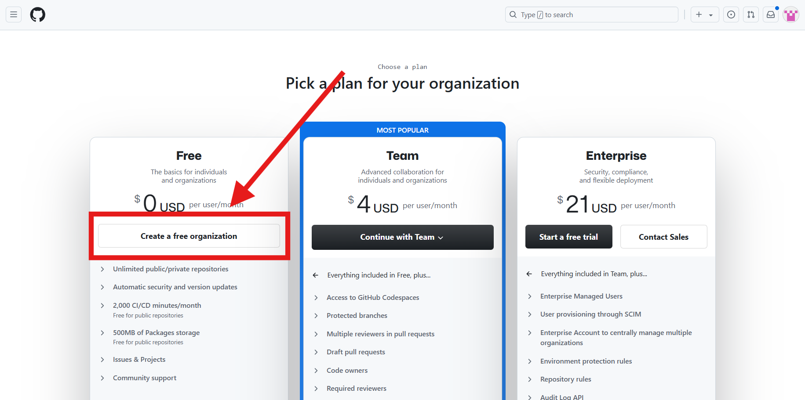
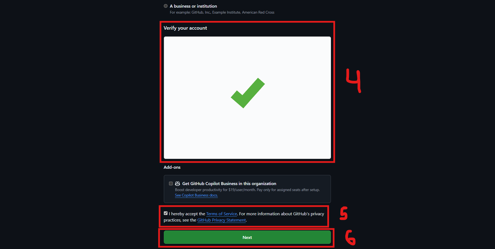

  <h1>Universidad Peruana de Ciencias Aplicadas</h1>
  
  <h2 >Carrera: de Ingeniería de Software</h2>
  <h2 >Ciclo: 2024-02</h2>
   
  <h2 >Curso: Aplicaciones Web</h2>
  <h2 >Sección: WS53</h2>
   
  <h2 >Informe del TB1</h2>
  <h2 >Startup: NRG3</h2>
  <h2 >Producto: Bliss</h2>
   
  <h2 >Integrantes:</h2>
  <ul style="list-style: none; padding: 0;">
      <li><h3>Juan Diego Astonitas Díaz</h3></li>
      <li><h3>Sebastian Aaron Anibal Carbajal Santivañez</h3></li>
      <li><h3>Gabriel Alexander Casas Sanchez</h3></li>
      <li><h3>Gianluca Santino Pasquale Barrenechea</h3></li>
      <li><h3>Elvia Marcela Rodriguez Villa</h3></li>
  </ul>
   
  <h4>Septiembre del 2024</h4>

## Registro de Versiones del Informe

| Versión | Fecha      | Autor                 | Descripción de modificación |
|---------|------------|-----------------------|-----------------------------|
| TB1     | 07/09/2024 | Todos los integrantes | Desarrollo de la TB1        |

## Project Report Collaboration Insights
Se han realizado todas las tareas asignadas para la entrega de la TB1, las cuales se encuentran registradas en el repositorio de Github de la organización del equipo bajo el enlace https://github.com/NRG3-appweb. Para elaborar el informe, cada miembro ha redactado y creado gráficos en formato Markdown según los puntos asignados, realizando commits para registrar el avance en el repositorio. 

## Contenido

- [Registro de Versiones del Informe](#registro-de-versiones-del-informe)
- [Project Report Collaboration Insights](#project-report-collaboration-insights)
- [Contenido](#contenido)
- [Student Outcome](#student-outcome)
- [Capítulo I: Introducción ](#capítulo-i-introducción-)
  - [1.1. Startup Profile](#11-startup-profile)
    - [1.1.1. Descripción de la Startup](#111-descripción-de-la-startup)
    - [1.1.2. Perfiles de integrantes del equipo](#112-perfiles-de-integrantes-del-equipo)
  - [1.2. Solution Profile](#12-solution-profile)
    - [1.2.1 Antecedentes y problemática](#121-antecedentes-y-problemática)
    - [1.2.2 Lean UX Process](#122-lean-ux-process)
      - [1.2.2.1. Lean UX Problem Statements](#1221-lean-ux-problem-statements)
      - [1.2.2.2. Lean UX Assumptions](#1222-lean-ux-assumptions)
      - [1.2.2.3. Lean UX Hypothesis Statements](#1223-lean-ux-hypothesis-statements)
      - [1.2.2.4. Lean UX Canvas](#1224-lean-ux-canvas)
  - [1.3. Segmentos objetivo](#13-segmentos-objetivo)
- [Capítulo II: Requirements Elicitation \& Analysis ](#capítulo-ii-requirements-elicitation--analysis-)
  - [2.1. Competidores](#21-competidores)
    - [2.1.1. Análisis competitivo](#211-análisis-competitivo)
    - [2.1.2. Estrategias y tácticas frente a competidores.](#212-estrategias-y-tácticas-frente-a-competidores)
        - [Estrategias:](#estrategias)
        - [Tácticas:](#tácticas)
  - [2.2. Entrevistas.](#22-entrevistas)
    - [2.2.1. Diseño de entrevistas](#221-diseño-de-entrevistas)
    - [2.2.2. Registro de entrevistas](#222-registro-de-entrevistas)
    - [2.2.3. Análisis de entrevistas](#223-análisis-de-entrevistas)
  - [2.3. Needfinding](#23-needfinding)
    - [2.3.1. User Personas](#231-user-personas)
    - [2.3.2. User Task Matrix](#232-user-task-matrix)
    - [2.3.3. User Journey Mapping](#233-user-journey-mapping)
        - [Segmento #1](#segmento-1)
        - [Segmento #2](#segmento-2)
    - [2.3.4. Empathy Mapping](#234-empathy-mapping)
        - [User Persona #1](#user-persona-1)
        - [User Persona #2](#user-persona-2)
    - [2.3.5. As-is Scenario Mapping](#235-as-is-scenario-mapping)
        - [User Persona #1](#user-persona-1-1)
        - [User Persona #2](#user-persona-2-1)
  - [2.4. Ubiquitous Language](#24-ubiquitous-language)
- [Capítulo III: Requirements Specification ](#capítulo-iii-requirements-specification-)
  - [3.1. To-Be Scenario Mapping](#31-to-be-scenario-mapping)
  - [3.2. User Stories](#32-user-stories)
    - [3.2.1 Epics](#321-epics)
    - [3.2.2 User Stories - Clientes](#322-user-stories---clientes)
    - [3.2.3 User Stories - Empresas](#323-user-stories---empresas)
    - [3.2.4 User Stories - Landing Page](#324-user-stories---landing-page)
    - [3.2.5 Technical Stories](#325-technical-stories)
  - [3.3. Impact Mapping](#33-impact-mapping)
  - [3.4. Product Backlog](#34-product-backlog)
- [Capítulo IV: Product Design ](#capítulo-iv-product-design-)
  - [4.1. Style Guidelines](#41-style-guidelines)
    - [4.1.1. General Style Guidelines](#411-general-style-guidelines)
    - [4.1.2. Web Style Guidelines](#412-web-style-guidelines)
  - [4.2. Information Architecture](#42-information-architecture)
    - [4.2.1. Organization Systems](#421-organization-systems)
    - [4.2.2. Labeling Systems](#422-labeling-systems)
    - [4.2.3. SEO Tags and Meta Tags](#423-seo-tags-and-meta-tags)
    - [4.2.4. Searching Systems](#424-searching-systems)
    - [4.2.5. Navigation Systems](#425-navigation-systems)
  - [4.3. Landing Page UI Design](#43-landing-page-ui-design)
    - [4.3.1. Landing Page Wireframe](#431-landing-page-wireframe)
    - [4.3.2. Landing Page Mock-up](#432-landing-page-mock-up)
  - [4.4. Web Applications UX/UI Design](#44-web-applications-uxui-design)
    - [4.4.1. Web Applications Wireframes](#441-web-applications-wireframes)
    - [4.4.2. Web Applications Wireflow Diagrams](#442-web-applications-wireflow-diagrams)
    - [4.4.3. Web Applications Mock-ups](#443-web-applications-mock-ups)
    - [4.4.4. Web Applications User Flow Diagrams](#444-web-applications-user-flow-diagrams)
  - [4.5. Web Applications Prototyping](#45-web-applications-prototyping)
  - [4.6. Domain-Driven Software Architecture](#46-domain-driven-software-architecture)
    - [4.6.1. Software Architecture Context Diagram](#461-software-architecture-context-diagram)
    - [4.6.2. Software Architecture Container Diagrams](#462-software-architecture-container-diagrams)
    - [4.6.3. Software Architecture Components Diagrams](#463-software-architecture-components-diagrams)
  - [4.7. Software Object-Oriented Design](#47-software-object-oriented-design)
    - [4.7.1. Class Diagrams](#471-class-diagrams)
    - [4.7.2. Class Dictionary](#472-class-dictionary)
  - [4.8. Database Design](#48-database-design)
    - [4.8.1. Database Diagram](#481-database-diagram)
- [Capítulo V: Product Implementation, Validation \& Deployment ](#capítulo-v-product-implementation-validation--deployment-)
  - [5.1. Software Configuration Management](#51-software-configuration-management)
    - [5.1.1. Software Development Environment Configuration](#511-software-development-environment-configuration)
    - [5.1.2. Source Code Management](#512-source-code-management)
    - [5.1.3. Source Code Style Guide \& Conventions](#513-source-code-style-guide--conventions)
    - [5.1.4. Software Deployment Configuration](#514-software-deployment-configuration)
  - [5.2. Landing Page, Services \& Applications Implementation](#52-landing-page-services--applications-implementation)
    - [5.2.1. Sprint 1](#521-sprint-1)
      - [5.2.1.1. Sprint Planning 1](#5211-sprint-planning-1)
      - [5.2.1.2. Sprint Backlog 1](#5212-sprint-backlog-1)
      - [5.2.1.3. Development Evidence for Sprint Review](#5213-development-evidence-for-sprint-review)
      - [5.2.1.4. Testing Suite Evidence for Sprint Review](#5214-testing-suite-evidence-for-sprint-review)
      - [5.2.1.5. Execution Evidence for Sprint Review](#5215-execution-evidence-for-sprint-review)
      - [5.2.1.6. Services Documentation Evidence for Sprint Review](#5216-services-documentation-evidence-for-sprint-review)
      - [5.2.1.7. Software Deployment Evidence for Sprint Review](#5217-software-deployment-evidence-for-sprint-review)
      - [5.2.1.8. Team Collaboration Insights during Sprint](#5218-team-collaboration-insights-during-sprint)
- [Conclusiones](#conclusiones)
- [Bibliografía](#bibliografía)
- [Anexos](#anexos)

## Student Outcome

El curso contribuye al cumplimiento del Student Outcome ABET:

**ABET – EAC - Student Outcome 5**
Criterio: *La capacidad de funcionar efectivamente en un equipo cuyos miembros
juntos proporcionan liderazgo, crean un entorno de colaboración e inclusivo,
establecen objetivos, planifican tareas y cumplen objetivos.*
En el siguiente cuadro se describe las acciones realizadas y enunciados de
conclusiones por parte del grupo, que permiten sustentar el haber alcanzado el logro
del ABET – EAC - Student Outcome 5.

<table>
  <tr>
    <td colspan="1"><strong>Criterio Específico</strong></td>
    <td colspan="1"><strong>Acciones Realizadas</strong></td>
    <td colspan="1"><strong>Conclusiones</strong></td>
  </tr>
  <tr>
    <td> Trabaja en equipo para proporcionar liderazgo en forma conjunta</td>
    <td>
	    Juan Astonitas  TB1: A lo largo del desarrollo del proyecto Bliss, he participado activamente en la toma de decisiones estratégicas y en la definición de la dirección del equipo, promoviendo la comunicación abierta y la responsabilidad compartida para garantizar un liderazgo efectivo y colectivo. Gabriel Casas TB1: Para el desarrollo del proyecto he participado de manera activa tanto en la toma de decisiones como en la división de responsabilidades, de la misma manera he ayudado en responsabilidades de mis compañeros con el afán de entregar un mejor produto. Elvia Rodriguez TB1:Durante el proyecto Bliss, mi enfoque ha sido mantener la cohesión del equipo, facilitando una comunicación fluida y asegurando que todas las voces fueran escuchadas. He trabajado mano a mano con mis compañeros para resolver conflictos y establecer un liderazgo compartido, lo que ha sido clave para el éxito del equipo.   Gianluca Pasquale TB1: He contribuido activamente en el liderazgo compartido, facilitando la toma de decisiones y promoviendo la responsabilidad colectiva.
    </td>
    <td>
	    TB1: 
A lo largo del desarrollo del proyecto Bliss, hemos demostrado una fuerte capacidad de liderazgo compartido, destacando la importancia de la toma de decisiones conjunta y la distribución equitativa de responsabilidades. Cada miembro del equipo ha aportado activamente, promoviendo una comunicación abierta y colaborando para superar desafíos, lo cual ha fortalecido la cohesión y efectividad del grupo. La responsabilidad colectiva y el apoyo mutuo han sido pilares clave que nos han permitido dirigir el proyecto hacia el cumplimiento exitoso de nuestros objetivos. Este enfoque de liderazgo conjunto ha sido fundamental para crear un entorno de trabajo inclusivo y productivo.  
    </td>
  </tr>
  <tr>
    <td>Crea un entorno colaborativo e inclusivo, establece metas, planifica tareas y cumple objetivos.</td>
    <td>
	    Juan Astonitas  TB1: Durante el proyecto, he contribuido a la creación de un entorno inclusivo y colaborativo, fomentando la participación de todos los miembros del equipo. He trabajado en la definición de metas claras, la planificación de tareas detalladas, y el seguimiento del cumplimiento de los objetivos, asegurando que cada miembro se sienta valorado y comprometido con los resultados. Gabriel Casas TB1:Durante el proyecto fue de mi prioridad ayudar a mis compañeros en la realización de sus tareas, por este motivo he reviso todo el proyecto, corregido errores, como tmambién aportado a la creación de items externos a mis responsabilidades asignadas. Elvia Rodriguez: TB1:A lo largo del proyecto Bliss, me he centrado en establecer un entorno de trabajo colaborativo e inclusivo, asegurándome de que cada miembro del equipo tuviera las herramientas y el apoyo necesarios para cumplir con sus tareas. Además, he liderado la planificación de actividades y el establecimiento de metas alcanzables para cumplir con los objetivos de manera eficiente.   Gianluca Pasquale TB1: He fomentado un entorno inclusivo, definiendo metas claras, planificando tareas, y asegurando el cumplimiento de los objetivos del proyecto.
    </td>
    <td>
	    TB1: 
Durante el proyecto Bliss, hemos logrado crear un entorno inclusivo y colaborativo que ha facilitado la participación activa de todos los miembros del equipo. Hemos definido metas claras y planificado tareas detalladamente, lo que ha permitido un seguimiento efectivo del progreso y el cumplimiento de los objetivos. La colaboración y el apoyo mutuo han sido esenciales para asegurar que cada miembro del equipo se sintiera valorado y comprometido. Este enfoque ha contribuido significativamente a la eficiencia y éxito del proyecto. 
    </td>
  </tr>
</table>

## Capítulo I: Introducción 
### 1.1. Startup Profile
#### 1.1.1. Descripción de la Startup
El sector de belleza y cuidado personal en Perú está experimentando un crecimiento acelerado, especialmente en los tratamientos faciales y la dermocosmética, que se han multiplicado casi ocho veces en la última década. Este crecimiento se da en respuesta a una demanda creciente de la clase media emergente, que busca servicios más personalizados y de alta calidad. En este contexto, los salones de belleza juegan un papel clave, pero muchos de ellos operan en un mercado polarizado e informal.

La competencia entre salones de belleza, especialmente los gestionados por pequeñas empresas familiares, es alta, y la personalización del servicio se ha convertido en un factor diferenciador clave. La mayoría de estos establecimientos, dirigidos en un 75.6% por mujeres según datos del INEI, enfrentan el desafío de profesionalizar su atención y mejorar la experiencia del usuario. A medida que la industria sigue creciendo, se vuelve esencial elevar la calidad del servicio, mejorar la gestión de la atención al cliente y formalizar las operaciones para establecer relaciones más duraderas y significativas con los clientes.

Para destacar en un mercado competitivo y en crecimiento, es crucial mejorar la calidad del servicio y ofrecer experiencias personalizadas que profesionalicen la industria y fortalezcan las relaciones con los clientes.

**Misión:**
Brindar servicios de belleza y cuidado personal altamente personalizados, enfocados en satisfacer las necesidades y expectativas únicas de cada cliente, ofreciendo una atención cercana y de calidad.

**Visión:**
Convertirnos en el referente líder en la industria de la belleza y cuidado personal en Perú, conocidos por ofrecer experiencias personalizadas y contribuir al crecimiento y profesionalización del sector.

#### 1.1.2. Perfiles de integrantes del equipo

<table>
  <tr>
    <th colspan="2"> Juan Diego Astonitas </th>
  </tr>
  <tr>
    <td>  </td>
    <td> Mi nombre es Juan Diego Astonitas Diaz, mi código de estudiante es u202110237 ,tengo 20 años, actualmente curso el 5to ciclo de la carrera de Ingeniería de Software, en la UPC en la sede San Miguel. Mis principales cualidades son el liderazgo y el dominio de Python. Haré todo lo que esté a mi alcance para respaldar al equipo en la finalización oportuna y efectiva de las tareas asignadas. </td>
  </tr>
  <tr>
    <th colspan="2"> Casas Sanchez Gabriel Alexander </th>
  </tr>
  <tr>
    <td>  </td>
    <td> Soy estudiante de Ingeniería de software y estoy cursando el quinto ciclo de la carrera. Me considero una persona bastante capaz y versátil en el ámbito académico. Creo que mi principal fortaleza es mi capacidad para dirigir y trabajar bien bajo presión. A pesar de no disfrutar los trabajos grupales, considero que siempre desempeñó un rol sobresaliente en ellos. </td>
  </tr>
<tr>
    <th colspan="2"> Gianluca Santino Pasquale Barrenechea </th>
  </tr>
  <tr>
    <td>  </td>
    <td> Me llamo Gianluca Santino Pasquale Barrenechea, con código de alumno u202112078, tengo 20 años y soy estudiante de la carrera de Ingenieria de Software. Como miembro de equipo, me centraré en el desarrollo del frontend y backend de nuestra Startup, utilizare mis habilidades en C++, C#, Python, Java y HTML para lograr esto. Mi objetivo está en tener un código limpio y eficiente. </td>
  </tr>
<tr>
    <th colspan="2"> Elvia Marcela Rodríguez Villa </th>
  </tr>
  <tr>
    <td>  </td>
    <td> Soy Elvia Rodríguez, actual estudiante universitaria y egresada de Laboratoria. Soy actual embajadora del programa de estudiantes de Microsoft y fui participante de diversos voluntariados y Hackathons cómo Ciencia en tu Comunidad y el Laboratorio de Emprendimientos de SENAJU. Asimismo, soy maestra de inglés y suelo incorporar mis conocimientos de programación de interfaces de usuario en mi labor educativa. </td>
  </tr>
<tr>
    <th colspan="2"> Sebastian Carbajal Santivañez </th>
  </tr>
  <tr>
    <td>  </td>
    <td>Mi nombre es sebastian carbajal santivañez, me encuentro cursando la carrera de ingeniería de software, me apasiona mucho el explorar nuevos horizontes y oportunidades dentro de mi rubro académico y profesional, me considero además una persona creativa con pensamiento innovador.</td>
  </tr>
</table>

### 1.2. Solution Profile
#### 1.2.1 Antecedentes y problemática

**What**
- ¿Cuál es el problema?

El problema radica en la falta de personalización y profesionalización en los servicios de belleza, donde las personas tienen dificultades para reservar citas, y las Mypes enfrentan retos para atraer nuevos clientes en un mercado competitivo e informal.

- ¿Cuál es la relación con la persona en cuestión?

La relación es conectar a clientes que buscan servicios de belleza convenientes y confiables con estilistas y dueños de negocios que desean expandir su clientela y visibilizar sus servicios.

**When**
- ¿Cuándo sucede el problema?

El problema surge cuando los clientes quieren reservar citas de belleza, pero no tienen tiempo para buscar proveedores o hacer reservas por teléfono.

- ¿Cuándo utiliza el cliente el producto?

El cliente utiliza el producto cuando desea buscar, reservar y pagar servicios de cuidado y belleza, ya sea en casa o en el establecimiento, y cuando los proveedores necesitan una plataforma para promocionar sus servicios.

**Where**
- ¿Dónde está el cliente cuando usa el producto?

El cliente usa el producto desde cualquier lugar con acceso a Internet, como su hogar, lugar de trabajo o mientras se desplaza.

- ¿Dónde surge el problema?

El problema surge cuando los clientes intentan reservar citas para servicios de belleza y encuentran dificultades para encontrar proveedores confiables o coordinar horarios adecuados.

**Who**
- ¿Quienes se ven involucrados en el problema?

Se ven involucrados los clientes que buscan servicios de belleza y cuidado personal, así como los proveedores que los ofrecen.

**Why**
- ¿Cuáles son las causas del problema?

La causa del problema es la falta de una plataforma centralizada que facilite la conexión conveniente entre clientes y proveedores de servicios de belleza, así como la dificultad para coordinar horarios y encontrar proveedores confiables.

**How**
- ¿En qué condiciones los clientes usan nuestro producto?

Nuestros clientes usan el producto cuando están en casa buscando servicios para ocasiones especiales, durante descansos en el trabajo navegando opciones, o en movimiento para reservar rápidamente servicios mientras están fuera de casa.

**How Much**

- ¿Cuál es la magnitud del problema?

La magnitud del problema es considerable, ya que, según la Asociación Peruana de Empresarios de la Belleza (2022), 4 de cada 10 peluquerías tuvieron que cerrar debido a la pandemia, y solo el 30% de las que permanecen siguen en la formalidad. Esto se debe a los altos costos de alquiler y materia prima, que afectan la viabilidad y profesionalización de muchos negocios en el sector.

#### 1.2.2 Lean UX Process
El lean UX process es un enfoque iterativo centrado en el usuario para el diseño de proyectos y productos. Este enfoque se base en ciclos rápidos (sprints) de investigación, diseño y pruebas para validar la propuesta o ideas planteadas por el equipo. Estas propuestas estarán siempre orientadas a satisfacer las necesidades de los usuarios. 
##### 1.2.2.1. Lean UX Problem Statements

Nuestro servicio ofrece la capacidadad de mejorar la gestión de clientes mediante una plataforma que facilite a los clientes la búsqueda y reserva de servicios de belleza y cuidado personal. Sin embargo, se ha observado un factor crítico que afecta la confianza del cliente al seleccionar un centro de belleza, este es la alta tasa de informalidad en la industria. Esta falta de transparencia y garantías sobre la calidad de los servicios ofrecidos crea incertidumbre y afecta negativamente la experiencia del usuario.

¿Cómo podemos mejorar el proceso de selección del cliente para salones, tratamientos y servicios, asegurando un diseño que promueva la confianza y seguridad?

* Se deberá proporcionar un sistema eficiente y transparente para la búsqueda y reserva de servicios, así como establecer canales de comunicación efectivos con los clientes. Nos enfrentamos a otro desafío significativo, los sistemas de gestión de citas para servicios de cuidado y belleza son ineficientes y generan desconfiaza en el usuario final. Reconocemos la importancia de garantizar una experiencia segura y sin preocupaciones para los usuarios que utilizan nuestra plataforma para reservar servicios de belleza. La altan tasa de informalidad en la industria de los centros de belleza crea desafíos adicionales para garantizar la calidad y confiabilidad de los servicios ofrecidos.

##### 1.2.2.2. Lean UX Assumptions

Creo que mis clientes necesitan saber cómo y dónde acceder a servicios de manicure, pedicure y tratamientos faciales a domicilio de manera conveniente y segura.

Estas necesidades se pueden resolver con una aplicación que conecte a clientes con profesionales de belleza verificados, ofreciendo una amplia gama de servicios personalizados y garantizando medidas de seguridad y calidad.

Mis clientes son personas que buscan comodidad y confiabilidad al reservar servicios de belleza, sin comprometer la calidad y la seguridad.

El valor N°1 que mi cliente quiere de mi servicio es la facilidad de reserva, la calidad de los servicios y la tranquilidad de tener profesionales confiables en su hogar.

El cliente también puede adquirir beneficios adicionales como descuentos por lealtad, recomendaciones personalizadas y acceso a productos exclusivos.

Voy a adquirir a la mayoría de mis clientes a través de estrategias de marketing digital, colaboraciones con empresas de belleza y programas de referidos. Haré dinero a través de anuncios por colaboraciones con marcas de belleza, comisiones por reservas y membresías premium.

Mi competencia principal en el mercado serán aplicaciones similares que ofrecen servicios de belleza a domicilio, salones de belleza locales y plataformas de reserva en línea. Los venceremos debido a nuestra estrategia de enfoque en la seguridad y calidad, personalización de servicios, y programas de fidelización.

Mi mayor riesgo de producto es que los clientes no confíen en la seguridad de tener desconocidos en sus hogares o que prefieran la experiencia tradicional en un salón de belleza.

Resolveremos esto a través de la implementación de rigurosos procesos de verificación de profesionales, garantías de seguridad y promoción de la comodidad y conveniencia de nuestros servicios a domicilio.

##### 1.2.2.3. Lean UX Hypothesis Statements

**Hypothesis Statement 01:**

**Creemos que** ofrecer una amplia gama de servicios de cuidado y belleza a través de nuestra aplicación **para** usuarios que buscan comodidad y conveniencia permitirá que estos puedan reservar citas fácilmente y acceder a servicios de calidad.

**Sabremos que** hemos tenido éxito

**Cuando** se vea un aumento significativo en la cantidad de reservas realizadas a través de nuestra aplicación, así como una mayor retención de clientes satisfechos.

**Hypothesis Statement 02:**

**Creemos que** implementar un sistema de verificación de estilistas calificados y negocios confiables garantizará la calidad de las citas reservadas y brindará seguridad a nuestros usuarios al reservar servicios de cuidado y belleza.

**Sabremos que** hemos tenido éxito

**Cuando** se reciban comentarios positivos de los usuarios acerca de la garantía y la buena calidad del servicio recibido, así como cuando veamos un mayor tráfico en la aplicación.

**Hypothesis Statement 03:**

**Creemos que** establecer colaboraciones estratégicas con salones de belleza, estilistas, marcas de belleza relevantes, y ofrecer programas de referidos atractivos ayudará a aumentar la visibilidad de nuestra aplicación.

**Sabremos que** hemos tenido éxito

**Cuando** observemos un aumento del 30% en la adquisición de clientes durante los períodos activos de nuestras colaboraciones, así como una mayor interacción de los usuarios con la aplicación a través de programas de referidos.

**Hypothesis Statement 04:**
**Creemos que** aumentaremos la confianza del usuario y fomentaremos la lealtad a nuestra marca si incorporamos funciones de calificación y reseñas para que los usuarios puedan evaluar la calidad de los servicios recibidos y compartir sus experiencias con otros usuarios.

**Sabremos que** hemos tenido éxito

**Cuando** observemos un aumento del 60% en la participación de los usuarios en la función de calificación y reseñas, así como un incremento en la cantidad de reseñas positivas y una mejora general en la percepción de la calidad de los servicios por parte de los usuarios.

##### 1.2.2.4. Lean UX Canvas

### 1.3. Segmentos objetivo

**Segmento objetivo #1: Clientas Aficionadas al Embellecimiento**

Este grupo está compuesto por mujeres de entre 20 y 45 años, pertenecientes a los sectores socioeconómicos B-C, que residen en Lima. Estas clientas buscan activamente servicios de embellecimiento y cuidado personal para realzar su apariencia y bienestar. A menudo enfrentan desafíos relacionados con la accesibilidad y la calidad de los servicios de belleza disponibles en el mercado.

Características clave de este segmento:

- Buscan servicios de belleza y cuidado personal para mejorar su apariencia y bienestar.
- Valoran la calidad y personalización en los servicios que reciben.
- Residen en áreas urbanas y tienen un interés constante en mantenerse al tanto de las últimas tendencias en belleza.
- Enfrentan dificultades para acceder a servicios de alta calidad debido a la falta de opciones confiables y convenientes.

**Segmento objetivo #2: MYPES del Sector de Belleza**

Este grupo está compuesto por dueños de pequeños y medianos negocios que brindan servicios de cuidado y belleza en Lima. Estos empresarios enfrentan retos significativos relacionados con la promoción de sus servicios, la captación de nuevos clientes y la competencia en un mercado en constante cambio. La realidad de este segmento se caracteriza por la necesidad de adoptar soluciones eficaces para mejorar su visibilidad y profesionalizar sus operaciones.

Características clave de este segmento:

- Enfrentan desafíos en la promoción de sus servicios y en la atracción de nuevos clientes.
- Buscan herramientas y plataformas que les permitan mejorar su visibilidad y profesionalizar sus operaciones.
- Operan en un mercado competitivo donde la diferenciación y la calidad del servicio son cruciales para su éxito.
- Valoran soluciones que les ayuden a gestionar eficientemente su negocio y a destacar en el mercado de belleza.

## Capítulo II: Requirements Elicitation & Analysis 

### 2.1. Competidores

Considerando los ideales de nuestra empresa y la tecnología que desarrollamos, alineados con nuestra misión y visión, es importante reconocer la existencia de otras aplicaciones y herramientas similares en el mercado. A continuación, mencionamos algunas de ellas y cómo se diferencian de nuestra propuesta.

- **Treatwell:**

Treatwell es una plataforma de reserva de servicios de belleza y bienestar que opera en Europa. Permite a los usuarios encontrar y reservar una amplia gama de tratamientos de belleza y bienestar en establecimientos locales. Aunque ofrece una extensa red de proveedores y una experiencia de reserva conveniente, su enfoque está limitado a Europa, y su personalización y adaptación al mercado latinoamericano, como el peruano, son limitadas.

- **SimplyBook.me:**

SimplyBook.me es una plataforma de programación en línea que sirve a una variedad de negocios, incluyendo los del sector belleza. Facilita la gestión de citas y reservas con una amplia gama de características de personalización para diferentes tipos de servicios. A diferencia de nuestra propuesta, SimplyBook.me es más generalista y no está específicamente centrada en el sector de belleza ni en la adaptación cultural y local para mercados específicos como el peruano.

- **Booksy:**

Booksy es una aplicación de reserva de citas enfocada en la industria de belleza y bienestar, facilitando la búsqueda y reserva de servicios de peluquería, estética y cuidado personal. Ofrece una plataforma intuitiva para encontrar y reservar tratamientos, pero su alcance se centra principalmente en mercados anglosajones. Su diferencia clave radica en su especialización en belleza, aunque su adaptación y enfoque en mercados latinoamericanos son limitados comparados con nuestra propuesta local y personalizada.

#### 2.1.1. Análisis competitivo

<table> 
  <tr>
    <th colspan="6"> Competitive Analysis Landscape </th>
  </tr>
  <tr>
    <td colspan="2" rowspan="2">¿Por qué llevar acabo este análisis? </td>
    <td colspan="4"> Pregunta </td>
  </tr>
  <tr>
    <td colspan="4"> Respuesta </td>
  </tr>
  <tr>
    <td colspan="2"> Productos </td>
    <td> BLISS </td>
    <td> Treatwell </td>
    <td> SimplyBook.me </td>
    <td> Booksy </td>
  </tr>
  <tr>
    <td rowspan="2">Perfil</td>
    <td>Overview</td>
    <td> Bliss es una plataforma de citas y reservas, enfocadas en la búsqueda, comparación y programación del servicio de negocios de belleza y bienestar </td>
    <td> Treatwell es una plataforma de reserva de servicios de belleza y bienestar en Europa. </td>
    <td> SimplyBook.me es una plataforma de programación en línea para una variedad de negocios, que facilita la gestión de citas y reservas. </td>
    <td> Booksy es una aplicación de reserva de citas enfocada en la industria de belleza y bienestar, que facilita a los usuarios la búsqueda y reserva de servicios de peluquería, estética y cuidado personal. </td>
  </tr>
  <tr>
    <td>Ventaja
    competitiva
    ¿Qué valor
    ofrece a los
    clientes?</td>
    <td> Ofrece una interfaz intuitiva para su facilidad de uso, disponibilidad las 24 horas del día, gestión centralizada de citas con la finalidad de poder ver y gestionar todas sus citas desde la plataforma. </td>
    <td> Ofrece conveniencia alpermitir a los clientes reservar servicios de belleza en línea y acceso a una amplia gama de salones y tratamientos.</td>
    <td> Ofrece conveniencia al permitir a los clientes reservar citas en línea las 24 horas del día y acceso a funciones como recordatorios automáticos y pagos en línea. </td>
    <td> Ofrece conveniencia al permitir a los clientes encontrar y reservar servicios de belleza en línea las 24 horas del día, así como acceder a información detallada sobre profesionales, servicios y precios. </td>
  </tr>
  <tr>
    <td rowspan="2">Perfil de Marketing</td>
    <td> Mercado Objetivo </td>
    <td> Las micro y pequeñas empresas enfocadas en la industria de belleza y bienestar que estén interesadas en publicar sus servicios en una plataforma online, también las mujeres que busquen gestionar y pedir este servicio. </td>
    <td> Usuarios urbanos interesados en servicios de belleza y bienestar en Europa. </td>
    <td> Negocios de servicios que requieren programación de citas, como peluquerías, salones de belleza, consultorios médicos, centros de fitness y más. </td>
    <td> Usuarios que buscan servicios de belleza y bienestar, así como profesionales de la industria de belleza y cuidado personal. </td>
  </tr>
  <tr>
    <td> Estrategias de Marketing </td>
    <td> Fomentar la participación en nuestra plataforma al permitir que los clientes reaccionen y compartan los servicios, al igual que hacer colaboraciones con las empresas de esta industria para un marketing digital. </td>
    <td> Marketing digital, colaboraciones con salones de belleza, promociones y programas de fidelización. </td>
    <td> Marketing digital, promoción en redes sociales, colaboraciones con negocios afines y programas de referidos. </td>
    <td> Marketing digital, promoción en redes sociales, colaboraciones con negocios afines y programas de referidos. </td>
  </tr>
  <tr>
    
  </tr>
  <tr>
    <td rowspan="3">Perfil de Producto</td>
    <td> Productos & Servicios </td>
    <td> Gestión de citas y reserva a servicios del sector belleza y bienestar, permitir transacciones de pago en línea, interfaz intuitiva para presentar los servicios que ofrece su empresa y sección de comentarios para que los clientes muestres y opiniones y las empresas puedan comunicarse con sus clientes. </td>
    <td> Reserva de citas para servicios de peluquería, belleza y bienestar </td>
    <td> Plataforma de programación en línea con funciones como calendarios, recordatorios de citas, gestión de personal y pagos en línea. </td>
    <td> Aplicación móvil y plataforma en línea que permite la reserva de citas, gestión de agendas y comunicación entre clientes y profesionales. </td>
  </tr>
  <tr>
    <td> Precios & Costos </td>
    <td> Las empresas deberán pagar en nuestra plataforma, será un porcentaje bajo por cada reserva o cita pagada, sin embargo, para los que buscan un servicio la aplicación será gratuita. </td>
    <td> Varían según el servicio y la ubicación del salón. </td>
    <td> Varían según el plan y las características seleccionadas, con opciones de suscripción mensual o anual. </td>
    <td> Varían según el plan y las características seleccionadas para los profesionales, mientras que para los usuarios finales, la aplicación es gratuita. </td>
  </tr>
  <tr> 
    <td>Canales de distribución (Web y/o Móvil)</td>
    <td> Plataforma en línea y aplicación móvil. </td>
    <td> Plataforma en línea y aplicación móvil. </td>
    <td> Plataforma en línea y aplicación móvil. </td>
    <td> Aplicación móvil disponible en tiendas de aplicaciones y plataforma en línea. </td>
  </tr>
  <tr>
    <td rowspan="4"> Análisis SWOT </td>
    <td> Fortalezas </td>
    <td> Función de filtrado de servicios de belleza según precio, lugar, valorados por la comunidad, entre otros. Interfaz intuitiva para que las empresas puedan mostrar a los usuarios sus servicios. Herramientas para permitir a la comunidad expresarse y recomendar los servicios de su agrado. </td>
    <td> Amplia red de salones asociados, conveniencia de reserva en línea, variedad de servicios. </td>
    <td> Interfaz intuitiva, amplia personalización, adaptabilidad a diferentes industrias y tipos de negocios. </td>
    <td> Especialización en la industria de belleza, interfaz intuitiva, amplia red de profesionales y servicios. </td>
  </tr>
  <tr>
    <td> Debilidades </td>
    <td> Dependencia por los comentarios y puntajes de los usuarios, pues sin ellos no podremos filtrar los mejores servicios. Las empresas que paguen por nuestro servicio posiblemente no puedan seguir nuestra curva de aprendizaje </td>
    <td> Dependencia de la disponibilidad de los salones asociados, posibles problemas de calidad del servicio. </td>
    <td> Posible curva de aprendizaje para usuarios nuevos, limitaciones en funciones avanzadas en planes más básicos. </td>
    <td> Dependencia de la disponibilidad de los profesionales, posibles problemas de calidad del servicio. </td>
  </tr>
  <tr>
    <td> Oportunidades </td>
    <td> Existen usuarios interesados en plataformas similares. Muchas empresas pequeñas no usan estos medios, pero están interesados. Colaboraremos con ellos para llegar al público objetivo. Facilidad al expandir nuestros servicios pues es digital. Después de la pandemia las plataformas digitales ganaron confianza. </td>
    <td> Expansión a nuevos mercados, introducción de nuevos servicios, mejorar la experiencia del usuario. </td>
    <td> Expansión a nuevos mercados, mejora continua de características y funciones, colaboraciones estratégicas con otros servicios. </td>
    <td> Expansión a nuevos mercados, introducción de nuevas características y servicios, colaboraciones estratégicas con marcas de belleza. </td>
  </tr>
  <tr>
    <td> Amenazas </td>
    <td> Competiremos con aplicaciones ya establecidas. Podría haber problemas a la seguridad de los datos y física de las empresas al cualquier usuario pedir sus servicios. </td>
    <td> Competencia de otras plataformas similares, cambios en las preferencias de los consumidores, problemas regulatorios. </td>
    <td> Competencia de otras plataformas de programación en línea, cambios en las necesidades y expectativas de los usuarios, problemas de seguridad de datos. </td>
    <td> Competencia de otras aplicaciones de reserva de citas, cambios en las preferencias de los usuarios, problemas de calidad del servicio por parte de los profesionales. </td>
  </tr>
</table>

#### 2.1.2. Estrategias y tácticas frente a competidores.

Considerando el análisis competitivo y las características únicas de nuestra startup Bliss, hemos desarrollado las siguientes estrategias y tácticas para abordar las fortalezas y debilidades de nuestros competidores, así como aprovechar las oportunidades y mitigar las amenazas presentes en el mercado.

###### Estrategias:
1. **Ampliación de servicios:** Bliss ofrecerá una gama integral de servicios de belleza y cuidado personal, que incluirá desde manicura y pedicura hasta tratamientos faciales, asegurando así una experiencia completa y personalizada tanto en el hogar como en el establecimiento del proveedor.

2. **Verificación de profesionales:** Implementaremos un proceso de verificación exhaustivo para los estilistas y negocios asociados. Esto garantizará que los servicios ofrecidos sean de alta calidad y confiables, lo que diferencia a Bliss al enfocarse en la confianza y seguridad del cliente.

3. **Enfoque en la comodidad del usuario:** Nos centraremos en mejorar la conveniencia y la facilidad de uso de la aplicación. La plataforma estará diseñada para ofrecer una experiencia intuitiva y fluida, facilitando la búsqueda y reserva de servicios, lo que aumentará la satisfacción y fidelización del usuario.

###### Tácticas:

4. **Optimización de la interfaz de usuario:** Mejoraremos continuamente la navegación y las funcionalidades de búsqueda dentro de la aplicación para que los usuarios puedan encontrar y reservar fácilmente servicios que se ajusten a sus horarios y preferencias.

5. **Sistema de calificación y comentarios:** Implementaremos un sistema robusto de calificación y comentarios que permita a los usuarios evaluar los servicios recibidos. Esto fomentará la transparencia y ayudará a construir una reputación sólida para los proveedores y para la plataforma en general.

6. **Programación flexible:** Permitiremos a los usuarios seleccionar franjas horarias específicas y preferencias de estilistas al hacer reservas, ofreciendo opciones flexibles que se adapten a sus necesidades y horarios, lo que mejorará la experiencia del usuario.

7. **Promoción de garantía de calidad:** Comunicaremos claramente nuestro compromiso con la calidad y la verificación de profesionales a través de campañas de marketing y mensajes en la aplicación, fortaleciendo la confianza de los usuarios en nuestra plataforma.

8. **Incentivos para usuarios y estilistas:** Ofreceremos descuentos, promociones y recompensas tanto para los usuarios que realicen reservas como para los estilistas que mantengan altos estándares de servicio, incentivando la calidad y la lealtad en la plataforma.

9. **Colaboraciones estratégicas:** Estableceremos asociaciones con marcas de productos de belleza y colaboradores influyentes para aumentar nuestra visibilidad y credibilidad en el mercado, atrayendo tanto a nuevos usuarios como a proveedores de servicios.

### 2.2. Entrevistas.
Las entrevistas nos permitirán recolectar los insights valiosos de los usuarios a través de preguntas que serán diseñadas y analizadas por nuestro equipo, previa realización de las entrevistas.
#### 2.2.1. Diseño de entrevistas
**Segmento 1**
* ¿Cómo sueles enterarte de nuevos servicios de cuidado y belleza, como tratamientos de belleza, manicura, masajes, extensiones de pestañas, tintes de cabello, depilación, etc.?
* ¿Qué canales de información utilizas con más frecuencia para buscar estos servicios? (Por ejemplo, redes sociales, buscadores en línea, recomendaciones de amigos o familiares, etc.)
* Cuando buscas un servicio específico, como manicura o extensiones de pestañas, ¿qué características te gustaría ver en un catálogo en línea para ayudarte a tomar una decisión informada?
* ¿Has buscado servicios de tintes de cabello, cortes de pelo o peinados en línea? ¿Qué información te gustaría encontrar en una plataforma digital para obtener una cotización precisa?
* ¿Qué aspectos te llaman más la atención al descubrir un nuevo servicio de cuidado y belleza en línea? (Por ejemplo, la calidad de las imágenes, las reseñas de otros usuarios, la descripción detallada de los servicios, etc.)
* ¿Has utilizado alguna vez plataformas digitales específicas para encontrar y reservar servicios de cuidado y belleza? Si es así, ¿qué aspectos te gustaron más de esas plataformas y cuáles crees que podrían mejorar?
* ¿Qué información consideras más importante al buscar y comparar diferentes proveedores de servicios de cuidado y belleza en línea? (Por ejemplo, precios, disponibilidad de citas, ubicación, reseñas de clientes, etc.)
* ¿Qué tan importante es para ti la facilidad y rapidez del proceso de reserva en línea al elegir un proveedor de servicios de cuidado y belleza?
* ¿Has experimentado algún problema o dificultad al reservar servicios de cuidado y belleza en línea en el pasado? ¿Qué aspectos crees que podrían mejorar para hacer este proceso más eficiente?
* ¿Te gustaría tener acceso a promociones especiales o descuentos exclusivos al reservar servicios de cuidado y belleza a través de una plataforma digital? ¿Cómo te gustaría recibir esta información?
* ¿Qué características adicionales te gustaría ver en una plataforma digital para reservar servicios de cuidado y belleza que aún no existan en otras plataformas?
* ¿Qué tan importante es para ti la seguridad y confianza en la plataforma digital al proporcionar información personal y financiera para reservar servicios de cuidado y belleza?

**Segmento 2**
* ¿Qué servicios de cuidado y belleza ofrece actualmente en su negocio?
* ¿Cuáles son los servicios más solicitados por los clientes de su negocio?
* ¿Cómo suelen los clientes reservar citas actualmente en su negocio?
* ¿Cuál es su principal desafío o dificultad al gestionar las reservas y citas en su negocio actualmente?
* ¿Qué características o funciones le gustaría ver en una aplicación que les ayude a gestionar las reservas y citas de su negocio y dar a conocerlo a más personas?
* ¿Con qué frecuencia hace uso de las redes sociales o medios de información para poder contactar a sus clientes?
* ¿Qué aspectos considera más importantes al elegir una plataforma para promocionar sus servicios y aceptar reservas? (Por ejemplo, costo, facilidad de uso, popularidad)
* Actualmente, ¿ofrece servicios de cuidado y belleza a domicilio?
* Sí: ¿A qué tipo de clientes ofrece este tipo de servicio? (Por ejemplo, clientes frecuentes o conocidos, cualquier persona que lo/a contacte)
* No: ¿Por qué? (qué necesita o desea para implementar este servicio)
* Explicación breve de la aplicación ¿Cómo cree que una aplicación como la que estamos desarrollando podría beneficiar a su negocio y a sus clientes?
* Considerando los posibles beneficios que podría traerle esta aplicación a su negocio, ¿estaría dispuesto/a a pagar una comisión por cada servicio adquirido a través de la aplicación? (de ser posible, especificar tasa máxima en % o, si es comisión fija, monto en soles)
* ¿Estaría dispuesto/a a ofrecer promociones o descuentos exclusivos a través de la aplicación para atraer nuevos clientes o fidelizar a los existentes?
* ¿Qué sugerencias o comentarios adicionales tiene para mejorar la experiencia de reserva de servicios de cuidado y belleza a través de una aplicación?
#### 2.2.2. Registro de entrevistas

<table>
  <tr>
    <td colspan="2">Entrevista a Cliente - 1</td>
  </tr>
  <tr>
    <td>Nombre Entrevistad@</td>
    <td>Emma Solis Espinoza</td>
  </tr>
  <tr>
    <td>Edad</td>
    <td>73 Años</td>
  </tr>
  <tr>
    <td>Profesión</td>
    <td>Ex - Asistenta Social Universitaria</td>
  </tr>
  <tr>
    <td>Departamento</td>
    <td>Lima, Perú</td>
  </tr>
  <tr>
    <td>Duración de la Entrevista: 15:31 min </td>
    <td>URL:<a href="https://upcedupe-my.sharepoint.com/:v:/g/personal/u202111461_upc_edu_pe/EYfdTsB84mtEobrppZAME08Ba9K5QzSKCXQqUzccGAj5Yw?nav=eyJyZWZlcnJhbEluZm8iOnsicmVmZXJyYWxBcHAiOiJPbmVEcml2ZUZvckJ1c2luZXNzIiwicmVmZXJyYWxBcHBQbGF0Zm9ybSI6IldlYiIsInJlZmVycmFsTW9kZSI6InZpZXciLCJyZWZlcnJhbFZpZXciOiJNeUZpbGVzTGlua0NvcHkifX0&e=beNxq1">enlace</a></td>
  </tr>
</table>
<table>
  <tr>
    <td colspan="2">Entrevista a Cliente - 2</td>
  </tr>
  <tr>
    <td>Nombre Entrevistad@</td>
    <td>Clara Rivas</td>
  </tr>
  <tr>
    <td>Edad</td>
    <td>24 Años</td>
  </tr>
  <tr>
    <td>Profesión</td>
    <td>Estudiante de ciencias ambientales</td>
  </tr>
  <tr>
    <td>Departamento</td>
    <td>Lima, Perú</td>
  </tr>
  <tr>
    <td>Duración de entrevistas: 11:09 </td>
    <td>URL:<a href="https://upcedupe-my.sharepoint.com/:v:/g/personal/u202111461_upc_edu_pe/EU8TdhBV29FKnpTXpAvRjmIBXUavhlU3arDi7ww46tCJWg?e=OwbF8T&nav=eyJyZWZlcnJhbEluZm8iOnsicmVmZXJyYWxBcHAiOiJTdHJlYW1XZWJBcHAiLCJyZWZlcnJhbFZpZXciOiJTaGFyZURpYWxvZy1MaW5rIiwicmVmZXJyYWxBcHBQbGF0Zm9ybSI6IldlYiIsInJlZmVycmFsTW9kZSI6InZpZXcifX0%3D">enlace</a></td>
  </tr>
</table>
<table>
  <tr>
    <td colspan="2">Entrevista a Cliente - 3</td>
  </tr>
  <tr>
    <td>Nombre Entrevistad@</td>
    <td>Cesar Santivañez</td>
  </tr>
  <tr>
    <td>Edad</td>
    <td>42 Años</td>
  </tr>
  <tr>
    <td>Profesión</td>
    <td>Gerente de Ingeniería de Procesos de Seguridad</td>
  </tr>
  <tr>
    <td>Departamento</td>
    <td>Lima, Perú</td>
  </tr>
  <tr>
    <td>Duración de la Entrevista: 10:27 min </td>
    <td>URL:<a href="https://upcedupe-my.sharepoint.com/:v:/g/personal/u202111461_upc_edu_pe/Ed_5wn0qyYhOtBjPGYesvcMBpie3AcIklWVngJTxRKtdqw?nav=eyJyZWZlcnJhbEluZm8iOnsicmVmZXJyYWxBcHAiOiJPbmVEcml2ZUZvckJ1c2luZXNzIiwicmVmZXJyYWxBcHBQbGF0Zm9ybSI6IldlYiIsInJlZmVycmFsTW9kZSI6InZpZXciLCJyZWZlcnJhbFZpZXciOiJNeUZpbGVzTGlua0NvcHkifX0&e=4osTj7">enlace</a></td>
  </tr>
</table>
<table>
  <tr>
    <td colspan="2">Entrevista a Emprendedor/MYPE - 1</td>
  </tr>
  <tr>
    <td>Nombre Entrevistad@</td>
    <td>Ysabel Santivañez Solis</td>
  </tr>
  <tr>
    <td>Edad</td>
    <td>41 Años</td>
  </tr>
  <tr>
    <td>Profesión</td>
    <td>Administradora / Estilista</td>
  </tr>
  <tr>
    <td>Departamento</td>
    <td>Lima, Perú</td>
  </tr>
  <tr>
    <td>Duración de la Entrevista: 13:01 min </td>
    <td>URL:<a href="https://upcedupe-my.sharepoint.com/:v:/g/personal/u202111461_upc_edu_pe/ETN6Tf9UZTtCkub6Ob1gKNMBQrxBSIRUwkHEwGE4FFWkLg?nav=eyJyZWZlcnJhbEluZm8iOnsicmVmZXJyYWxBcHAiOiJPbmVEcml2ZUZvckJ1c2luZXNzIiwicmVmZXJyYWxBcHBQbGF0Zm9ybSI6IldlYiIsInJlZmVycmFsTW9kZSI6InZpZXciLCJyZWZlcnJhbFZpZXciOiJNeUZpbGVzTGlua0NvcHkifX0&e=Ug5dXo">enlace</a></td>
  </tr>
</table>
<table>
  <tr>
    <td colspan="2">Entrevista a Emprendedor/MYPE - 2</td>
  </tr>
  <tr>
    <td>Nombre Entrevistad@</td>
    <td>Elena Hernandez</td>
  </tr>
  <tr>
    <td>Edad</td>
    <td>29 Años</td>
  </tr>
  <tr>
    <td>Profesión</td>
    <td>Pedicurista - Manicurista</td>
  </tr>
  <tr>
    <td>Departamento</td>
    <td>Piura,Perú</td>
  </tr>
  <tr>
    <td>Duración de la Entrevista:</td>
    <td>URL:<a href="">enlace</a></td>
  </tr>
</table>

#### 2.2.3. Análisis de entrevistas
**Segmento Objetivo 1: Clientes de la industria de belleza y bienestar**
- La primera entrevista revela varios patrones en sus preferencias y preocupaciones. En este caso, la clienta destaca preocupaciones específicas relacionadas con la seguridad en las transacciones en línea. A pesar de que las redes sociales, especialmente Whatsapp, son una fuente importante para ofrecer servicios de belleza debido a la versatilidad y la facilidad, Emma expresa desconfianza hacia las plataformas que solicitan datos de tarjetas de crédito. Ella prefiere realizar las transacciones de manera presencial o en persona debido al aumento de casos de robo de información y brechas de seguridad en línea. Según indica, “La seguridad en las reservas es crucial para mí. Prefiero hacer estos trámites en persona porque me siento más segura que colocando mis datos en una página web, incluso si esta ofrece medidas de seguridad adicionales.”
- En la segunda entrevista, se destaca la importancia crucial de la organización y eficiencia en los negocios de cuidado y belleza. Clara señala que, a pesar de las ventajas de la reserva en línea, la falta de una buena gestión de tiempos y organización en los establecimientos puede generar frustración significativa. Como ella misma comenta, "uno entra y le dicen que espere para ser atendido en un momento, pero ese momento termina en minutos incluso horas, y me he visto perjudicada esperando casi 3 horas para que hagan algo sencillo". Esto revela que los problemas de organización y gestión del tiempo son fundamentales para la experiencia del cliente.
- En ultima parte de nuestras entrevistas, se demuestra que el tiempo de atención y la implementación de sistemas automatizados en los medios de comunicación es algo fundamental y preocupante al mismo tiempo, ya que, según César, manifiesta que hasta el momento, con una significativa sobredemanda de emprendimientos y negocios de este rubro, en ninguno de los casos ha llegado a ver un sistema eficiente con los medios de comunicación directa que estos tienen, si bien ha podido acceder a diferentes beneficios que algunos negocios le brindaron, el poder tener una personalización más adaptada al usuario para su experiencia, a la vez de poder implementar un “SRA” en plataformas como whatsapp o en la misma web, como menciona “brindará más confianza al cliente, lo que ayudaría a que tenga una preferencia en especifica, beneficiando también al negocio”.

**Segmento Objetivo 2: MYPES o Emprendedores**
* La primera entrevistada, propietaria de MYPES, señala que enfrentan desafíos particulares en la gestión de sus negocios. Ella utiliza Instagram como su principal plataforma para impulsar su marca. Sin embargo, enfrenta un reto significativo debido a la diversidad en el nivel de familiaridad de sus clientes con las aplicaciones y plataformas digitales. Ella observa que su clientela está dividida entre aquellos que tienen conocimientos avanzados y se sienten cómodos utilizando diversas plataformas, y aquellos que prefieren realizar sus gestiones por teléfono o en persona. Esta diversidad en las preferencias de los clientes presenta un desafío en la organización y gestión de reservas. Como señala: “La dificultad principal radica en la falta de uniformidad en el uso de las aplicaciones entre mis clientes. Mientras algunos están completamente familiarizados con Instagram y otras plataformas, otros aún prefieren métodos tradicionales como el teléfono o la visita en persona. Esto puede llevar a una mala organización si no se maneja adecuadamente.”

**Conclusiones de las entrevistas**

Las entrevistas a clientes revela que la seguridad en las transacciones en línea, la capacitación del personal y la organización según la demanda es una preocupación significativa para los usuarios de servicios de belleza, A pesar de la conveniencia de las redes sociales y las plataformas digitales para ofrecer estos servicios,muchos prefieren realizar transacciones en persona debido a sus dudas sobre la seguridad de proporcionar información financiera en línea.

Las entrevistas a l@s emprendedores/ras y/o MYPES demuestra que hay dificultades debido a la variabilidad en el nivel de familiaridad de sus clientes con las herramientas digitales. La clientela se divide entre aquellos que se sienten cómodos con las plataformas digitales y aquellos que prefieren métodos tradicionales como el teléfono o la atención en persona, subrayando asi la necesidad de implementar estrategias que integren y armonicen diversos canales de comunicación, garantizando una experiencia de cliente fluida y eficiente, independientemente del método de contacto preferido.

### 2.3. Needfinding
#### 2.3.1. User Personas

###### **MYPES o Emprendedores**
Rosa Martínez encarna a las propietarias de pequeñas y medianas empresas en el sector de belleza, quienes enfrentan desafíos para competir en un mercado saturado. A través de las entrevistas, se destacó su necesidad de atraer más clientes y profesionalizar la gestión de su negocio. Rosa busca herramientas que le permitan mejorar la visibilidad de su salón y fidelizar a sus clientes, reflejando el perfil de las MYPES que intentan crecer en un entorno competitivo, pero carecen de los recursos tecnológicos necesarios para optimizar su operación.

###### **Clientes de la industria de belleza y bienestar**
Andrea Salazar representa a las mujeres ocupadas que buscan servicios de belleza personalizados y de alta calidad. A partir del análisis de entrevistas, se identificaron sus principales necesidades: acceder a salones confiables que ofrezcan una atención constante y ahorrar tiempo en la búsqueda de estos servicios. Andrea refleja el perfil de clientas que valoran la estética como parte importante de su estilo de vida, pero que se frustran al no encontrar soluciones eficientes y adaptadas a sus expectativas.

#### 2.3.2. User Task Matrix

###### **MYPES o Emprendedores**
La siguiente tabla detalla las actividades clave que Rosa Martínez, propietaria de un salón de belleza, lleva a cabo para gestionar su negocio. Estas tareas incluyen la promoción del salón, la atención a clientes y la gestión de reservas, necesarias para mantener el funcionamiento del negocio sin depender de una aplicación digital. 

| **Task**                                                       | **Frecuencia** | **Importancia** |
| -------------------------------------------------------------- | -------------- | --------------- |
| Publicitar el salón a través de métodos tradicionales e internet| Alta           | Alta            |
| Mantener un catálogo físico o digital de servicios actualizado  | Alta           | Alta            |
| Gestionar reservas por teléfono o en persona                   | Media          | Media           |
| Atender a clientes y gestionar citas                           | Alta           | Alta            |
| Hacer cambios en los servicios a pedido de los clientes        | Media          | Media           |
| Mantener comunicación con los clientes para fidelización       | Alta           | Alta            |
| Gestionar inventario de productos y materiales del salón       | Media          | Media           |
| Crear promociones y descuentos para atraer nuevos clientes     | Media          | Baja            |
| Responder a la retroalimentación de los clientes               | Media          | Media           |

###### **Clientes de la industria de belleza y bienestar**
Esta tabla resume las principales tareas que realiza Andrea Salazar, una clienta aficionada a la belleza, al buscar y acceder a servicios de cuidado personal. Incluye desde la búsqueda de salones confiables hasta la reserva de citas y ajustes en los servicios, todas estas tareas se realizan actualmente sin la asistencia de herramientas digitales.

| **Task**                                           | **Frecuencia** | **Importancia** |
| -------------------------------------------------- | -------------- | --------------- |
| Requerir servicios de belleza personalizados       | Alta           | Alta            |
| Buscar salones de belleza confiables y cercanos    | Alta           | Alta            |
| Comparar diferentes centros de belleza             | Media          | Media           |
| Realizar reservas para servicios de belleza        | Alta           | Alta            |
| Confirmar disponibilidad de los servicios          | Media          | Baja            |
| Elegir el servicio específico requerido            | Alta           | Alta            |
| Solicitar ajustes o cambios en el servicio         | Baja           | Alta            |
| Proporcionar retroalimentación sobre el servicio   | Baja           | Baja            |

#### 2.3.3. User Journey Mapping
###### **Clientas Aficionadas al Embellecimiento**
Este User Journey Map ilustra el recorrido de las Clientas Aficionadas al Embellecimiento en su búsqueda de servicios de belleza en la situación actual. Desde la identificación de sus necesidades hasta la reserva de citas en salones de belleza, este mapa destaca los pasos que siguen, sus emociones y las frustraciones que enfrentan al tratar de acceder a servicios personalizados de calidad. Al comprender este viaje, se pueden identificar áreas de mejora y oportunidades para optimizar la experiencia del usuario.

###### **MYPES del Sector de Belleza**
El User Journey Map para las MYPES del Sector de Belleza representa el recorrido que siguen los propietarios de salones al gestionar su negocio en el contexto actual. Este mapa abarca desde la promoción de sus servicios hasta la atención al cliente y la gestión de reservas. Se enfoca en los desafíos y oportunidades que enfrentan para atraer y retener clientes, destacando sus emociones y necesidades a lo largo del proceso. Analizar este viaje permite identificar puntos críticos y áreas en las que se puede mejorar la operación y la experiencia del cliente en el sector de belleza.

#### 2.3.4. Empathy Mapping

###### Clientas Aficionadas al Embellecimiento
sta sección presenta el Empathy Map para las Clientas Aficionadas al Embellecimiento, diseñado para entender sus necesidades, emociones y preocupaciones en la búsqueda de servicios de belleza. Al centrarse en el User Persona, se han recopilado observaciones clave que permiten identificar sus Pains y Gains, fundamentales para desarrollar soluciones que optimicen su experiencia en el sector.

###### MYPES del Sector de Belleza
El Empathy Map para las MYPES del Sector de Belleza se elabora para profundizar en las preocupaciones y aspiraciones de los propietarios de salones. Al colocar al User Persona en el centro, se recogen observaciones sobre sus desafíos y motivaciones, identificando Pains y Gains específicos. Este análisis ofrece una visión clara que ayudará a diseñar estrategias efectivas para mejorar la operación de sus negocios en un mercado competitivo.

#### 2.3.5. As-is Scenario Mapping

###### User Persona #1

###### User Persona #2

### 2.4. Ubiquitous Language

| Término (Inglés) | Término (Español) | Definición                                                                                                                                                                                      |
|------------------|-------------------|-------------------------------------------------------------------------------------------------------------------------------------------------------------------------------------------------|
| **Client**       | Cliente           | Persona que utiliza los servicios de cuidado y belleza ofrecidos por el salón. El cliente puede reservar citas, pedir servicios personalizados y proporcionar feedback.                         |
| **Stylist**      | Estilista         | Profesional que ofrece servicios de cuidado y belleza dentro del salón. El estilista realiza las tareas según las citas agendadas y es responsable de la satisfacción del cliente.              |
| **Local**        | Local             | Centro de belleza o salón de belleza donde se atiende a las clientes y se realiza los servicios de belleza.                                                                                     |
| **Appointment**  | Cita              | Reserva realizada por un cliente para recibir uno o más servicios en una fecha y hora específicas. Las citas pueden ser gestionadas y confirmadas a través del sistema.                         |
| **Service**      | Servicio          | Actividad específica ofrecida por el salón, como un corte de cabello, manicura, pedicura, etc. Los servicios son solicitados y recibidos por los clientes durante una cita.                     |
| **Reservation**  | Reservación       | Proceso de solicitar y asegurar una cita en el sistema del salón. Una reservación incluye la selección del servicio, estilista, y la fecha/hora preferida.                                      |
| **Feedback**     | Retroalimentación | Opinión, comentario o evaluación proporcionada por un cliente después de recibir un servicio. El feedback se utiliza para mejorar la calidad del servicio y la satisfacción del cliente.        |
| **Promotion**    | Promoción         | Estrategias y acciones diseñadas para aumentar la visibilidad de los servicios del salón y atraer más clientes. Las promociones pueden incluir descuentos, paquetes especiales, y publicidad.   |
| **Availability** | Disponibilidad    | El tiempo en que un estilista está libre para realizar servicios y el horario disponible para que un cliente haga una reservación. La disponibilidad se gestiona a través del sistema de citas. |

## Capítulo III: Requirements Specification 

### 3.1. To-Be Scenario Mapping

#### User Persona #1

#### User Persona #2

### 3.2. User Stories
Para elaborar user stories estas deben pertenecer a una epic stories. A continuación, se mostrarán las epic stories:

#### 3.2.1 Epics

<table border="1">
	<tbody>
		<tr>
			<td colspan="1">Epic ID</td>
            <td colspan="1">Título</td>
            <td colspan="1">Descripción</td>
		</tr>
        <tr>
            <td colspan="1">EP001</td>
            <td colspan="1">Gestión de usuario</td>
            <td colspan="1">
            <strong>Como</strong> usuario de la aplicación (cliente o empresa), <strong>quiero</strong> gestionar mi perfil personal o de empresa <strong>para</strong> mantener la información actualizada.
            </td>
		</tr>
        <tr>
            <td colspan="1">EP002</td>
            <td colspan="1">Busqueda y selección de servicios</td>
            <td colspan="1">
            <strong>Como</strong> cliente, <strong>quiero</strong> buscar y seleccionar servicios de belleza con facilidad, <strong>para</strong> encontrar la opción que mejor se adapte a mis necesidades.
            </td>
		</tr>
        <tr>
            <td colspan="1">EP003</td>
            <td colspan="1">Reserva y confirmacion de servicios</td>
            <td colspan="1">
            <strong>Como</strong> cliente, <strong>quiero</strong> reservar un servicio y recibir una confirmación clara y rápida, <strong>para</strong> asegurarme de que mi cita esté programada.
            </td>
		</tr>
        <tr>
            <td colspan="1">EP004</td>
            <td colspan="1">Retroalimentación y valoración</td>
            <td colspan="1">
            <strong>Como</strong> cliente, <strong>quiero</strong> proporcionar retroalimentación y valoraciones sobre los servicios recibidos, <strong>para</strong> ayudar a otros clientes y mejorar la calidad de los servicios ofrecidos.
            </td>
		</tr>
        <tr>
            <td colspan="1">EP005</td>
            <td colspan="1">Gestión del catálogo de servicios</td>
            <td colspan="1">
            <strong>Como</strong> empresa, <strong>quiero</strong> poder gestionar los servicios que aparecen en mi catálogo <strong>para</strong> así poder manternerlo actualizado en caso de que añada o quite alguno.
            </td>
		</tr>
        <tr>
            <td colspan="1">EP006</td>
            <td colspan="1">Personalización del servicio</td>
            <td colspan="1">
            <strong>Como</strong> cliente, <strong>quiero</strong> adaptar mi solicitud de servicios de belleza y/o cuidado de acuerdo a mis preferencias y a la disposición de la empresa que ofrece el servicio <strong>para</strong> asegurarme que el servicio que solicite sea posible de agendar.
            </td>
		</tr>
		<tr>
            <td colspan="1">EP007</td>
            <td colspan="1">Seguridad y Verificación</td>
            <td colspan="1">
            <strong>Como</strong> usuario de la aplicación (cliente o empresa), <strong>quiero</strong> asegurarme de que mi identidad y la de otros usuarios estén verificadas, <strong>para</strong> garantizar un entorno seguro y confiable dentro de la plataforma.
            </td>
		</tr>
        <tr>
            <td colspan="1">EP008</td>
            <td colspan="1">Comunicación</td>
            <td colspan="1">
            <strong>Como</strong> empresa, <strong>quiero</strong> comunicarme eficientemente con mis clientes <strong>para</strong> así poder brindar elmejor servicio posible.
            </td>
		</tr>
        <tr>
            <td colspan="1">EP009</td>
            <td colspan="1">Reservas</td>
            <td colspan="1">
            <strong>Como</strong> empresa, <strong>quiero</strong> gestionar sus reservas <strong>para</strong> garantizar una experiencia de servicio mas fluida y satisfactoria.
            </td>
		</tr>
        <tr>
            <td colspan="1">EP010</td>
            <td colspan="1">Sistema de pagos</td>
            <td colspan="1">
            <strong>Como</strong> usuario de la aplicación (cliente o empresa), <strong>quiero</strong> gestionar los pagos de manera segura y eficiente, <strong>para</strong> asegurar transacciones confiables y sin inconvenientes.
            </td>
		</tr>
        <tr>
            <td colspan="1">EP011</td>
            <td colspan="1">Experiencia del Usuario</td>
            <td colspan="1">
            <strong>Como</strong>visitante de la landing page de Bliss, <strong>quiero</strong> interactuar de manera fluida y obtener toda la información relevante sobre el producto y sus alianzas estratégicas, <strong>para</strong> tomar una decisión informada.
            </td>
		</tr>
	</tbody>
</table>

#### 3.2.2 User Stories - Clientes
<table  border = "1">
	<tbody>
		<tr>
			<td colspan="1">Story ID</td>
            <td colspan="1">Título</td>
            <td colspan="1">Descripción</td>
            <td colspan="1">Criterios de Aceptación con Escenarios</td>
            <td colspan="1">Epic ID</td>
		</tr>
		<tr>
            <td colspan="1">US001</td>
            <td colspan="1">Creación de cuenta</td>
            <td colspan="1">
            <strong>Como</strong> visitante <strong>quiero</strong> crear una cuenta proporcionando mi nombre, dirección de correo electrónico y contraseña <strong>para</strong> poder tener mis datos guardados.
            </td>
            <td colspan="1">
            <strong>E01: Registro completado</strong>
             
            <strong>Dado que</strong> un nuevo visitante quiere registrarse
             
            <strong>Cuando</strong> ingresa su nombre, dirección de correo electrónico y contraseña
             
            <strong>Y</strong> presiona el botón de Crear Cuenta
             
            <strong>Entonces</strong> se envía un correo de verificación a la dirección enviada
              
            <strong>E02: Registro completado</strong>
             
            <strong>Dado que</strong> un nuevo visitante quiere registrarse
             
            <strong>Cuando</strong> ingresa un nombre, contraseña o un correo electrónico que no cumpla los requisitos establecidos
             
            <strong>Y</strong> presiona el botón de Crear Cuenta
             
            <strong>Entonces</strong> aparece en pantalla un mensaje de error, indicando donde se encuentra el error y pidiendo que se ingrese de nuevo.
            </td>
            <td colspan="1">EP001</td>
	    </tr>
        <tr>
            <td colspan="1">US002</td>
            <td colspan="1">Verificación de correo electrónico</td>
            <td colspan="1">
            <strong>Como</strong> visitante <strong>quiero</strong> recibir un correo electrónico de verificación después de registrarme <strong>para</strong> confirmar mi dirección de correo electrónico.
            </td>
            <td colspan="1">
            <strong>E01: Verificación exitosa</strong>
             
            <strong>Dado que</strong> un visitante quiere crear una nueva cuenta
             
            <strong>Cuando</strong> encuentra el correo que le mandamos donde está el enlace con el código para crear su cuenta
             
            <strong>Y</strong> ingresa correctamente su código al enlace
             
            <strong>Entonces</strong> la cuenta nueva esta creada y se le redirige a la página principal de la aplicación.
              
            <strong>E02: Error en la verificación</strong>
             
            <strong>Dado que</strong> un visitante quiere crear una nueva cuenta
             
            <strong>Cuando</strong> no encuentra el correo que mandamos a la dirección registrada presiono el botón mandar de nuevo
             
            <strong>Y</strong> ya pasaron 15 minutos
             
            <strong>Entonces</strong> aparecerá un mensaje de error indicando que el correo no se pudo verificar y que pedirá ingresar de nuevo el correo electrónico.
            </td>
            <td colspan="1">EP007</td>
	    </tr>
        <tr>
            <td colspan="1">US003</td>
            <td colspan="1">Inicio de sesión de usuario</td>
            <td colspan="1">
            <strong>Como</strong> usuario registrado, <strong>quiero</strong> iniciar sesión utilizando mi correo electrónico y contraseña<strong>para</strong> poder cargar mis datos guardados anteriormente. 
            </td>
            <td colspan="1">
            <strong>E01: Inicio sesión exitoso</strong>
             
            <strong>Dado que</strong> que un usuario quiere ingresar a su cuenta
             
            <strong>Cuando</strong> el usuario proporciona su dirección de correo electrónico y contraseña
             
            <strong>Y</strong> presiona el botón Iniciar Sesión
             
            <strong>Entonces</strong> el usuario es redirigido a la página principal.
              
            <strong>E02: Error al iniciar sesión</strong>
             
            <strong>Dado que</strong> que un usuario quiere ingresar a su cuenta
             
            <strong>Cuando</strong> el usuario proporciona un correo electrónico o contraseña invalido
             
            <strong>Y</strong> presiona el botón Iniciar Sesión
             
            <strong>Entonces</strong> se muestra un mensaje de error y se solicita ingrese de nuevo.
            </td>
            <td colspan="1">EP001</td>
	    </tr>
        <tr>
            <td colspan="1">US004</td>
            <td colspan="1">Recomendación por ubicación</td>
            <td colspan="1">
            <strong>Como</strong> cliente, <strong>quiero</strong> visualizar como recomendados los servicios de belleza o cuidado de establecimientos cercanos a mi ubicación actual <strong>para</strong> así poder escoger el que menos tiempo de traslado me tome. 
            </td>
            <td colspan="1">
            <strong>E01: Recomendaciones encontradas</strong>
             
            <strong>Dado que</strong> el cliente se encuentra en home
             
            <strong>Cuando</strong> se reconoce su ubicación por localización satélital
             
            <strong>Entonces</strong> se muestra una lista de servicios ofrecidos por establecimientos cercanos a la ubicación del cliente.
              
            <strong>E02: No se encuentran recomendaciones</strong>
             
            <strong>Dado que</strong> el cliente se encuentra en home
             
            <strong>Cuando</strong> no se reconoce su ubicación por localización satélital
             
            <strong>Entonces</strong> solo se visualizan servicios basados en su historial de servicios.
            </td>
            <td colspan="1">EP002</td>
	    </tr>
        <tr>
            <td colspan="1">US005</td>
            <td colspan="1">Visualización de historial</td>
            <td colspan="1">
            <strong>Como</strong> cliente, <strong>quiero</strong> visualizar los servicios de belleza de establecimientos a los que ya he solicitado servicios anteriormente <strong>para</strong> para así poder mantener una rutina con cosmeticas en las que confio.
            </td>
            <td colspan="1">
            <strong>E01: Recomendaciones encontradas</strong>
             
            <strong>Dado que</strong> el cliente quiere buscar servicios ya solicitados
             
            <strong>Cuando</strong> ingrese a su historial
             
            <strong>Entonces</strong> se muestra una lista de servicios que el usuario ya ha solicitado
              
            <strong>E02: Historial sin serivicios almacenados</strong>
             
            <strong>Dado que</strong> el cliente quiere buscar servicios ya solicitados
             
            <strong>Cuando</strong> ingrese a su historial
             
            <strong>Entonces</strong> el sistema muestra un mensaje indicando que no se tiene guardado ningún servicio en el historial.
            </td>
            <td colspan="1">EP002</td>
	    </tr>
        <tr>
            <td colspan="1">US006</td>
            <td colspan="1">Visualización de disponibilidad de citas</td>
            <td colspan="1">
            <strong>Como</strong> cliente, <strong>quiero</strong> poder ver la disponibilidad de citas de los centros de belleza y cuidado <strong>para</strong> elegir un horario conveniente para mí.
            </td>
            <td colspan="1">
            <strong>E01: Visualización detalles del servicio</strong>
             
            <strong>Dado que</strong> el cliente selecciona un servicio específico
             
            <strong>Cuando</strong> selecciona el especialista
             
            <strong>Y</strong> detalla los requerimientos personalizados del servicio
             
            <strong>Entonces</strong> el sistema muestra un calendario con horarios disponibles y puede seleccionar una fecha y hora conveniente.
              
            <strong>E02: Error al acceder a los detalles del servicio</strong>
             
            <strong>Dado que</strong> el cliente selecciona un servicio específico
             
            <strong>Cuando</strong> selecciona el especialista
             
            <strong>Y</strong> los detalles del servicio no están completos
             
            <strong>Entonces</strong> se muestra un mensaje de advertencia sobre la falta de información del servicio.
            </td>
            <td colspan="1">EP003</td>
	    </tr>
        <tr>
            <td colspan="1">US007</td>
            <td colspan="1">Notificación de confirmación de reserva</td>
            <td colspan="1">
            <strong>Como</strong> cliente, <strong>quiero</strong> recibir una notificación de confirmación después de reservar una cita <strong>para</strong> tener la seguridad de que se ha realizado correctamente.
            </td>
            <td colspan="1">
            <strong>E01: Notificación Automática</strong>
             
            <strong>Dado que</strong> el cliente reserva una cita
             
            <strong>Cuando</strong> pasa 1 minuto
             
            <strong>Entonces</strong> recibe la notificación con detalles de la cita en su correo electrónico.
              
            <strong>E02: Notificación no enviada</strong>
             
            <strong>Dado que</strong> el cliente reserva una cita
             
            <strong>Cuando</strong> pasa 1 minuto y no recibe una notificación en ningún dispositivo vinculado
             
            <strong>Entonces</strong> puede seleccionar la opción de reenviar confirmación.
            </td>
            <td colspan="1">EP003</td>
	    </tr>
        <tr>
            <td colspan="1">US008</td>
            <td colspan="1">Cancelación de cita por parte del cliente</td>
            <td colspan="1">
            <strong>Como</strong> cliente, <strong>quiero</strong> cancelar una cita reservada en la aplicación <strong>para</strong> así poder hacer tiempo para alguna necesidad que se me presente.
            </td>
            <td colspan="1">
            <strong>E01: Cancelación Confirmada</strong>
             
            <strong>Dado que</strong> el cliente quiere cancelar una cita
             
            <strong>Cuando</strong> selecciona la opción de cancelar la cita
             
            <strong>Entonces</strong> se presenta un mensaje de confirmación
             
            <strong>Y</strong> se elimina de su agenda personal
              
            <strong>E02: Error de Cancelación</strong>
             
            <strong>Dado que</strong> el cliente quiere cancelar una cita
             
            <strong>Cuando</strong> selecciona la opción de cancelar la cita
             
            <strong>Entonces</strong> el sistema muestra mensaje de erorr al cancelar la cita.
            </td>
            <td colspan="1">EP003</td>
	    </tr>
        <tr>
            <td colspan="1">US009</td>
            <td colspan="1">Dejar valoración y reseña después de la cita</td>
            <td colspan="1">
            <strong>Como</strong> cliente, <strong>quiero</strong> dejar una valoración y reseña sobre el servicio recibido después de completar una cita <strong>para</strong> ayudar a otros cliente en su elección.
            </td>
            <td colspan="1">
            <strong>E01: Publicación de Reseña</strong>
             
            <strong>Dado que</strong> el cliente ya recibio el servicio
             
            <strong>Cuando</strong> selecciona la opción de dejar reseña en el perfil de la empresa
             
            <strong>Y</strong> escriba respecto a su experiencia junto a un puntaje con un indicador de hasta 5 estrellas
             
            <strong>Y</strong> publique su reseña
             
            <strong>Entonces</strong> su reseña se visualiza en el perfil de la empresa.
              
            <strong>E02: Error en la reseña</strong>
             
            <strong>Dado que</strong> el usuario ya recibio el servicio
             
            <strong>Cuando</strong> selecciona la opción de dejar reseña en el perfil de la empresa
             
            <strong>Y</strong> escriba respecto a su experiencia junto a un puntaje con un indicador de hasta 5 estrellas
             
            <strong>Y</strong> no pueda publicar su reseña
             
            <strong>Entonces</strong> se le muestra al usuario un mensaje de error al publicar la reseña.
            </td>
            <td colspan="1">EP004</td>
	    </tr>
        <tr>
            <td colspan="1">US010</td>
            <td colspan="1">Personalización del Servicio</td>
            <td colspan="1">
            <strong>Como</strong> cliente, <strong>quiero</strong> personalizar algunos detalles de el servicio reservado <strong>para</strong> así poder cuplir con todas mis necesidades.
            </td>
            <td colspan="1">
            <strong>E01: Correcta personalización del servicio</strong>
             
            <strong>Dado que</strong> el cliente quiere personalizar el servicio
             
            <strong>Cuando</strong> realiza una reserva, puede modificar o incluir detalles respecto al servicio (ej. técnicas específicas, productos deseados)
             
            <strong>Y</strong> tiene la intencion de confirmar estas opciones
             
            <strong>Entonces</strong> se establecen los nuevos requisitos de servicio.
              
            <strong>E02: Error en la personalización del servicio</strong>
             
            <strong>Dado que</strong> el cliente quiere personalizar el servicio
             
            <strong>Cuando</strong> realiza una reserva e intente modificar aspectos que no fueron aceptados por la empresa que ofrece el servicio.
             
            <strong>Entonces</strong> se muestra una ventana emergente con un mensaje que menciona que no se puede modificar este aspecto del servicio.
            </td>
            <td colspan="1">EP006</td>
	    </tr>
        <tr>
            <td colspan="1">US011</td>
            <td colspan="1">Reserva de citas periódicas</td>
            <td colspan="1">
            <strong>Como</strong> cliente, <strong>quiero</strong> tener la opcion de agendar servicios que requieran mantenimientos periódicos en una sola reserva <strong>para</strong> poder cumplir con el tratamiento al completo.
            </td>
            <td colspan="1">
            <strong>E01: Confirmación reserva de citas periódicas</strong>
             
            <strong>Dado que</strong> el cliente confirmó un servicio con cuidados que requieren más de 2 citas
             
            <strong>Cuando</strong> el cliente acepte agendar todo el paquete de citas
             
            <strong>Entonces</strong> las reservas se harán válidas y podrán ser visualizadas en el calendario del cliente.
              
            <strong>E02: Error de reservas periódicas</strong>
             
            <strong>Dado que</strong> el cliente confirmó un servicio con cuidados que requieren más de 2 citas
             
            <strong>Cuando</strong> el cliente acepte agendar todo el paquete de citas
             
            <strong>Entonces</strong> el sistema mostrará un mensaje de error indicando que no se han podido agendar las citas.
            </td>
            <td colspan="1">EP003</td>
	    </tr>
        <tr>
            <td colspan="1">US012</td>
            <td colspan="1">Pago a través de la App</td>
            <td colspan="1">
            <strong>Como</strong> cliente, <strong>quiero</strong> pagar el servicio de belleza o cuidado en una plataforma <strong>para</strong> así asegurarme que todo forma parte delmismo sistema. 
            </td>
            <td colspan="1">
            <strong>E01: Pago Directo</strong>
             
            <strong>Dado que</strong> el cliente tiene su tarjeta bancaria asociada
             
            <strong>Cuando</strong> selecciona un servicio para reservar una cita 
             
            <strong>Y</strong> se reciba la confirmación del banco asociado
             
            <strong>Entonces</strong> se reserva el servicio solicitado.
              
            <strong>E02: Error de Pago</strong>
             
            <strong>Dado que</strong> el cliente tiene su tarjeta bancaria asociada
             
            <strong>Cuando</strong> selecciona un servicio para reservar una cita 
             
            <strong>Y</strong> no se recibe la confirmación del banco asociado
             
            <strong>Entonces</strong> no se reserva el servicio solicitado y se muestra un mensaje de error de realización de pago.
            </td>
            <td colspan="1">EP010</td>
	    </tr>
        <tr>
            <td colspan="1">US013</td>
            <td colspan="1">Búsqueda de servicios</td>
            <td colspan="1">
            <strong>Como</strong> cliente, <strong>quiero</strong> buscar un servicio o establecimiento específico mediante un cuadro de texto de busqueda <strong>para</strong> poder realizar una búsqueda rápida y fácil.
            </td>
            <td colspan="1">
            <strong>E01: Busqueda por nombre</strong>
             
            <strong>Dado que</strong> el cliente escribe el nombre del establecimiento o servicio
             
            <strong>Cuando</strong> envia la solicitud de búsqueda
             
            <strong>Entonces</strong> visualiza resultados coincidentes con su búsqueda.
              
            <strong>E02: Filtro de servicios</strong>
             
            <strong>Dado que</strong> el cliente usa la barra de búsqueda
             
            <strong>Cuando</strong> el cliente selecciona los filtros de búsqueda sea por tipo de servicio o por rango de precios
             
            <strong>Entonces</strong> visualiza los servicios coincidentes con el filtrado.
            </td>
            <td colspan="1">EP002</td>
	    </tr>
        <tr>
            <td colspan="1">US014</td>
            <td colspan="1">Crear reserva de citas</td>
            <td colspan="1">
            <strong>Como</strong> cliente, <strong>quiero</strong> poder registrar una nueva reserva <strong>para</strong> poder acceder a mi servicio deseado.
            </td>
            <td colspan="1">
            <strong>E01: Correcta reserva de cita</strong>
             
            <strong>Dado que</strong> el cliente quiere reservar una cita
             
            <strong>Cuando</strong> quiere confirmar su intención 
             
            <strong>Y</strong> realiza el pago
             
            <strong>Entonces</strong> el sistema la almacena en la base de datos
             
            <strong>Y</strong> el cliente recibe una confirmación de reserva.
              
            <strong>E02: Error de reserva de cita</strong>
             
            <strong>Dado que</strong> el cliente quiere reservar una cita
             
            <strong>Cuando</strong> quiere confirmar su intención 
             
            <strong>Y</strong> no se recibe el pago
             
            <strong>Entonces</strong> el sistema muestra un mensaje de error indicando que la reserva no pudo ser completada y sugerir intentar nuevamente.
            </td>
            <td colspan="1">EP003</td>
	    </tr>
        <tr>
            <td colspan="1">US015</td>
            <td colspan="1">Ver perfil de cliente</td>
            <td colspan="1">
            <strong>Como</strong> cliente, <strong>quiero</strong> poder ver mi perfil <strong>para</strong> acceder a mi informacion personal en mi cuenta. 
            </td>
            <td colspan="1">
            <strong>E01: Correcta visualización del perfil del cliente</strong>
             
            <strong>Dado que</strong> el cliente quiere ver su perfil
             
            <strong>Cuando</strong> ingrese a su perfil de cliente
             
            <strong>Entonces</strong> se muestra la información del cliente.
              
            <strong>E02: Error en la visualización del cliente</strong>
             
            <strong>Dado que</strong> el cliente quiere ver su perfil
             
            <strong>Cuando</strong> ingrese a su perfil de cliente
             
            <strong>Entonces</strong> la información no se carga.
            </td>
            <td colspan="1">EP001</td>
	    </tr>
        <tr>
            <td colspan="1">US016</td>
            <td colspan="1">Editar mi perfil de cliente</td>
            <td colspan="1">
            <strong>Como</strong> cliente, <strong>quiero</strong> editar mi perfil <strong>para</strong> mantener actualizada mi cuenta.
            </td>
            <td colspan="1">
            <strong>E01: Correcta actualización del perfil del cliente</strong>
             
            <strong>Dado que</strong> el cliente modificar su informacion personal
             
            <strong>Cuando</strong> realiza las modificaciones necesarias en el perfil de cliente
             
            <strong>Entonces</strong> el sistema actualiza la información editada.
              
            <strong>E02: Error en la visualización del cliente</strong>
             
            <strong>Dado que</strong> el cliente modificar su información personal
             
            <strong>Cuando</strong> realiza las modificaciones necesarias en el perfil de cliente
             
            <strong>Entonces</strong> el sistema muestra un mensaje de error al actualizar.
            <td colspan="1">EP001</td>
	    </tr>
        <tr>
            <td colspan="1">US017</td>
            <td colspan="1">Integración con calendario personal</td>
            <td colspan="1">
            <strong>Como</strong> empresa, <strong>quiero</strong> sincronizar mis citas y reservas con mi calendario personal (Google Calendar, Outlook) <strong>para</strong> mantenerme organizado.
            </td>
            <td colspan="1">
            <strong>E01: Sincronización exitosa</strong>
             
            <strong>Dado que</strong> el usuario desea sincronizar su calendario
             
            <strong>Cuando</strong> el usuario conecta su cuenta de calendario personal a la aplicación
             
            <strong>Entonces</strong> las citas y reservas se sincronizan correctamente y se reflejan en el calendario personal del usuario.
              
            <strong>E02: Error en la sincronización</strong>
             
            <strong>Dado que</strong> el usuario desea sincronizar su calendario
             
            <strong>Cuando</strong> el usuario intenta conectar su cuenta de calendario pero hay un error de conexión o de API
             
            <strong>Entonces</strong> el sistema muestra un mensaje de error y no se sincronizan las citas.
            </td>
            <td colspan="1">EP009</td>
	    </tr>
    </tbody>
</table>

#### 3.2.3 User Stories - Empresas

<table  border = "1">
	<tbody>
		<tr>
			<td colspan="1">Story ID</td>
            <td colspan="1">Título</td>
            <td colspan="1">Descripción</td>
            <td colspan="1">Criterios de Aceptación con Escenarios</td>
            <td colspan="1">Epic ID</td>
		</tr>
        <tr>
            <td colspan="1">US018</td>
            <td colspan="1">Registro de perfil de empresa</td>
            <td colspan="1">
            <strong>Como</strong> empresa, <strong>quiero</strong> crear un perfil <strong>para</strong> mostrar información sobre mi negocio y los servicios que ofrezco.
            </td>
            <td colspan="1">
            <strong>E01: Creación exitosa de perfil de empresa</strong>
             
            <strong>Dado que</strong> la empresa quiere crearse su perfil
             
            <strong>Cuando</strong> llena el formulario de creación de perfil
             
            <strong>Entonces</strong> el sistema mostrará un mensaje de creación correcta de perfil de empresa.
              
            <strong>E02: Error al crear perfil de empresa</strong>
             
            <strong>Dado que</strong> la empresa quiere crear su perfil de empresa
             
            <strong>Cuando</strong> llena el formulario de creación de perfil
             
            <strong>Entonces</strong> el sistema mostrará un mensaje de error al crear el perfil.
            </td>
            <td colspan="1">EP001</td>
	    </tr>
        <tr>
            <td colspan="1">US019</td>
            <td colspan="1">Edición de perfil de especialista</td>
            <td colspan="1">
            <strong>Como</strong> empresa, <strong>quiero</strong> editar los perfiles de mis especialistas <strong>para</strong> que el cliente pueda visualizar las características y disponibilidad de los especialistas.
            </td>
            <td colspan="1">
            <strong>E01: Modificar el perfil de empresa satisfactoriamente</strong>
             
            <strong>Dado que</strong> la empresa quiere editar su informacion
             
            <strong>Cuando</strong> cambia la información en su formulario
             
            <strong>Y</strong> quiere confirmar la edicion
             
            <strong>Entonces</strong> el sistema muestra un mensaje de correcto guardado
             
            <strong>Y</strong> se guarda en la base de datos.
              
            <strong>E02: Error al modificar el perfil de empresa</strong>
             
            <strong>Dado que</strong> la empresa quiere editar su informacion
             
            <strong>Cuando</strong> cambia la informacion en su formulario
             
            <strong>Y</strong> quiere confirmar la edicion
             
            <strong>Entonces</strong> el sistema muestra un mensaje de incorrecto
             
            <strong>Y</strong> no se guarda en la base de datos.
            </td>
            <td colspan="1">EP001</td>
	    </tr>
        <tr>
            <td colspan="1">US020</td>
            <td colspan="1">Gestión de citas</td>
            <td colspan="1">
            <strong>Como</strong> empresa, <strong>quiero</strong> gestionar las citas realizadas a través de la aplicación <strong>para</strong> poder realizar el cronograma de trabajo.
            </td>
            <td colspan="1">
            <strong>E01: Visualización de citas</strong>
             
            <strong>Dado que</strong> la empresa quiere gestionar las citas
             
            <strong>Cuando</strong> accede a la lista de citas
             
            <strong>Entonces</strong> puede ver detalles de cada cita y gestionar las reservas.
              
            <strong>E02:Error en la visualización de citas</strong>
             
            <strong>Dado que</strong> que la empresa quiere gestionar las citas
             
            <strong>Cuando</strong> accede a la lista de citas
             
            <strong>Entonces</strong> no aparecerá ninguna cita.
            </td>
            <td colspan="1">EP009</td>
	    </tr>
        <tr>
            <td colspan="1">US021</td>
            <td colspan="1">Creacion de servicio</td>
            <td colspan="1">
            <strong>Como</strong> empresa, <strong>quiero</strong> crear y especificar los detalles de un servicio <strong>para</strong>
            </td> que los usuarios lo soliciten.
            <td colspan="1">
            <strong>E01: Creacion correcta de servicio</strong>
             
            <strong>Dado que</strong> la empresa quiere crear un servicio
             
            <strong>Cuando</strong> quiera confirmar la eliminacion
             
            <strong>Entonces</strong> el sistema muestra que el servicio ha sido correctamente eliminado.
              
            <strong>E02: Error al crear servicio</strong>
             
            <strong>Dado que</strong> la empresa quiere crear un servicio
             
            <strong>Cuando</strong> quiera confirmar la eliminacion
             
            <strong>Entonces</strong> el sistema mostrará un mensaje de error.
            </td>
            <td colspan="1">EP005</td>
	    </tr>
		<tr>
            <td colspan="1">US022</td>
            <td colspan="1">Eliminación de servicio</td>
            <td colspan="1">
            <strong>Como</strong> empresa, <strong>quiero</strong> poder eliminar un servicio que yo creé <strong>para</strong> mantener los servicio relevantes y a mi criterio.
            </td>
            <td colspan="1">
            <strong>E01: Modificacion correcta de servicio</strong>
             
            <strong>Dado que</strong> la empresa quiere crear un servicio
             
            <strong>Cuando</strong> quiera confirmar la eliminacion
             
            <strong>Entonces</strong> el sistema muestra que el servicio ha sido correctamente eliminado.
              
            <strong>E02: Modificacion incorrecta de servicio</strong>
             
            <strong>Dado que</strong> la empresa quiere crear un servicio
             
            <strong>Cuando</strong> quiera confirmar la eliminacion
             
            <strong>Entonces</strong> el sistema muestra un mensaje de error y no guardará las modificaciones.
            </td>
            <td colspan="1">EP005</td>
	    </tr>
        <tr>
            <td colspan="1">US023</td>
            <td colspan="1">Actualización de servicios ofrecidos</td>
            <td colspan="1">
            <strong>Como</strong> empresa, <strong>quiero</strong> actualizar los detalles de los servicios que ofrezco en la aplicación <strong>para</strong> que mis clientes esteninformados del servicio que brindo.
            </td>
            <td colspan="1">
            <strong>E01: Actualización de Servicios</strong>
             
            <strong>Dado que</strong> la empresa quiere modificar un servicio
             
            <strong>Cuando</strong> modifica e intenta guardar los cambios uno de los servicios ofrecidos
             
            <strong>Entonces</strong> los cambios se reflejan en la aplicación.
              
            <strong>E02: Error de Disponibilidad de Servicios</strong>
             
            <strong>Dado que</strong> la empresa quiere modificar un servicio
             
            <strong>Cuando</strong> modifica e intenta guardar los cambios uno de los servicios ofrecidos
             
            <strong>Entonces</strong> los cambios no se han sido guardados en la aplicación ni en la base de datos.
            </td>
            <td colspan="1">EP005</td>
	    </tr>
        <tr>
            <td colspan="1">US024</td>
            <td colspan="1">Suscripción al sistema de pagos</td>
            <td colspan="1">
            <strong>Como</strong> empresa, <strong>quiero</strong> suscribirme al sistema de pagos en la aplicación <strong>para</strong> gestionar los pagos de las citas de manera segura.
            </td>
            <td colspan="1">
            <strong>E01: Habilitación de Pagos Seguros</strong>
             
            <strong>Dado que</strong> la empresa quiere recibir pagos por los servicios en la aplicación
             
            <strong>Cuando</strong> sigue los pasos para completar la suscripción y confirma los reglamentos
             
            <strong>Entonces</strong> está habilitado para recibir pagos de manera segura.
              
            <strong>E02: Error en la habilitación</strong>
             
            <strong>Dado que</strong> la empresa quiere recibir pagos por los servicios en la aplicación
             
            <strong>Cuando</strong> sigue los pasos para completar la suscripción y confirma los reglamentos
             
            <strong>Entonces</strong> el sistema muestra un mensaje de error al habilitar los pagos.
            </td>
            <td colspan="1">EP010</td>
	    </tr>
    </tbody>
</table>

#### 3.2.4 User Stories - Landing Page

<table  border = "1">
	<tbody>
	<tr>
            <td colspan="1">Story ID</td>
	    <td colspan="1">Título</td>
  	    <td colspan="1">Descripción</td>
	    <td colspan="1">Criterios de Aceptación con Escenarios</td>
	    <td colspan="1">Epic ID</td>
	</tr>
        <tr>
            <td colspan="1">US025</td>
            <td colspan="1">Navegacion por la landing page</td>
            <td colspan="1">
            <strong>Como</strong> visitante de la landing page, <strong>quiero</strong> navegar por la landing page de Bliss <strong>para</strong> obtener mas informacion sobre el producto.
            </td>
            <td colspan="1">
            <strong>E01: Correcta reserva de cita</strong>
             
            <strong>Dado que</strong> un visitante esta en la pagina de inicio de la landing page de Bliss
             
            <strong>Cuando</strong> baja por la página para obtener mas informacion sobre el producto
             
            <strong>Entonces</strong> puede ver las características y ventajas que tiene este.
              
            <strong>E02: Fallo al navegar por la landing</strong>
             
            <strong>Dado que</strong> un visitante esta en la pagina de inicio de la landing page de Bliss
             
            <strong>Cuando</strong> baja por la página para obtener mas informacion sobre el producto
             
            <strong>Entonces</strong> la página muestra un error de carga.
            </td>
            <td colspan="1">EP011</td>
	</tr>
        <tr>
            <td colspan="1">US026</td>
            <td colspan="1">Visualizar alianzas</td>
            <td colspan="1">
            <strong>Como</strong> visitante de la landing page, <strong>quiero</strong> visualizar las alianzas que tiene Bliss <strong>para</strong> poder confiar en la experiencia que brinda el producto. 
            </td>
            <td colspan="1">
            <strong>E01: Visualización de alianzas</strong>
             
            <strong>Dado que</strong> el visitante quiere saber las alianzas estrategicas que posee el producto
             
            <strong>Cuando</strong> observe la sección de Alianzas
             
            <strong>Entonces</strong> el usuario puede confiar más en la excelencia del producto.
              
            <strong>E02: Incorrecta visualización de alianzas</strong>
             
            <strong>Dado que</strong> el visitante quiere saber las alianzas estrategicas que posee elproducto
             
            <strong>Cuando</strong> observe la sección de Alianzas
             
            <strong>Entonces</strong> no podra informarse bien sobre la confiabilidad del producto.
            </td>
            <td colspan="1">EP011</td>
	</tr>
	<tr>
            <td colspan="1">US027</td>
            <td colspan="1">Visualizar equipo de Bliss</td>
            <td colspan="1">
            <strong>Como</strong> visitante de la landing page, <strong>quiero</strong> ver la información sobre el equipo, <strong>para</strong> conocer a las personas detrás de la empresa y su experiencia. 
            </td>
            <td colspan="1">
            <strong>E01: Información Correcta</strong>
             
            <strong>Dado que</strong> el visitante está en la sección "Quiénes Somos"
             
            <strong>Cuando</strong> revisa la información del equipo
             
            <strong>Entonces</strong> puede ver perfiles detallados de los miembros del equipo, incluyendo sus nombres, roles y biografías.
              
            <strong>E02: Información Incorrecta</strong>
             
            <strong>Dado que</strong> que el visitante está en la sección "Quiénes Somos"
             
            <strong>Cuando</strong>  revisa la información del equipo
             
            <strong>Entonces</strong> la información de los perfiles está incompleta o desactualizada.
            </td>
            <td colspan="1">EP011</td>
	</tr>
	<tr>
            <td colspan="1">US028</td>
            <td colspan="1">Visualizar visión del equipo</td>
            <td colspan="1">
            <strong>Como</strong> visitante de la landing page, <strong>quiero</strong> ver la visión de la empresa <strong>para</strong> entender los objetivos y valores fundamentales de la empresa. 
            </td>
            <td colspan="1">
            <strong>E01: Visión Correcta</strong>
             
            <strong>Dado que</strong> el visitante está en la sección "Nuestra visión"
             
            <strong>Cuando</strong> revisa la visión de la empresa
             
            <strong>Entonces</strong> puede leer una declaración clara y bien presentada de la visión y objetivos de la empresa.
              
            <strong>E02: Visión Inorrecta</strong>
             
            <strong>Dado que</strong> el visitante está en la sección "Nuestra visión"
             
            <strong>Cuando</strong> revisa la visión de la empresa
             
            <strong>Entonces</strong> la declaración de la visión está desactualizada o mal redactada.
            </td>
            <td colspan="1">EP011</td>
	</tr>
    </tbody>
</table>

#### 3.2.5 Technical Stories

<table  border = "1">
     <tbody>
	<tr>
	    <td colspan="1">Story ID</td>
      <td colspan="1">Título</td>
      <td colspan="1">Descripción</td>
      <td colspan="1">Criterios de Aceptación con Escenarios</td>
	</tr>
      <tr>
        <td colspan="1">TS001</td>
        <td colspan="1">Implementación del diseño responsivo</td>
        <td colspan="1">
        <strong>Como</strong> desarrollador, <strong>quiero</strong> implementar un diseño responsivo en la landing page de Bliss <strong>para</strong> que se ejecute de manera correcta en dispositivos de diferentes tamaños.
        </td>
        <td colspan="1">
        <strong>E01: Diseño Correcto</strong>
         
        <strong>Dado que</strong> el visitante accede a la landing page desde cualquier dispositivo
         
        <strong>Cuando</strong> visualiza la página
         
        <strong>Entonces</strong> el diseño se ajusta correctamente sin desplazamiento horizontal, y las imágenes y textos se redimensionan proporcionalmente.
          
        <strong>E02: Diseño Incorrecto</strong>
         
        <strong>Dado que</strong> el visitante accede a la landing page desde cualquier dispositivo
         
        <strong>Cuando</strong> visualiza la página
         
        <strong>Entonces</strong> hay problemas de desplazamiento horizontal o las imágenes/textos no se redimensionan adecuadamente.
        </td>
	    </tr>
      <tr>
        <td colspan="1">TS002</td>
        <td colspan="1">Implementación de la sección "Quiénes Somos"</td>
        <td colspan="1">
        <strong>Como</strong> desarrollador, <strong>quiero</strong> implementar la sección "Quiénes Somos" <strong>para</strong> mostrar al equipo de Bliss en la landing page. 
        </td>
        <td colspan="1">
        <strong>E01: Sección Correcta</strong>
         
        <strong>Dado que</strong> el visitante accede a la sección "Quiénes Somos"
         
        <strong>Cuando</strong> revisa la página
         
        <strong>Entonces</strong> puede ver las fotos del equipo, los nombres y cargos.
          
        <strong>E02: Sección Incorrecta</strong>
         
        <strong>Dado que</strong> el visitante accede a la sección "Quiénes Somos"
         
        <strong>Cuando</strong> revisa la página
         
        <strong>Entonces</strong> la sección no muestra correctamente las fotos, nombres o cargos del equipo.
        </td>
	    </tr>
	<tr>
    <td colspan="1">TS003</td>
    <td colspan="1">Implementación de la sección de alianzas</td>
    <td colspan="1">
    <strong>Como</strong> desarrollador, <strong>quiero</strong> implementar la sección de alianzas en la landing page, <strong>para</strong> mostrar las colaboraciones de Bliss con Montalvo, Soho Color y Artemis.
    </td>
    <td colspan="1">
    <strong>E01: Sección Correcta</strong>
     
    <strong>Dado que</strong>el visitante accede a la sección de alianzas
     
    <strong>Cuando</strong> revisa la página
     
    <strong>Entonces</strong> puede ver los logotipos de Montalvo, Soho Color y Artemis con una breve descripción de cada alianza.
      
    <strong>E02: Sección Incorrecta</strong>
     
    <strong>Dado que</strong> el visitante accede a la sección de alianzas
     
    <strong>Cuando</strong> revisa la página
     
    <strong>Entonces</strong> los logotipos o descripciones de Montalvo, Soho Color y Artemis no se muestran correctamente.
    </td>
	</tr>
	<tr>
      <td colspan="1">TS004</td>
      <td colspan="1">Implementación de la sección "Nuestra Visión"</td>
      <td colspan="1">
      <strong>Como</strong> desarrollador, <strong>quiero</strong> implementar la sección "Nuestra Visión" <strong>para</strong> mostrar la visión de Bliss en la landing page.
      </td>
      <td colspan="1">
      <strong>E01: Sección Correcta</strong>
       
      <strong>Dado que</strong> el visitante accede a la sección "Nuestra Visión"
       
      <strong>Cuando</strong> revisa la página
       
      <strong>Entonces</strong> puede leer un párrafo que describe claramente la visión de la empresa.
        
      <strong>E02: Sección Incorrecta</strong>
       
      <strong>Dado que</strong> el visitante está en la sección "Nuestra visión"
       
      <strong>Cuando</strong> revisa la página
       
      <strong>Entonces</strong> el párrafo que describe la visión de la empresa no se muestra correctamente.
      </td>
	</tr>
    </tbody>
</table>

### 3.3. Impact Mapping

### 3.4. Product Backlog

<table>
  <tr>
    <td colspan="1">Orden</td>
    <td colspan="1">User Story ID</td>
    <td colspan="1">Titulo</td>
    <td colspan="1">Descripción</td>
    <td colspan="1">Story Points</td>
  </tr>
  <tr>
    <td>1</td>
    <td>US025</td>
    <td>Navegacion por la landing page</td>
    <td>Como visitante de la landing page, quiero navegar por la landing page de Bliss para obtener mas informacion sobre el producto.</td>
    <td>2</td>
  </tr>
  <tr>
    <td>2</td>
    <td>TS001</td>
    <td>Implementación del diseño responsivo</td>
    <td>Como desarrollador, quiero implementar un diseño responsivo en la landing page de Bliss para que se ejecute de manera correcta en dispositivos de diferentes tamaños.</td>
    <td>5</td>
  </tr>
  <tr>
    <td>3</td>
    <td>US028</td>
    <td>Visualizar visión del equipo</td>
    <td>Como visitante de la landing page, quiero ver la visión de la empresa para entender los objetivos y valores fundamentales de la empresa.</td>
    <td>2</td>
  </tr>
  <tr>
    <td>4</td>
    <td>TS004</td>
    <td>Implementación de la sección "Nuestra Visión"</td>
    <td>Como desarrollador, quiero implementar la sección "Nuestra Visión" para mostrar la visión de Bliss en la landing page.</td>
    <td>3</td>
  </tr>
  <tr>
    <td>5</td>
    <td>US026</td>
    <td>Visualizar alianzas</td>
    <td>Como visitante de la landing page, quiero visualizar las alianzas que tiene Bliss para poder confiar en la experiencia que brinda el producto.</td>
    <td>2</td>
  </tr>
  <tr>
    <td>6</td>
    <td>TS003</td>
    <td>Implementación de la sección de alianzas</td>
    <td>Como desarrollador, quiero implementar la sección de alianzas en la landing page, para mostrar las colaboraciones de Bliss con Montalvo, Soho Color y Artemis.</td>
    <td3></td>
  </tr>
  <tr>
    <td>7</td>
    <td>US027</td>
    <td>Visualizar equipo de Bliss</td>
    <td>Como visitante de la landing page, quiero ver la información sobre el equipo, para conocer a las personas detrás de la empresa y su experiencia.</td>
    <td>2</td>
  </tr>
  <tr>
    <td>8</td>
    <td>TS002</td>
    <td>Implementación de la sección "Quiénes Somos"</td>
    <td>Como desarrollador, quiero implementar la sección "Quiénes Somos" para mostrar al equipo de Bliss en la landing page.</td>
    <td>3</td>
  </tr>
  <tr>
    <td>9</td>
    <td>US021</td>
    <td>Creacion de servicio</td>
    <td>Como empresa, quiero crear y especificar los detalles de un servicio para</td>
    <td>5</td>
  </tr>
  <tr>
    <td>10</td>
    <td>US022</td>
    <td>Eliminación de servicio</td>
    <td>Como empresa, quiero poder eliminar un servicio que yo creé para mantener los servicio relevantes y a mi criterio.</td>
    <td>3</td>
  </tr>
  <tr>
    <td>11</td>
    <td>US023</td>
    <td>Actualización de servicios ofrecidos</td>
    <td>Como empresa, quiero actualizar los detalles de los servicios que ofrezco en la aplicación para que mis clientes estén informados del servicio que brindo.</td>
    <td>5</td>
  </tr>
  <tr>
    <td>12</td>
    <td>US024</td>
    <td>Suscripción al sistema de pagos</td>
    <td>Como empresa, quiero suscribirme al sistema de pagos en la aplicación para gestionar los pagos de las citas de manera segura.</td>
    <td>8</td>
  </tr>
  <tr>
    <td>13</td>
    <td>US013</td>
    <td>Búsqueda de servicios</td>
    <td>Como cliente, quiero buscar un servicio o establecimiento específico mediante un cuadro de texto de búsqueda para poder realizar una búsqueda rápida y fácil.</td>
    <td>3</td>
  </tr>
  <tr>
    <td>14</td>
    <td>US006</td>
    <td>Visualización de disponibilidad de citas</td>
    <td>Como cliente, quiero poder ver la disponibilidad de citas de los centros de belleza y cuidado para elegir un horario conveniente para mí.</td>
    <td>5</td>
  </tr>
  <tr>
    <td>15</td>
    <td>US014</td>
    <td>Crear reserva de citas</td>
    <td>Como cliente, quiero poder registrar una nueva reserva para poder acceder a mi servicio deseado.</td>
    <td>8</td>
  </tr>
  <tr>
    <td>16</td>
    <td>US011</td>
    <td>Reserva de citas periódicas</td>
    <td>Como cliente, quiero tener la opción de agendar servicios que requieran mantenimientos periódicos en una sola reserva para poder cumplir con el tratamiento al completo.</td>
    <td>5</td>
  </tr>
  <tr>
    <td>17</td>
    <td>US010</td>
    <td>Personalización del Servicio</td>
    <td>Como cliente, quiero personalizar algunos detalles del servicio reservado para así poder cumplir con todas mis necesidades.</td>
    <td>5</td>
  </tr>
  <tr>
    <td>18</td>
    <td>US012</td>
    <td>Pago a través de la App</td>
    <td>Como cliente, quiero pagar el servicio de belleza o cuidado en una plataforma para así asegurarme de que todo forma parte del mismo sistema.</td>
    <td>8</td>
  </tr>
  <tr>
    <td>19</td>
    <td>US007</td>
    <td>Notificación de confirmación de reserva</td>
    <td>Como cliente, quiero recibir una notificación de confirmación después de reservar una cita para tener la seguridad de que se ha realizado correctamente.</td>
    <td>2</td>
  </tr>
  <tr>
    <td>20</td>
    <td>US008</td>
    <td>Cancelación de cita por parte del cliente</td>
    <td>Como cliente, quiero cancelar una cita reservada en la aplicación para así poder hacer tiempo para alguna necesidad que se me presente.</td>
    <td>3</td>
  </tr>
  <tr>
    <td>21</td>
    <td>US020</td>
    <td>Gestión de citas</td>
    <td>Como empresa, quiero gestionar las citas realizadas a través de la aplicación para poder realizar el cronograma de trabajo.</td>
    <td>5</td>
  </tr>
  <tr>
    <td>22</td>
    <td>US009</td>
    <td>Dejar valoración y reseña después de la cita</td>
    <td>Como cliente, quiero dejar una valoración y reseña sobre el servicio recibido después de completar una cita para ayudar a otros clientes en su elección.</td>
    <td>3</td>
  </tr>
  <tr>
    <td>23</td>
    <td>US001</td>
    <td>Creación de cuenta</td>
    <td>Como visitante quiero crear una cuenta proporcionando mi nombre, dirección de correo electrónico y contraseña para poder tener mis datos guardados.</td>
    <td>5</td>
  </tr>
  <tr>
    <td>24</td>
    <td>US002</td>
    <td>Verificación de correo electrónico</td>
    <td>Como visitante quiero recibir un correo electrónico de verificación después de registrarme para confirmar mi dirección de correo electrónico.</td>
    <td>3</td>
  </tr>
  <tr>
    <td>25</td>
    <td>US003</td>
    <td>Inicio de sesión de usuario</td>
    <td>Como usuario registrado, quiero iniciar sesión utilizando mi correo electrónico y contraseñapara poder cargar mis datos guardados anteriormente.</td>
    <td>5</td>
  </tr>
  <tr>
    <td>26</td>
    <td>US018</td>
    <td>Registro de perfil de empresa</td>
    <td>Como empresa, quiero crear un perfil para mostrar información sobre mi negocio y los servicios que ofrezco.</td>
    <td>5</td>
  </tr>
  <tr>
    <td>27</td>
    <td>US019</td>
    <td>Edición de perfil de especialista</td>
    <td>Como empresa, quiero editar los perfiles de mis especialistas para que el cliente pueda visualizar las características y disponibilidad de los especialistas.</td>
    <td>3</td>
  </tr>
  <tr>
    <td>28</td>
    <td>US015</td>
    <td>Ver perfil de cliente</td>
    <td>Como cliente, quiero poder ver mi perfil para acceder a mi informacion personal en mi cuenta.</td>
    <td>5</td>
  </tr>
  <tr>
    <td>29</td>
    <td>US016</td>
    <td>Editar mi perfil de cliente</td>
    <td>Como cliente, quiero editar mi perfil para mantener actualizada mi cuenta.</td>
    <td>2</td>
  </tr>
  <tr>
    <td>30</td>
    <td>US005</td>
    <td>Visualización de historial</td>
    <td>Como cliente, quiero visualizar los servicios de belleza de establecimientos a los que ya he solicitado servicios anteriormente para así poder mantener una rutina con cosméticos en los que confío.</td>
    <td>3</td>
  </tr>
  <tr>
    <td>31</td>
    <td>US004</td>
    <td>Recomendación por ubicación</td>
    <td>Como cliente, quiero visualizar como recomendados los servicios de belleza o cuidado de establecimientos cercanos a mi ubicación actual para así poder escoger el que menos tiempo de traslado me tome.</td>
    <td>5</td>
  </tr>
  <tr>
    <td>32</td>
    <td>US017</td>
    <td>Integración con calendario personal</td>
    <td>Como empresa, quiero sincronizar mis citas y reservas con mi calendario personal (Google Calendar, Outlook) para mantenerme organizado.</td>
    <td>8</td>
  </tr>
</table>

## Capítulo IV: Product Design 

### 4.1. Style Guidelines
Estas directrices de estilo describen los principios y prácticas que se deben seguir al diseñar la interfaz de usuario (UI) de Bliss. El objetivo de estas directrices es crear una experiencia de usuario coherente, intuitiva y atractiva que sea fácil de usar para todos los usuarios.
 
El concepto general es crear una atmósfera de confianza y modernidad. Al reflejar las últimas tendencias en colores y al usar tipografías claras y refinadas, se apoya el objetivo de ser una plataforma moderna y exclusiva que atiende las necesidades de los usuarios que buscan servicios de belleza de alta calidad.

Este enfoque visual fortalece la experiencia de usuario y fomenta una sensación de bienestar, invitando a los clientes a sentirse en armonía con la estética y el cuidado que la empresa promete.
#### 4.1.1. General Style Guidelines
Los colores son fundamentales para transmitir la identidad visual de la marca. En el caso de una empresa de servicios de belleza, es ideal basarse en colores de temporada, lo que mantiene la marca relevante y conectada con las últimas tendencias.
Además, deben estar en sintonía con los valores de innovación, compromiso y bienestar.

### Typography
 
La combinación de Tajawal y Montserrat ofrece una mezcla de elegancia minimalista y presencia contemporánea. Tajawal brinda un toque único que conecta con audiencias que valoran la diversidad cultural, mientras que Montserrat asegura que la marca se vea moderna y profesional.

Ambas tipografías son sans-serif, lo que significa que tienen un enfoque limpio y sin adornos, ideal para entornos digitales y modernos, donde la facilidad de lectura y la atracción visual son fundamentales. Además, sus líneas geométricas y proporciones balanceadas refuerzan la identidad visual de una empresa que se especializa en servicios de belleza de alta calidad, ofreciendo una experiencia visual coherente y atractiva.

En las tipografías Tajawal y Montserrat, el espaciado entre letras y palabras debe ser lo suficientemente amplio para garantizar una buena legibilidad sin que se sienta disperso. Debido a que ambas son tipografías sans-serif, el espaciado natural es bastante limpio, pero ajustarlo ligeramente puede generar diferentes efectos:

Tajawal: Un espaciado ligeramente más amplio entre letras puede acentuar la elegancia y fluidez, ideal para cuerpos de texto o descripciones de los servicios.
Montserrat: Al ser más sólida y geométrica, un espaciado moderado en los títulos permite que las letras "respiren", lo que refuerza el carácter moderno y confiable de la marca.

El espaciado en un style guideline es fundamental para crear una experiencia visual armoniosa, especialmente en una plataforma de servicios de belleza, donde la estética y la claridad son primordiales. El espaciado adecuado asegura que el contenido sea fácil de leer, que la interfaz se sienta organizada y que el diseño transmita una sensación de calma y sofisticación.

### Minimalismo y sofisticación:
El uso exclusivo de la palabra "BLISS" en el logo sigue el principio del minimalismo, eliminando elementos gráficos innecesarios y permitiendo que el nombre de la marca sea el centro de atención. En la industria de la belleza, menos es más: la simplicidad comunica elegancia, profesionalismo y calidad, sin distracciones. Esto asegura que el logo no sature visualmente, sino que proyecte una imagen limpia y sofisticada, consistente con los servicios ofrecidos.

### Sentido emocional:
"BLISS", que en inglés significa felicidad suprema o estado de éxtasis, conecta directamente con las emociones del público objetivo. El nombre evoca sensaciones de bienestar, relajación y satisfacción, que son precisamente los sentimientos que se buscan en los servicios de belleza. Al usar esta palabra como el logo, se establece una asociación inmediata con una experiencia placentera, posicionando a la marca como un facilitador de estos estados de ánimo.

### Icons
Los iconos son una extensión visual integral de la identidad de la marca y alinean perfectamente con el estilo general de la empresa. En la plataforma de belleza, los iconos refuerzan la sofisticación y elegancia de la marca, integrándose armoniosamente con el resto del diseño.

Los iconos son coherentes en estilo y forma a lo largo de toda la plataforma. Siguen un estilo de diseño uniforme, incluyendo el grosor de las líneas, el estilo de los bordes y la paleta de colores. Los iconos no pueden variar en estilo, asegurando una apariencia ordenada y consistente.

#### 4.1.2. Web Style Guidelines

El Web Style Guide nos permitió garantizar una apariencia uniforme en toda la web. Definimos colores, tipografías y elementos de diseño para asegurar que todos los componentes mantengan una coherencia visual. Esto refuerza la identidad de la marca y facilita la navegación del usuario. El Web Style Guide refleja la personalidad y valores de la marca a través de nuestras elecciones de diseño. Utilizamos una paleta de colores y tipografías que transmiten el mensaje y la estética de la empresa, fortaleciendo su presencia visual y distinguiéndola en el mercado.

Para proporcionar una comprensión visual más clara de nuestra Web Style Guide, a continuación, incluimos imágenes que ilustran los principales aspectos de las guías de estilo. Estas imágenes representan las directrices clave que hemos establecido para asegurar la consistencia y coherencia en el diseño web. Cada sección visual incluye detalles sobre la paleta de colores, las tipografías seleccionadas, y las normas de espaciado, entre otros elementos.

### 4.2. Information Architecture

#### 4.2.1. Organization Systems

En esta sección, hemos aplicado los sistemas de organización en función de los grupos de información correspondientes. La organización visual del contenido ha sido implementada de las siguientes formas:

Jerárquica (visual hierarchy): Para destacar elementos clave según su importancia, facilitando que los usuarios accedan de manera intuitiva a la información más relevante.

Organización secuencial (step-by-step): Utilizada en procesos que requieren una guía paso a paso, como la reserva de servicios, garantizando un flujo lógico y fácil de seguir.

Organización matricial: Implementada en áreas donde es necesario comparar o analizar datos interrelacionados, brindando al usuario una visión estructurada de las opciones disponibles.

Asimismo, hemos seleccionado los esquemas de categorización del contenido según las necesidades específicas, es decir, categorías, serivicios, especialistas, tipo de servicio, locales y salones.

#### 4.2.2. Labeling Systems
Se detallan las decisiones sobre la organización visual del contenido y los esquemas de categorización, lo cual asegura que los usuarios puedan navegar fácilmente a través de la plataforma.

Para la organización del contenido, se ha decidido utilizar:

Jerarquía visual: Se aplica principalmente en la estructura de las páginas de servicios y productos, donde la información más importante se presenta primero. Esto facilita que el usuario identifique rápidamente los servicios más relevantes.
Organización secuencial: Utilizada en el proceso de reserva de servicios, donde el usuario sigue un flujo paso a paso hasta completar la acción.

Organización matricial: Se utiliza en las comparaciones de servicios, permitiendo que los usuarios evalúen las características de diferentes opciones de manera clara y concisa.

#### 4.2.3. SEO Tags and Meta Tags

##### Página de Aterrizaje (Landing Page)
Title: Bliss - Elige, Agenda y Personaliza Tu Servicio de Belleza
Meta Description: Bliss te permite elegir, agendar y personalizar tu servicio de cuidado o belleza en un solo lugar. Descubre la manera más fácil de recibir el mejor cuidado con total comodidad.
Meta Keywords: servicios de belleza, cuidado personal, agenda de belleza, personaliza tus servicios, Bliss
Meta Author: NRG3
##### Aplicación Web
Title: Bliss - Reserva y Personaliza Servicios de Belleza Online
Meta Description: Bliss te ofrece una plataforma para elegir, agendar y personalizar tus servicios de belleza con facilidad. Disfruta de una experiencia intuitiva y adaptada a tus necesidades.
Meta Keywords: reserva de belleza, aplicación de belleza, servicios personalizados, Bliss
Meta Author: NRG3

#### 4.2.4. Searching Systems

Estas decisiones están diseñadas para evitar que los usuarios se sientan abrumados por grandes volúmenes de información, facilitando una navegación eficiente y una búsqueda precisa. A continuación, se detallan las opciones de búsqueda y los filtros disponibles, así como la presentación de los datos después de la búsqueda.

##### Opciones de Búsqueda
##### Barra de Búsqueda
La barra de búsqueda permite a los usuarios ingresar términos específicos para encontrar rápidamente servicios, características o productos relacionados. La búsqueda se realiza en todos los campos de datos relevantes, proporcionando resultados instantáneos.

##### Categorías
Los usuarios pueden seleccionar entre diferentes categorías, como "Hair", "Nails", "Lashes", "Brows", "Skin", "Body", y "Toes", para limitar los resultados a un grupo específico de servicios.

##### Etiquetas Populares
Las etiquetas populares, como "Agata" y "Jelly Nails", permiten a los usuarios buscar elementos relacionados con términos específicos, facilitando la localización de servicios populares o especializados.

##### Filtros Disponibles
##### Filtros por Tipo de Servicio

Hair: Incluye opciones como "Dye", "Treatment", "Botox", "Curly", "Perm".
Nails: Incluye opciones para diferentes tipos de servicios de uñas.
Makeup: Servicios relacionados con el maquillaje.
Filtros por Salón
Los usuarios pueden seleccionar salones específicos, como "Vera", "SOHO", "Daniela’s Art", "Lucky", "Honey Moon", y "Magaly’s Salon", para encontrar servicios ofrecidos en lugares preferidos.

##### Filtro por Precio

Rango de Precio: Los usuarios pueden ajustar el rango de precio para filtrar los resultados entre 0 y 1000 unidades monetarias, ayudando a encontrar opciones dentro de su presupuesto.
Filtro de Popularidad

Popular Tags: Permite filtrar resultados por etiquetas populares, como "Agata" (9), "Jelly Nails" (15), etc., para encontrar servicios que tienen alta demanda.
Apariencia de los Datos Después de la Búsqueda
Listados de Resultados
Los resultados de búsqueda se presentan en una lista ordenada con información clave, como nombre del servicio, descripción breve, y etiquetas relevantes. Se incluyen opciones para ver más detalles o realizar una acción directa, como agendar o contactar.

##### Resumen y Descripción
Cada resultado incluye un resumen y descripción que destaca la información más relevante, facilitando una rápida evaluación sin necesidad de acceder a la vista completa.

##### Opciones de Ordenación y Filtros Aplicados
Los resultados se pueden ordenar por criterios como relevancia o precio. Los filtros aplicados se muestran claramente para que los usuarios puedan ver qué opciones están activas y ajustar su búsqueda según sea necesario.

##### Revisiones y Comentarios
Se muestra un resumen de las revisiones y comentarios (si los hay), permitiendo a los usuarios evaluar la calidad y popularidad de los servicios.

#### 4.2.5. Navigation Systems

La estructura de navegación y las opciones disponibles en nuestro producto digital están diseñadas para proporcionar una experiencia de usuario intuitiva y eficiente. A continuación se muestra un resumen de las secciones y elementos clave:

1. Páginas Principales
Home: Página principal del sitio web.
About: Información sobre la empresa o producto.
Contact: Información de contacto y formulario.
Pricing: Información sobre precios y planes.
Services: Detalles sobre los servicios ofrecidos.
2. Opciones de Usuario
Login: Acceso a cuentas de usuario.
Sign-up: Registro de nuevos usuarios.
Become a member: Opción para unirse como miembro.
Login / Register: Alternativa para iniciar sesión o registrarse.
3. Búsqueda y Navegación
Search: Barra de búsqueda para encontrar contenido.
Category: Filtros por categoría para organizar la información.
Explore: Opciones para explorar diferentes secciones o servicios.
4. Branding y Identidad
BrandName: Logo y nombre de la marca, repetido en varias secciones para mantener la identidad visual.
1: Referencias genéricas que podrían indicar elementos de navegación repetidos o destacadas.

### 4.3. Landing Page UI Design
#### 4.3.1. Landing Page Wireframe

El wireframe de la landing page de Bliss sirve como una guía visual básica que estructura los elementos clave de la página sin enfocarse en los detalles de diseño. Este esquema inicial muestra la disposición de secciones como el encabezado con el logo y menú de navegación, una propuesta de valor clara, testimonios de usuarios, y llamadas a la acción (call to action) prominentes para motivar a los visitantes a explorar los servicios. El objetivo es asegurar que la experiencia del usuario sea intuitiva y que los elementos estén estratégicamente ubicados para facilitar la conversión de visitantes en usuarios registrados.

#### 4.3.2. Landing Page Mock-up

El mockup de la landing page representa una versión más detallada y cercana al diseño final de la página, integrando los colores, tipografías, e imágenes que reflejan la identidad visual de Bliss. Este diseño proporciona una vista realista de cómo se verá la página en su versión final, destacando la estética moderna y amigable que busca atraer y retener a los usuarios. Además, resalta la importancia de la coherencia en los elementos gráficos y la alineación con la propuesta de valor de Bliss, asegurando una presentación profesional y atractiva que comunica confianza y calidad a los visitantes.

### 4.4. Web Applications UX/UI Design

#### 4.4.3. Web Applications Mock-ups

#### 4.4.4. Web Applications User Flow Diagrams

### 4.5. Web Applications Prototyping
### 4.6. Domain-Driven Software Architecture
#### 4.6.1. Software Architecture Context Diagram

En el diagrama de contexto se consideraron tres actores clave para el negocio: los visitantes, que pueden convertirse en usuarios potenciales al visitar la página de inicio; los dueños del negocio, que incluyen tanto a estilistas como a empresas con salones de belleza; y los consumidores, que utilizan el producto final.

#### 4.6.2. Software Architecture Container Diagrams

En el diagrama de contenedores, se ha propuesto una arquitectura monolítica en la cual los usuarios pueden conectarse a través de sus dispositivos móviles o navegadores a la aplicación. Esta aplicación interactúa con una API REST, la cual gestiona los cinco bounded contexts identificados. Todos estos contextos están integrados a una única base de datos.

#### 4.6.3. Software Architecture Components Diagrams

Los componentes del sistema siguen el patrón CQRS, organizados en cinco áreas clave: Service Management, User Management, Booking Management, Notifications, y Payments.

##### Service Management Component

##### User Management Component

##### Booking Management Component

##### Notification Component

##### Payments Component

### 4.7. Software Object-Oriented Design
#### 4.7.1. Class Diagrams

#### 4.7.2. Class Dictionary

<table>
  <tr>
    <td><strong>Clase</strong></td>
    <td><strong>Nombre de atributos</strong></td>
    <td><strong>Descripción</strong></td>
    <td><strong>Tipo de dato</strong></td>
  </tr>
  <tr>
    <td colspan = "4">Customer</td>
  </tr>
  <tr>
    <td>1</td>
    <td>firstName</td>
    <td>Almacena el primer nombre del cliente.</td>
    <td>String</td>
  </tr>
  <tr>
    <td>2</td>
    <td>lastName</td>
    <td>Almacena el apellido del cliente.</td>
    <td>String</td>
  </tr>
  <tr>
    <td>3</td>
    <td>DNI</td>
    <td>Almacena el dni del cliente.</td>
    <td>String</td>
  </tr>
  <tr>
    <td>4</td>
    <td>phone</td>
    <td>Almacena el telefono del cliente.</td>
    <td>String</td>
  </tr>
  <tr>
    <td>5</td>
    <td>adress</td>
    <td>Almacena la dirección del cliente.</td>
    <td>String</td>
  </tr>
  <tr>
    <td>6</td>
    <td>city</td>
    <td>Almacena la ciudad del cliente.</td>
    <td>String</td>
  </tr>
  <tr>
    <td>7</td>
    <td>fechaNacimiento</td>
    <td>Almacena la fecha de nacimiento del cliente.</td>
    <td>String</td>
  </tr>
  <tr>
    <td>8</td>
    <td>region</td>
    <td>Almacena la region del cliente.</td>
    <td>String</td>
  </tr>
  <tr>
    <td>9</td>
    <td>historial</td>
    <td>Almacena el historial de reservas del cliente.</td>
    <td>Historial</td>
  </tr>
  <tr>
    <td colspan = "4">User</td>
  </tr>
  <tr>
    <td>1</td>
    <td>nickname</td>
    <td>Almacena el apodo del usuario.</td>
    <td>String</td>
  </tr>
  <tr>
    <td>2</td>
    <td>emailAdress</td>
    <td>Almacena el email del usuario.</td>
    <td>String</td>
  </tr>
  <tr>
    <td>3</td>
    <td>password</td>
    <td>Almacena la contrseña del usuario.</td>
    <td>String</td>
  </tr>
  <tr>
    <td colspan = "4">Company</td>
  </tr>
  <tr>
    <td>1</td>
    <td>name</td>
    <td>Almacena el nombre de la compañia.</td>
    <td>String</td>
  </tr>
  <tr>
    <td>2</td>
    <td>RUC</td>
    <td>Almacena el RUC de la empresa.</td>
    <td>String</td>
  </tr>
  <tr>
    <td>3</td>
    <td>city</td>
    <td>Almacena la ciudad en la que se encuentra la empresa.</td>
    <td>String</td>
  </tr>
  <tr>
    <td>4</td>
    <td>address</td>
    <td>Almacena la dirección de la compañia.</td>
    <td>String</td>
  </tr>
  <tr>
    <td>5</td>
    <td>phone</td>
    <td>Almacena el telefono de contacto de la compañia.</td>
    <td>String</td>
  </tr>
  <tr>
    <td>6</td>
    <td>email</td>
    <td>Almacena el correo electrónico de la empresa.</td>
    <td>String</td>
  </tr>
  <tr>
    <td>7</td>
    <td>description</td>
    <td>Almacena una breve descripción relacionada con la empresa.</td>
    <td>String</td>
  </tr>
  <tr>
    <td>8</td>
    <td>region</td>
    <td>Almacena la region en la que se encuentra la empresa.</td>
    <td>String</td>
  </tr>
  <tr> 
    <td colspan="4">Local</td>
  </tr> 
  <tr>
    <td>1</td> 
    <td>name</td> 
    <td>Almacena el nombre del local.</td> 
    <td>String</td> 
  </tr> 
  <tr> 
    <td>2</td> 
    <td>address</td> 
    <td>Almacena la dirección del local.</td> 
    <td>String</td> 
  </tr> 
  <tr> 
    <td>3</td> 
    <td>phone</td> 
    <td>Almacena el número de teléfono del local.</td> 
    <td>String</td> 
  </tr>
  <tr>
    <td colspan = "4">Payment</td>
  </tr>
  <tr> 
  <td colspan="4">Payment</td> 
  </tr> 
  <tr> 
    <td>1</td> 
    <td>status</td> 
    <td>Almacena el estado del pago.</td> 
    <td>String</td> 
  </tr>
  <tr>
    <td colspan = "4">Appointment</td>
  </tr>
  <tr> 
    <td>1</td> 
    <td>status</td> 
    <td>Almacena el estado de la cita.</td> 
    <td>String</td> 
  </tr> 
  <tr> 
    <td>2</td> 
    <td>date</td> 
    <td>Almacena la fecha de la cita.</td> 
    <td>Date</td> 
  </tr> 
  <tr> 
    <td>3</td> 
    <td>requirements</td> 
    <td>Almacena los requisitos de la cita.</td> 
    <td>Requirements[]</td> 
  </tr> 
  <tr> 
    <td>4</td> 
    <td>service</td> 
    <td>Almacena el servicio relacionado con la cita.</td> 
    <td>Service</td> 
  </tr>
  <tr>
    <td colspan = "4">Appointment_cart</td>
  </tr>
  <tr> 
    <td>1</td> 
    <td>appointment</td> 
    <td>Almacena los detalles de la cita en el carrito.</td> 
    <td>Appointment</td> 
  </tr>
  <tr>
    <td colspan = "4">Historial</td>
  </tr>
  <tr> 
    <td>1</td> 
    <td>appointment</td>
    <td>Almacena los detalles de la cita histórica.</td>
    <td>Appointment</td>
  </tr>
  <tr>
    <td colspan = "4">Specialist</td>
  </tr>
  <tr>
    <td>1</td>
    <td>firstName</td> 
    <td>Almacena el nombre del especialista.</td> 
    <td>String</td> 
  </tr> 
  <tr> 
    <td>2</td> 
    <td>lastName</td> 
    <td>Almacena el apellido del especialista.</td> 
    <td>String</td> 
  </tr> 
  <tr> 
    <td>3</td> 
    <td>speciality</td> 
    <td>Almacena la especialidad del especialista.</td> 
    <td>String</td> 
  </tr>
  <tr>
    <td colspan = "4">Category</td>
  </tr>
  <tr> 
    <td>1</td> 
    <td>name</td> 
    <td>Almacena el nombre de la categoría.</td> 
    <td>String</td> 
  </tr>
  <tr>
    <td colspan = "4">Service</td>
  </tr>
  <tr> 
    <td>1</td> 
    <td>serviceName</td> 
    <td>Almacena el nombre del servicio.</td> 
    <td>String</td> 
  </tr> 
  <tr> 
    <td>2</td> 
    <td>price</td> 
    <td>Almacena el precio del servicio.</td> 
    <td>Double</td> 
  </tr> 
  <tr> 
    <td>3</td> 
    <td>duration</td> 
    <td>Almacena la duración del servicio.</td> 
    <td>Double</td> 
  </tr>
  <tr>
    <td colspan = "4">Service_type</td>
  </tr>
  <tr> 
    <td>1</td> 
    <td>name</td> 
    <td>Almacena el nombre del tipo de servicio.</td> 
    <td>String</td> 
  </tr> 
  <tr> 
    <td>2</td> 
    <td>category</td> 
    <td>Almacena la categoría relacionada con el tipo de servicio.</td> 
    <td>Category</td> 
  </tr>
  <tr>
    <td colspan = "4">Requirement</td>
  </tr>
  <tr> 
    <td>1</td> 
    <td>attribute</td> 
    <td>Almacena el atributo requerido.</td> 
    <td>String</td> 
  </tr>
  <tr>
    <td colspan = "4">RequirementsDecorator/td>
  </tr>
  <tr> 
    <td>1</td> 
    <td>requirement</td> 
    <td>Almacena el requisito decorado.</td> 
    <td>Requirement</td> 
  </tr>
  <tr>
    <td colspan = "4">Review</td>
  </tr>
  <tr> 
    <td>1</td> 
    <td>description</td> 
    <td>Almacena la descripción de la reseña.</td> 
    <td>String</td> 
  </tr> 
  <tr> 
    <td>2</td> 
    <td>value</td> 
    <td>Almacena el valor de la reseña (calificación).</td> 
    <td>Int</td> 
  </tr>
</table>

### 4.8. Database Design
#### 4.8.1. Database Diagram

## Capítulo V: Product Implementation, Validation & Deployment 

### 5.1. Software Configuration Management
En este ítem se definirán todas las reglas y procesos que hemos seguido en el proyecto al momento de crear y desplegar la página web de Bliss. El objetivo de estas reglas y procesos es garantizar la integridad y consistencia del software, desde el inicio hasta el despliegue y mantenimiento.

#### 5.1.1. Software Development Environment Configuration
**Project Management**

Para la organizacion del proyecto requerimos de un sistema de de asignación de tareas, palataformas y puntos de reunión y un repositorio dónde trabajaremos en conjunto cada avance del proyecto. A continuación se menciona los nombres de los productos y el propósito de uso en el proyecto:
<ul>
  <li>Centro de organización de trabajo: Github</li>
  <li>Planificación de tareas: Trello</li>
  <li>Reuniones con el equipo: Google Meet</li>
  <li>Coordinación grupal: WhatsApp</li>
</ul>

**Requirements Management**
<table>
  <tr>
    <td>Herramienta</td>
    <td>Descripción</td>
    <td>Enlace</td>
  </tr>
  <tr>
    <td>Trello</td>
    <td>Para designar las tareas y actividades de cada integrante del grupo en caso de revisión o cambios.</td>
    <td><a href="https://trello.com" target="_blank">https://trello.com</a></td>
  </tr>
</table>

**Product UX/UI Design**
<table>
  <tr>
    <td>Herramienta</td>
    <td>Descripción</td>
    <td>Enlace</td>
  </tr>
  <tr>
    <td>Figma</td>
    <td>Para el diseño de los wireframe y mockups, además de la realización del prototipo de Web App</td>
    <td><a href="https://www.figma.com/" target="_blank">https://www.figma.com/</a></td>
  </tr>
</table>

**Software Development**
<table>
  <tr>
    <td>Herramienta</td>
    <td>Descripción</td>
    <td>Enlace</td>
  </tr>
  <tr>
    <td>HTML</td>
    <td>El lenguaje base de etiquetado para aplicaciones web sera empleado en este proyecto.</td>
    <td><a href="https://www.w3schools.com/html/default.asp" target="_blank">https://www.w3schools.com/html/default.asp</a></td>
  </tr>
  <tr>
    <td>CSS</td>
    <td>Cascade Styles Sheet maneja el diseño visual de la landing page.</td>
    <td><a href="https://www.w3schools.com/css/default.asp" target="_blank">https://www.w3schools.com/css/default.asp</a></td>
  </tr>
</table>

**Software Deployment**
<table>
  <tr>
    <td>Herramienta</td>
    <td>Descripción</td>
    <td>Enlace</td>
  </tr>
  <tr>
    <td>Github Pages</td>
    <td>Para realizar el despliegue de nuestra landing page.</td>
    <td><a href="https://pages.github.com/" target="_blank">https://pages.github.com/</a></td>
  </tr>
</table>

**Software Documentation**7
<table>
  <tr>
    <td>Herramienta</td>
    <td>Descripción</td>
    <td>Enlace</td>
  </tr>
  <tr>
    <td>Github</td>
    <td>Para gestionar la documentación del proyecto</td>
    <td><a href="https://github.com/UPC-PRE-SI729-2402-SW54-X-Force/Report" target="_blank">https://github.com/UPC-PRE-SI729-2402-SW54-X-Force/Report</a></td>
  </tr>
  <tr>
    <td>MarkDown</td>
    <td>Para documentar el proyecto.</td>
    <td><a href="https://markdown.es/" target="_blank">https://markdown.es/</a></td>
  </tr>
</table>

#### 5.1.2. Source Code Management

<table>
    <tbody>
        <tr>
            <td> Producto </td>
            <td> Repositorio </td>
            <td>  URL </td>
        </tr>
        <tr>
            <td> Landing Page </td>
            <td> Bliss-landing-page </td>
            <td><a href="https://github.com/NRG3-appweb/Landing-Page" target="_blank">https://github.com/NRG3-appweb/Landing-Page</a></td>
        </tr>
        <tr>
            <td> Web Services </td>
            <td> Bliss-web-services: </td>
            <td><a href="https://github.com/NRG3-appweb/Backend">https://github.com/NRG3-appweb/Backend</a></td>
        </tr>
        <tr>
            <td> Front Web Application </td>
            <td> Bliss-Frontend </td>
            <td><a href="https://github.com/NRG3-appweb/Frontend">https://github.com/NRG3-appweb/Frontend</a></td>
        </tr>
    </tbody>
</table>

**Flujo de trabajo GitFlow**

Usaremos el flujo de trabajo planteado por Vincent Driessen en "A successful Git branching model" con los siguientes parámetros:
 * Una rama de producción.
 * Una rama de pruebas.
 * Una rama en la que se solucionen los bugs rapidamente y vuelvan a producción.
 * Ramas de features a implementar.
 * Cada cambio en producción debe establecerse como una nueva versión.
 * Para este proyecto en concreto consideramos que los cambios en la rama de producción y de pruebas deben tener autorización de un compa­ñero de equipo.
   
Teniendo en cuenta la información anterior nos inclinamos por este tipo de organización en los branches:

* **Main branch:** Esta rama esta destinada a la producción de la aplicación, cada cambio deberá tener autorización de un compañero de equipo para evitar cambios sin verificar.
* **Hotfix branch:** En esta rama se incluirán todas las versiones que poseen errores identificados y que con cada arreglo de este se despliegue otra vez a Main Branch además de implementarla en lo que será Develop Branch.
* **Develop branch:** Esta rama está destinada a las constantes implementaciones en caliente de los features, 
* **Features branch:** Cada feature poseerá su respectiva rama, una vez que se encuentre correctamente implementada será fusionada con Develop branch.

Con cada deployment de la aplicación debe establecerse como una nueva versión.
Nomenclatura de numeración de las versiones:

* <strong>Major changes:</strong> Cuando el código o versión nueva del proyecto a implementar presenta cambios significativos con la versión anterior, estos cambios llegan a ser incompatibles con la versión anterior. Esto se evidenciará en el numero de la versión ej: versión 1.0.0 -> versión 2.0.0.</li>
* <strong>Minor changes:</strong> Cuando el código o versión nueva del proyecto a implementar presenta cambios con respecto a alguna característica, ya sea añadir o modificar, 
de la versión anterior; estos cambios no llegan a ser incompatibles con la versión anterior. Esto se evidenciará en el numero de la versión ej: versión 1.1.0 -> versión 1.2.0.
* <strong>Patch:</strong> Cuando se solucionan bugs menores. Esto se evidenciará en el numero de la versión ej: versión 1.1.3 -> versión 1.1.4.

Sufijos asignados a las versiones:
* <strong>-alpha:</strong> versión no estable con características básicas o no funcionales, ejemplo : versión 1.0.0 -alpha.
* <strong>-beta:</strong> versión no apta para la publicación, aún así ya presenta características funcionales en el estado base, ejemplo versión 1.0.0 –beta.
* <strong>-rc:</strong> versión apta para la publicación y uso de los usuarios, es candidata para publicar, ejemplo versión 1.0.0 -rc.

#### 5.1.3. Source Code Style Guide & Conventions

Usaremos buenas prácticas en cuanto al código de manera que sea coherente y sostenible.

**HTML:**

* Cada etiqueta, id, nombre y clase será nombrada usando Lowercase.
* Utilizar UTF-8.
* Redacción en inglés.
* En cada referencia a un archivo, colocar el tipo de archivo (.css, .js).
* Terminar cada etiqueta con />.

**Etiquetas de HTML usadas:**
Se uso diferentes etiquetas para conformar la estructura del Landing Page del producto:
* **header**: Esta etiqueta define todo el contenido introductorio de la página web, como por ejemplo la barra de búsquedas.
* **nav**: Define las secciones de la página que estarán dedicadas a la navegación en la página
* **div**: Esta etiqueta permite la separación de diferentes objetos dentro de nuestra página, esto nos permitió poder aplicar hojas de estilo específicas para cada parte de los objetos.
* **img**: Esta etiqueta permite la inserción de imágenes en la página web, se uso en diversas ocasiones dentro de la página.
* **ul**: Esta etiqueta sirve para definir una lista desordenada, mayor mente se uso para la elaboración del menú interactivo de la página.
* **li**: Sirve para definir los elementos de las listas que se implementaron en la página, más especifico en la barra de búsqueda y el blog.
* **a**: También llamado “Anchor”, se usó para definir hipervínculos para mover a los usuarios a través de las diferentes secciones de la página.
* **p**: Definen los párrafos de texto, separándolos del resto de contenido.
* **button**: Declaran un botón interactivo modificable que permite a los usuarios realizar una acción en específico.
* **h1 - h4**: Definen los diferentes títulos y subtítulos de la página siendo h1 el mayor nivel y h4 el más bajo.

**CSS:**

* Width del body al 100%.
* En cuanto a las imágenes, especificar el ancho (Width) de acuerdo a la etiqueta padre.
* Cada etiqueta, nombre y clase será nombrada de acuerdo al propósito y clasificación del elemento.
* Separación de palabras con un guion "-".
* Margin y padding en "*" con valor de 0.

#### 5.1.4. Software Deployment Configuration

**Landing Page**

**Consideraciones antes del despliegue**
1. **Archivos HTML, CSS y JS**
Asegurse que todos los archivos de la página web sean implementados en HTML, CSS y JS para un correcto funcionamiento de la página. En el caso de la imágenes, nos permitimos usar los distintos formatos existentes (jpg, png, webp, etc).
2. **Publicación de archivos**
Debido al funcionamiento del servicio de Github Pages, todos los archivos correspondientes al funcionamiento de nuestra aplicación será subidos al repositorio compartido de Github para poder trabajar de manera simultanea entre los integrantes del grupo.
3. **Pruebas de funcionamiento**
Con cada actualización e implementación del repositorio se harán pruebas que garanticen el correcto funcionamiento de la página, además la página también será probada por usuarios externos al grupo de trabajo para evitar opiniones influenciadas por la propiedad del proyecto.

**Requerimientos para realizar del despliegue:**

* Repositorio en nuestra organización de GitHub
* Repositorio con visibilidad pública
* Permisos de Github
* Código Fuente de nuestra Landing Page

**Pasos realizados para desplegar nuestra Landing Page:**
  
1) Subir el código fuente de nuestra Landig Page a nuestro repositorio destino en GitHub.
2) Ir a la página de configuración de nuestro repositorio de GitHub.
3) Seleccionar el apartado de Pages.
4) Elegir la rama main y folder(/root).
5) Una vez hecho el paso anterior se estaría contruyendo y poco tiempo después tendriamos que observar la landing desplegada.

### 5.2. Landing Page, Services & Applications Implementation
#### 5.2.1. Sprint 1
##### 5.2.1.1. Sprint Planning 1
<table>
  <tr>
    <td colspan="1"><strong>Sprint #</strong></td>
    <td colspan="1">1</td>
  </tr>
  <tr>
    <td colspan="2"><strong>Sprint Planning Background</strong></td>
  </tr>
  <tr>
    <td colspan="1"><strong>Date</strong></td>
    <td colspan="1">2024-09-07</td>
  </tr>
  <tr>
    <td colspan="1"><strong>Time</strong></td>
    <td colspan="1">12:00 PM</td>
  </tr>
  <tr>
    <td colspan="1"><strong>Location</strong></td>
    <td colspan="1">Virtual google meet</td>
  </tr>
  <tr>
    <td colspan="1"><strong>Prepared by</strong></td>
    <td colspan="1">Gabriel Casas</td>
  </tr>
  <tr>
    <td colspan="1"><strong>Attendees (to planning meeting)</strong></td>
    <td colspan="1">Juan Astonitas, Sebastian Carbajal, Gabriel Casas, Gianluca Pasquale, Elvia Rodriguez</td>
  </tr>
  <tr>
    <td colspan="1"><strong>Sprint n – 1 Review Summary</strong></td>
    <td colspan="1">Se realizó la landing page implementada con css y html, a raiz de los mockups y wireframes del diseño del landing page</td>
  </tr>
  <tr>
    <td colspan="1"><strong>Sprint n – 1 Retrospective Summary</strong></td>
    <td colspan="1">Mejorar la puntualidad en la entrega de artefactos.</td>
  </tr>
  <tr>
    <td colspan="2"><strong>Sprint Goal & User Stories</strong></td>
  </tr>
  <tr>
    <td colspan="1"><strong>Sprint 1 Goal</strong></td>
    <td colspan="1">Nuestro enfoque para este sprint es implementar la landing page de nuestro producto. Creemos que esto brindará una correcta presentación de nuestro producto hacia los visitantes. Esto se confirmará cuando todas las secciones de nuestra página web sean visitadas por cada visitante.</td>
  </tr>
  <tr>
    <td colspan="1"><strong>Sprint 1 Velocity</strong></td>
    <td colspan="1">Para este sprint nuestro equipo puende aceptar hasta 25 story points</td>
  </tr>
  <tr>
    <td colspan="1"><strong>Sum of Story Points</strong></td>
    <td colspan="1">La suma de story point atendidos es de 19 story point.</td>
  </tr>
</table>

##### 5.2.1.2. Sprint Backlog 1

<table>
  <tr>
    <td colspan="1"><strong>Sprint #</strong></td>
    <td colspan="7"><strong>Sprint 1</strong></td>
  </tr>
  <tr>
    <td colspan="2"><strong>User Story</strong></td>
    <td colspan="6"><strong>Work-Item/task</strong></td>
  </tr>
  <tr>
    <td colspan="1"><strong>Id</strong></td>
    <td colspan="1"><strong>Title</strong></td>
    <td colspan="1"><strong>Id</strong></td>
    <td colspan="1"><strong>Title</strong></td>
    <td colspan="1"><strong>Description</strong></td>
    <td colspan="1"><strong>Estimation(Hrs)</strong></td>
    <td colspan="1"><strong>Assigned To</strong></td>
    <td colspan="1"><strong>Status</strong></td>
  </tr>
  <tr>
    <td colspan="1">US025</td>
    <td colspan="1">Navegacion por la landing page</td>
    <td colspan="1">T01</td>
    <td colspan="1">Crear una página web</td>
    <td colspan="1">Se debe crear unapágina web navegable y sin errores, sobre la cual se construirá la landing page de bliss.</td>
    <td colspan="1">0.5</td>
    <td colspan="1">Elvia Rodriguez</td>
    <td colspan="1">Done</td>
  </tr>
  <tr>
    <td colspan="1">TS001</td>
    <td colspan="1">Implementación del diseño responsivo</td>
    <td colspan="1">T02</td>
    <td colspan="1">Implementación de responsive site</td>
    <td colspan="1">Se debe programar la página webn teniendo en cuenta el diseño resposinve, para que de esta manera la página sea compatible con todos los dispositivos.</td>
    <td colspan="1">0.5</td>
    <td colspan="1">Elvia Rodriguez</td>
    <td colspan="1">Done</td>
  </tr>
  <tr>
    <td colspan="1">US028</td>
    <td colspan="1">Visualizar visión del equipo</td>
    <td colspan="1">T03</td>
    <td colspan="1">Agregar la sección de visión</td>
    <td colspan="1">Se debe agregar una sección a la landing page en la cual se evidencie la misión, visión y valores de la empresa.</td>
    <td colspan="1">0.5</td>
    <td colspan="1">Gabriel Casas</td>
    <td colspan="1">Done</td>
  </tr>
  <tr>
    <td colspan="1">TS004</td>
    <td colspan="1">Implementación de la sección "Nuestra Visión"</td>
    <td colspan="1">T04</td>
    <td colspan="1">Agregar la sección de visión</td>
    <td colspan="1">Se debe agregar esta sección donde se mostrarán la misión, visión y valores de la empresa. Se debe tener en cuenta las nomenclaturas correctas y de la misma manera las llamadas a los estilos.</td>
    <td colspan="1">0.5</td>
    <td colspan="1">Elvia Rodriguez</td>
    <td colspan="1">Done</td>
  </tr>
  <tr>
    <td colspan="1">US026</td>
    <td colspan="1">Visualizar alianzas</td>
    <td colspan="1">T05</td>
    <td colspan="1">Agregar la sección de alianzas</td>
    <td colspan="1">Se debe agregar una sección a la landing page en la cual se evidencie las empresas con las que ya estamos trabajando.</td>
    <td colspan="1">0.5</td>
    <td colspan="1">Gabriel Casas</td>
    <td colspan="1">Done</td>
  </tr>
  <tr>
    <td colspan="1">TS003</td>
    <td colspan="1">Implementación de la sección de alianzas</td>
    <td colspan="1">T06</td>
    <td colspan="1">Agregar la sección de alianzas</td>
    <td colspan="1">Se debe agregar esta sección donde se mostrarán las empresas con las que ya estamos trabajando. Se debe tener en cuenta las nomenclaturas correctas y de la misma manera las llamadas a los estilos.</td>
    <td colspan="1">0.5</td>
    <td colspan="1">Gabriel Casas</td>
    <td colspan="1">Done</td>
  </tr>
  <tr>
    <td colspan="1">US027</td>
    <td colspan="1">Visualizar equipo de Bliss</td>
    <td colspan="1">T07</td>
    <td colspan="1">Agregar la sección de equipo</td>
    <td colspan="1">Se debe de agregar una sección donde aparezca los integrantes del equipo junto a su participación en el proyecto.</td>
    <td colspan="1">0.5</td>
    <td colspan="1">Elvia Rodriguez</td>
    <td colspan="1">To-do</td>
  </tr>
  <tr>
    <td colspan="1">TS002</td>
    <td colspan="1">Implementación de la sección "Quiénes Somos"</td>
    <td colspan="1">T08</td>
    <td colspan="1">Agregar la sección sobre nosotros</td>
    <td colspan="1">Se debe agregar una sección donde se muestren los servicios que brindamos en el producto de Bliss. Se debe tener en cuenta las nomenclaturas correctas y de la misma manera las llamadas a los estilos.</td>
    <td colspan="1">0.5</td>
    <td colspan="1">Gabriel Casas</td>
    <td colspan="1">Done</td>
  </tr>
</table>

##### 5.2.1.3. Development Evidence for Sprint Review

**Tabla de commits de la landing-page**
<table>
  <tr>
    <td colspan="1">Repository</td>
    <td colspan="1">Branch</td>
    <td colspan="1">Commit Id</td>
    <td colspan="1">Commit Message</td>
    <td colspan="1">Commit Message Body</td>
    <td colspan="1">Commited on (Date)</td>
  </tr>
  <tr>
    <td>https://github.com/NRG3-appweb/Landing-Page</td>
    <td>main</td>
    <td>eef4365</td>
    <td>Initial commit</td>
    <td>Initial commit</td>
    <td>18/08/2024</td>
  </tr>
  <tr>
    <td>https://github.com/NRG3-appweb/Landing-Page</td>
    <td>develop</td>
    <td>359e599</td>
    <td>feat(landing-page): add html file</td>
    <td>feat(landing-page): add html file</td>
    <td>04/09/2024</td>
  </tr>
  <tr>
    <td>https://github.com/NRG3-appweb/Landing-Page</td>
    <td>develop</td>
    <td>e71c7da</td>
    <td>feat(landing): add empty initial css file</td>
    <td>feat(landing): add empty initial css file</td>
    <td>04/09/2024</td>
  </tr>
  <tr>
    <td>https://github.com/NRG3-appweb/Landing-Page</td>
    <td>develop</td>
    <td>5a3229d</td>
    <td>feat(landing-page):add empty initial js file</td>
    <td>feat(landing-page):add empty initial js file</td>
    <td>04/09/2024</td>
  </tr>
  <tr>
    <td>https://github.com/NRG3-appweb/Landing-Page</td>
    <td>develop</td>
    <td>58eb3a3</td>
    <td>feat(landing-page):add initial HTML structure</td>
    <td>feat(landing-page):add initial HTML structure</td>
    <td>04/09/2024</td>
  </tr>
  <tr>
    <td>https://github.com/NRG3-appweb/Landing-Page</td>
    <td>develop</td>
    <td>77387f2</td>
    <td>feat(landing-page): add initial CSS structure</td>
    <td>feat(landing-page): add initial CSS structure</td>
    <td>05/09/2024</td>
  </tr>
  <tr>
    <td>https://github.com/NRG3-appweb/Landing-Page</td>
    <td>develop</td>
    <td>4d3e758</td>
    <td>feat(landing-page): add initial JS functions</td>
    <td>feat(landing-page): add initial JS functions</td>
    <td>05/09/2024</td>
  </tr>
  <tr>
    <td>https://github.com/NRG3-appweb/Landing-Page</td>
    <td>develop</td>
    <td>06a00b0</td>
    <td>feat(landing-page): include additional components in the file</td>
    <td>feat(landing-page): include additional components in the file</td>
    <td>05/09/2024</td>
  </tr>
  <tr>
    <td>https://github.com/NRG3-appweb/Landing-Page</td>
    <td>develop</td>
    <td>1495444</td>
    <td>fix(style.css): Added omitted styles.</td>
    <td>fix(style.css): Added omitted styles.</td>
    <td>05/09/2024</td>
  </tr>
  <tr>
    <td>https://github.com/NRG3-appweb/Landing-Page</td>
    <td>develop</td>
    <td>a02e2c6</td>
    <td>fix(style.css): Fixed missreferenced properties on tag a.</td>
    <td>fix(style.css): Fixed missreferenced properties on tag a.</td>
    <td>05/09/2024</td>
  </tr>
  <tr>
    <td>https://github.com/NRG3-appweb/Landing-Page</td>
    <td>develop</td>
    <td>e787437</td>
    <td>fix(style.css): Fixed style button.</td>
    <td>fix(style.css): Fixed style button.</td>
    <td>05/09/2024</td>
  </tr>
  <tr>
    <td>https://github.com/NRG3-appweb/Landing-Page</td>
    <td>develop</td>
    <td>8deb156</td>
    <td>feat(footer): Added footer to the landing page.</td>
    <td>feat(footer): Added footer to the landing page.</td>
    <td>05/09/2024</td>
  </tr>
  <tr>
    <td>https://github.com/NRG3-appweb/Landing-Page</td>
    <td>develop</td>
    <td>192c35c</td>
    <td>feat(values): Added the values of the company.</td>
    <td>feat(values): Added the values of the company.</td>
    <td>05/09/2024</td>
  </tr>
</table>

##### 5.2.1.4. Testing Suite Evidence for Sprint Review

Para este sprint no se realizaron pruebas debido a que solo corresponde al desarrollo de la landing page.

##### 5.2.1.5. Execution Evidence for Sprint Review
En este apartado se hace presenta el despliegue de la landing page del producto solución Bliss: Enlace de la landing page: https://nrg3-appweb.github.io/Landing-Page/

##### 5.2.1.6. Services Documentation Evidence for Sprint Review

No se emplearon servicios adicionales, ya que este primer sprint se centró exclusivamente en la implementación del landing page.

##### 5.2.1.7. Software Deployment Evidence for Sprint Review
**Diseño**
Para realizar este apartado del sprint se uso uso de la plataforma figma en el cual se creo un archivo colaborativo donde se realizaron los mock-ups y wireframes, de la misma manera haciendo uso de esta plataforma se creo el prototipo de la aplicación.
* Para el uso de figma, primero es necesario crear tu propia cuenta, para esto se deberá ingresar al página oficial de figma (https://www.figma.com/) y registrarse.
* 

* Una vez se tiene la cuenta, se debe crear un draft en el que se trabajan los diseños de manera colaborativa.

**Despliege**
Para poder realizar todos los procesos realizados en este sprint relacionados con la landing page, loscuales corresponden a la creción de la landing page, se necesito de crear una organización dentro de github, así como crear un repositorio el cual almacenará la landing page.
* Para el uso de github, primero es necesario de crear tu porpia cuenta, para esto se deberá ingresar al página oficial de github (https://github.com/) y registrarse.

* Una vez se tiene el usuario, se debe crear una organización con el nombre de la startup, en este caso NRG3. Además se debe añadir a todos los miembros de la organización.

* Con la organización creada, ahora se deben crear los repositorios en los que se trabajara el proyecto.

* Una vez se han creado todos los repositorios, el proyecto ya esta listo para ser trabajado. Para nuestro proyecto se crearon 4 repositorios los cuales son:
  * Report: Este repositorio se usa para realizar el informa del proyecto de manera continua.
  * Landing-Page: Este repositorio se usa para codificar y desplegar la landingpage del proyecto.
  * Frontend: Este repositorio se usará para contener el código de la parte frontend del projecto.
  * Backend: Este repositorio se usará para contener el código de la parte backend del projecto.

##### 5.2.1.8. Team Collaboration Insights during Sprint
Para este sprint se dividieron las tareas en diseño e implementación de la landing page. Para el desarollo de los diseño todos los integrantes fromaron parte, sin embargo, el dearrollo e implementación de la landing page estuvo bajo responsabilidad de Gabriel Casas y Elvia Rodriguez.

* Gabriel Casas: 5 commits.
* Elvia Rodriguez: 7 commits.

## Conclusiones

- El proyecto Bliss aborda una necesidad creciente en el mercado de servicios de belleza y cuidado personal, donde la demanda por conveniencia y personalización sigue en aumento. Al ofrecer una plataforma que facilita la búsqueda, reserva y pago de estos servicios, Bliss se posiciona estratégicamente para capturar la atención de clientes y proveedores que buscan eficiencia y calidad en sus interacciones. Esta solución no solo mejora la experiencia del usuario, sino que también contribuye a la formalización y profesionalización de un sector con gran potencial de crecimiento.

- Uno de los diferenciadores clave de Bliss es su enfoque en la verificación de profesionales y la personalización del servicio. Estas estrategias no solo garantizan la calidad y confiabilidad de los servicios ofrecidos, sino que también alinean la propuesta de valor de Bliss con las expectativas de sus usuarios. Esta atención al detalle y compromiso con la satisfacción del cliente permitirá a Bliss destacarse en un mercado competitivo, ofreciendo una experiencia de usuario superior y generando confianza entre sus usuarios.

- El análisis competitivo ha identificado tanto fortalezas como áreas de oportunidad para Bliss en comparación con sus principales competidores. Para afrontar estos desafíos, Bliss implementará tácticas enfocadas en la optimización de la interfaz de usuario, la flexibilidad en la programación y la garantía de calidad en los servicios. Estas estrategias, combinadas con incentivos y colaboraciones estratégicas, permitirán a Bliss no solo enfrentar las amenazas del mercado, sino también capitalizar las oportunidades para crecer y consolidarse como líder en su sector.

- El desarrollo de Bliss está alineado con su visión de ser un referente en la industria de la belleza y cuidado personal, ofreciendo experiencias personalizadas y contribuyendo a la formalización del sector. A medida que la plataforma evolucione, Bliss podrá expandir sus servicios y adaptarse a las necesidades cambiantes del mercado, siempre manteniendo un enfoque en la calidad y satisfacción del cliente. Esta proyección a futuro refuerza el compromiso de Bliss de no solo crecer como empresa, sino también de impactar positivamente en la industria y en la vida de sus usuarios.

## Bibliografía

## Anexos
